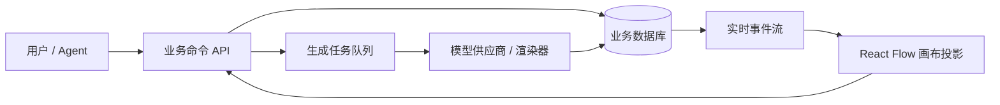
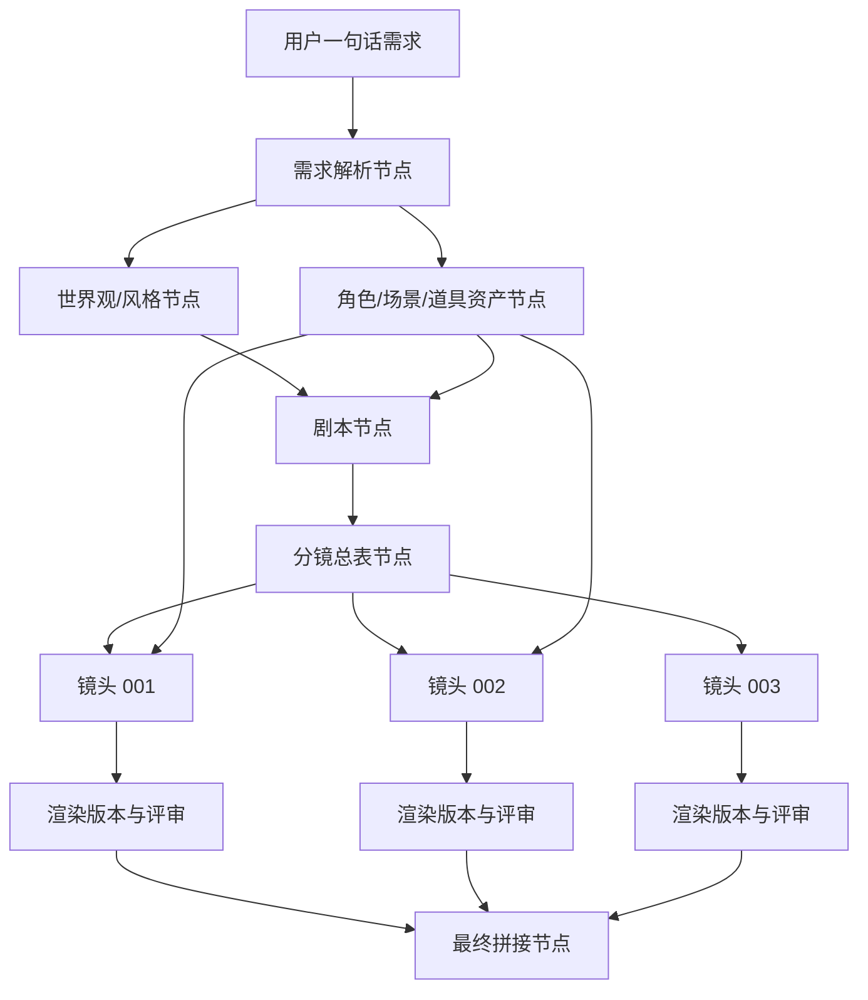

# React Flow 多媒体画布与 Agent 视频生成业务交互设计

作者：**Manus AI**
日期：2026-06-11

## 1. 结论摘要

你的需求可以拆成两个层面：第一层是**无限画布上的多媒体资产组织与可视化编辑**，第二层是**围绕视频生成过程的 Agent 编排、可追踪血缘、增量修改与质量控制**。从调研结果看，React Flow 比较适合作为第一层的画布 SDK。它原生提供无限画布、node、asset、edge、store、React Flow API、自定义工具和自定义 UI 等能力；其中 node 是画布上的 JSON 记录，asset 用于管理图片、视频、书签等外部资源，React Flow API 可以程序化创建、更新、删除 node 和 asset，edge/custom edge 可以表达形状之间的连接关系。[1] [2] [3] [4]

不过，React Flow 不应该被设计成你的核心业务数据库。更稳妥的架构是：**业务数据层是事实源，React Flow 是可交互的 UI 投影层**。Workspace、媒体资源、资源分组、节点、边、生成任务、模型调用、版本、评审结果和最终视频，都应该在你的业务数据库中建模；React Flow snapshot 主要保存布局、视口、选择状态以及画布呈现所需的 node 映射。这样 Studio 模式可以充分使用画布编辑能力，而 Agent 模式则可以通过受控业务命令自动创建节点、连线、分组和生成任务，画布实时呈现 Agent 的执行过程。

> 推荐的核心判断是：**Agent 模式不应以“模拟用户鼠标操作 React Flow”为主，而应以“调用业务命令改变业务状态，React Flow 订阅状态并可视化”为主。** 这会显著降低自动化脆弱性，并让每一步生成过程可审计、可回滚、可增量重算。

spark-video 的架构非常值得借鉴。它不是单纯写死一个 CLI 流水线，而是把视频生成拆成 Producer、Screenwriter、Director、Cast/Set/Prop、VFX Review、Clip Review 等 Skill，并用确定性脚本完成校验、编译、渲染、拼接和状态写入。[5] [6] 这对你的产品最大的启发是：Agent 模式应当是一个**可视化 DAG 工作流 + Skill 化角色分工 + 确定性执行器 + 人类确认 Gate** 的组合，而不是一个从 Prompt 到最终视频的黑盒按钮。

| 决策点 | 建议结论 | 理由 |
|---|---|---|
| React Flow 是否满足基础需求 | **基本满足，但需要业务层补齐** | 自定义 node、asset、edge、React Flow API、持久化和自定义 UI 足以支撑画布交互；音频、生成任务、版本、评审、资产状态需要自定义业务模型。[1] [2] [3] [4] |
| 媒体资源如何建模 | **Asset + MediaNode 双层模型** | asset 负责文件元数据和存储 URL，MediaNode 负责画布节点、生成参数、状态、输入依赖和版本。 |
| Agent 如何操作画布 | **调用命令 API，而非操作 DOM/鼠标** | 命令 API 可以保证权限、校验、事务、审计、回滚和增量重算。 |
| Studio 与 Agent 如何共存 | **同一套数据模型，不同编辑权限与交互入口** | Studio 是用户直接编辑；Agent 是自动编排，用户通过对话、Gate 和局部接管参与。 |
| 是否借鉴 spark-video | **强烈建议借鉴 Skill、Gate、状态机和资产一致性规则** | 它解决的是长视频生成中的跨镜头一致性、叙事统一、重试评审和增量修改问题。[5] [6] [7] [8] |

## 2. React Flow 能力适配分析

### 2.1 可满足的能力

按照你的通用模式，Workspace 是最高组织单位，每个 Workspace 拥有一张无限画布。React Flow 本身并不定义 Workspace 概念，但它的 store、snapshot 和 persistence 能保存一个文档中的 nodes、pages、edges 等记录；官方文档也说明可以通过 `getSnapshot` 和 `loadSnapshot` 将 document/session 分开保存，其中 document 包含 nodes、pages、edges，session 包含 camera、selection、UI state。[3] 因此，Workspace 可以由你自己的业务层定义，而每个 Workspace 对应一个 React Flow document 或一个业务 canvas document。

多媒体资源方面，React Flow 内置 asset 类型包含 image、video、bookmark。官方文档说明，asset 是外部资源记录，存储尺寸、MIME 类型、源 URL 等元数据，实际文件可以存在 S3、Google Cloud Storage 或你自己的 API 中；node 通过 `assetId` 引用 asset，同一 asset 可被多个 node 复用。[2] 这正好适合图片和视频资源。音频不是内置基础类型，但 React Flow 文档明确提到可以通过 custom asset type 和 AssetUtil 扩展音频等领域资产。[2] 文本则可以使用内置 text node，也可以为了业务一致性实现自定义 TextMediaFlowNode。

连线方面，React Flow 支持 custom dependency edge，也支持 React Flow edge utility。官方示例展示了如何用 React Flow API 在两个 node 之间创建 custom edge，并为 custom edge 的 start/end terminal 创建 edge。[4] 另一个 edge 示例说明可以自定义绑定关系，并在目标 node 变化或删除时触发响应。[9] 这足以支撑视觉上的 A → B → C 依赖关系。但是，你的语义是“媒体输入依赖”和“生成血缘”，不只是视觉连线，所以应在业务表中维护 Edge/DAG，再同步渲染为 React Flow custom edge 或 custom edge。

| 需求 | React Flow 原生/扩展能力 | 产品侧应补充的内容 |
|---|---|---|
| Workspace 与无限画布 | React Flow 提供无限画布和 store，Workspace 由业务层定义。[1] [3] | Workspace 表、权限、协作成员、项目设置、默认模型配置。 |
| 文本、图片、视频、音频 | 图片/视频 asset 原生支持；音频可 custom asset；文本可 node。[1] [2] | 统一 MediaAsset、MediaNode、Artifact、Version 模型。 |
| 分组 | React Flow 有 group node 和 node 组织能力。[1] | 业务 Group/Folder 与左侧导航树的层级关系。 |
| 左侧资源导航树 | React Flow 可替换或隐藏默认 UI，也可自定义组件。[10] [11] | 自研资源树、搜索、筛选、状态徽标、拖拽定位节点。 |
| 右键创建资源 | React Flow 支持自定义 context menu 和工具栏。[10] | 创建空白媒体资源的业务命令、默认布局和权限校验。 |
| 节点弹框输入 Prompt | 自定义 node component 与外部面板均可实现。[1] [11] | Prompt 编辑器、@引用、模型选择、参数配置、任务提交。 |
| 节点连线作为输入依赖 | custom edge/edge 可视化实现。[4] [9] | DAG 校验、依赖解析、循环检测、生成上下文组装。 |
| Agent 自动创建过程 | React Flow API 可程序化创建 nodes/assets/edges。[1] [4] | Agent 命令层、事务、审计日志、进度事件和回滚。 |

### 2.2 React Flow 的边界

React Flow 更像一个强大的**画布编辑引擎**，而不是一个多媒体 AIGC 业务平台。它能渲染和编辑 node，能保存画布状态，能处理 assets 和 edges，但它不会替你解决资源版本管理、模型供应商路由、生成任务队列、长任务状态、失败重试、视频拼接、Prompt 血缘、质量评审和增量重算。这些应由你的应用层实现。

因此，建议避免把 React Flow node data 当成所有业务数据的唯一来源。node data 可以保存 UI 展示必要字段，例如标题、状态、缩略图、尺寸、业务 nodeId；但完整的媒体元数据、生成参数、模型调用记录、输入引用、版本、review、artifact URL 和审计信息，应存储在后端业务表中。这样做的好处是，当 Agent 在后台执行时，即使画布未打开，也能完整运行；当用户打开画布时，前端只需要把业务状态投影成节点和边。

## 3. 推荐的信息架构与数据模型

产品层建议采用“业务事实源 + 画布投影”的双层模型。业务事实源描述 Workspace 中真实存在的媒体资源、生成任务和血缘；画布投影描述这些对象在 React Flow 上的位置、尺寸、折叠状态、选中状态和视觉样式。

| 实体 | 关键字段 | 说明 |
|---|---|---|
| Workspace | id、name、owner、mode、settings | 第一层组织单位，一张或多张画布都可归属 Workspace。 |
| CanvasDocument | id、workspaceId、React FlowSnapshot、layoutVersion | 保存画布布局和 UI 投影，不承载全部业务事实。 |
| MediaAsset | id、type、mime、storageUrl、thumbnailUrl、duration、size、meta | 文件级资产，包括图片、视频、音频和文本内容。 |
| MediaNode | id、workspaceId、assetId、nodeType、title、status、currentVersionId | 画布上的业务节点，node 通过 nodeId 映射它。 |
| MediaGroup | id、workspaceId、name、parentId、nodeIds、groupType | 对应左侧导航树和画布分组。 |
| MediaEdge | id、fromNodeId、toNodeId、edgeType、role、order | 表示输入依赖、参考依赖、首尾帧依赖、拼接依赖等。 |
| GenerationJob | id、targetNodeId、provider、model、prompt、params、status、costEstimate | 一次生成或处理任务。 |
| ArtifactVersion | id、nodeId、jobId、assetId、versionNo、winner、reviewScore | 节点的产物版本，可多候选、多轮重试。 |
| ReviewRecord | id、versionId、rubric、score、critique、verdict | 自动或人工评审结果。 |
| AgentStep | id、workspaceId、stepType、input、output、status、createdNodes | Agent 操作审计，用于复盘视频如何生成。 |

> 在这个模型中，React Flow node 是 `MediaNode` 的可视化实例，React Flow custom edge/edge 是 `MediaEdge` 的可视化实例。真正的依赖计算、输入组装和增量重算，不依赖用户是否打开画布。

## 4. Studio 模式业务交互设计

Studio 模式的定位是“用户主导的自由创作空间”。它应该尽可能开放 React Flow 的画布编辑能力，让用户自行创建、移动、分组、连接和生成媒体资源。用户可以像使用白板一样组织素材，也可以像使用节点编辑器一样把媒体资源连成生成流程。

Studio 模式的核心交互流程可以设计为：用户进入 Workspace 后，左侧导航树显示所有媒体资源和分组；中间是无限画布；右侧或弹框是当前节点的属性与生成面板。用户可以通过左侧新建、拖拽上传、画布右键、快捷工具栏等方式创建资源。创建资源时，系统先生成一个空白 MediaNode 和空 MediaAsset，再在画布上创建对应 node。用户单击节点时弹出媒体预览和 Prompt 输入框，支持选择模型供应商、设置参数、用 @ 引用其他媒体资源，并提交生成任务。

| 场景 | 用户动作 | 系统行为 | 画布反馈 |
|---|---|---|---|
| 创建文本节点 | 右键选择“新建文本” | 创建 TextMediaNode，内容为空 | 出现文本卡片，状态为 Draft。 |
| 创建图片节点 | 右键选择“新建图片” | 创建 ImageMediaNode，asset 暂为空 | 出现图片占位卡，提示输入 Prompt 或上传。 |
| 创建视频节点 | 右键选择“新建视频” | 创建 VideoMediaNode，asset 暂为空 | 出现视频占位卡，支持生成或上传。 |
| 创建音频节点 | 右键选择“新建音频” | 创建 AudioMediaNode，使用 custom audio asset | 出现音频波形/播放器占位。 |
| 建立依赖 | 从 A 拖线到 B | 创建 MediaEdge，并渲染 custom edge/edge | B 的输入区展示 A 的缩略图。 |
| @引用资源 | 在 Prompt 输入 `@角色A` | 插入资源引用 token，并建立可选引用边 | Prompt 中高亮引用，节点间出现虚线或输入标记。 |
| 提交生成 | 点击“生成” | 创建 GenerationJob，解析上游输入 | 节点进入 Queued/Running，进度可见。 |
| 查看版本 | 点击节点版本列表 | 查询 ArtifactVersion | 可预览、设为 winner、回滚或派生。 |

在 Studio 模式中，用户需要有充分的编辑自由。画布节点可以被移动、缩放、分组、复制和删除；连线可以被重连；资源树可以新建文件夹或分组。为了降低复杂度，建议区分“视觉分组”和“业务分组”：视觉分组用于画布布局，业务分组用于左侧资源树和结构化管理。两者可以互相同步，但不应强制完全一致。

## 5. Agent 模式业务交互设计

Agent 模式的定位不是“禁止用户操作”，而是“默认由 Agent 主导生产，用户在关键节点确认、局部接管和对话式修改”。你担心的矛盾其实可以通过**权限梯度**解决：Agent 执行时，画布默认处于只读或半只读状态；用户可以随时通过对话要求修改，也可以对某个节点点击“接管编辑”。接管后，该节点进入 User Editing 状态，Agent 暂停对该节点及其下游依赖的自动改写，直到用户点击“交还给 Agent”。

Agent 模式应当将“视频到底如何生成出来”变成可视化的 DAG。Agent 每完成一步，就在画布上创建或更新一个节点：需求理解、故事大纲、剧本场景、角色设定、场景设定、道具设定、分镜、镜头 Prompt、参考图、视频片段、评审结果、重试版本、拼接结果、最终成片。用户看到的不是一个旋转中的黑盒，而是一条逐步展开的生产路径。

| Agent 阶段 | 自动创建的画布对象 | 用户可见信息 | 用户干预方式 |
|---|---|---|---|
| 需求理解 | Brief 节点、目标节点、约束节点 | 视频类型、时长、比例、风格、供应商偏好 | 对话补充约束，或编辑 Brief。 |
| 资产规划 | 角色、场景、道具、BGM 分组 | 每个资产的用途、状态、参考图需求 | 要求换风格、上传参考、删除角色。 |
| 剧本生成 | Script 节点、Scene 子节点 | 每场的剧情、台词、时长估计 | 对话修改某场，或接管文本编辑。 |
| 分镜生成 | Storyboard 节点、Shot 节点 | 镜头目的、Prompt、时长、kind、输入引用 | 修改某个镜头、拆分/合并镜头。 |
| 预渲染检查 | VFX Review 节点 | 问题清单、严重程度、修复建议 | 批准自动修复或手动指定修复。 |
| 渲染执行 | Clip 节点、Version 节点 | 进度、模型、版本、缩略图、成本估计 | 停止、重试、换模型、锁定版本。 |
| 后评审重试 | Review 节点、Retry 边 | 分数、失败原因、改写后的 Prompt | 接受 best-of-N，或要求重做。 |
| 拼接成片 | Final Video 节点 | 最终视频、BGM、字幕、片段清单 | 修改某段后增量重拼接。 |

### 5.1 Agent 模式的三种交互强度

建议 Agent 模式不要只有一种。可以提供三种强度，让不同用户选择不同参与度。

| 模式 | 描述 | 适用用户 | Gate 策略 |
|---|---|---|---|
| 自动驾驶 | Agent 尽量自动完成，从需求到初版成片 | 想快速出结果的用户 | 只在预算、渲染前、最终成片处确认。 |
| 带确认自动驾驶 | Agent 自动推进，但在剧本、分镜、渲染、成片处停下 | 对创意结果有控制要求的用户 | 类似 spark-video 的 4+2 Gate。 |
| 协作驾驶 | Agent 负责搭框架和建议，用户频繁编辑节点 | 专业创作者、导演、剪辑师 | 每个阶段都可局部接管，Agent 做增量补全。 |

默认可以采用“带确认自动驾驶”。因为视频生成成本高、主观性强，完全无确认虽然体验流畅，但容易在错误方向上消耗大量渲染资源。spark-video 的 Gate 设计正是为了解决这个问题：在剧本、分镜、渲染结果、最终成片等成本或方向节点上让用户确认。[6]

### 5.2 用户手动修改与 Agent 自动生成如何共存

共存的关键不是让用户直接改完后 Agent 猜发生了什么，而是每一次用户修改都要落成结构化事件。比如用户把某个视频节点的 Prompt 改了，系统应记录 `PromptUpdated` 事件，并将该节点及下游依赖标记为 Stale。Agent 看到 Stale 后，可以询问是否重跑下游，或自动基于策略执行增量重算。

| 用户修改 | 事件 | 自动影响范围 | Agent 下一步 |
|---|---|---|---|
| 修改剧本某场台词 | SceneScriptUpdated | 该场分镜、相关镜头、最终拼接过期 | 重新生成该场分镜，提示会影响 N 个镜头。 |
| 换角色参考图 | AssetReferenceUpdated | 使用该角色的所有 r2v 镜头过期 | 重新渲染受影响镜头，保留旧版本。 |
| 删除 A→B 连线 | EdgeDeleted | B 的输入上下文变化，B 及下游过期 | 重新解析 B Prompt 或询问是否继续。 |
| 手动选择某个版本为 winner | VersionPromoted | 下游拼接节点过期 | 增量重拼接，不重渲染其他镜头。 |
| 修改最终 BGM | BgmConfigUpdated | Final Video 过期 | 只重跑 stitch/mix，不重跑视频片段。 |

这里需要一个明确的节点状态机。建议每个 MediaNode 至少包含 Draft、Ready、Queued、Running、Succeeded、Rejected、Stale、Locked、UserEditing、Failed 等状态。Agent 自动执行时只能修改非 Locked、非 UserEditing 的节点；用户接管时，节点及下游自动暂停。

## 6. 视频生成 Agent 的推荐工作流

你提到“没想明白 Agent 模式到底应该如何完成一个视频的生成”，建议采用类似 spark-video 的阶段化流程，但把每个阶段都映射成画布节点和业务事件。以下是一个更适合产品化的流程。

### 6.1 第一阶段：理解需求与建立生产计划

Agent 接收用户需求后，先创建一个 Brief 节点，并提取视频类型、时长、画幅、语言、风格、目标平台、是否需要旁白、是否有角色一致性要求、是否使用用户上传参考素材。随后创建 Production Plan 节点，列出预计阶段、镜头数量、模型供应商、成本估计和需要确认的 Gate。

这一阶段建议不要立刻进入大规模生成。用户可以在画布上看到 Brief 和 Plan，并通过对话确认“短剧模式、旁白模式、广告模式、产品展示模式”等。spark-video 在起点设置 drama/narration 模式 Gate，这一点值得借鉴。[6]

### 6.2 第二阶段：创建资产骨架

Agent 根据需求创建角色、场景、道具、BGM 和风格节点。借鉴 spark-video 的 Cast/Set/Prop 思路，所有会跨镜头复用的对象都应有独立资产节点。更重要的是，同一对象的不同视觉状态应拆成不同节点，例如“女主-日常服”“女主-婚礼服”“办公室-白天”“办公室-夜晚”。spark-video 明确强调“一个文件夹 = 一个视觉状态”，这是减少视频模型漂移的关键规则。[8]

| 资产类型 | 画布节点 | 典型输入 | 典型输出 |
|---|---|---|---|
| 角色 | Character Asset | 文字设定、参考图、声音样本 | 角色卡、参考图、声音配置。 |
| 场景 | Set Asset | 场景描述、风格、时间/天气 | 场景参考图、空间描述。 |
| 道具 | Prop Asset | 道具描述、状态变化 | 道具参考图、状态版本。 |
| 风格 | Style/Lore Asset | 风格关键词、禁用元素、色彩 | mood anchor、palette、negative constraints。 |
| BGM/音频 | Audio Asset | 上传音频、生成音频、旁白配置 | BGM、旁白、音效。 |

### 6.3 第三阶段：剧本与分镜

Agent 先生成 Script 节点，再拆分为 Scene 节点。每个 Scene 节点输出剧情、台词、动作、预计时长和涉及资产。随后 Director Skill 或 Director 子流程将 Scene 转为 Shot 节点。每个 Shot 节点应该明确保存 narrative_purpose、prompt、duration、kind、characters、props、set_id、reference inputs、use_prev_last_frame_as_first、seed 和候选数量等字段。spark-video 的 Director Skill 使用 provider-agnostic 的 `kind` 字段（t2v/i2v/r2v）而不是直接写供应商模型名，这一点非常适合产品化，因为用户可以在同一业务意图下切换模型供应商。[7]

在画布上，Script → Scene → Storyboard → Shot 的关系可以表现为分组和连线。Shot 节点应有两层内容：卡片上显示缩略摘要、时长、状态和预览；弹框中显示完整 Prompt、输入资产、模型参数和版本记录。

### 6.4 第四阶段：预渲染 QA

在真正消耗视频生成成本前，Agent 应运行预渲染 QA。QA 的对象是结构化分镜，而不是已经生成的视频。它检查是否存在角色引用缺失、Prompt 与场景矛盾、台词无法被当前 kind 表达、mood anchor 缺失、道具状态混用、连续帧依赖设置不合理、模型供应商不兼容等问题。spark-video 的 VFX Review 负责的正是这类预渲染质量门，并且只输出问题报告，不直接改分镜。[12]

产品上可以把预渲染 QA 表现为一个 Review 节点，连接到 Storyboard 节点。若有 Critical 问题，Agent 自动创建 Fix Plan，并在用户批准后修复；若只有 Warning/Suggestion，可以允许用户一键继续。

### 6.5 第五阶段：渲染、评审与重试

每个 Shot 节点进入渲染后，应创建一个或多个 Version 子节点。Version 包含视频文件、首帧/尾帧、模型调用参数、耗时、成本、review score 和 critique。渲染完成后，自动评审模块为每个版本打分；若通过，设为 winner；若不通过，Agent 读取 critique 并改写 Prompt 后重试。spark-video 的 Clip Review 将这种流程定义为 render → review → ACCEPT 或 rewrite retry，重试耗尽后 best-of-N 或升级给 Director 的状态机。[13]

| 状态 | 含义 | 画布表现 |
|---|---|---|
| Rendering | 正在生成该镜头 | Shot 节点显示进度条和模型名。 |
| Reviewing | 已生成，正在质量评审 | Version 节点显示“评审中”。 |
| Accepted | 版本通过评审 | 节点边框变绿，标记 winner。 |
| Rejected | 版本未通过 | 节点边框变红，显示分数和失败原因。 |
| Retrying | Agent 正在改 Prompt 重试 | 出现 Retry 边和新 Version 节点。 |
| Escalated | 重试耗尽，需要重拆分镜 | 创建 Escalation 节点连接到 Director/Storyboard。 |

### 6.6 第六阶段：拼接、混音与最终成片

当所有 Shot 都有 winner version 后，Agent 创建 Final Stitch 节点，执行拼接、字幕、旁白、BGM、转场和封面生成。最终生成 Final Video 节点。用户若对某个片段不满意，应能在 Final Video 的时间轴上点击对应片段，系统定位到源 Shot 节点和版本记录，然后只重做该 Shot 或相关下游拼接。

这个“从成片回溯到节点”的能力非常关键。它能让用户明白某个画面来自哪个 Prompt、哪些参考图、哪个模型、哪一次重试，以及为什么最终选择该版本。这正是你希望用户“知道某一个视频到底是如何生成出来的，每一步是什么”的核心体验。

## 7. Agent 可调用工具与命令 API 设计

为了让 Agent 可靠地操作画布，建议定义一组业务命令。每个命令都应具备参数 schema、权限校验、事务、幂等 key、审计日志和事件广播。前端 React Flow 订阅事件后更新画布，而不是由 Agent 直接调用 React Flow 前端实例。

| 命令 | 用途 | 典型参数 |
|---|---|---|
| `create_media_node` | 创建空白或初始媒体节点 | workspaceId、type、title、groupId、position、initialContent。 |
| `update_media_node` | 更新节点标题、Prompt、参数、状态 | nodeId、patch、reason。 |
| `create_media_edge` | 建立输入依赖或引用关系 | fromNodeId、toNodeId、edgeType、role、order。 |
| `create_group` | 创建资源分组或画布分组 | workspaceId、name、parentId、nodeIds、layout。 |
| `submit_generation_job` | 提交生成任务 | targetNodeId、provider、model、prompt、inputRefs、params。 |
| `promote_version` | 将某版本设为 winner | nodeId、versionId、reason。 |
| `mark_stale` | 标记节点及下游过期 | nodeId、scope、reason。 |
| `run_review` | 对分镜或产物执行评审 | targetId、reviewType、rubric。 |
| `request_user_gate` | 在关键阶段请求用户确认 | gateType、summary、affectedNodes、options。 |
| `apply_user_feedback` | 将自然语言反馈解析为结构化修改 | feedback、targetNodes、strategy。 |

这些命令同时服务 Studio 和 Agent。Studio 中用户点击按钮，本质上也是调用这些命令；Agent 模式中 Agent 自动调用这些命令。这样可以保证两种模式的数据一致性，并且让每一步都可审计。

## 8. Skill 机制如何借鉴 spark-video

建议将 Skill 设计成“可被 Agent 读取和执行的能力说明 + 数据契约 + 质量标准 + 工具路由”。它不一定要和某个具体模型或框架绑定。spark-video 的架构文档强调，`SKILL.md` 是 Markdown 加 YAML front matter，不绑定特定运行时，因此可被不同 Agent 框架加载；它描述判断标准和契约，而不是刚性的固定脚本。[5]

在你的产品中，可以把 Skill 分为产品内置 Skill 和用户自定义 Skill。内置 Skill 包括短剧生成、广告片生成、产品展示、知识科普、音乐 MV、口播视频、图片生成、视频续写、音频配音、质量评审等。每个 Skill 应声明输入节点类型、输出节点类型、可调用工具、默认模型策略、Gate 策略、评审 rubric 和失败处理策略。

| Skill | 输入 | 输出 | 核心职责 |
|---|---|---|---|
| Producer Skill | 用户 Brief、Workspace 状态 | Production Plan、Gate、任务 DAG | 统筹全流程，决定阶段、并发和确认点。 |
| Screenwriter Skill | Brief、角色/世界观 | Script、Scene | 生成剧本、台词、场景结构。 |
| Director Skill | Scene、资产、风格 | Storyboard、Shot | 转换为镜头语言和可生成 Prompt。 |
| Art Asset Skill | 角色/场景/道具描述 | 参考图、资产状态版本 | 保证跨镜头一致性。 |
| Prompt Rewrite Skill | Rejected Version、critique | Revised Prompt | 基于失败原因定向改写 Prompt。 |
| Preflight Review Skill | Storyboard、资产、模型配置 | QA Report | 渲染前发现结构性问题。 |
| Clip Review Skill | 生成视频、参考资产 | Score、critique、verdict | 渲染后质量评审与重试决策。 |
| Stitch Skill | Winner Clips、音频、字幕 | Final Video | 拼接、混音、字幕和最终导出。 |

Skill 与确定性执行器要分工明确。Skill 负责判断、生成、解释和决策；执行器负责校验、文件处理、渲染提交、状态写入、并发控制和拼接。这样既能发挥 Agent 的弹性，又能避免让 Agent 随意改写关键状态。

## 9. 左侧导航树与画布的关系

左侧导航树不应只是 React Flow nodes 的列表，而应是 Workspace 中业务资源的主索引。它可以按资源类型、分组、流程阶段、状态、标签、时间线等方式切换视图。画布则是一个或多个视图中的空间化呈现。

| 导航树视图 | 组织方式 | 适用场景 |
|---|---|---|
| 资源视图 | 文本、图片、视频、音频、角色、场景、道具 | 找素材、管理资产。 |
| 流程视图 | Brief、Script、Storyboard、Shots、Final | 理解视频生成链路。 |
| 分组视图 | 用户自定义文件夹/画布分组 | 项目管理和素材整理。 |
| 状态视图 | Draft、Running、Rejected、Stale、Succeeded | 排查任务和处理失败。 |
| 时间线视图 | 按最终视频片段顺序排列 | 从成片回溯到镜头。 |

当用户点击导航树中的资源时，画布应定位到对应节点；当 Agent 创建新节点时，导航树应同步出现资源和状态徽标。对于没有放置到画布上的资源，可以显示为“未上画布”；用户拖入画布时创建 node 投影，但不重复创建业务资源。

## 10. 关键产品机制建议

### 10.1 输入引用与 @ 机制

连线和 @引用都表达输入依赖，但它们的语义略有不同。连线更适合显式工作流和血缘，@引用更适合 Prompt 中的局部引用。建议两者都落成 MediaEdge，只是 edgeType 不同。

| 方式 | 用户体验 | 数据语义 |
|---|---|---|
| 画布连线 | 用户看到 A → B，表示 A 是 B 的输入 | `edgeType=input`，用于上下文组装和下游过期传播。 |
| Prompt @引用 | 在 Prompt 中写 `@角色A`、`@参考图1` | `edgeType=mention` 或 `edgeType=reference`，保留 token span。 |
| 自动引用 | Agent 根据剧本自动把角色/场景接到镜头 | `edgeType=auto_input`，可被用户确认或删除。 |

### 10.2 版本与候选机制

每个媒体节点都应支持多个 ArtifactVersion。视频生成尤其需要候选、重试和 winner。用户不满意时，不应覆盖原产物，而应生成新版本并保留对比。

| Version 字段 | 说明 |
|---|---|
| versionNo | 第几次生成或第几个候选。 |
| sourceJobId | 来源生成任务。 |
| inputHash | 输入依赖、Prompt、参数的 hash，用于判断是否过期。 |
| artifactUrl | 产物文件地址。 |
| thumbnailUrl | 缩略图或关键帧。 |
| reviewScore | 自动评审分数。 |
| critique | 自动评审文本。 |
| winner | 是否作为当前有效版本。 |

### 10.3 成本与预算 Gate

视频生成涉及真实成本和等待时间。建议在分镜后、渲染前展示预算 Gate，包括预计镜头数、总时长、模型供应商、分辨率、预计耗时、预计费用区间和可并发程度。spark-video 在 GATE 2 展示 storyboard summary、时长、成本估计和风险提示，这一点值得产品化吸收。[6]

### 10.4 增量重算

所有节点都应该支持基于 DAG 的影响分析。修改上游节点后，下游节点不应立即被删除，而应标记为 Stale。Agent 可以给出“将影响 8 个镜头和最终拼接，是否继续”的说明。对于最终成片修改，优先只重做受影响镜头和 stitch，而不是全量重跑。

## 11. 实施路线建议

第一阶段应先完成 Studio 模式的基础闭环：Workspace、资源树、React Flow 画布、媒体节点、连线、Prompt 弹框、模型选择、生成任务、产物版本和基础持久化。此时 Agent 可以先作为“辅助生成”存在，只对用户当前选中的节点执行生成或改写。

第二阶段再建设 Agent 模式的生产 DAG：Brief → Script → Storyboard → Shot → Clip → Review → Final。此阶段重点不是追求所有视频类型，而是跑通一个最典型的视频生成流程，例如 30–60 秒短视频或广告片。要建立 Agent 命令 API、节点状态机、Gate、审计日志、增量重算和局部接管。

第三阶段再引入 Skill 化体系、预渲染 QA、自动评审重试、角色/场景/道具一致性资产库、多供应商路由和高级协作。这个阶段可以重点借鉴 spark-video 的 Skill 划分、Gate 设计、one-state-one-asset 原则、shots_state 单一事实源和 clip review 状态机。[5] [6] [8] [13]

| 阶段 | 目标 | 关键交付 |
|---|---|---|
| MVP 1：Studio 画布 | 让用户可手动组织和生成多媒体资源 | Workspace、资源树、媒体节点、连线、Prompt 弹框、版本。 |
| MVP 2：Agent 可视化生产 | 让 Agent 自动创建视频生产 DAG | Brief、Script、Storyboard、Shot、Clip、Final 节点与 Gate。 |
| MVP 3：一致性与质量 | 提升视频可用性和可控性 | 角色/场景/道具资产状态、预渲染 QA、后评审重试。 |
| MVP 4：专业化工作流 | 面向复杂视频项目 | Skill 市场、自定义 Skill、多人协作、时间线、成本控制。 |

## 12. 风险与规避

最大的风险是把 React Flow 当成完整业务平台，导致后期 Agent、任务队列、增量重算和审计无法稳定实现。规避方式是从一开始就建立业务事实源，React Flow 只做投影。第二个风险是 Agent 自动流程过黑盒，用户不知道视频为何这样生成。规避方式是把 Agent 每一步都落成画布节点和 AgentStep 日志。第三个风险是用户手动修改与 Agent 自动执行冲突。规避方式是节点锁、UserEditing 状态、影响分析和 Stale 机制。第四个风险是长视频一致性差。规避方式是借鉴 spark-video，把角色、场景、道具作为独立资产状态，并在生成和评审阶段强制引用它们。[8] [12] [13]

| 风险 | 典型表现 | 规避策略 |
|---|---|---|
| 画布数据与业务数据混乱 | 节点移动或复制导致生成血缘丢失 | 业务 DB 为事实源，React Flow node 仅保存 nodeId 和布局。 |
| Agent 操作不可控 | 自动修改用户刚改过的节点 | 节点锁、UserEditing、事务和审计日志。 |
| 视频生成成本失控 | 分镜错误但直接批量渲染 | 渲染前预算 Gate 和预渲染 QA。 |
| 跨镜头漂移 | 同一角色每个镜头长相不同 | 角色/场景/道具状态资产 + 强制引用 + 后评审。 |
| 用户不知道过程 | 最终只看到一个 mp4 | 每个阶段生成画布节点、版本和评审记录。 |
| 增量修改困难 | 改一个镜头要全量重跑 | DAG 影响分析、Stale 标记、局部重渲染与重拼接。 |

## 13. 最终建议

建议你的产品形态可以概括为：**一张以 React Flow 为交互底座的多媒体生产画布，一套以业务 DAG 为事实源的生成系统，以及一个以 Skill 为角色分工的可视化 Agent。** Studio 模式提供开放编辑能力，Agent 模式提供自动化生产能力，但二者共享同一套 Workspace、MediaNode、MediaEdge、ArtifactVersion 和 GenerationJob 数据模型。

Agent 模式不需要牺牲用户手动修改能力。相反，如果把每一步都可视化为节点、边、版本和评审，用户会比传统表单式生成工具更容易理解和介入。用户可以在剧本阶段改文字，在分镜阶段改镜头，在渲染阶段换版本，在成片阶段定位回源镜头。Agent 负责解释影响范围、执行增量重算和维护一致性。

如果只选择一个最重要的架构原则，我建议是：**让 Agent 调用业务命令，让画布呈现业务状态，不要让 Agent 直接操纵画布 UI。** 这会决定系统后续能否稳定地支持自动生成、手动编辑、多人协作、版本管理、失败恢复和复杂视频项目。

## References

[1]: https://reactflow.dev/docs/editor "React Flow Docs — React Flow"
[2]: https://reactflow.dev/sdk-features/assets "React Flow Docs — Assets"
[3]: https://reactflow.dev/docs/persistence "React Flow Docs — Persistence"
[4]: https://reactflow.dev/examples/create-custom-edge "React Flow Docs — Create an custom edge"
[5]: https://github.com/JohnKeating1997/spark-video/blob/main/docs/architecture.md "spark-video — Architecture"
[6]: https://raw.githubusercontent.com/JohnKeating1997/spark-video/main/references/spark-video-episode/SKILL.md "spark-video — Producer / Episode Skill"
[7]: https://raw.githubusercontent.com/JohnKeating1997/spark-video/main/references/spark-video-director/SKILL.md "spark-video — Director Skill"
[8]: https://raw.githubusercontent.com/JohnKeating1997/spark-video/main/references/spark-video-cast/SKILL.md "spark-video — Cast / Set / Prop Skill"
[9]: https://reactflow.dev/examples/sticker-edges "React Flow Docs — Attach nodes together (edges)"
[10]: https://reactflow.dev/examples/custom-menus "React Flow Docs — Changing menus"
[11]: https://reactflow.dev/examples/custom-ui "React Flow Docs — Replace the entire UI"
[12]: https://raw.githubusercontent.com/JohnKeating1997/spark-video/main/references/spark-video-vfx-review/SKILL.md "spark-video — VFX Review Skill"
[13]: https://raw.githubusercontent.com/JohnKeating1997/spark-video/main/references/spark-video-clip-review/SKILL.md "spark-video — Clip Review Skill"
