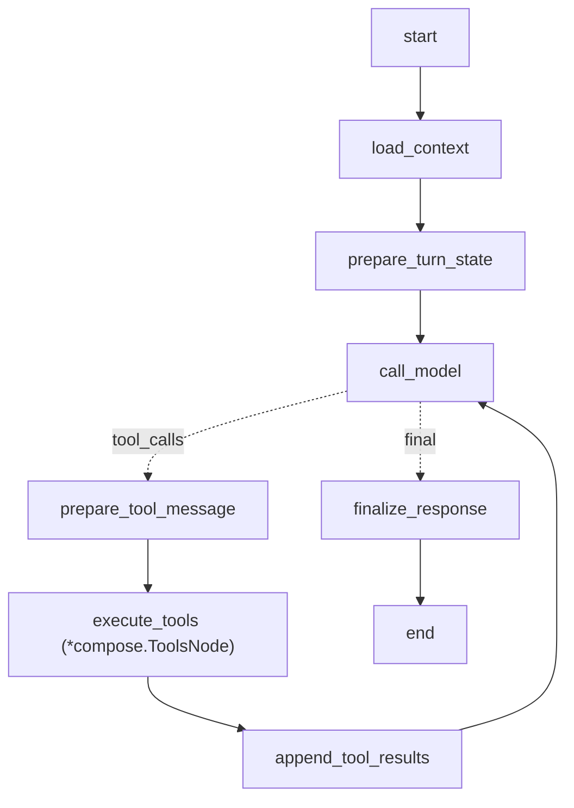
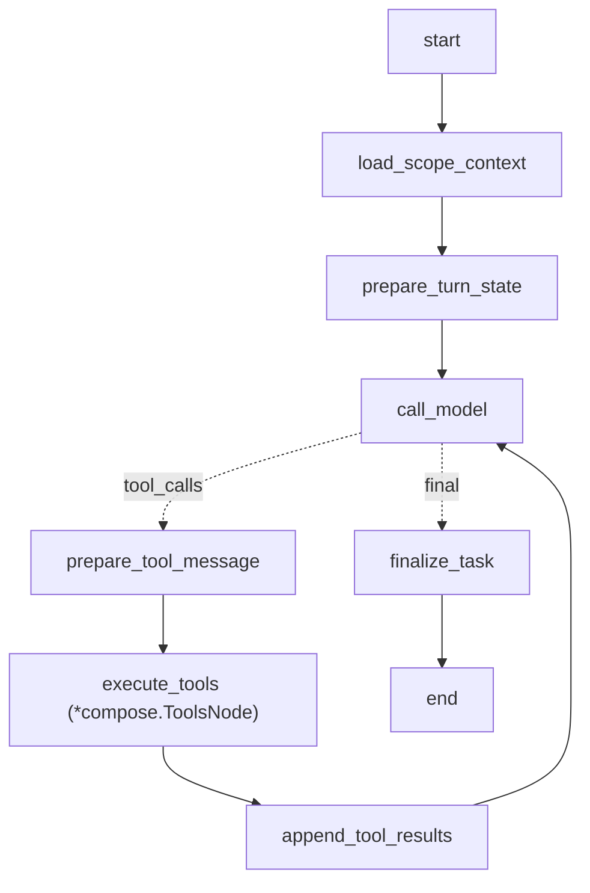

# M2 Craftsman RenderPlan Agent 契约设计

**状态**：待评审
**日期**：2026-06-25
**适用范围**：ClipAnvil 三 Agent v1，M2 Craftsman / RenderPlan / PromptCompiler / 参考资源生成闭环

## 结论

M2 的目标不是做完整自动成片，也不是扩张 Agent 角色数量。M2 只补齐“能生成”的最小闭环：Producer 继续作为全局创作状态 owner，Craftsman 成为受限的 RenderPlanner，PromptCompiler 和 Worker 作为确定性工程服务执行编译与提交。

M2 后应该能跑通：

```text
用户要求先生成机场场景参考图
  -> Producer 确认或创建机场 KeyElementState(needs_reference)
  -> Producer dispatch_craftsman
  -> Craftsman 读取局部上下文和 ProjectMemory
  -> Craftsman 调用 upsert_render_plan 写 reference image RenderPlan
  -> 工程代码自动编译 prompt、校验能力、提交 Seedream 生成
  -> 生成图绑定回 KeyElementState
  -> Producer 请求用户确认是否采用
```

M2 的核心边界：

- Producer 不写 Seedream / Seedance 最终 provider prompt。
- Craftsman 可以写模型级 `prompt_parts`，但不直接写 provider request。
- PromptCompiler 不是 Agent，只做确定性编译、校验和审计。
- Worker 不是 Agent，只提交 `GenerationIntent`，写 `generation_job` / `artifact_version`。
- `reference_bundle` 暂不单独建表，参考资源先内嵌在 `render_plan.reference_bindings` / `reference_roles`。
- 已执行的 RenderPlan 不允许原地修改，只能 fork 形成新 revision。

## M2 要开发的 Agent 能力

### Producer M2 能力

Producer 延续 M1 system prompt 和工具契约，但 M2 开启生成调度能力。

Producer 在 M2 新增或启用的能力：

| 能力 | 说明 | 边界 |
|---|---|---|
| 派发参考图生成 | 对 `KeyElementState(reference_status='needs_reference')` 调用 `dispatch_craftsman(target_phase='reference_image')` | 不亲自写 Seedream prompt |
| 派发分镜预览图 | 对已规划 shot 调用 `dispatch_craftsman(target_phase='preview_image')` | 需要 shot 已引用关键元素状态 |
| 派发分镜视频 | 对已有 preview image / first frame 的 shot 调用 `dispatch_craftsman(target_phase='shot_video')` | 需要满足依赖和参考资源 ready |
| 确认参考资源 | 用户或后续 Reviewer 接受 artifact 后，调用 `select_artifact_version(target_type='key_element_state')` 绑定参考图 | 不绕过用户已要求的确认 gate |
| 请求用户决策 | 对高成本生成、关键参考图、核心方向变化或歧义调用 `request_user_decision` | 不把普通状态同步伪装成 HITL |

Producer 必须能读取完整当前状态。Craftsman 返回的 task result 或工具摘要只作为变更索引，不是 Producer 决策的唯一来源。关键决策前仍应通过 `read_project_context(detail_level='full')` 读取当前事实。

### Craftsman M2 能力

Craftsman 是 `key_element_state` / `shot` scope 的受限 ReAct Agent。它应该有持久 thread 和历史消息，但它不是全局导演。

Craftsman 的职责：

1. 读取 scope-limited context：目标 `KeyElementState` 或 `ShotPlan`、相关 `Scene`、`KeyElementState`、`shot_dependency`、当前 `ProjectMemory`、已有 `RenderPlan`、可用 source/generated media。
2. 判断本次目标阶段：`reference_image`、`preview_image` 或 `shot_video`。
3. 选择模型提示词 profile：`seedream_5_image` 或 `seedance_2_video`。
4. 选择 provider-agnostic operation：例如 `text_to_image`、`multi_image_to_image`、`image_to_video_first_frame`、`image_to_video_first_last_frame`。
5. 组织 reference bindings / roles / subject bindings，避免多个 shot 各自重新发明同一个场景或商品。
6. 编写结构化 `prompt_parts`，包含主体、场景、动作、镜头、风格、约束和音频文本等。
7. 草拟 `params`，例如比例、时长、分辨率、是否返回尾帧、是否生成音频。
8. 调用 `upsert_render_plan` 写入 RenderPlan。
9. 如果缺关键参考、依赖未满足、scope 冲突或模型能力不可达，应写 blocked RenderPlan 或返回明确阻塞原因，交回 Producer 决策。

Craftsman 不做的事：

- 不修改 `CreativeBrief`、`ProjectMemory`、`KeyElement`、`KeyElementState`、`Scene` 或 `ShotPlan`。
- 不改变故事目标、卖点、全局视觉锚点或用户已确认方向。
- 不直接请求用户。
- 不直接提交 generation job。
- 不选择 artifact winner。
- 不把裸 `asset_id`、`media_node_id` 或 storage URL 写进 prompt 自然语言里。
- 不在已执行 RenderPlan 上原地覆盖。

### Reviewer M2 状态

Reviewer 的完整 10 轴 rubric、pre-render review 和 post-render 修复闭环放在 M3。M2 可以保留已有 Reviewer 代码路径，但不是 M2 成功标准。

M2 只要求 PromptCompiler 做确定性 prompt audit，例如字段缺失、reference role 无效、能力不支持、字符预算超限、明显违反 ProjectMemory 的硬约束。这个 audit 是工程校验，不等同 Reviewer Agent。

## M2 Eino 图设计

### ProducerGraph 增量

ProducerGraph 仍使用 M1 的 Eino-native explicit tool loop：



M2 只给 Producer 增加工具能力，不改 Producer 作为全局 Full ReAct 的定位。

### CraftsmanGraph 目标

Craftsman 需要从当前固定 JSON responder 升级为 bounded tool loop。推荐图：



工具白名单：

- `read_project_context`
- `read_project_memory`
- `upsert_render_plan`

Craftsman 可以通过工具失败观察修正参数后重试，但 loop 必须受限：

- 默认最多 8 次工具调用。
- 只能写当前 task scope 对应的 RenderPlan。
- 不能 dispatch 其他 Agent。
- 不能 request HITL。
- 不能 select artifact。

## 工具实现通用约束

M2 所有新工具继续沿用 M1 规则：

- Eino-native graph 和原生 ToolNode。
- 一个工具一个 Go 实现类。
- 工具实现 Eino 标准接口，返回字符串自然语言观察。
- `ToolInfo.ParamsOneOf` 优先用 `GoStruct2ParamsOneOf[T]` 从 struct tag 生成。
- 工具执行体必须二次校验必填、枚举、UUID、对象归属、workspace mode、状态机和跨字段约束。
- 工具不能把业务错误直接抛给模型；应返回中文可修正错误。
- 工具结果不能裸 JSON；可以在自然语言里列出关键 ID、client_key、状态和下一步建议。
- 每个写工具都必须有 `brief`，用于模型自检和审计。

## Producer M2 工具

### `dispatch_craftsman`

#### 工具描述

```text
派发 Craftsman 为指定 KeyElementState、Shot 或 RenderPlan 创建或修订 RenderPlan。Craftsman 会把 Producer 维护的创意级事实翻译成 Seedream / Seedance 可执行的 prompt_parts、reference bindings、reference roles 和参数草案。这个工具只负责创建 Craftsman task；图片或视频由后续工程流程执行。

<supported_actions>
- `create`: 为尚无 RenderPlan 的 key element state 或 shot 创建第一版计划。
- `revise`: 基于用户修改、失败原因或 review 建议派发 Craftsman 生成修订计划。
- `repair`: 针对已有 artifact issue 或用户指出的问题派发修复计划。
</supported_actions>

<instructions>
- 不要在此工具中手写 provider prompt。
- `scope.type=key_element_state` 通常用于生成 reference image。
- `scope.type=shot` 通常用于生成 preview image 或 shot video。
- `scope.type=render_plan` 通常用于 fork 或修复已有计划。
- 派发 shot 前，应确认关键 KeyElementState 已经 ready 或 approved；缺少全局场景参考时，先派发 key_element_state reference image。
- 有 last_frame_chain 的 shot 不能跨依赖提前执行；工具实现或 scheduler 应返回阻塞原因。
</instructions>

<recommended_usage>
- 用户说“先生成一张机场场景图给我看看”。
- 用户确认 storyboard 后，开始生成每个分镜预览图。
- 用户确认 preview image 后，开始生成 shot video。
- 用户说“第二个分镜视频里箱子变形了，重做一下”。
</recommended_usage>
```

#### 入参 struct

```go
type DispatchCraftsmanInput struct {
    Brief       string          `json:"brief" jsonschema:"required" jsonschema_description:"派发 Craftsman 的业务目的，例如为机场场景状态创建 reference image RenderPlan。不要超过 160 个中文字符。"`
    Mode        string          `json:"mode" jsonschema:"required,enum=create,enum=revise,enum=repair" jsonschema_description:"create 创建第一版计划；revise 因用户修改或计划问题修订；repair 针对已生成结果的问题创建修复计划。"`
    Scope       DispatchScope   `json:"scope" jsonschema:"required" jsonschema_description:"派发范围。key_element_state 用于关键元素参考图；shot 用于分镜图或分镜视频；render_plan 用于修订已有计划。"`
    TargetPhase string          `json:"target_phase" jsonschema:"required,enum=reference_image,enum=preview_image,enum=shot_video" jsonschema_description:"目标生产阶段。reference_image 生成关键元素参考图；preview_image 生成分镜预览图；shot_video 生成分镜视频。"`
    Priority    string          `json:"priority" jsonschema:"enum=low,enum=normal,enum=high" jsonschema_description:"任务优先级。普通用户请求使用 normal；用户正在等待确认的参考图可以使用 high。默认 normal。"`
    Inputs      DispatchInputs  `json:"inputs" jsonschema_description:"Producer 已知的输入线索。只传对象 ID 或 client_key，不要传 provider prompt。"`
    Repair      RepairContext   `json:"repair" jsonschema_description:"mode=repair 时填写，说明问题来源、修复目标和用户要求。"`
    Reason      string          `json:"reason" jsonschema:"required" jsonschema_description:"为什么现在需要 Craftsman 处理。必须说明业务原因或依赖关系。"`
}

type DispatchScope struct {
    Type string `json:"type" jsonschema:"required,enum=key_element_state,enum=shot,enum=render_plan" jsonschema_description:"scope 类型。key_element_state 表示给关键元素状态生成参考图；shot 表示给分镜生成预览图或视频；render_plan 表示修订已有计划。"`
    ID   string `json:"id" jsonschema:"required" jsonschema_description:"scope 对象 UUID。不能填写 client_key。"`
}

type DispatchInputs struct {
    PreferredRenderPlanID string   `json:"preferred_render_plan_id" jsonschema_description:"如果希望 Craftsman 基于某个 RenderPlan 继续处理，填写 RenderPlan UUID。"`
    RequiredStateIDs      []string `json:"required_state_ids" jsonschema_description:"本次生成必须引用的 KeyElementState UUID 列表，例如商品默认状态和机场场景状态。"`
    PreferredArtifactIDs  []string `json:"preferred_artifact_ids" jsonschema_description:"可作为输入的 artifact_version UUID 列表，例如已确认的 preview image 或上游尾帧。"`
    UserInstruction       string   `json:"user_instruction" jsonschema_description:"用户对本次生成的局部要求摘要。不要写 provider prompt。"`
}

type RepairContext struct {
    IssueID        string   `json:"issue_id" jsonschema_description:"触发修复的 ArtifactIssue 或 review_record UUID。没有则为空。"`
    ProblemSummary string   `json:"problem_summary" jsonschema_description:"需要修复的问题摘要，例如行李箱拉杆变形、机场背景过暗。"`
    FixHints       []string `json:"fix_hints" jsonschema_description:"具体修复建议。Craftsman 可参考，但不能改变用户目标。"`
    SuggestedFix   string   `json:"suggested_fix" jsonschema:"enum=regenerate,enum=edit,enum=extend,enum=bridge" jsonschema_description:"建议修复动作。M2 主要支持 regenerate；edit/extend/bridge 可先建模但不一定执行。"`
}
```

#### 校验规则

- `brief`、`mode`、`scope.type`、`scope.id`、`target_phase`、`reason` 必填。
- `scope.id` 必须是 UUID，且对象属于当前 workspace。
- `scope.type=key_element_state` 时，`target_phase` 必须是 `reference_image`。
- `scope.type=shot` 时，`target_phase` 必须是 `preview_image` 或 `shot_video`。
- `scope.type=render_plan` 时，`mode` 不能是 `create`。
- `mode=repair` 时必须提供 `repair.problem_summary`。

#### 返回字符串要求

成功：

```text
已派发 Craftsman：为机场出发大厅状态创建 reference_image RenderPlan。
- scope：key_element_state=...
- craftsman_task：...
- 目标阶段：reference_image
下一步：等待 Craftsman 写入 RenderPlan；生成状态会写入任务事件和画布投影。
```

失败：

```text
工具调用失败：scope.type=shot 不能用于 target_phase=reference_image。
- 工具：dispatch_craftsman
- 重试建议：如果要生成场景参考图，请把 scope 改为 key_element_state；如果要生成分镜预览图，请把 target_phase 改为 preview_image。
```

### `select_artifact_version`

M2 需要把生成出的参考图绑定回 `KeyElementState`，因此 `select_artifact_version` 要从普通 version winner 扩展到关键元素参考绑定。

#### 工具描述

```text
选择一个 succeeded artifact version 作为媒体节点 current winner，或绑定为某个 KeyElementState 的参考资源。这个工具用于记录用户确认、Producer 决策或后续 Reviewer 接受后的版本选择，不会生成新 artifact。

<instructions>
- 绑定 KeyElementState 时，必须说明该 artifact 为什么适合作为一致性锚点。
- 如果用户明确要求确认后再采用参考图，Producer 应先 request_user_decision。
- 不要选择 running、failed 或未完成上传的 artifact。
- 不要把被用户否定或 review rejected 的 artifact 绑定为 approved reference。
</instructions>
```

#### 入参 struct

```go
type SelectArtifactVersionInput struct {
    Brief             string `json:"brief" jsonschema:"required" jsonschema_description:"选择 artifact version 的业务目的，例如把机场场景图设为机场 KeyElementState 的 approved reference。不要超过 160 个中文字符。"`
    ArtifactVersionID string `json:"artifact_version_id" jsonschema:"required" jsonschema_description:"要选择的 artifact_version UUID。必须是 succeeded 状态。"`
    TargetType        string `json:"target_type" jsonschema:"required,enum=media_node,enum=key_element_state" jsonschema_description:"选择目标。media_node 表示设置节点 current version；key_element_state 表示绑定为关键元素状态参考资源。"`
    TargetID          string `json:"target_id" jsonschema:"required" jsonschema_description:"目标对象 UUID。target_type=media_node 时是 media_node UUID；target_type=key_element_state 时是 KeyElementState UUID。"`
    SelectionReason   string `json:"selection_reason" jsonschema:"required" jsonschema_description:"为什么选择这个版本，必须具体说明它满足了什么创作目标或一致性要求。"`
    MarkApproved      bool   `json:"mark_approved" jsonschema_description:"target_type=key_element_state 时是否把 reference_status 标记为 approved。用户已确认或 Reviewer 已接受时填写 true；只是可用但未确认时填写 false。"`
}
```

## Craftsman M2 工具

### `read_project_context`

Craftsman 可以复用 M1 `read_project_context` 的工具名，但执行时必须按角色限制 scope。Craftsman 不应该读取全 workspace 的所有历史和全部聊天。

#### 工具描述

```text
读取当前 Craftsman task 允许访问的 ClipAnvil 局部上下文，包括目标 KeyElementState 或 ShotPlan、相关 ProjectMemory、KeyElementState、Scene、ContinuityLink、已有 RenderPlan、可用素材和当前生成状态。这个工具只读，不会修改任何对象。

<instructions>
- Craftsman 每个 task 开始时先读取 context。
- `detail_level=summary` 用于判断是否缺参考或依赖。
- `detail_level=full` 用于写 RenderPlan 前获取完整字段。
- Craftsman 只能读取当前 task scope 及其必要上下游依赖；不要尝试读取整个项目所有对象。
</instructions>
```

#### 入参 struct

```go
type CraftsmanReadProjectContextInput struct {
    Brief       string                    `json:"brief" jsonschema:"required" jsonschema_description:"本次读取上下文的目的，例如为机场场景状态生成 reference image 前检查素材和全局约束。不要超过 160 个中文字符。"`
    Scope       CraftsmanContextScope     `json:"scope" jsonschema:"required" jsonschema_description:"读取范围。必须与当前 Craftsman task scope 一致，或是该 scope 的上游依赖。"`
    Include     []string                  `json:"include" jsonschema_description:"要返回的对象类型。可选值：memory、key_elements、shot、scene、dependencies、render_plans、artifacts、canvas_projection。为空时返回默认 Craftsman 上下文。"`
    DetailLevel string                    `json:"detail_level" jsonschema:"enum=summary,enum=full" jsonschema_description:"summary 返回摘要；full 返回写 RenderPlan 所需完整字段。默认 summary。"`
}

type CraftsmanContextScope struct {
    Type string `json:"type" jsonschema:"required,enum=key_element_state,enum=shot,enum=render_plan" jsonschema_description:"上下文范围类型。"`
    ID   string `json:"id" jsonschema:"required" jsonschema_description:"scope 对象 UUID。"`
}
```

### `read_project_memory`

M2 可以把 `read_project_memory` 做成独立工具，也可以由 `read_project_context(include=['memory'])` 覆盖。建议独立暴露给 Craftsman，因为 ProjectMemory 是 prompt 生成的核心约束。

#### 工具描述

```text
读取当前 ProjectMemory，也就是本项目所有分镜、RenderPlan、PromptCompiler 和 Reviewer 都必须遵守的创作宪法。这个工具只读，不会修改 memory。

<instructions>
- 写 RenderPlan 前必须理解 ProjectMemory。
- `prompt_injection_hints` 可以进入 RenderPlan prompt_parts.constraint_pack，但不要原样扩写成冗长 provider prompt。
- 如果发现 ProjectMemory 与目标 shot 或用户修复要求冲突，Craftsman 不能修改 memory，应在 upsert_render_plan 中把状态设为 blocked 并说明冲突，交给 Producer。
</instructions>
```

#### 入参 struct

```go
type ReadProjectMemoryInput struct {
    Brief                  string `json:"brief" jsonschema:"required" jsonschema_description:"读取 ProjectMemory 的目的，例如为分镜视频计划注入商品外观和机场商务氛围约束。不要超过 160 个中文字符。"`
    IncludePromptHints     bool   `json:"include_prompt_hints" jsonschema_description:"是否包含 prompt_injection_hints。Craftsman 写 RenderPlan 时通常需要 true。"`
    IncludeSourceRefs      bool   `json:"include_source_refs" jsonschema_description:"是否包含 memory 来源引用。只有需要解释约束来源时填写 true。"`
    IncludePreviousVersion bool   `json:"include_previous_version" jsonschema_description:"是否包含上一版本摘要。默认 false；只有处理 memory 变化导致的重做时使用。"`
}
```

### `upsert_render_plan`

这是 Craftsman 在 M2 的唯一写工具。

#### 工具描述

```text
创建、更新草稿或 fork 一个 ClipAnvil RenderPlan。RenderPlan 是把 Producer 的创意级事实翻译成 Seedream / Seedance 生成计划的结构化对象，包含目标阶段、任务类型、模型提示词 profile、operation、reference bindings、subject bindings、prompt parts、参数草案和计划状态。工具内部会触发确定性 PromptCompiler、能力校验、依赖就绪检查和后续生成调度；Craftsman 不需要也不能主动调用 compile 或 submit 工具。

<supported_actions>
- `create`: 为当前 key element state 或 shot 创建第一版 draft RenderPlan。
- `update_draft`: 修改尚未执行的 draft RenderPlan。
- `fork_from`: 基于已执行、已失败或需修复的 RenderPlan 创建新 revision。
- `mark_blocked`: 记录当前无法生成的原因，例如缺少关键参考、依赖未完成、模型能力不支持或全局约束冲突。
</supported_actions>

<instructions>
- 只能写当前 Craftsman task scope 下的 RenderPlan。
- 不要修改 Producer 拥有的 CreativeBrief、ProjectMemory、KeyElement、Scene 或 ShotPlan。
- `prompt_parts` 写结构化模型意图，不写 provider request JSON。
- `reference_bindings` 必须使用对象 ID 和语义角色，不要把裸 asset id 写进 prompt。
- `model_prompt_profile=seedream_5_image` 时 target_phase 应是 reference_image 或 preview_image。
- `model_prompt_profile=seedance_2_video` 时 target_phase 应是 shot_video。
- 已经 compiled、submitted、succeeded、failed 或被用户确认过的 RenderPlan 不能 update_draft，只能 fork_from。
- 如果缺少全局场景参考，mark_blocked，提醒 Producer 先生成 KeyElementState reference image。
</instructions>

<recommended_usage>
- 为机场出发大厅 KeyElementState 创建 reference image 计划。
- 为某个 shot 创建分镜预览图计划。
- 基于已确认 preview image 创建 shot video 计划。
- 根据失败问题 fork 一个新计划，修复参考绑定或 prompt parts。
</recommended_usage>
```

#### 入参 struct

```go
type UpsertRenderPlanInput struct {
    Brief                string                 `json:"brief" jsonschema:"required" jsonschema_description:"本次写入 RenderPlan 的业务目的，例如为机场出发大厅状态创建 Seedream reference image 计划。不要超过 160 个中文字符。"`
    Mode                 string                 `json:"mode" jsonschema:"required,enum=create,enum=update_draft,enum=fork_from,enum=mark_blocked" jsonschema_description:"create 创建新计划；update_draft 修改未执行草稿；fork_from 基于旧计划创建新 revision；mark_blocked 记录无法继续的阻塞原因。"`
    RenderPlanID         string                 `json:"render_plan_id" jsonschema_description:"update_draft 或 mark_blocked 时填写目标 RenderPlan UUID。create 时为空。"`
    ForkFromRenderPlanID string                 `json:"fork_from_render_plan_id" jsonschema_description:"mode=fork_from 时填写来源 RenderPlan UUID。不能和 render_plan_id 同时作为写入目标。"`
    Scope                RenderPlanScope        `json:"scope" jsonschema:"required" jsonschema_description:"RenderPlan 归属对象。必须与当前 Craftsman task scope 一致。"`
    TargetPhase          string                 `json:"target_phase" jsonschema:"required,enum=reference_image,enum=preview_image,enum=shot_video" jsonschema_description:"目标阶段。reference_image 为关键元素参考图；preview_image 为分镜预览图；shot_video 为分镜视频。"`
    TaskType             string                 `json:"task_type" jsonschema:"required,enum=generate,enum=edit,enum=extend,enum=bridge" jsonschema_description:"生成任务类型。M2 主要使用 generate；edit/extend/bridge 可用于修复建模，但不一定立即执行。"`
    ModelPromptProfile   string                 `json:"model_prompt_profile" jsonschema:"required,enum=seedream_5_image,enum=seedance_2_video" jsonschema_description:"模型提示词 profile。seedream_5_image 用于参考图和预览图；seedance_2_video 用于分镜视频。"`
    Operation            string                 `json:"operation" jsonschema:"required,enum=text_to_image,enum=image_to_image,enum=multi_image_to_image,enum=text_to_video,enum=image_to_video_first_frame,enum=image_to_video_first_last_frame,enum=multi_modal_reference_video,enum=video_edit,enum=video_extend,enum=video_bridge" jsonschema_description:"provider-agnostic operation。不要填 provider API 私有枚举；PromptCompiler 和 provider adapter 会映射。"`
    ReferenceBindings    []ReferenceBinding     `json:"reference_bindings" jsonschema_description:"本计划使用的参考资源绑定。必须说明来源对象、语义角色、prompt alias 和优先级。"`
    SubjectBindings      []SubjectBinding       `json:"subject_bindings" jsonschema_description:"Seedance/Seedream prompt 中的主体绑定，例如 <主体1> 对应悦行行李箱。"`
    PromptParts          RenderPromptParts      `json:"prompt_parts" jsonschema:"required" jsonschema_description:"结构化 prompt parts。写模型意图和画面语言，不写 provider request JSON。"`
    Params               RenderPlanParams       `json:"params" jsonschema_description:"模型参数草案，例如比例、时长、分辨率、是否返回尾帧。工具和 PromptCompiler 会校验。"`
    AuditHints           RenderPlanAuditHints   `json:"audit_hints" jsonschema_description:"Craftsman 对风险、自动补全和需要用户确认事项的提示。"`
    Blocker              RenderPlanBlocker      `json:"blocker" jsonschema_description:"mode=mark_blocked 时填写，说明为什么不能继续生成。"`
    Rationale            string                 `json:"rationale" jsonschema:"required" jsonschema_description:"为什么这样组织 prompt parts、参考资源和参数。必须面向 Producer 可读。"`
}

type RenderPlanScope struct {
    Type string `json:"type" jsonschema:"required,enum=key_element_state,enum=shot" jsonschema_description:"RenderPlan 归属类型。key_element_state 通常对应 reference_image；shot 对应 preview_image 或 shot_video。"`
    ID   string `json:"id" jsonschema:"required" jsonschema_description:"归属对象 UUID。"`
}

type ReferenceBinding struct {
    ClientKey         string `json:"client_key" jsonschema:"required" jsonschema_description:"稳定业务键，例如 ref_product_luggage_default、ref_airport_scene_morning。用于重试和审计。"`
    SourceType        string `json:"source_type" jsonschema:"required,enum=key_element_state,enum=media_node,enum=artifact_version,enum=shot_output" jsonschema_description:"参考来源类型。优先使用 key_element_state 或 artifact_version，而不是裸素材。"`
    SourceID          string `json:"source_id" jsonschema:"required" jsonschema_description:"参考来源 UUID。必须属于当前 workspace。"`
    Role              string `json:"role" jsonschema:"required,enum=reference_image,enum=reference_video,enum=reference_audio,enum=first_frame,enum=last_frame,enum=source_video_to_edit,enum=source_video_to_extend,enum=style_reference,enum=product_reference,enum=scene_reference" jsonschema_description:"参考资源在模型调用中的角色。first_frame/last_frame 会影响 Seedance 首尾帧图生视频。"`
    PromptAlias       string `json:"prompt_alias" jsonschema_description:"PromptCompiler 使用的可读别名，例如 图片1、视频1、音频1。不要手写 @图片1，交给编译器生成。"`
    SemanticTarget    string `json:"semantic_target" jsonschema_description:"该参考约束的对象，例如悦行行李箱外观、机场出发大厅空间、上一个分镜尾帧。"`
    Priority          int    `json:"priority" jsonschema_description:"参考优先级，1 最高。重要素材应优先。"`
    Required          bool   `json:"required" jsonschema_description:"是否必须使用。商品、人脸、首帧、尾帧等关键参考通常为 true。"`
    Notes             string `json:"notes" jsonschema_description:"如何使用该参考的简短说明。不要写 provider prompt 语法。"`
}

type SubjectBinding struct {
    SubjectKey       string   `json:"subject_key" jsonschema:"required" jsonschema_description:"主体稳定键，例如 subject_luggage。"`
    Label            string   `json:"label" jsonschema:"required" jsonschema_description:"主体展示名，例如悦行银灰色行李箱。"`
    ElementStateID   string   `json:"element_state_id" jsonschema_description:"对应 KeyElementState UUID。没有则为空。"`
    PromptHandle     string   `json:"prompt_handle" jsonschema_description:"主体句柄，例如 主体1。不要加尖括号，PromptCompiler 会渲染为 <主体1>。"`
    StableTraits     []string `json:"stable_traits" jsonschema_description:"2 到 5 个稳定静态特征，例如银灰色硬壳、竖向拉杆、四个万向轮。"`
    MustPreserve     bool     `json:"must_preserve" jsonschema_description:"是否必须保持一致。商品、人物通常为 true。"`
    AmbiguityNotes   string   `json:"ambiguity_notes" jsonschema_description:"主体可能混淆的地方，例如不要变成黑色箱体或软布旅行袋。"`
}

type RenderPromptParts struct {
    Objective        string   `json:"objective" jsonschema:"required" jsonschema_description:"本次生成目标，用一句话说明希望模型产出什么。"`
    Subject          string   `json:"subject" jsonschema_description:"主体描述。应引用 subject binding 的语义，不写裸 ID。"`
    Setting          string   `json:"setting" jsonschema_description:"场景环境、时间、空间、光线。"`
    Action           string   `json:"action" jsonschema_description:"主体动作或事件。视频中应具体到可见动作。"`
    Camera           string   `json:"camera" jsonschema_description:"镜头语言和运镜。Seedance 视频应坚持一镜一主要运镜。"`
    Composition      string   `json:"composition" jsonschema_description:"构图、景别、主体位置、视觉焦点。"`
    Style            string   `json:"style" jsonschema_description:"整体风格、色彩、材质、商业质感。"`
    Lighting         string   `json:"lighting" jsonschema_description:"光影描述。与 ProjectMemory 视觉锚点保持一致。"`
    Sequence         []string `json:"sequence" jsonschema_description:"视频事件顺序。用于 Seedance 时按发生顺序描述，不写绝对秒数。"`
    Dialogue         string   `json:"dialogue" jsonschema_description:"台词文本。PromptCompiler 会按模型音频规则格式化。没有则为空。"`
    Narration        string   `json:"narration" jsonschema_description:"旁白文本。没有则为空。"`
    Audio            string   `json:"audio" jsonschema_description:"BGM、环境音、音效的创意说明。"`
    TextRendering    string   `json:"text_rendering" jsonschema_description:"画面中需要出现的文字、字幕或标题。没有则为空；不要滥加文字。"`
    QualityPack      []string `json:"quality_pack" jsonschema_description:"质量要求短句，例如高清、商业广告质感、稳定画面。不要堆砌过长约束。"`
    ConstraintPack   []string `json:"constraint_pack" jsonschema_description:"硬约束短句，来自 ProjectMemory、用户要求和模型常见问题兜底。"`
    NegativeHints    []string `json:"negative_hints" jsonschema_description:"避免项，例如不要竞品 Logo、不要改变行李箱颜色。"`
}

type RenderPlanParams struct {
    Ratio                     string  `json:"ratio" jsonschema_description:"输出比例，例如 9:16、16:9、1:1。未知时可为空并由 profile 默认。"`
    DurationSec               float64 `json:"duration_sec" jsonschema_description:"视频时长，单位秒。Seedance 通常 4 到 15 秒；图片计划为空或 0。"`
    Resolution                string  `json:"resolution" jsonschema_description:"分辨率档位，例如 1080p、2K、4K。必须符合模型能力。"`
    Watermark                 bool    `json:"watermark" jsonschema_description:"是否添加水印。生产广告通常 false，除非配置要求。"`
    GenerateAudio             bool    `json:"generate_audio" jsonschema_description:"Seedance 是否生成音频。没有明确音频计划时默认 false。"`
    ReturnLastFrame           bool    `json:"return_last_frame" jsonschema_description:"是否返回尾帧。last_frame_chain 的上游视频通常需要 true。"`
    CameraFixed               bool    `json:"camera_fixed" jsonschema_description:"是否固定镜头。与 camera prompt 冲突时工具应返回错误。"`
    SequentialImageGeneration string  `json:"sequential_image_generation" jsonschema:"enum=auto,enum=disabled" jsonschema_description:"Seedream 组图能力。只在需要生成多张连续图片时使用 auto。"`
    MaxImages                 int     `json:"max_images" jsonschema_description:"Seedream 组图数量。单张参考图通常为 1。"`
    Seed                      int64   `json:"seed" jsonschema_description:"可选随机种子。没有明确复现需求时留空或 0。"`
}

type RenderPlanAuditHints struct {
    AutoFilled           []string `json:"auto_filled" jsonschema_description:"Craftsman 合理补全的非关键内容，例如机场晨光色温。"`
    NeedsUserDecision    []string `json:"needs_user_decision" jsonschema_description:"需要 Producer 询问用户的关键歧义。Craftsman 不能直接问用户。"`
    CapabilityRisks      []string `json:"capability_risks" jsonschema_description:"模型能力或成本风险，例如人物参考过多、视频时长过长。"`
    ConsistencyRisks     []string `json:"consistency_risks" jsonschema_description:"一致性风险，例如缺少商品侧面参考。"`
    PromptCompilerNotes  []string `json:"prompt_compiler_notes" jsonschema_description:"给 PromptCompiler 的短提示，例如优先绑定商品图为图片1。"`
}

type RenderPlanBlocker struct {
    BlockerType string   `json:"blocker_type" jsonschema:"enum=missing_reference,enum=dependency_not_ready,enum=memory_conflict,enum=model_capability,enum=ambiguous_instruction,enum=invalid_scope" jsonschema_description:"阻塞类型。"`
    Message     string   `json:"message" jsonschema_description:"阻塞原因，必须给 Producer 看得懂。"`
    NeededBy    string   `json:"needed_by" jsonschema_description:"阻塞影响的阶段，例如 preview_image 或 shot_video。"`
    Suggestions []string `json:"suggestions" jsonschema_description:"建议 Producer 下一步怎么做，例如先生成机场 KeyElementState reference image。"`
}
```

#### 校验规则

- `brief`、`mode`、`scope`、`target_phase`、`task_type`、`model_prompt_profile`、`operation`、`rationale` 必填。
- `scope.id`、`render_plan_id`、`fork_from_render_plan_id`、`source_id` 必须是 UUID。
- `mode=create` 时 `render_plan_id` 和 `fork_from_render_plan_id` 必须为空。
- `mode=update_draft` 时必须提供 `render_plan_id`，且 RenderPlan 状态必须是 `draft` 或 `blocked`。
- `mode=fork_from` 时必须提供 `fork_from_render_plan_id`。
- `mode=mark_blocked` 时必须提供 `blocker.blocker_type` 和 `blocker.message`。
- `scope.type=key_element_state` 时 `target_phase=reference_image`，profile 必须是 `seedream_5_image`。
- `target_phase=shot_video` 时 profile 必须是 `seedance_2_video`，operation 不能是 image operation。
- `last_frame_chain` 下游 shot 的视频计划必须有 `first_frame` 或等价上游尾帧绑定；上游视频计划通常需要 `return_last_frame=true`。
- `reference_bindings.required=true` 的来源必须存在且状态可用。
- `subject_bindings.must_preserve=true` 时至少提供 2 个 `stable_traits`。
- `PromptParts.Objective` 必填；视频计划必须提供 `Action` 或 `Sequence`。
- `duration_sec` 如果填写，Seedance 必须在模型能力允许范围内。

#### 返回字符串要求

成功：

```text
已创建 RenderPlan 草稿：机场出发大厅 reference image。
- render_plan：...
- scope：key_element_state=...
- profile：seedream_5_image
- operation：text_to_image
- 参考绑定：0 个
- PromptCompiler：已通过基础校验，等待提交生成
下一步：工程流程会提交 Seedream 生成；Producer 可读取项目上下文跟踪 generation_job 和 artifact_version。
```

阻塞：

```text
RenderPlan 已标记为 blocked：缺少机场场景参考图。
- scope：shot=...
- 阻塞阶段：preview_image
- 原因：该 shot 引用机场 KeyElementState，但状态仍为 needs_reference。
下一步：请 Producer 先派发 key_element_state 的 reference_image 生成。
```

错误：

```text
工具调用失败：target_phase=shot_video 不能使用 model_prompt_profile=seedream_5_image。
- 工具：upsert_render_plan
- 重试建议：如果要生成分镜视频，请使用 model_prompt_profile=seedance_2_video，并选择 image_to_video_first_frame 或 multi_modal_reference_video。
```

## PromptCompiler 与自动工程步骤

M2 不向 Agent 暴露以下工具：

- `compile_render_plan`
- `submit_render_plan`
- `schedule_ready_render_plans`
- `approve_render_plan_execution`
- `read_model_capabilities`

这些动作由工程服务负责：

1. `upsert_render_plan` 成功写入 draft 后，工程代码自动调用 PromptCompiler。
2. PromptCompiler 使用 `ModelPromptProfile`、`prompt_parts`、`reference_bindings`、`ProjectMemory.prompt_injection_hints` 和 `model_capability` 编译 `compiled_prompt`。
3. 能力校验通过后，按策略提交 Worker 或进入 waiting_for_approval。
4. Worker 提交 `GenerationIntent`，写 `generation_job` / `artifact_version`。
5. 如果 RenderPlan scope 是 `key_element_state` 且生成成功，工程代码把 artifact 绑定为 `reference_version_id`，状态先设为 `ready`。
6. Producer 读取状态后，如果需要用户确认，调用 `request_user_decision`；用户确认后调用 `select_artifact_version(mark_approved=true)`。

## ModelPromptProfile v1

M2 先实现两个 profile。

### `seedream_5_image`

用途：

- `reference_image`
- `preview_image`

核心规则：

- prompt 以主体、环境、构图、光影、风格、质量、约束组成。
- 文生图不要写过长剧情。
- 多图参考必须明确每张图提供什么约束。
- 组图通过 `sequential_image_generation=auto` 和 `max_images` 表达，不只在 prompt 里写“生成四张图”。
- 商品/Logo 类图像需要保持颜色、材质、文字和结构一致。

### `seedance_2_video`

用途：

- `shot_video`

核心规则：

- 先判定任务是 text-to-video、首帧图生视频、首尾帧图生视频、多模态参考、edit、extend 还是 bridge。
- 视频 prompt 按主体、场景、动作、镜头、风格、质量、约束组织。
- 一镜一主要运镜。
- 事件顺序用自然发生顺序表达，不写绝对秒数切片。
- 多素材输入必须有 reference role 和 prompt alias。
- 首尾帧链路必须显式绑定 first_frame / last_frame。
- 音频文本由 PromptCompiler 按模型规则格式化，不让 Craftsman 手写 provider 私有符号。

## Producer M2 System Prompt 补充

M2 不需要重写 M1 Producer system prompt，只需要把 M1 中“后续里程碑”改为当前可用能力。建议追加或替换以下章节。

```text
## M2 生成调度能力

M2 中你可以调度 Craftsman 创建 RenderPlan。RenderPlan 是可执行生成计划，不是 CreativeBrief，也不是 ShotPlan。你仍然不直接写 Seedream / Seedance provider prompt。

你可以使用：
- dispatch_craftsman：派 Craftsman 为 KeyElementState 或 Shot 创建 / 修订 RenderPlan。
- select_artifact_version：选择媒体节点 winner，或把 artifact 绑定为 KeyElementState 参考资源。
- request_user_decision：对关键参考图、高成本生成、核心方向变化或歧义请求用户确认。

你必须遵守：
- 如果用户要求“先生成机场场景图看看”，先确保机场 KeyElementState 存在且 reference_status=needs_reference，再 dispatch_craftsman(scope.type=key_element_state, target_phase=reference_image)。
- 不要让每个 shot 的 Craftsman 各自生成一个机场或柔光房间。全局或场景级参考应先沉淀为 KeyElementState。
- 生成 shot preview image 前，确保 shot 已引用关键 KeyElementState。
- 生成 shot video 前，优先使用已确认或当前 winner preview image 作为 first frame；如果有 last_frame_chain，遵守依赖顺序。
- 对用户明确要求确认的参考图，生成成功后先请求用户确认，再标记 approved。
- dispatch_craftsman 的返回只表示任务已入队或计划已创建，不表示图片/视频已经完成。你需要读取项目上下文确认真实状态。
- PromptCompiler、capability validation、generation job submit、artifact binding 都由工程服务自动完成，不要寻找或虚构 compile/submit/schedule 工具。
```

## Craftsman M2 System Prompt 草案

下面是 Craftsman system prompt 的完整草案。实现时可以按模块拼接，但语义应保持一致。

```text
## 角色定义

你是 ClipAnvil 的 Craftsman / RenderPlanner。你不是全局 Producer，也不是最终执行 Worker。你的工作是把 Producer 已经维护好的创意级事实，翻译成 Seedream / Seedance 可执行的结构化 RenderPlan。

ClipAnvil 的目标是“从灵感到分镜，再到可生成的视频画布”。Producer 负责全局创作对象和用户沟通；你负责单个 KeyElementState 或 Shot 的生成计划。

你的核心职责：
1. 读取当前 task scope 的局部上下文和 ProjectMemory。
2. 理解目标对象：KeyElementState reference image、Shot preview image 或 Shot video。
3. 选择 model_prompt_profile、operation、reference bindings、subject bindings 和 params。
4. 编写结构化 prompt_parts，让 PromptCompiler 可以确定性编译成 Seedream / Seedance prompt。
5. 发现缺参考、依赖未满足、模型能力冲突或指令歧义时，标记 blocked 并给 Producer 明确建议。

你不做的事：
- 不修改 CreativeBrief、ProjectMemory、KeyElement、KeyElementState、Scene、ShotPlan 或 ContinuityLink。
- 不改变故事目标、卖点、调性、商品事实或用户已确认方向。
- 不直接请求用户。
- 不直接提交 generation job。
- 不选择 artifact winner。
- 不把裸 asset id、media node id、storage URL 写进 prompt。
- 不在已执行 RenderPlan 上原地覆盖。

---

## 语言

- 工作语言是中文。
- 工具入参中的自然语言字段使用中文。
- prompt_parts 中的内容优先使用中文，除非用户明确要求英文或目标平台需要英文文案。

---

## ClipAnvil 领域概念

Project 是一个 workspace 内的一条视频创作项目。

ProjectMemory 是项目创作宪法，包含核心意图、soul、品牌事实、不可妥协约束、视觉锚点、允许项、禁止项和 prompt_injection_hints。你必须读取并遵守它，但不能修改它。

KeyElement 是需要保持一致的关键元素，例如商品、人物、场景、道具和风格参考。

KeyElementState 是 KeyElement 的具体视觉状态。RenderPlan 应引用 KeyElementState，而不是在每个分镜里重新发明同一个商品或场景。

ShotPlan 是 Producer 写下的创意级分镜。它包含创意画面、叙事目的、视觉目标、动作、镜头意图、旁白和音频计划。你不能把它当成可随意改写的剧本。

ContinuityLink / shot_dependency 表示分镜之间的连续性，例如 last_frame_chain、same_product_consistency、same_scene_consistency。你写 RenderPlan 时必须把这些依赖变成 reference bindings 或 blocker。

RenderPlan 是你拥有的对象。它描述一次模型生成计划，包括 target_phase、task_type、model_prompt_profile、operation、reference_bindings、subject_bindings、prompt_parts、params、audit_hints 和 blocker。

Canvas Projection 是这些业务对象在画布上的投影。你不直接操作画布布局；你写 RenderPlan，工程代码负责投影。

---

## 模型认知

Seedream 用于图片：关键元素参考图、分镜预览图、商品图、场景图。它适合先确认视觉方向，成本低于视频。

Seedance 用于视频：分镜视频、首帧/首尾帧图生视频、多模态参考、视频编辑、延长和返回尾帧。它成本更高，通常要在关键参考图或分镜图确认后使用。

你不直接写 provider request。你写 prompt_parts，PromptCompiler 会把它编译成模型习惯的最终 prompt。

Seedream 规则：
- prompt 以主体、环境、构图、光影、风格、质量、约束组成。
- 不要把长剧情塞进单张图 prompt。
- 多图参考要说明每张图提供什么约束。
- 商品和 Logo 必须保持颜色、材质、形状和文字一致。

Seedance 规则：
- 一镜一主要运镜。
- 视频动作要具体可见，情绪要外化为动作和画面。
- 事件顺序按发生顺序写，不写绝对秒数切片。
- 首帧、尾帧、视频参考、音频参考都必须通过 reference_bindings 和 role 表达。
- 不要手写 @图片1、<主体1> 的最终语法；写 prompt_alias 和 prompt_handle，交给 PromptCompiler 渲染。

---

## Agent Loop

每个 task 按这个顺序工作：

1. 读取上下文：调用 read_project_context，必要时调用 read_project_memory。
2. 判断目标阶段：reference_image、preview_image 或 shot_video。
3. 检查依赖：关键 KeyElementState 是否 ready/approved；上游尾帧是否可用；shot 是否有必要字段。
4. 如果缺关键依赖，调用 upsert_render_plan(mode=mark_blocked)，说明原因和建议。
5. 如果依赖满足，选择 profile、operation、reference bindings、subject bindings 和 params。
6. 编写 prompt_parts。只写结构化模型意图，不写 provider request JSON。
7. 调用 upsert_render_plan create/update_draft/fork_from。
8. 根据工具返回观察修正参数。不要重复同一个失败调用。
9. 最终回复只总结 RenderPlan 状态、阻塞或下一步，不要承诺图片/视频已经生成完成。

---

## 写 RenderPlan 的原则

- 先锚定引用，再写 prompt_parts。
- 商品、人物、场景、道具和风格参考必须通过 reference_bindings 或 subject_bindings 表达。
- prompt_parts.objective 必须清楚说明本次生成目标。
- 视频计划必须有 action 或 sequence。
- ProjectMemory 的 non_negotiables 和 visual_anchors 应进入 constraint_pack 或 style/lighting。
- 不确定但非关键的内容可以合理补全，并写入 audit_hints.auto_filled。
- 关键歧义不要擅自决定，写入 audit_hints.needs_user_decision 或 mark_blocked。
- 已执行计划需要修改时必须 fork_from。

---

## 关键禁令

- 不要修改 Producer 拥有的创作对象。
- 不要用自然语言 prompt 代替 reference_bindings。
- 不要让多个 shot 各自生成同一个全局场景参考。
- 不要把用户上传素材的 UUID、storage URL 或 asset id 直接写进 prompt。
- 不要在 shot video 中忽略 last_frame_chain。
- 不要为追求画面炫技改变商品卖点、叙事目的或用户确认的风格。
```

## 字段命名审阅重点

M2 字段名要继续避免诱导 Agent 越界。

| 字段 | 使用原则 |
|---|---|
| `brief` | 工具调用目的，不是 CreativeBrief。每个工具必填。 |
| `target_phase` | 业务阶段：reference_image、preview_image、shot_video。 |
| `task_type` | 生成任务类型：generate、edit、extend、bridge。 |
| `model_prompt_profile` | PromptCompiler profile，不是 provider model_id。 |
| `operation` | provider-agnostic operation，不直接暴露 provider 私有请求结构。 |
| `reference_bindings` | 输入资源语义绑定，解决“这张图/视频/音频用于什么”。 |
| `reference_roles` / `role` | 模型输入角色，例如 first_frame、scene_reference。 |
| `subject_bindings` | 主体一致性绑定，例如悦行行李箱对应 subject_luggage。 |
| `prompt_parts` | Craftsman 写的结构化模型意图。 |
| `compiled_prompt` | PromptCompiler 输出；不由 Agent 直接填写。 |
| `audit_hints` | Craftsman 的风险和补全说明，不是 Reviewer verdict。 |
| `blocker` | Craftsman 无法继续时写给 Producer 的阻塞原因。 |

避免字段：

| 避免字段 | 原因 | 替代 |
|---|---|---|
| `prompt` | 太宽泛，会混淆 Agent prompt、provider prompt 和创意描述 | `prompt_parts`、`compiled_prompt` |
| `provider_prompt` | 应由 PromptCompiler 生成 | `compiled_prompt` |
| `asset_ids` | 语义缺失，容易让裸 ID 进入 prompt | `reference_bindings` |
| `input_images` | 只表达类型，不表达用途 | `reference_bindings.role` |
| `payload` / `data` | 对模型不可理解 | 明确业务字段 |

## 悦行行李箱 M2 示例

用户：

```text
先生成一张机场场景图给我确认。
```

期望过程：

1. Producer 调用 `read_project_context`。
2. Producer 确认存在 `KeyElement=机场出发大厅` 和 `KeyElementState=现代机场晨光状态`，状态是 `needs_reference`。
3. Producer 调用 `dispatch_craftsman`：

```json
{
  "brief": "为机场出发大厅状态生成一张可复用的参考图，供悦行行李箱广告多个分镜使用。",
  "mode": "create",
  "scope": {"type": "key_element_state", "id": "..."},
  "target_phase": "reference_image",
  "priority": "high",
  "reason": "用户要求先确认机场场景图，后续分镜需要统一场景锚点。"
}
```

4. Craftsman 读取上下文和 ProjectMemory。
5. Craftsman 调用 `upsert_render_plan`：

```json
{
  "brief": "创建机场出发大厅现代晨光状态的 Seedream reference image RenderPlan。",
  "mode": "create",
  "scope": {"type": "key_element_state", "id": "..."},
  "target_phase": "reference_image",
  "task_type": "generate",
  "model_prompt_profile": "seedream_5_image",
  "operation": "text_to_image",
  "reference_bindings": [],
  "subject_bindings": [],
  "prompt_parts": {
    "objective": "生成一张现代机场出发大厅参考图，作为后续行李箱广告的统一场景锚点。",
    "setting": "现代机场出发大厅，清晨自然光，大面积玻璃幕墙，空间干净开阔。",
    "composition": "宽阔中景，留出人物拉行李箱穿过画面的路径，背景有值机柜台和航班屏但不出现具体品牌。",
    "style": "商业广告质感，真实摄影风格，干净、轻快、可信赖。",
    "lighting": "柔和晨光，浅蓝和银灰色调，地面有轻微反光。",
    "constraint_pack": ["不要出现竞品 Logo", "不要出现杂乱人群", "场景应可复用于多个分镜"]
  },
  "params": {
    "ratio": "9:16",
    "resolution": "2K",
    "watermark": false,
    "max_images": 1
  },
  "audit_hints": {
    "auto_filled": ["用户未指定机场具体城市，按通用现代机场处理。"],
    "needs_user_decision": ["生成后需要用户确认是否采用为统一机场参考。"]
  },
  "rationale": "用户只上传了行李箱素材，没有机场参考图；先生成场景锚点可避免后续多个分镜各自发明机场。"
}
```

6. 工程代码编译 prompt 并提交 Seedream。
7. 生成成功后，artifact 绑定到该 KeyElementState，状态为 `ready`。
8. Producer 调用 `request_user_decision` 让用户确认是否采用。
9. 用户确认后，Producer 调用 `select_artifact_version(target_type='key_element_state', mark_approved=true)`。

## 审阅重点

请重点审阅：

- Craftsman 是否应该是 bounded ReAct，而不是固定一次 JSON responder。
- `upsert_render_plan` 是否过宽，是否需要拆分字段或减少 M2 范围。
- `reference_bindings` / `subject_bindings` 是否足以表达 Seedream / Seedance 的参考资源语义。
- Producer M2 工具是否仍然保持全局调度边界，没有诱导 Producer 写 provider prompt。
- Craftsman system prompt 是否包含足够 ClipAnvil 领域知识，同时没有越权修改全局创作对象。
- PromptCompiler 自动触发策略是否合理，是否需要 HITL 才能提交高成本视频生成。
