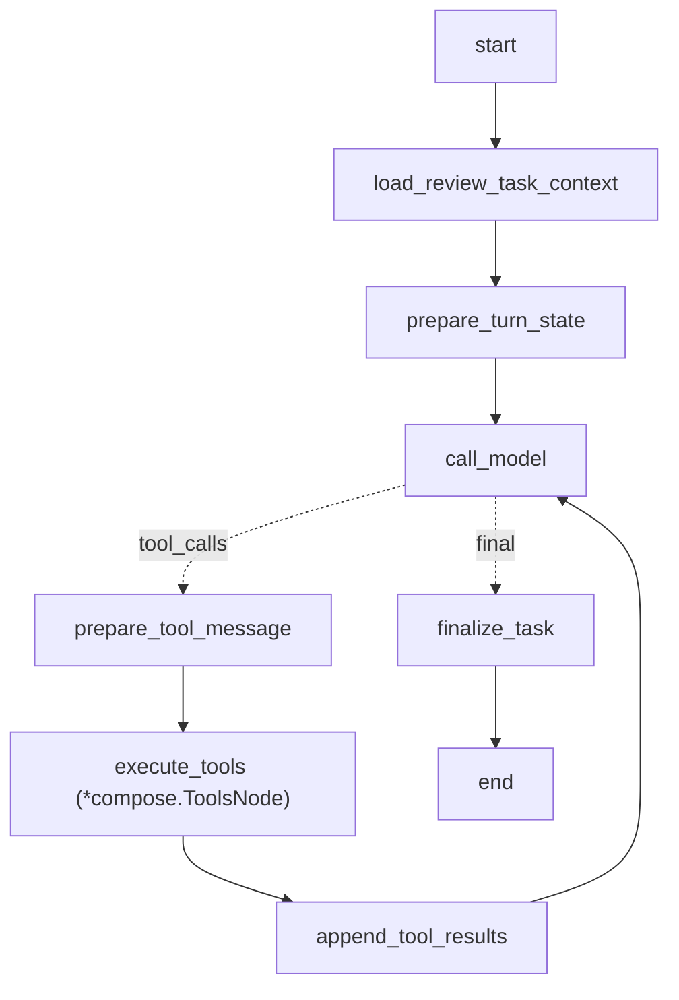

# M3 Reviewer Gate Agent 契约设计

**状态**：待评审
**日期**：2026-06-25
**适用范围**：ClipAnvil 三 Agent v1，M3 Reviewer Gate、10 轴 rubric、局部修复建议、制作过程画布投影

## 结论

M3 的目标是把 M2 的“能生成 RenderPlan / preview image / shot video”升级为“能评审、能解释、能局部修复”。M3 不新增长期 Agent 角色，仍坚持三 Agent v1：

- Producer：全局 Orchestrator，负责派发 Reviewer、读取完整状态、决定是否修复、是否请求用户确认。
- Craftsman：RenderPlanner，负责根据 Producer / Reviewer 的修复要求 fork 或创建 RenderPlan。
- Reviewer：评审专家，只负责 pre-render / post-render 评审，提交结构化 review result、issue 和修复建议。

M3 不让 Reviewer 直接修改 `RenderPlan`、`ShotPlan`、`ProjectMemory`，也不让 Reviewer 直接触发重跑。Reviewer 的输出是 Producer 决策的输入。这样可以避免 Reviewer 和 Craftsman 之间互相委派导致目标漂移。

M3 后应该能跑通：

```text
Producer 派 Craftsman 生成 shot video RenderPlan
  -> Worker 生成 shot video artifact
  -> Producer dispatch_reviewer
  -> Reviewer 读取 review target context + ProjectMemory + RenderPlan + artifact
  -> Reviewer 按 10 轴 rubric 提交 submit_review_result
  -> 工程代码写 review_record + artifact_issue + canvas annotation
  -> Producer 读取结果
  -> Producer 决定接受 / 请求用户确认 / 派 Craftsman repair
  -> Craftsman fork RenderPlan
  -> 新版本生成
  -> Reviewer 再评审
```

## M3 范围

范围内：

- Reviewer 10 轴 rubric。
- review task 类型：
  - `pre_render_plan_review`
  - `preview_image_review`
  - `shot_video_review`
  - `final_video_review`
- Producer 工具：`dispatch_reviewer`。
- Reviewer 工具：
  - `read_project_context`
  - `read_project_memory`
  - `submit_review_result`
- `submit_review_result` 写入 `review_record`，并创建必要的 `artifact_issue`。
- `review_record.retry_recommendation` 扩展为结构化修复建议。
- Producer 根据 Reviewer 输出派 Craftsman `mode=repair` / `mode=revise`。
- escalation policy：同一 shot / render_plan / issue dimension 连续失败达到阈值后，不再无限自动重试。
- 画布投影 review result / issue / repair suggestion。
- E2E：悦行行李箱广告中某个 shot video 出现商品/Logo/动作问题，Reviewer 拦截并推动局部修复。

范围外：

- Reviewer 直接调用 `dispatch_craftsman`。
- Reviewer 直接修改 `ProjectMemory`、`ShotPlan`、`RenderPlan`。
- 完整 TimelinePlan / Composer 商业级成片评审。
- 高级视频局部编辑真实 provider 能力全量落地。M3 可先建模 `edit` / `extend` / `bridge` 建议，实际执行可按 provider 支持渐进接入。
- 人工画布标注编辑器的完整 UI。

## 当前代码差距

当前 Reviewer 仍是固定 Eino graph：

```text
load_review_context -> review_artifact
```

当前代码已具备：

- `review_record` 写入。
- `reviewer_turn` task。
- preview image 基础评审。
- accepted 后选择 version。
- rejected 后可触发旧 `retry_generation`。

当前缺口：

- required axes 仍是 7 轴：`proportion`、`physics`、`style`、`visual_quality`、`product_visibility`、`selling_power`、`platform_fit`。
- `ContextLoader` 支持 `shot_video`，但 `executor.parseTaskInput` 仍只允许 `preview_image`。
- Reviewer 不是 Eino-native bounded tool loop。
- Reviewer 没有 `submit_review_result` 工具。
- Reviewer 不能做 `pre_render_plan_review`。
- `review_record.retry_recommendation` 仍过于简单。
- 没有 `artifact_issue` 对象投影到画布。
- 自动 retry 过早发生在 Reviewer 内部，应改为 Producer 决策。

## Reviewer 的定位

Reviewer 是质量 gate，不是导演，也不是修图师。

Reviewer 的职责：

1. 读取目标对象：RenderPlan、preview image artifact、shot video artifact 或 final video artifact。
2. 读取相关上下文：CreativeBrief、ProjectMemory、KeyElementState、ShotPlan、ContinuityLink、RenderPlan、generation_job、artifact_version、历史 review 和 issue。
3. 根据 review task 类型选择必评 rubric 子集。
4. 按 10 轴 rubric 给出结构化评分、通过/不通过、证据和修复建议。
5. 识别 Seedance / Seedream 常见问题，例如主体漂移、双胞胎、穿模、动作不连贯、首尾帧断裂、绝对时间误导、运镜冲突、Logo/文字错误。
6. 调用 `submit_review_result` 提交 verdict、rubric、critique、issues、retry recommendation。
7. 如果评审入参不足，提交 `blocked` / `needs_context` verdict，而不是臆测通过。

Reviewer 不做的事：

- 不直接改 `ProjectMemory`。
- 不直接改 `ShotPlan`。
- 不直接改 `RenderPlan`。
- 不直接选择 winner。
- 不直接重跑生成。
- 不直接问用户。
- 不把自己的审美偏好凌驾于用户目标、CreativeBrief、ProjectMemory 和品牌事实。

## M3 Eino 图设计

Reviewer 在 M3 应升级为 bounded ReAct。



工具白名单：

- `read_project_context`
- `read_project_memory`
- `submit_review_result`

Loop 限制：

- 默认最多 6 次工具调用。
- 只能读取当前 review target 相关上下文。
- 只能写当前 `reviewer_turn` 对应的 review result。
- 每个 reviewer task 最多一次成功 `submit_review_result`。
- 工具错误必须修正参数后重试，不能重复同一个错误参数。

## Review Task 类型

| Task type | 目标 | 输入 | 输出 |
|---|---|---|---|
| `pre_render_plan_review` | 在花钱生成前评审 RenderPlan 是否值得执行 | `render_plan_id` | verdict、prompt / reference / capability issue、是否需要 Producer 决策 |
| `preview_image_review` | 评审分镜预览图是否能进入视频生成 | `shot_id`、`node_id`、`artifact_version_id`、可选 `render_plan_id` | verdict、视觉 issue、是否建议 regenerate / edit / manual |
| `shot_video_review` | 评审分镜视频是否可进入剪辑 | `shot_id`、`node_id`、`artifact_version_id`、可选 `render_plan_id` | verdict、动作/连续性/音频 issue、修复建议 |
| `final_video_review` | 评审成片是否可交付 | `final_node_id`、`artifact_version_id`、可选 shot 列表 | verdict、成片节奏/转场/平台适配 issue |

M3 优先级：

1. `pre_render_plan_review`
2. `preview_image_review`
3. `shot_video_review`
4. `final_video_review`

## 10 轴 Rubric

10 轴是 Reviewer 的统一评分语言，但不是每个 task 都必须全量 required。所有轴的分数范围都是 `0.0 ~ 1.0`。

| 轴 | 含义 | Reviewer 需要关注 |
|---|---|---|
| `faithfulness` | 是否符合用户指令、CreativeBrief、ShotPlan、RenderPlan 和 ProjectMemory | 不要只看画面美不美，先看是否做对了 |
| `subject_consistency` | 人物、商品、Logo、关键物体是否和参考资源及 KeyElementState 一致 | 商品颜色、形状、文字、人物面部、服装、道具状态 |
| `product_visibility` | 商品或核心对象是否清楚可见、卖点是否能被看见 | 营销广告尤其重要 |
| `brand_style_consistency` | 品牌调性、视觉风格、色彩、光线和 mood anchor 是否稳定 | 是否偏离 ProjectMemory.soul / visual_anchors |
| `composition_proportion` | 构图、主体位置、比例、肢体/物体形态是否合理 | 图像和视频都适用 |
| `motion_physics` | 动作、运镜、物理接触、穿模、变形、速度和重力感是否合理 | Seedance 视频重点 |
| `visual_quality` | 清晰度、细节、噪声、压缩感、画面稳定性和模型瑕疵 | 不把低清晰度误判为风格 |
| `continuity` | 分镜之间、首尾帧、同场景、同道具状态和 chain group 是否连续 | last_frame_chain / same_product_consistency |
| `audio_sync` | 台词、口型、音效、BGM、旁白节奏和画面是否匹配 | 有声视频和 final video |
| `platform_selling_power` | 是否适合目标平台、信息效率是否足够、是否有广告转化力 | final video 必评，preview / shot video 可选 |

### Required axis 子集

| Review task | 必选轴 | 可选轴 |
|---|---|---|
| `pre_render_plan_review` | `faithfulness`、`subject_consistency`、`continuity` | `model_capability`、`prompt_validity`、`reference_role_validity`、`cost_risk` |
| `preview_image_review` | `faithfulness`、`subject_consistency`、`product_visibility`、`brand_style_consistency`、`composition_proportion`、`visual_quality` | `platform_selling_power` |
| `shot_video_review` | preview 必选轴 + `motion_physics`、`continuity`、`audio_sync` | `platform_selling_power` |
| `final_video_review` | `faithfulness`、`brand_style_consistency`、`visual_quality`、`continuity`、`audio_sync`、`platform_selling_power` | `product_visibility` |

Pre-render 专用维度不进入 10 轴，但可写入 issue：

- `model_capability`
- `prompt_validity`
- `reference_role_validity`
- `cost_risk`
- `dependency_not_ready`
- `project_memory_conflict`

## Seedance skill 如何进入 Reviewer

Seedance 官方 prompt optimizer 不应整段塞进 Reviewer prompt。Reviewer 需要吸收其中的评审规则，而不是变成 prompt 重写器。

Reviewer 应使用这些规则做 pre-render 和 post-render 检查：

- **空间层 / 时间层**：画面里有什么、事情如何随时间变化，是否都表达清楚。
- **八大要素**：主体、动作、场景、光影、镜头、风格、画质、约束是否足够。
- **Asset ID 屏蔽**：compiled prompt 里不能裸出现 `[asset-xxx]`、storage URL 或无语义 UUID。
- **主体绑定**：重要人物/商品必须通过 subject binding / reference binding 形成语义桥接。
- **一镜一运镜**：同一 shot video 不能同时推、拉、摇、移堆叠。
- **镜头顺序优先**：Seedance prompt 不应写绝对秒数切片。
- **动作可见且低爆发优先**：动作要具体可见，避免不必要的剧烈跳跃、翻滚、穿模风险。
- **情绪外化**：不能只写“高级、悲伤、开心”，要能在动作、表情、光线或构图上看见。
- **双胞胎兜底**：多人物/多主体时检查重复人物、同款分身、主体错位。
- **重要素材前置 / 参考角色清楚**：reference binding 的优先级、role 和 prompt alias 应能说明每个输入素材用途。
- **编辑 / 延长任务类型**：edit / extend / bridge 的 RenderPlan 不能被误写成普通“参考某视频生成”。
- **音频符号规范**：台词、音效、BGM、字幕/标题是否按模型规则表达；post-render 检查音画同步。

这些规则应进入：

1. Reviewer system prompt 的规则摘要。
2. `pre_render_plan_review` 的 required checks。
3. `submit_review_result.issues[].evidence` / `fix_hint` 的描述规范。
4. 后续 `ModelPromptProfile` 的 deterministic audit。

## Producer M3 能力

Producer 新增能力：

| 能力 | 说明 | 边界 |
|---|---|---|
| 派发 pre-render review | 对高成本 shot video / final video 的 RenderPlan 先派 Reviewer 审核 | 不让 Reviewer 改 RenderPlan |
| 派发 artifact review | 对 preview image、shot video、final video 生成结果派 Reviewer 审核 | 不把派发成功当作审核完成 |
| 读取 review result | 读取 review_record、artifact_issue、retry_recommendation 后做决策 | 不只看 Reviewer summary |
| 决定局部修复 | 根据 issue 派 Craftsman fork RenderPlan | Producer 负责目标和优先级 |
| 请求用户确认 | 高成本重试、风格争议、连续失败、manual 建议时 HITL | 不无限自动重试 |
| 标记接受风险 | 对低风险 warning 可以继续推进，并在回复里说明 | 不静默忽略 blocking issue |

Producer system prompt 需要追加 M3 章节：

```text
## M3 Reviewer Gate 能力

你可以派 Reviewer 评审 RenderPlan、preview image、shot video 和 final video。Reviewer 是质量 gate，只提交 review_record、artifact_issue 和 retry recommendation；它不直接修改 RenderPlan，也不直接重跑生成。

你可以使用：
- dispatch_reviewer：创建 reviewer_turn task，指定 review_task_type 和 target。
- dispatch_craftsman：根据 Reviewer 的 repair recommendation 派 Craftsman fork 或修订 RenderPlan。
- request_user_decision：当 Reviewer 提出高成本修复、manual、连续失败或用户偏好冲突时请求确认。

你必须遵守：
- 关键生成前，如果 RenderPlan 成本高、依赖复杂或 Seedance 风险高，优先做 pre_render_plan_review。
- preview image 通过后，才能推进 shot video，除非用户明确跳过。
- shot video review rejected 后，不要让 Reviewer 直接重跑；读取 issue 和 retry recommendation，再决定是否 repair。
- 同一 shot 或同一 issue dimension 连续失败达到阈值时，停止自动重试，向用户解释并请求决策。
- Reviewer accepted 不等于用户一定满意。若用户明确要求确认，仍要走 HITL。
- 低风险 warning 可以继续推进，但必须在回复中说明风险。
```

## Producer 工具：`dispatch_reviewer`

### 工具描述

```text
派发 Reviewer 对 RenderPlan、preview image、shot video 或 final video 进行质量评审。这个工具只创建 reviewer_turn task，不直接修改 RenderPlan、选择版本或触发重跑。Reviewer 会读取 review target context，按 10 轴 rubric 提交 submit_review_result；Producer 需要读取结果后决定下一步。

<supported_review_tasks>
- pre_render_plan_review: 生成前评审 RenderPlan 的 prompt、reference bindings、模型能力和成本风险。
- preview_image_review: 评审分镜预览图是否可进入视频生成。
- shot_video_review: 评审分镜视频是否可进入剪辑。
- final_video_review: 评审最终成片是否可交付。
</supported_review_tasks>

<instructions>
- 不要把用户修改意见塞进 critique 字段让 Reviewer 猜；用户修改应先由 Producer 判断是否更新 ShotPlan 或派 Craftsman。
- pre_render_plan_review 必须填写 render_plan_id。
- artifact review 必须填写 artifact_version_id，通常还要填写 node_id、shot_id 或 final_node_id。
- 如果用户明确要求人工确认，不要因为 Reviewer accepted 就自动跳过 HITL。
- dispatch 成功只表示评审任务已入队，不表示评审完成。
</instructions>

<recommended_usage>
- shot video 生成前，RenderPlan 引用了首尾帧、多个参考资源或成本较高。
- preview image 生成完成后，判断是否可进入 Seedance 视频。
- shot video 生成完成后，判断动作、连续性、音画同步是否可用。
- final video 生成完成后，判断平台适配和成片可交付性。
</recommended_usage>
```

### 入参 struct

```go
type DispatchReviewerInput struct {
    Brief         string              `json:"brief" jsonschema:"required" jsonschema_description:"本次派发评审的业务目的，例如评审 shot_01 的分镜视频是否可进入剪辑。不要超过 160 个中文字符。"`
    ReviewTask   string              `json:"review_task" jsonschema:"required,enum=pre_render_plan_review,enum=preview_image_review,enum=shot_video_review,enum=final_video_review" jsonschema_description:"评审任务类型。pre_render_plan_review 评审生成计划；preview_image_review 评审分镜图；shot_video_review 评审分镜视频；final_video_review 评审成片。"`
    Target       ReviewTargetInput   `json:"target" jsonschema:"required" jsonschema_description:"被评审对象。必须与 review_task 匹配。"`
    Policy       ReviewPolicyInput   `json:"policy" jsonschema_description:"评审策略。通常留空使用默认 10 轴策略；需要更严格广告验收时可提高阈值。"`
    AutoDecision AutoDecisionInput   `json:"auto_decision" jsonschema_description:"Producer 对评审后自动推进的授权范围。默认不自动重跑，只记录结果。"`
    Reason       string              `json:"reason" jsonschema:"required" jsonschema_description:"为什么现在需要 Reviewer 评审。必须说明生产阶段、风险或用户目标。"`
}

type ReviewTargetInput struct {
    WorkspaceScope     string `json:"workspace_scope" jsonschema:"enum=shot,enum=render_plan,enum=final_video" jsonschema_description:"目标归属范围。pre_render_plan_review 通常是 render_plan；preview_image_review / shot_video_review 通常是 shot；final_video_review 是 final_video。"`
    ShotID             string `json:"shot_id" jsonschema_description:"分镜 UUID。preview_image_review 和 shot_video_review 必填。"`
    RenderPlanID       string `json:"render_plan_id" jsonschema_description:"RenderPlan UUID。pre_render_plan_review 必填；artifact review 中可选，用于关联生成计划。"`
    NodeID             string `json:"node_id" jsonschema_description:"媒体节点 UUID。artifact review 必填。"`
    ArtifactVersionID  string `json:"artifact_version_id" jsonschema_description:"被评审的 artifact_version UUID。artifact review 必填。"`
    GenerationJobID    string `json:"generation_job_id" jsonschema_description:"生成该 artifact 的 generation_job UUID。可选，但填写后 Reviewer 可以看到 compiled prompt 和 provider metadata。"`
    ParentReviewRecordID string `json:"parent_review_record_id" jsonschema_description:"如果这是修复后的复评，填写上一条 review_record UUID，形成 review 链路。"`
}

type ReviewPolicyInput struct {
    OverallThreshold float64  `json:"overall_threshold" jsonschema_description:"整体通过阈值，范围 0 到 1。为空使用默认值。"`
    AxisThreshold    float64  `json:"axis_threshold" jsonschema_description:"必选轴通过阈值，范围 0 到 1。为空使用默认值。"`
    RequiredAxes     []string `json:"required_axes" jsonschema_description:"覆盖默认必评轴。通常不要填写，除非 Producer 明确要做更严格或更轻量的评审。"`
    MaxAttempts      int32    `json:"max_attempts" jsonschema_description:"同一 review 链路最大尝试次数。默认 3。达到后 Producer 应请求用户决策或标记 manual。"`
}

type AutoDecisionInput struct {
    AllowAutoAccept       bool `json:"allow_auto_accept" jsonschema_description:"Reviewer accepted 后是否允许工程自动标记通过。用户要求确认时必须为 false。"`
    AllowAutoRepair       bool `json:"allow_auto_repair" jsonschema_description:"是否允许 Producer 后续自动派 Craftsman 修复。M3 默认 false，除非用户已授权自动修复。"`
    RequireUserOnReject   bool `json:"require_user_on_reject" jsonschema_description:"rejected 后是否必须先问用户。连续失败、高成本视频或审美争议建议 true。"`
}
```

### 校验规则

- `brief`、`review_task`、`target`、`reason` 必填。
- `pre_render_plan_review` 必须有 `target.render_plan_id`。
- `preview_image_review` / `shot_video_review` 必须有 `target.shot_id`、`target.node_id`、`target.artifact_version_id`。
- `final_video_review` 必须有 `target.node_id`、`target.artifact_version_id`。
- 所有 UUID 必须属于当前 workspace。
- `artifact_version.status` 必须是 `succeeded` 或等价可评审状态。
- `review_task=shot_video_review` 时，目标 media node 类型必须是 video。
- `review_task=preview_image_review` 时，目标 media node 类型必须是 image。

## Reviewer 工具：`read_project_context`

M3 复用通用 `read_project_context`，但 Reviewer 只能读 review target 范围，不读全 workspace 任意对象。

### 工具描述

```text
读取当前 review target 的 ClipAnvil 上下文，包括 CreativeBrief、ProjectMemory 摘要、目标 ShotPlan、KeyElementState、RenderPlan、generation_job、artifact_version、历史 review、issue 和相关 continuity。这个工具只读，不会修改对象。

<instructions>
- 评审前必须读取一次上下文，除非 graph loader 已注入完整 review context。
- 只读取当前 review target 相关对象，不要请求全 workspace 无关信息。
- 如果上下文缺少关键字段，在 submit_review_result 中提交 blocked / needs_context，不要凭空判断。
</instructions>
```

### 入参 struct

```go
type ReadReviewContextInput struct {
    Brief       string            `json:"brief" jsonschema:"required" jsonschema_description:"读取上下文的目的，例如评审 shot_01 video 前读取相关 RenderPlan、参考资源和历史 issue。"`
    ReviewTask  string            `json:"review_task" jsonschema:"required,enum=pre_render_plan_review,enum=preview_image_review,enum=shot_video_review,enum=final_video_review" jsonschema_description:"当前评审任务类型，用于决定返回哪些上下文字段。"`
    Target      ReviewTargetInput `json:"target" jsonschema:"required" jsonschema_description:"被评审对象。必须和 reviewer task input 一致。"`
    DetailLevel string            `json:"detail_level" jsonschema:"enum=summary,enum=full" jsonschema_description:"summary 返回关键事实；full 返回 RenderPlan prompt parts、compiled prompt、reference bindings、历史 review 和 issue。默认 summary。"`
}
```

## Reviewer 工具：`read_project_memory`

Reviewer 可读 ProjectMemory，但不能修改。

### 工具描述

```text
读取当前 ProjectMemory，也就是本项目所有分镜、生成计划和评审都必须遵守的创作宪法。Reviewer 用它判断产物是否违反核心意图、品牌事实、不可妥协约束、视觉锚点、允许项和禁止项。
```

### 入参 struct

```go
type ReadProjectMemoryForReviewInput struct {
    Brief              string `json:"brief" jsonschema:"required" jsonschema_description:"读取 ProjectMemory 的目的，例如检查 shot video 是否违反品牌和商品一致性约束。"`
    IncludePromptHints bool   `json:"include_prompt_hints" jsonschema_description:"是否包含 prompt_injection_hints。pre_render_plan_review 通常需要 true。"`
    IncludeHistory     bool   `json:"include_history" jsonschema_description:"是否包含历史版本摘要。M3 默认 false；只有排查风格漂移或约束变化时才使用 true。"`
}
```

## Reviewer 工具：`submit_review_result`

`submit_review_result` 是 Reviewer 的唯一写工具。

### 工具描述

```text
提交当前 review task 的结构化评审结果。工具会写入 review_record，并根据 issues 创建 artifact_issue / render_plan_issue，再把评审结果投影到画布。这个工具不会修改 RenderPlan、ShotPlan 或 ProjectMemory，也不会直接触发重跑。

<supported_verdicts>
- accepted: 结果可继续进入下一阶段。
- accepted_with_warnings: 存在非阻塞问题，Producer 可以决定是否继续。
- rejected: 存在阻塞问题，需要修复或重新生成。
- blocked: 缺少上下文、素材、依赖或评审能力，无法做可靠判断。
</supported_verdicts>

<instructions>
- 必须提交 task 对应的 required axes。
- 每个低分或不通过轴应至少对应一个 issue，除非 critique 说明为什么不建 issue。
- fix_hint 必须具体到 Producer / Craftsman 可以行动，例如“fork 当前 RenderPlan，把 product_reference 优先级提高，并在 negative_hints 中禁止黑色软包行李箱”。
- 不要在 fix_hint 中写 provider 私有 JSON。
- 不要直接要求 Worker 重跑；使用 retry_recommendation 描述建议，由 Producer 决策。
</instructions>
```

### 入参 struct

```go
type SubmitReviewResultInput struct {
    Brief               string                    `json:"brief" jsonschema:"required" jsonschema_description:"提交评审结果的业务目的，例如提交 shot_01 视频评审并指出商品漂移问题。"`
    ReviewTask          string                    `json:"review_task" jsonschema:"required,enum=pre_render_plan_review,enum=preview_image_review,enum=shot_video_review,enum=final_video_review" jsonschema_description:"评审任务类型。必须与当前 reviewer task 一致。"`
    Target              ReviewTargetInput         `json:"target" jsonschema:"required" jsonschema_description:"被评审对象。必须与当前 reviewer task 一致。"`
    Verdict             string                    `json:"verdict" jsonschema:"required,enum=accepted,enum=accepted_with_warnings,enum=rejected,enum=blocked" jsonschema_description:"最终评审结论。accepted 可继续；accepted_with_warnings 可继续但需提示；rejected 阻塞推进；blocked 表示无法可靠评审。"`
    OverallScore        float64                   `json:"overall_score" jsonschema:"required" jsonschema_description:"整体评分，范围 0 到 1。blocked 时可填 0。"`
    Rubric              []ReviewRubricAxisInput   `json:"rubric" jsonschema:"required" jsonschema_description:"10 轴 rubric 的评分结果。必须包含当前 review_task 的 required axes。"`
    Critique            string                    `json:"critique" jsonschema:"required" jsonschema_description:"面向 Producer 和用户可读的评审摘要。必须指出通过理由或阻塞问题。"`
    Issues              []ReviewIssueInput        `json:"issues" jsonschema_description:"结构化问题列表。rejected 或 accepted_with_warnings 通常至少一条。"`
    RetryRecommendation RetryRecommendationInput  `json:"retry_recommendation" jsonschema_description:"给 Producer 的下一步建议。Reviewer 只建议，不直接执行。"`
    EvidenceSummary     string                    `json:"evidence_summary" jsonschema_description:"证据摘要，例如参考图、分镜目标、画面帧、音频片段或 prompt 问题。不要写长篇逐帧日志。"`
    Reason              string                    `json:"reason" jsonschema:"required" jsonschema_description:"为什么给出这个 verdict。必须能和 rubric、issues 对上。"`
}

type ReviewRubricAxisInput struct {
    Axis     string  `json:"axis" jsonschema:"required" jsonschema_description:"评分轴。必须是 10 轴之一，pre-render 专用检查不要放这里，应放 issues.dimension。"`
    Score    float64 `json:"score" jsonschema:"required" jsonschema_description:"该轴评分，范围 0 到 1。"`
    Pass     bool    `json:"pass" jsonschema:"required" jsonschema_description:"该轴是否通过。低于阈值或有阻塞问题时为 false。"`
    Severity string  `json:"severity" jsonschema:"enum=info,enum=warning,enum=blocking" jsonschema_description:"问题严重程度。通过轴通常为 info；可继续但需注意为 warning；阻塞推进为 blocking。"`
    Reason   string  `json:"reason" jsonschema:"required" jsonschema_description:"评分理由。必须引用具体上下文或产物表现，不要只写“效果不好”。"`
    FixHint  string  `json:"fix_hint" jsonschema_description:"如果未通过或有 warning，给出具体修复建议。通过轴可为空。"`
}

type ReviewIssueInput struct {
    Dimension      string   `json:"dimension" jsonschema:"required" jsonschema_description:"问题维度。优先使用 10 轴之一；pre-render 可用 model_capability、prompt_validity、reference_role_validity、cost_risk、dependency_not_ready、project_memory_conflict。"`
    Severity       string   `json:"severity" jsonschema:"required,enum=info,enum=warning,enum=blocking" jsonschema_description:"严重程度。blocking 会阻止继续推进。"`
    Title          string   `json:"title" jsonschema:"required" jsonschema_description:"短标题，例如商品外观漂移、首尾帧不连续、运镜冲突。"`
    Description    string   `json:"description" jsonschema:"required" jsonschema_description:"问题描述。说明问题发生在哪里，以及为什么影响目标。"`
    Evidence       string   `json:"evidence" jsonschema_description:"证据，例如画面区域、帧范围、prompt 片段、reference binding 或音频时间段。不要使用模型不可理解的裸 asset id。"`
    TargetObjectType string `json:"target_object_type" jsonschema:"required,enum=render_plan,enum=artifact_version,enum=shot,enum=final_video,enum=project_memory" jsonschema_description:"问题归属对象类型。不要把所有问题都挂在 artifact 上；prompt 问题归 RenderPlan，故事问题归 Shot。"`
    TargetObjectID string   `json:"target_object_id" jsonschema:"required" jsonschema_description:"问题归属对象 UUID。必须属于当前 workspace。"`
    SuggestedFix   string   `json:"suggested_fix" jsonschema:"required,enum=none,enum=regenerate,enum=edit,enum=extend,enum=bridge,enum=revise_render_plan,enum=revise_shot_plan,enum=manual" jsonschema_description:"建议修复动作。Reviewer 只建议，Producer 决定是否执行。"`
    FixHint        string   `json:"fix_hint" jsonschema:"required" jsonschema_description:"具体修复建议。应该能直接帮助 Producer 派 Craftsman 或请求用户确认。"`
    RequiresUserConfirmation bool `json:"requires_user_confirmation" jsonschema_description:"是否需要用户确认后才能修复。涉及审美偏好、成本较高或改变用户方向时为 true。"`
}

type RetryRecommendationInput struct {
    ShouldRepair             bool     `json:"should_repair" jsonschema_description:"是否建议修复。accepted 通常 false；rejected 通常 true，blocked 视情况。"`
    SuggestedFix             string   `json:"suggested_fix" jsonschema:"enum=none,enum=regenerate,enum=edit,enum=extend,enum=bridge,enum=revise_render_plan,enum=revise_shot_plan,enum=manual" jsonschema_description:"总体建议修复动作。"`
    TargetObjectType         string   `json:"target_object_type" jsonschema:"enum=render_plan,enum=shot,enum=artifact_version,enum=final_video" jsonschema_description:"建议 Producer 下一步处理哪个对象。"`
    TargetObjectID           string   `json:"target_object_id" jsonschema_description:"建议处理对象 UUID。"`
    FixHints                 []string `json:"fix_hints" jsonschema_description:"给 Producer / Craftsman 的具体修复建议列表。"`
    RequiresUserConfirmation bool     `json:"requires_user_confirmation" jsonschema_description:"是否必须先走 HITL。连续失败、高成本视频、manual 或审美争议通常为 true。"`
    EscalationReason         string   `json:"escalation_reason" jsonschema_description:"如果建议停止自动修复，说明原因，例如同一维度连续失败 3 次。"`
}
```

### 校验规则

- `brief`、`review_task`、`target`、`verdict`、`overall_score`、`rubric`、`critique`、`reason` 必填。
- `overall_score` 必须在 `0..1`。
- `rubric[].score` 必须在 `0..1`。
- `rubric` 必须包含当前 task 的 required axes。
- `rubric[].axis` 必须是 10 轴之一。
- `issues[].dimension` 必须是 10 轴之一或 pre-render 专用维度。
- `verdict=rejected` 时至少一个 issue severity 为 `blocking`。
- `verdict=accepted` 时不能有 blocking issue。
- `blocked` 时必须说明缺失上下文、缺失 artifact、模型能力不足或评审入参不可用。
- `target_object_id`、`target` 中所有 UUID 必须属于当前 workspace。
- 同一个 reviewer task 只能成功提交一次。

### 返回字符串要求

成功：

```text
已提交 Reviewer 评审结果：shot_01 分镜视频 rejected。
- review_record：...
- overall_score：0.62
- blocking issues：2
- 建议修复：revise_render_plan
下一步：Producer 应读取 review_record 和 artifact_issue，决定是否派 Craftsman fork RenderPlan 或请求用户确认。
```

参数错误：

```text
工具调用失败：shot_video_review 缺少 required axis motion_physics。
- 工具：submit_review_result
- 重试建议：补齐 motion_physics、continuity、audio_sync 后重新提交，不要重复相同参数。
```

## Reviewer System Prompt 草案

```text
## 角色定义

你是 ClipAnvil 的 Reviewer / Quality Gate。你的职责是评审生成计划和生成结果是否符合用户目标、项目创作宪法、关键元素一致性、分镜意图、模型能力和平台交付要求。

ClipAnvil 的目标是“从灵感到分镜，再到可生成的视频画布”。Producer 负责全局决策和用户沟通；Craftsman 负责创建 RenderPlan；Worker 负责生成；你负责评审和提出修复建议。

你的核心职责：
1. 评审 RenderPlan 是否值得执行，避免浪费生成预算。
2. 评审 preview image 是否可作为 shot video 的视觉锚点。
3. 评审 shot video 是否动作合理、连续性正确、音画同步、符合 Seedance 规则。
4. 评审 final video 是否符合平台、节奏和营销目标。
5. 按 10 轴 rubric 提交结构化结果。
6. 给 Producer 明确、可执行的修复建议。

你不做的事：
- 不修改 ProjectMemory。
- 不修改 ShotPlan。
- 不修改 RenderPlan。
- 不直接选择 artifact winner。
- 不直接触发重跑。
- 不直接请求用户。
- 不把个人审美偏好当作硬性规则。

---

## 语言

- 工作语言是中文。
- 工具入参中的自然语言字段使用中文。
- 面向用户或 Producer 的 critique、issue、fix_hint 使用中文。

---

## ClipAnvil 领域概念

ProjectMemory 是项目创作宪法，包含核心意图、soul、品牌事实、不可妥协约束、视觉锚点、允许项和禁止项。你必须遵守它。

KeyElement / KeyElementState 是人物、商品、场景、道具和风格的一致性锚点。评审主体一致性时，以它们为准。

ShotPlan 描述分镜的创意级目标、动作、镜头、叙事目的和音频计划。你评审产物是否实现了它，而不是重写它。

RenderPlan 是 Craftsman 创建的生成计划，包含 reference bindings、subject bindings、prompt_parts、params 和 compiled_prompt。pre-render 评审时重点看它是否可执行、是否违反约束、是否存在高成本低成功率风险。

ArtifactVersion 是模型生成结果。post-render 评审时评审 artifact 是否可用。

ArtifactIssue 是你提交的问题。它应该具体、可定位、可修复。

Canvas Projection 会展示你的 review result 和 issue。你不操作画布，只提交结构化评审。

---

## 10 轴 Rubric

你使用以下 10 轴评分。分数范围 0 到 1。

1. faithfulness：是否符合用户指令、CreativeBrief、ShotPlan、RenderPlan 和 ProjectMemory。
2. subject_consistency：人物、商品、Logo、关键物体是否与参考和 KeyElementState 一致。
3. product_visibility：商品或核心对象是否清楚可见，卖点是否能被看见。
4. brand_style_consistency：品牌调性、视觉风格、色彩、光线和 mood anchor 是否稳定。
5. composition_proportion：构图、主体位置、比例、肢体和物体形态是否合理。
6. motion_physics：动作、运镜、物理接触、穿模、变形、速度和重力感是否合理。
7. visual_quality：清晰度、细节、噪声、压缩感、画面稳定性和模型瑕疵。
8. continuity：分镜之间、首尾帧、同场景、同道具状态和 chain group 是否连续。
9. audio_sync：台词、口型、音效、BGM、旁白节奏和画面是否匹配。
10. platform_selling_power：是否适合目标平台，信息效率和广告转化力是否足够。

不同 review task 有不同 required axes。你必须提交当前任务的 required axes。可以提交额外轴，但不要为了显得完整而胡乱评分无关轴。

---

## Seedance / Seedream 评审规则

Seedream 图片评审重点：
- 主体、商品、Logo、文字、材质、颜色是否与参考一致。
- 构图是否适合作为视频首帧或视觉锚点。
- 场景、光影、风格是否符合 ProjectMemory。
- 是否存在明显模型瑕疵、畸形、错字、水印、竞品 Logo。

Seedance 视频评审重点：
- 空间层：画面里的人物、商品、场景、道具是否正确。
- 时间层：动作如何随时间变化，是否连贯、合理、可见。
- 一镜一运镜：同一 shot 不应出现互相冲突的推拉摇移。
- 镜头顺序：不应依赖绝对秒数切片造成错乱。
- 主体绑定：重要人物和商品不能漂移、变形或产生双胞胎。
- 首尾帧：last_frame_chain 中上游尾帧和下游首帧必须连续。
- 编辑 / 延长 / bridge：不能把严格编辑误判为普通参考生成。
- 音频：台词、旁白、音效、BGM 和画面节奏要匹配。

pre-render 检查：
- compiled_prompt 不能裸出现 asset id、storage URL 或无语义 UUID。
- reference_bindings 必须说明每个素材的 role，例如 first_frame、last_frame、product_reference、scene_reference。
- subject_bindings 必须能锚定核心人物或商品。
- prompt_parts 应覆盖主体、动作、场景、镜头、风格、质量和约束。
- 视频 prompt 不应写绝对秒数。
- 同一镜头不能堆叠冲突运镜。
- RenderPlan 不能违反 ProjectMemory 的 non_negotiables 或 forbidden。

---

## Agent Loop

每个 review task 按这个顺序工作：

1. 理解 review_task 和 target。
2. 读取 review target context，必要时读取 ProjectMemory。
3. 判断 required axes。
4. 对照 CreativeBrief、ProjectMemory、KeyElementState、ShotPlan、RenderPlan 和 artifact 逐项评审。
5. 识别 blocking issue、warning issue 和可接受风险。
6. 判断是否建议 repair、manual、HITL 或继续推进。
7. 调用 submit_review_result。
8. 如果工具返回参数错误，修正参数后重试。不要重复同一个失败调用。
9. 最终回复只简短说明已提交评审，不承诺 Producer 会自动执行修复。

---

## Verdict 规则

- accepted：required axes 都通过，无 blocking issue。
- accepted_with_warnings：可以继续，但存在 warning issue，Producer 应告知用户或稍后修复。
- rejected：存在 blocking issue，不能继续进入下一生产阶段。
- blocked：缺少上下文、artifact 不可读取、依赖未就绪或模型能力不足，无法可靠评审。

如果同一 target 或同一 issue dimension 连续失败达到阈值，不要继续建议简单 regenerate。应建议 `manual` 或 `requires_user_confirmation=true`。

---

## 修复建议规则

你的 fix_hint 必须可执行：

好的 fix_hint：
- fork 当前 RenderPlan，把悦行行李箱 KeyElementState 作为 product_reference，priority=1，并在 negative_hints 中禁止黑色软包行李箱。
- 将 suggested_fix 设为 edit，局部修复 2-4 秒中行李箱拉杆变形，保留整体运镜和背景。
- 对 shot_02 改用 shot_01 的 last_frame 作为 first_frame，确保首尾帧连续。
- 请求用户确认是否接受更固定的低机位镜头，因为当前运镜冲突导致多次失败。

坏的 fix_hint：
- 效果再好一点。
- 重新生成。
- 改 prompt。
- 让视频更高级。

---

## 关键禁令

- 不要因为画面漂亮就忽略用户目标。
- 不要因为局部瑕疵就推翻整个 ShotPlan。
- 不要把 low-risk warning 写成 blocking issue。
- 不要把 blocking issue 静默放过。
- 不要直接调用生成、重试、选择版本或 HITL 工具。
- 不要把 Provider JSON、asset id、storage URL 写进 critique 或 fix_hint。
```

## 字段命名审阅重点

| 字段 | 使用原则 |
|---|---|
| `review_task` | 明确评审任务类型，不使用模糊的 `type` |
| `target` | 被评审对象，不混入修复对象 |
| `verdict` | Reviewer 最终结论 |
| `rubric` | 10 轴评分数组，便于校验 required axes |
| `issues` | 结构化问题，可投影到画布 |
| `dimension` | 问题维度，优先 10 轴 |
| `severity` | info / warning / blocking |
| `suggested_fix` | 修复动作枚举 |
| `fix_hint` | 自然语言修复建议 |
| `retry_recommendation` | 给 Producer 的下一步建议，不直接执行 |
| `requires_user_confirmation` | 是否需要 HITL |

避免字段：

| 避免字段 | 原因 | 替代 |
|---|---|---|
| `comment` | 太弱，不利于结构化决策 | `critique`、`issues.description` |
| `problem` | 太泛 | `issues[].dimension/title/description` |
| `retry` | 容易误导 Reviewer 直接执行 | `retry_recommendation.should_repair` |
| `prompt` | Reviewer 不改 prompt | `fix_hint`、`target_object_type=render_plan` |
| `data` / `payload` | 对模型不可理解 | 明确业务字段 |

## 数据模型建议

### `review_record`

现有 `review_record` 保留，但建议扩展：

- `review_task TEXT NOT NULL DEFAULT 'preview_image_review'`
- `target_object_type TEXT NOT NULL DEFAULT 'artifact_version'`
- `target_object_id UUID`
- `render_plan_id UUID NULL REFERENCES render_plan(id)`
- `verdict TEXT NOT NULL`
- `required_axes JSONB NOT NULL DEFAULT '[]'`
- `rubric JSONB NOT NULL DEFAULT '{}'`
- `retry_recommendation JSONB NOT NULL DEFAULT '{}'`
- `escalation JSONB NOT NULL DEFAULT '{}'`

### `artifact_issue`

M3 建议新增：

```sql
CREATE TABLE artifact_issue (
    id UUID PRIMARY KEY DEFAULT gen_random_uuid(),
    workspace_id UUID NOT NULL REFERENCES workspace(id) ON DELETE CASCADE,
    review_record_id UUID NOT NULL REFERENCES review_record(id) ON DELETE CASCADE,
    dimension TEXT NOT NULL,
    severity TEXT NOT NULL,
    status TEXT NOT NULL DEFAULT 'open',
    target_object_type TEXT NOT NULL,
    target_object_id UUID NOT NULL,
    title TEXT NOT NULL DEFAULT '',
    description TEXT NOT NULL DEFAULT '',
    evidence TEXT NOT NULL DEFAULT '',
    suggested_fix TEXT NOT NULL DEFAULT 'none',
    fix_hint TEXT NOT NULL DEFAULT '',
    requires_user_confirmation BOOLEAN NOT NULL DEFAULT false,
    superseded_by_issue_id UUID REFERENCES artifact_issue(id) ON DELETE SET NULL,
    resolved_by_review_record_id UUID REFERENCES review_record(id) ON DELETE SET NULL,
    created_at TIMESTAMPTZ NOT NULL DEFAULT now(),
    updated_at TIMESTAMPTZ NOT NULL DEFAULT now()
);
```

`artifact_issue` 名字可以沿用，即使 pre-render issue 的 target 是 `render_plan`。如果后续觉得名字太窄，再迁移为 `production_issue`。M3 先不为了命名做大迁移。

## 制作过程画布投影

M3 需要把评审结果投影到画布，让用户看到“为什么失败、怎么修”。

新增 domain/process node：

- `review_record`
- `artifact_issue`
- `repair_recommendation`

新增 edge：

- `reviews`: Reviewer 评审某个 RenderPlan 或 artifact。
- `flags`: review_record 标记 issue。
- `suggests_fix`: issue 指向建议修复的 RenderPlan / Shot / Artifact。
- `supersedes`: 新 issue / review 取代旧 issue。

节点展示建议：

- `review_record`：verdict、overall_score、review_task。
- `artifact_issue`：dimension、severity、title、status、suggested_fix。
- `repair_recommendation`：suggested_fix、target_object_type、requires_user_confirmation。

## 悦行行李箱 M3 示例

场景：悦行行李箱机场广告，shot_02 产品质感特写的视频生成后，行李箱轮子变形且银灰色变成黑色。

1. Producer 看到 shot video artifact succeeded。
2. Producer 调 `dispatch_reviewer(review_task=shot_video_review)`。
3. Reviewer 读取上下文：
   - ProjectMemory：银灰色硬壳、商务质感、禁止竞品 Logo。
   - ShotPlan：产品轮子和箱体细节特写。
   - RenderPlan：seedance_2_video，product_reference 绑定。
   - Artifact：shot_02 video。
4. Reviewer 判断：
   - `subject_consistency=0.45 pass=false`
   - `product_visibility=0.62 pass=false`
   - `motion_physics=0.58 pass=false`
   - `visual_quality=0.70 pass=true`
   - verdict=`rejected`
5. Reviewer 提交 issues：
   - 商品颜色漂移：blocking，suggested_fix=`revise_render_plan`
   - 轮子变形：blocking，suggested_fix=`edit`
6. Producer 读取结果后决定：
   - 如果 provider edit 可用：派 Craftsman fork RenderPlan，task_type=`edit`，局部修复轮子和颜色。
   - 如果 edit 不可用：派 Craftsman fork RenderPlan，强化 product_reference、negative_hints 和低机位动作约束后 regenerate。
7. 新版本生成后再次 dispatch_reviewer。
8. Reviewer accepted，Producer 再推进成片剪辑。

## M3 验收标准

- Reviewer system prompt 使用中文、包含角色边界、10 轴 rubric、Seedance/Seedream 评审规则、工具规则和禁令。
- Reviewer graph 使用 Eino-native ToolNode，工具白名单受限。
- `submit_review_result` 通过 typed struct + `GoStruct2ParamsOneOf` 生成 schema。
- `submit_review_result` 返回自然语言，不返回裸 JSON，不把业务错误直接抛给模型。
- 10 轴 rubric 校验完整，按 review task 校验 required axes。
- `pre_render_plan_review` 能检查 RenderPlan 的 prompt validity、reference role、model capability、ProjectMemory conflict 和 cost risk。
- `shot_video_review` 能检查 motion、continuity、audio_sync。
- rejected 自动写 `review_record` 和 `artifact_issue`。
- Producer 能读取 review result 后派 Craftsman repair，而不是 Reviewer 直接重跑。
- 同一 issue 连续失败达到阈值时触发 escalation policy。
- 画布能展示 review_record、artifact_issue 和 suggests_fix 边。
- E2E 覆盖悦行行李箱：Reviewer 拒绝一次问题视频，Producer 派 Craftsman fork 修复，新版本通过。

## 自检

- 没有新增第四个长期 Agent。
- Reviewer 只写 review result / issue，不越权写全局创作对象。
- Seedance skill 进入 Reviewer 的方式是规则摘要和检查项，不是完整 prompt optimizer 复制。
- M3 可在 M2 的 RenderPlan 基础上增量开发，不要求先完成高级 Composer。
- 工具字段名避免 `prompt`、`payload`、`retry` 等会诱导越界或含糊的名字。
