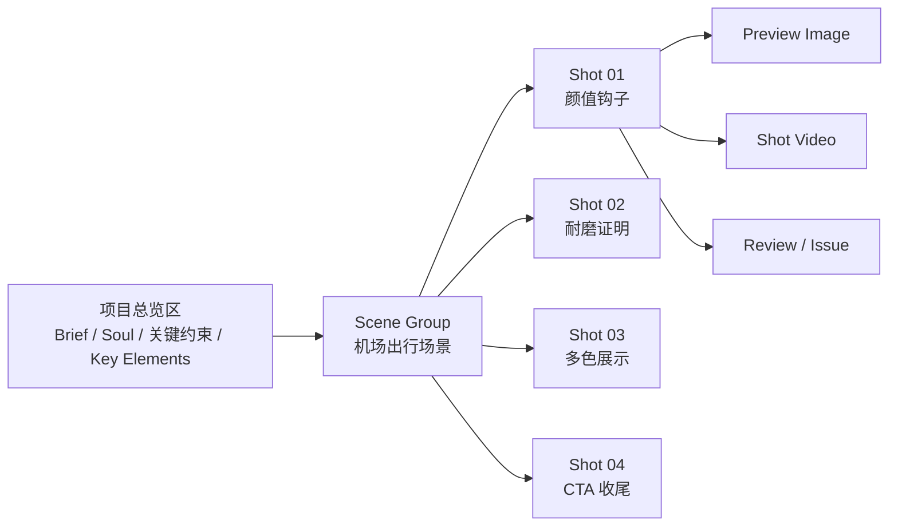

# Agent Canvas Workbench 设计 Spec

## 1. 背景

当前 Agent 画布已经能把 `CreativeBrief`、`ProjectMemory`、`KeyElement`、`KeyElementState`、`Scene`、`Shot`、`RenderPlan`、`ReviewRecord`、`ArtifactIssue` 投影到 React Flow 上，但投影方式仍然偏“对象关系图”：

- 所有领域对象都被平铺成节点，固定坐标散落在画布上。
- `RenderPlan`、`ReviewRecord`、`ArtifactIssue` 作为独立节点大量堆叠，遮挡主线。
- 节点只显示标题、短描述和少量 meta，单击后不能看到 Agent 领域详情。
- 画布无法让用户直观看到“视频正在如何被制作”：哪个场景、哪个分镜、哪个预览图、哪个视频、哪个评审问题。

这与 ClipAnvil 的目标不匹配。ClipAnvil Agent 模式应表达的是“从灵感到分镜，再到可生成的视频画布”，画布首先应该是视频制作过程的可视化工作台，而不是数据库对象图。

## 2. 目标

把 Agent 画布升级为 **Agent Canvas Workbench**：

- 按场景和分镜组织画布，让用户一眼看懂视频结构。
- 每个分镜组内展示脚本、参考资源、预览图、分镜视频、RenderPlan 状态、Reviewer 结论和问题。
- 默认隐藏低价值关系边和历史 RenderPlan 噪音，只突出制作主线。
- 单击节点或卡片能打开 Agent 专属详情面板，展示完整领域信息。
- 保持“业务 DB 是事实源，React Flow 是投影层”的架构边界。
- 视觉风格与 Studio 模式保持同一设计系统，画布密度更适合制作检查。

## 3. 非目标

本 spec 不包含以下内容：

- 不把 Agent 画布变成可直接编辑的 Studio 画布。
- 不改变 Producer / Craftsman / Reviewer 的角色分工。
- 不新增 Agent 工具来直接拖动画布或写 React Flow 坐标。
- 不把前端 React Flow 状态作为事实源持久化。
- 不在第一阶段实现复杂时间线剪辑、转场编辑、音轨编辑。
- 不在第一阶段支持从画布直接触发所有修复动作；先保证可看懂、可定位、可审阅。

## 4. 设计原则

### 4.1 制作主线优先

默认画布只突出用户最关心的主线：

```text
项目约束 -> 场景 -> 分镜 -> 预览图 -> 分镜视频 -> 评审问题
```

`RenderPlan`、`generation_job`、`review_record` 等技术对象不应默认抢占主视觉。它们应该作为分镜详情、状态徽标、展开区域或侧边详情出现。

### 4.2 Scene / Shot 是一等布局单位

Agent 画布的空间结构应围绕视频结构组织：

- `Scene` 是大组。
- `Shot` 是 Scene 内的核心制作单元。
- 每个 Shot 组内固定展示脚本、参考、预览、视频、评审。
- Shot 顺序按 `sequence_index` 或同等业务顺序排列。
- Shot 依赖只显示关键连续性关系，例如首尾帧链路、同主体一致性、同场景一致性。

### 4.3 详情按需展开

画布默认不铺满所有字段。完整信息通过详情面板查看：

- Shot 详情：创意文本、动作、镜头、音频、依赖、状态。
- RenderPlan 详情：目标阶段、operation、reference bindings、prompt parts、compiled prompt、模型参数、校验错误。
- Artifact 详情：图片/视频预览、版本、生成任务、provider request/response 摘要。
- Review 详情：10 轴 rubric、总分、问题、建议修复动作。
- KeyElement 详情：主体状态、参考资源、被哪些分镜引用。

### 4.4 投影是工程代码，不是 Agent 任务

Agent 仍然只写业务事实：

- Producer 写 brief、memory、key elements、scene、shot、dependency。
- Craftsman 写 render plan。
- Worker 写 generation job、artifact version、media node。
- Reviewer 写 review record、artifact issue。

工程代码负责把这些事实编译为 Agent Canvas Workbench 的 view model。

## 5. 目标体验

### 5.1 默认画布结构



### 5.2 分镜组内信息

每个 Shot 组应像一张制作卡片，而不是一堆散点：

```text
┌──────────────────────────────────────────────────────────────┐
│ Shot 01  颜值钩子                              failed / retry │
│ 开场强钩子：银色行李箱在机场晨光中亮相，年轻女生拉箱前行... │
│ 目标: preview_image + shot_video     依赖: 产品参考、机场场景 │
├──────────────────────┬──────────────────────┬────────────────┤
│ Preview              │ Video                │ Review          │
│ [图片缩略图/占位]     │ [视频缩略图/占位]     │ score 7.2       │
│ succeeded / failed   │ queued / failed      │ 2 issues        │
└──────────────────────┴──────────────────────┴────────────────┘
```

### 5.3 项目总览区

项目总览区不应占据过大空间，但必须能解释全片约束：

- CreativeBrief 标题和一句概念。
- ProjectMemory soul / non-negotiables 摘要。
- KeyElement 列表，展示 product / character / scene / prop / style。
- KeyElementState 的 reference 状态，例如 `ready`、`needs_reference`、`failed`。

### 5.4 详情面板

单击 Agent 领域节点或分镜组内卡片后，右侧或浮层展示 Agent 专属详情面板。不要复用 Studio 的通用 `PropertyPanel` 作为主要详情，因为 Studio 属性面板面向可编辑媒体节点，不理解 Agent 领域对象。

详情面板至少支持：

- 标题、类型、状态、更新时间。
- 核心业务字段。
- 关联对象。
- 最新 RenderPlan。
- 最新 generation job。
- 当前 artifact winner。
- Reviewer verdict 和 issues。
- 可复制或引用的对象标识。

## 6. 里程碑

### M1：Scene / Shot 分组投影与自动布局

#### 目标

把 Agent 画布从领域对象平铺图改成 Scene / Shot 分组工作台。用户进入 Agent workspace 后，应能立刻看懂当前视频有几个场景、几个分镜、每个分镜处于什么生产状态。

#### 落地事项

1. 新增 Agent Canvas Workbench view model。
   - 后端从现有领域表构建 `overview + scenes + shots` 结构。
   - 前端将该结构映射为 React Flow group / custom node。
   - 保留 DB 为事实源，不保存前端布局快照。

2. 调整默认布局。
   - Overview 固定在左侧或顶部。
   - Scene 作为大组容器。
   - Shot 按业务顺序在 Scene 内排列。
   - Shot 组内固定网格展示 summary、preview、video、review。
   - 画布初始化后不出现大面积节点重叠。

3. 收敛默认节点数量。
   - 默认不再把所有 RenderPlan、ReviewRecord、ArtifactIssue 平铺成独立节点。
   - RenderPlan 显示为 Shot 内状态块或详情入口。
   - Review 和 Issue 显示为 Shot 内质量状态与问题摘要。

4. 优化状态表达。
   - Shot 状态：planned、preview_running、preview_ready、video_running、succeeded、failed、blocked 等。
   - Preview / Video 状态：missing、queued、running、succeeded、failed、stale。
   - KeyElementState 状态：ready、needs_reference、failed。

#### 可交付标准

- 新增或替换 Agent canvas projection API，返回 Scene / Shot 组织后的结构。
- 前端 Agent 画布能用该结构渲染分组视图。
- 同一个 workspace 中 1 个 scene、4 个 shot、多个 render plan 不再堆叠。
- 节点数量显示与默认可见对象数量一致，避免把隐藏详情也算成主画布节点噪音。
- 画布在刷新、WebSocket 更新后保持布局稳定。

#### 验收标准

以“悦行行李箱广告”workspace 为例：

- 用户能在第一屏或缩放后清晰看到 1 个项目总览区、1 个 Scene 组、4 个 Shot 组。
- 每个 Shot 组能看出脚本摘要、preview 是否生成、video 是否生成、是否有 issue。
- 不再出现 RenderPlan 节点纵向堆成一列并遮挡视频/图片节点。
- 不再出现多条低价值虚线穿过主画面导致不可读。
- `pnpm --filter @clip-anvil/web... build` 通过。
- `pnpm --filter @clip-anvil/web lint` 通过。
- 如果改后端 API，`make server-test` 通过。

### M2：Agent 领域详情面板

#### 目标

让用户单击画布上的 Scene、Shot、Preview、Video、RenderPlan 摘要、Review 摘要、Issue 摘要时，能看到完整、可审阅的详情。

#### 落地事项

1. 新增 Agent 专属详情组件。
   - 不再把 Agent domain node 强行交给 Studio `PropertyPanel` 展示。
   - 根据对象类型展示不同结构。
   - 支持只读展示和复制对象 ID / client key。

2. 后端提供详情 API 或扩展 projection payload。
   - M2 可以先按需读取详情，避免把 compiled prompt、provider response 等大字段塞进首屏 canvas payload。
   - 详情 API 必须基于 account / workspace 鉴权。

3. 支持主要对象详情。
   - Overview / ProjectMemory。
   - KeyElement / KeyElementState。
   - Scene。
   - Shot。
   - RenderPlan。
   - Artifact / media node。
   - ReviewRecord。
   - ArtifactIssue。

4. 显示 RenderPlan 的关键信息。
   - target phase。
   - operation。
   - task type。
   - reference bindings。
   - subject bindings。
   - prompt parts。
   - compiled prompt。
   - params。
   - compile / capability / worker 错误。

5. 显示 Reviewer 的 10 轴 rubric。
   - 总分。
   - verdict。
   - 每个维度分数。
   - critique。
   - issue 列表。
   - suggested fix。

#### 可交付标准

- 单击工作台中的每类主要对象都能打开详情面板。
- 详情面板不会遮挡对话输入关键区域，移动端或窄屏至少可滚动查看。
- compiled prompt、provider error、review critique 等长文本有合理折叠和复制能力。
- 详情面板数据来自后端事实源，不依赖前端临时 React Flow node data。

#### 验收标准

以“悦行行李箱广告”workspace 为例：

- 单击 Shot 01 能看到完整创意文本、动作、镜头、引用的行李箱状态和依赖。
- 单击 Shot 01 的 preview 区域能看到当前图片版本、generation job、失败或成功状态。
- 单击 RenderPlan 摘要能看到 reference bindings，并能识别是否引用了不存在的 media node。
- 单击 Review 摘要能看到 10 轴 rubric 和 issue。
- 单击 KeyElementState `needs_reference` 能看出为什么缺参考资源，以及哪些 shot 需要它。
- 前端 build / lint 通过；后端详情 API 有单测或 handler 层覆盖。

### M3：制作过程实时可视化与可操作入口

#### 目标

让用户不只看到结果，还能看到 Agent 正在制作视频的过程：Producer 正在规划什么，Craftsman 正在为哪个 Shot 写 RenderPlan，Worker 正在生成哪个 preview/video，Reviewer 正在评审哪里。

#### 落地事项

1. 实时状态投影。
   - WebSocket 事件驱动画布局部刷新。
   - Producer task running / waiting_for_user / failed 反映到全局状态。
   - Craftsman task running / succeeded / failed 反映到对应 Shot 或 KeyElementState。
   - Worker generation job queued / running / succeeded / failed 反映到 preview/video 区域。
   - Reviewer task running / succeeded / failed 反映到 review 区域。

2. 制作过程时间线。
   - 在详情面板或画布底部显示当前 workspace 的关键制作事件。
   - 事件包括 user message、tool call、RenderPlan created、worker submitted、artifact succeeded、review submitted、decision requested。
   - 时间线用于解释“为什么现在卡住了”。

3. 可操作入口。
   - 从 Shot 详情引用对象到对话输入，例如“修改这个分镜”。
   - 从 Issue 详情生成修复建议文本，交给用户确认或发给 Producer。
   - 从 waiting_for_user 状态进入决策卡。
   - 可选：从 failed job 详情发起“让 Producer 处理这个失败”的自然语言消息。

4. 过滤和视图模式。
   - 默认 Production View：只看制作主线。
   - Debug View：显示 RenderPlan、ReviewRecord、Issue、dependency 边等完整调试对象。
   - Issues View：只看失败、blocked、needs_reference、open issue。

#### 可交付标准

- 工具调用、任务状态、生成任务状态能映射到具体 Shot / Artifact / Review 区域。
- 刷新页面后仍能根据 DB 状态恢复“正在制作/等待用户/失败/完成”的状态。
- 多 tab 打开同一 workspace 时，状态变化能通过 WebSocket 同步。
- 用户能从画布定位一个失败点，并通过对话让 Producer 继续处理。

#### 验收标准

以“悦行行李箱广告”workspace 为例：

- Producer 派发 4 个 preview image 后，4 个 Shot 组分别显示 queued/running/succeeded/failed。
- 任意一个 Craftsman 因缺少 reference 而 blocked 时，对应 Shot 或 KeyElementState 显示 blocked，不会让用户误以为整个项目无响应。
- Worker 调 Seedream / Seedance 成功后，对应 preview/video 卡片无需刷新即可更新。
- request_user_decision 期间，画布全局状态显示等待用户，决策完成后状态恢复。
- Debug View 能看到 RenderPlan 和 ReviewRecord 的完整关系，用于开发排障。
- 浏览器 E2E 覆盖一次“发消息 -> 创建分镜 -> 生成 preview -> 查看详情 -> 触发失败定位”的主链路。

## 7. 数据与 API 设计方向

### 7.1 Workbench Projection

建议新增 Agent 专用投影结构，而不是继续扩展当前平铺 `domain_projection.nodes/edges`：

```ts
interface AgentWorkbenchProjection {
  overview: AgentProjectOverview;
  scenes: AgentSceneGroup[];
  filters: AgentWorkbenchFilters;
  counts: AgentWorkbenchCounts;
}

interface AgentSceneGroup {
  id: string;
  title: string;
  status: string;
  summary?: string;
  location?: string;
  shots: AgentShotCard[];
}

interface AgentShotCard {
  id: string;
  client_key: string;
  title: string;
  status: string;
  sequence_index: number;
  creative_text: string;
  dependencies: AgentShotDependencySummary[];
  key_elements: AgentKeyElementRefSummary[];
  preview: AgentArtifactSlot;
  video: AgentArtifactSlot;
  render_plans: AgentRenderPlanSummary[];
  review: AgentReviewSummary | null;
  issues: AgentIssueSummary[];
}
```

### 7.2 详情 API

建议新增按对象读取详情的 API：

```text
GET /api/agent/workspaces/:workspaceID/canvas/details?object_type=shot&object_id=...
```

返回值可以按对象类型分 union：

```ts
type AgentCanvasDetail =
  | ShotDetail
  | RenderPlanDetail
  | ArtifactDetail
  | ReviewDetail
  | IssueDetail
  | KeyElementDetail
  | SceneDetail
  | ProjectOverviewDetail;
```

### 7.3 与当前 CanvasPayload 的关系

短期有两种可选落地方式：

1. 在现有 Agent canvas query 里附带 `agent_workbench_projection`。
2. 新增独立 endpoint，AgentWorkspacePage 单独 query。

推荐第一阶段用独立 endpoint，避免继续污染 Studio / Agent 共用的 `CanvasPayload`。等工作台结构稳定后，再考虑是否合并到 shared payload。

## 8. 前端组件设计方向

建议新增组件边界：

```text
AgentWorkbenchCanvas
  AgentProjectOverviewNode
  AgentSceneGroupNode
  AgentShotGroupNode
    ShotSummaryBlock
    ArtifactSlotBlock
    RenderPlanStatusBlock
    ReviewStatusBlock
  AgentCanvasDetailPanel
  AgentCanvasToolbar
```

与现有组件关系：

- 继续复用 `CanvasFlowSurface` 的 React Flow 基础能力，或新增 Agent 专用 surface。
- 不复用 `DomainFlowNode` 作为主工作台节点。
- 不复用 Studio `PropertyPanel` 作为 Agent 详情主面板。
- 可以复用 Studio 的按钮、状态、卡片、缩略图、生产状态样式 token。

## 9. 视觉要求

- 整体风格与 Studio 一致：干净、专业、信息密度适中。
- 卡片圆角不超过现有设计系统要求。
- 避免大面积单色主题和过度装饰。
- 分镜组应稳定占位，图片/视频加载、失败、空状态不会导致布局跳动。
- 长标题和长脚本必须截断或折叠，不允许溢出遮挡。
- 状态颜色要一致：running、succeeded、failed、blocked、stale、needs_reference 清晰可辨。
- 默认视图线条要克制，只保留帮助理解制作流程的边。

## 10. 测试策略

### 10.1 后端测试

- Workbench projection builder 单测。
- 空 workspace、只有 brief、只有 key element、单 scene 多 shot、多 scene、多 RenderPlan、多 issue 的 fixture。
- 详情 API 鉴权测试。
- 详情 API object type / object id 校验测试。

### 10.2 前端测试

- View model mapping 单测。
- Shot group layout 稳定性测试。
- 不同状态的 artifact slot 渲染测试。
- Detail panel 对不同 object type 的渲染测试。

### 10.3 E2E 测试

至少覆盖：

1. 创建 Agent workspace。
2. 发送用户需求。
3. Producer 创建 brief / memory / scene / shot。
4. Agent 画布出现 Scene / Shot 分组。
5. 派发 preview image。
6. Worker 成功或失败后，Shot 组状态实时更新。
7. 单击 Shot / RenderPlan / Review 能打开详情。
8. 刷新页面后画布状态保持一致。

## 11. 验收总标准

完成三个阶段后，Agent 画布应达到以下效果：

- 用户不看数据库、不看日志，也能知道视频有几个场景、几个分镜、每个分镜做到哪一步。
- 用户能定位失败点：是缺参考资源、RenderPlan 无效、Worker 调用失败、模型能力不匹配，还是 Reviewer 不通过。
- 用户能打开详情审阅 Agent 的关键决策：脚本、参考资源、prompt 结构、模型参数、评审意见。
- 用户能通过画布理解制作过程，但仍通过对话驱动 Producer 处理问题。
- 开发者仍能切到 Debug View 查看完整领域对象关系，便于排障。
- Studio 和 Agent 边界清晰：Studio 是手工编辑器，Agent Canvas Workbench 是自动制作过程的投影。

## 12. 实施顺序建议

1. M1 先做新 projection 和 Scene / Shot 分组视图，不急着做所有详情。
2. M2 再做详情 API 和详情面板，解决“看不到完整信息”的问题。
3. M3 最后做实时过程、操作入口和 Debug View，解决“看不到制作过程”和“失败不可定位”的问题。

这个顺序能保证每个阶段都有独立价值，也能避免一次性重写 Agent 画布、详情、WebSocket 和交互动作导致范围失控。
