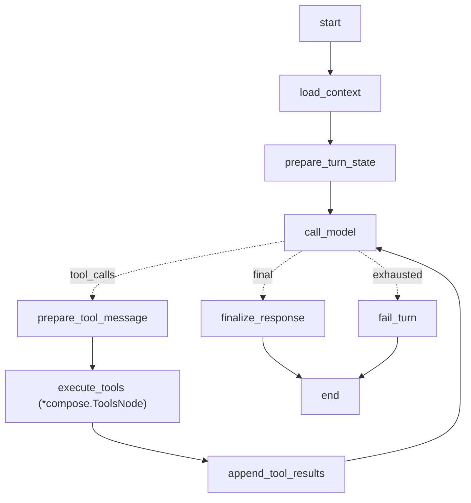

# Composer Agent Sandbox 成片方案设计

**状态**：待评审
**日期**：2026-06-27
**适用范围**：ClipAnvil Agent 模式，Composer Agent、sandbox ffmpeg 后期处理、最终成片画布投影

## 结论

Composer 不应继续沿用历史 `composer_final` 线性图。历史 Composer 只是确定性合成服务：读取 video refs、创建 final video node、提交 `internal_ffmpeg` 的 `compose_final_video`。下一阶段应重建为与 Craftsman / Reviewer 一致的 **Eino-native bounded ReAct Agent**。

新的 Composer 是 final-output 作用域的后期剪辑 Agent。它不负责故事规划、不生成分镜视频、不评审质量；它负责把 Producer 已确认的分镜视频、音频、字幕、品牌素材和平台规格组织成可交付成片，并在 sandbox 中通过受控 ffmpeg 工具完成处理。

目标闭环：

```text
Producer 确认 shot video winners
  -> Producer dispatch_composer
  -> Composer 读取成片上下文
  -> Composer stage 本次需要的素材到 sandbox
  -> Composer 起草 TimelinePlan / CompositionPlan
  -> Composer 用受控 ffmpeg 工具渲染成片
  -> Composer inspect 输出并必要时修正重试
  -> Composer submit final video artifact
  -> 工程代码写 media_node / generation_job / artifact_version / sandbox_job
  -> Composer 写 composition_completed signal
  -> Producer 读取上下文并决定评审、请求用户确认或继续修复
  -> Agent Workbench 展示最终成片、剪辑计划、sandbox trace 和 Producer 决策状态
```

## 设计原则

### 1. Composer 是剪辑师，不是导演

Producer 仍是全局创作状态 owner。Composer 只能在 final-output scope 内做后期处理：

- 读取分镜、shot video winners、素材、review、ProjectMemory 和平台目标。
- 组织最终视频顺序、裁切、转场、字幕、BGM、CTA、规格适配。
- 在 sandbox 内执行受控 ffmpeg / ffprobe。
- 发布成片产物和剪辑 trace。

Composer 不做：

- 不修改 `CreativeBrief`、`ProjectMemory`、`Scene`、`Shot`、`RenderPlan`。
- 不生成 preview image 或 shot video。
- 不派发 Craftsman / Reviewer。
- 不直接请求用户决策。
- 不把失败自动升级为用户问题；只能向 Producer 发 signal。

### 2. 固定工具优先，受控 ffmpeg 作为逃生口

不要给 Composer 默认通用 `exec shell`。Composer 的主工具应是固定 sandbox 工具，保证可审计、可复现、可测试。

推荐工具层：

| 工具 | 职责 | 是否允许模型灵活决策 |
|---|---|---|
| `read_composition_context` | 读取成片上下文、shot video winners、素材、review 和平台目标 | 只读 |
| `stage_media_inputs` | 将本次任务需要的 media asset / artifact version 下载到 sandbox 稳定路径 | 参数可选，行为确定 |
| `probe_media` | 用 ffprobe / file 检查素材时长、编码、分辨率、音轨 | 只读 |
| `upsert_timeline_plan` | 写入或修订成片剪辑计划 | 结构化写入 |
| `render_composition` | 将 TimelinePlan 编译为 ffmpeg 命令并执行 | 模板化执行 |
| `run_ffmpeg_command` | 受控 escape hatch，只允许 ffmpeg / ffprobe，禁止任意 shell | Phase 1 开放，允许 Composer 自行决策 |
| `inspect_composition_output` | 检查输出文件 MIME、时长、分辨率、音轨和大小 | 只读 |
| `submit_composition_artifact` | 将 `/workspace/output` 成片发布为 Agent-owned final video | 结构化写入 |

`run_ffmpeg_command` 在 Phase 1 开放，但必须是受控 ffmpeg 工具，不是通用 shell。它允许 Composer 在固定模板之外自行决策具体 ffmpeg / ffprobe 参数，但必须限制：

- 只能执行 `ffmpeg` 或 `ffprobe`。
- 输入路径只能来自 `stage_media_inputs` 返回值。
- 输出路径只能在 `/workspace/output`。
- 禁止 shell 管道、重定向、`curl`、`rm`、后台进程、任意 `python`。
- 每次执行都写 `sandbox_job`，保存 command、cwd、stdout、stderr、exit_code、duration。
- stderr 需要返回摘要，便于 Composer 修正参数后重试。

### 3. Sandbox 初始化不等于素材同步

`EnsureSandbox` 只负责创建 sandbox、初始化目录和检查工具。素材以任务为粒度 stage：

```text
EnsureSandbox:
  /workspace/assets
  /workspace/scripts
  /workspace/tmp
  /workspace/output
  /workspace/manifests

stage_media_inputs:
  解析本次 composition task 需要的 node/version/asset
  生成 presigned GET
  下载到 /workspace/assets/<asset_id>.<ext>
  写本次 manifest
  返回稳定路径
```

这样能避免全量同步 workspace 素材带来的慢、脏、占空间和版本不确定问题。`stage_media_inputs` 可以复用缓存，但必须通过 manifest 校验 asset id、size/hash 或 storage URL。

## Composer Eino 图

ComposerGraph 应与 Craftsman / Reviewer 保持一致，采用 Eino-native bounded tool loop。

Eino 图名建议：`composer_timeline`



图节点口径：

- `load_context`：读取 Composer task、final-output scope、Producer instruction、shot video winners、ProjectMemory 摘要、平台目标、历史 final video、sandbox/job 状态。
- `prepare_turn_state`：注入 Composer 白名单工具 schema。
- `call_model`：调用 Composer responder，模型只能通过原生 tool calls 操作。
- `execute_tools`：Eino `compose.ToolsNode`，按顺序执行 Composer native tools。
- `append_tool_results`：把 tool observation 回灌给 Composer，同一轮可修正参数。
- `finalize_response`：生成 task 输出；如果已提交成片，写 `composition_completed` signal；如果 blocked，写 `composition_blocked` signal。

Loop 限制：

- 默认最多 8 次工具调用。
- 每个 task 最多一次成功 `submit_composition_artifact`。
- Composer 不能调用 Producer / Craftsman / Reviewer 工具。
- Composer 不能调用 `request_user_decision`。
- Composer 失败不能无限重试，连续 ffmpeg 失败 2 次后应 blocked 并交给 Producer。

## Producer 入口

新增 Producer native tool：`dispatch_composer`。

职责：创建 `composer_turn` task，并唤醒 Composer executor。Producer 只描述成片目标，不写 ffmpeg 命令。

建议参数：

```json
{
  "brief": "将已通过评审的分镜视频合成为 15 秒竖屏种草广告，结尾加 CTA。",
  "mode": "create",
  "shot_refs": ["shot-01", "shot-02", "shot-03"],
  "platform": {
    "aspect_ratio": "9:16",
    "max_duration_seconds": 15,
    "safe_area": "tiktok_reels"
  },
  "style": {
    "pace": "fast",
    "transition": "fade",
    "subtitle_style": "marketing_bold"
  },
  "assets": {
    "bgm_ref": "bgm-main",
    "logo_ref": "brand-logo"
  },
  "request_final_review": true,
  "reason": "所有 shot_video winner 已 ready，需要生成第一版成片给用户确认。"
}
```

校验规则：

- workspace 必须是 Agent mode。
- `shot_refs` 必须解析到当前 workspace 的 active shots。
- 每个 selected shot 必须有 succeeded/current shot video winner。
- 如果请求字幕、BGM、logo，相关素材必须存在或 Composer 返回 blocked。
- 不允许 Producer 传入裸 storage URL 或 sandbox path。

## TimelinePlan / CompositionPlan

Composer 需要一个可投影、可复现的成片计划。Phase 1 明确新增 `timeline_plan` 表，避免把关键业务对象长期塞进 final video node metadata。Final node metadata 只保留摘要和外键，完整计划以 `timeline_plan` 为事实源。

最小字段：

| 字段 | 说明 |
|---|---|
| `workspace_id` | 所属 workspace |
| `composer_task_id` | 由哪个 Composer task 创建 |
| `status` | `draft` / `rendering` / `submitted` / `blocked` / `failed` / `succeeded` |
| `version` | 同一 final-output 计划的修订号 |
| `title` | 成片标题 |
| `platform` | 目标平台、比例、时长、安全区 |
| `sequence` | shot video 顺序、trim、速度、转场 |
| `overlays` | 字幕、logo、CTA、价格标签等 |
| `audio` | BGM、旁白、原声保留、ducking、音量 |
| `render_profile` | ffmpeg 模板、编码参数、输出格式 |
| `output_node_id` | 成片 media node |
| `metadata` | ffprobe 摘要、sandbox manifest、调试信息 |

Final video node metadata 只保存摘要：

```json
{
  "agent_artifact_kind": "final_video",
  "timeline_plan_id": "...",
  "timeline_plan_version": 1,
  "composer_task_id": "...",
  "duration_seconds": 14.8,
  "aspect_ratio": "9:16"
}
```

## Sandbox 工具语义

### `stage_media_inputs`

用途：把业务世界里的素材变成 ffmpeg 可用的 sandbox 本地文件。

输入：

```json
{
  "refs": [
    {"ref": "shot-01-video", "role": "clip"},
    {"ref": "brand-logo", "role": "logo"},
    {"ref": "bgm-main", "role": "bgm"}
  ]
}
```

输出：

```json
{
  "manifest_id": "composition-manifest-...",
  "staged": [
    {
      "ref": "shot-01-video",
      "role": "clip",
      "node_id": "...",
      "artifact_version_id": "...",
      "asset_id": "...",
      "media_type": "video",
      "mime": "video/mp4",
      "path": "/workspace/assets/shot-01-video.mp4"
    }
  ]
}
```

要求：

- 解析 semantic key / display name / UUID 时必须唯一。
- 所有素材必须属于当前 workspace。
- generated media 默认取 `current_version_id`。
- source material 使用 node 自身 `asset_id`。
- 写 manifest 到 `/workspace/manifests/<composer_task_id>.json`。
- 每个下载写 `sandbox_job` 或一个包含多输入明细的 stage job。

### `render_composition`

用途：把 TimelinePlan 编译为受控 ffmpeg 命令并执行。

第一版模板：

- `concat_copy`：同编码分镜快速拼接。
- `concat_with_fades`：分镜间淡入淡出。
- 模板输出统一走 production 持久化 helper，写入 `generation_job`、`artifact_version` 和 `sandbox_job` trace。

模板不足时，Composer 可使用 `run_ffmpeg_command` 自行决策 ffmpeg / ffprobe 参数，但要记录为何模板不足，并把命令执行写入 `sandbox_job`。

### `submit_composition_artifact`

用途：提交 `/workspace/output/final-*.mp4`，创建或更新 final video node。

行为：

- 校验输出在 `/workspace/output`。
- `file` / `ffprobe` 检查 MIME、duration、resolution、audio stream。
- 上传到 MinIO。
- 创建 `media_asset`。
- 创建或更新 `media_node(node_type='video', source='agent', operation_type='compose_final_video')`。
- 通过 production 持久化 helper 创建 `generation_job` / `artifact_version`，不在 Composer 内部分叉实现产物生命周期。
- 将 `sandbox_job_id` 关联到 `generation_job`。
- 广播 canvas / agent workbench 更新。

## Producer signal

Composer 结果必须通过 `producer_pending_signal` 唤醒 Producer，不能只写 task succeeded。

新增 signal 类型：

| signal_type | 触发时机 | payload |
|---|---|---|
| `composition_completed` | 成片成功提交并有 current artifact version | `timeline_plan_id`、`final_node_id`、`artifact_version_id`、`generation_job_id`、`sandbox_job_ids`、`duration_seconds`、`aspect_ratio` |
| `composition_blocked` | 缺素材、缺 winner、计划不可执行或需要用户/Producer 决策 | `reason_code`、`reason_message`、`missing_refs`、`suggested_next_action` |
| `composition_failed` | sandbox / ffmpeg / submit 失败且超过 Composer 自修复阈值 | `error_code`、`error_message`、`sandbox_job_ids`、`stderr_summary` |

信号规则：

- `source_role='composer'`。
- `scope_type='final_output'`。
- `source_task_id=<composer_task_id>`。
- `source_thread_id=<composer_thread_id>`。
- `dedupe_key` 建议：`composition_completed:<final_node_id>:<artifact_version_id>`，失败类用 `composition_failed:<composer_task_id>:<attempt>`。
- Producer 下一轮通过 system reminder 感知 signal，再读取 `read_project_context` / workbench projection 决定是否派 Reviewer 做 `final_video_review`、请求用户确认或重新 dispatch Composer。

Producer executor 当前会自动把 `worker_generation_completed`、`review_completed` 类 signal 标为 processed；Composer signal 需要纳入同等 release/processed 策略，避免 claimed signal 泄漏。

## 后端改造范围

### 1. 删除/替换历史 Composer

替换对象：

- `apps/server/internal/agent/composer/types.go`
- `apps/server/internal/agent/composer/graph.go`
- `apps/server/internal/agent/composer/executor.go`
- `apps/server/internal/agent/tools/compose_final.go`

新建或重写：

- `apps/server/internal/agent/composer/context_loader.go`
- `apps/server/internal/agent/composer/graph.go` 中的 `composer_timeline` native tool loop
- `apps/server/internal/agent/composer/model_responder.go`
- `apps/server/internal/agent/composer/tool_context_provider.go`
- `apps/server/internal/agent/composer/system_prompt.go`
- `apps/server/internal/agent/tools/dispatch_composer_native.go`
- `apps/server/internal/agent/tools/composition_*_native.go`

### 2. Runtime / task / queue

保留：

- `role='composer'`
- `scope_type='final_output'`
- `task_type='composer_turn'`
- `GetOrCreateComposerThread`
- `ListQueuedComposerTasksAcrossWorkspaces`

补齐：

- `agentComposerTaskEnqueuer`，与 Craftsman / Reviewer enqueuer 风格一致。
- main wiring 中注册 Composer executor / enqueuer / recovery。
- Producer native registry 注册 `dispatch_composer`。
- Composer executor 运行完成后创建 producer pending signal。

### 3. Sandbox / production

现有能力：

- `sandbox.JobService.RunCommand`
- `sandbox.JobService.ComposeVideos`
- `sandbox.JobService.ImportRemoteAsset`
- `production.InternalFFmpegProvider.runCompose`
- `sandbox_job` 与 `generation_job` 关联。

需要补齐：

- `timeline_plan` 表、sqlc query 和后端 projection。
- 任务级 `stage_media_inputs` 服务。
- 受控 `run_ffmpeg_command`，Phase 1 开放，但不要暴露通用 shell。
- `ffprobe` 输出解析。
- `render_composition` 模板编译器。
- final output submit 走 production 持久化 helper，统一 `generation_job` / `artifact_version` / `sandbox_job` 生命周期。

第一阶段可以复用 `internal_ffmpeg` provider 的 `compose_final_video` 作为 `render_composition` 的底层实现，但接口不要继续叫旧 `compose_final`。Composer 面向的是 TimelinePlan，不是一个固定拼接按钮。

## 前端 Agent Workbench 改造

Agent 画布需要把最终成片作为一等制作结果展示，不再只是普通 video node。

### 后端 projection

扩展 Agent Workbench response：

```json
{
  "overview": {},
  "scenes": [],
  "final_output": {
    "status": "succeeded",
    "title": "Final video",
    "node_id": "...",
    "version_id": "...",
    "access_url": "...",
    "thumbnail_url": "...",
    "duration_seconds": 14.8,
    "aspect_ratio": "9:16",
    "timeline_plan": {
      "id": "...",
      "version": 1,
      "clips": 3,
      "transitions": 2,
      "has_bgm": true,
      "has_subtitles": true
    },
    "sandbox_jobs": [
      {"id": "...", "status": "succeeded", "operation_type": "render_composition"}
    ],
    "review": {
      "verdict": "accepted",
      "score": 0.86
    },
    "issues": []
  }
}
```

`final_output.status` 建议：

- `missing`
- `queued`
- `staging`
- `planning`
- `rendering`
- `inspecting`
- `succeeded`
- `blocked`
- `failed`
- `stale`

### 画布布局

Workbench 默认主线升级为：

```text
项目总览 -> Scene / Shot groups -> Final Output lane
```

Final Output lane 应放在所有 shot 之后，展示：

- 成片播放器或缩略图。
- TimelinePlan 摘要：比例、时长、片段数、转场、字幕、BGM、CTA。
- 当前生成状态。
- sandbox job trace 入口。
- final video review 结果和 issue。
- Producer 决策状态：等待确认 / 已确认 / 需要修改。

### 详情面板

新增或扩展 Agent detail drawer：

| 面板 | 内容 |
|---|---|
| Final Video | 视频预览、版本、下载/预览 URL、duration、resolution、audio stream |
| TimelinePlan | shot sequence、trim、transition、overlay、audio mix、render profile |
| Sandbox Trace | stage job、render job、inspect job、command 摘要、stderr 摘要、输出路径 |
| Final Review | `final_video_review` verdict、rubric、issues、retry recommendation |

前端不直接编辑 TimelinePlan。第一阶段只读展示；后续可以从“请求修改”回到 Producer，让 Producer 再 dispatch Composer revision。

### WebSocket 更新

当 Composer 创建 final node、提交成片、sandbox job 终态、review 终态时：

- `/ws/canvas` 推送 media node / version 更新。
- `/ws/agent` 推送 task/event/signal 更新。
- Agent Workbench projection 重新拉取或局部合并。

前端不要把 React Flow state 当事实源；final output 渲染仍从后端 projection 派生。

## 与 Craftsman / Reviewer 的一致性

| 维度 | Craftsman | Reviewer | Composer |
|---|---|---|---|
| Eino 形态 | bounded native tool loop | bounded native tool loop | bounded native tool loop |
| 作用域 | `key_element_state` / `shot` / `render_plan` | `shot` / `render_plan` / `final_output` | `final_output` |
| 写入对象 | `render_plan` | `review_record` / `artifact_issue` | `timeline_plan` / final video artifact / sandbox trace |
| 能否调其他 Agent | 否 | 否 | 否 |
| 能否请求用户 | 否 | 否 | 否 |
| 完成后通知 Producer | `craftsman_render_plan_ready` signal | `review_completed` signal | `composition_completed` / blocked / failed signal |
| 是否直接提交模型生成 | 否，由 Worker 执行 | 否 | 可以执行 sandbox 后期处理，但仅限 final-output scope |

Composer 与 Worker 的差异：

- Worker 执行单个 RenderPlan 生产，不做剪辑判断。
- Composer 可以用模型判断 TimelinePlan 和后期策略，但执行仍通过固定 sandbox 工具和持久化 job。

## 分阶段落地

### Phase 1：固定剪辑闭环

目标：把 selected shot videos 合成为可播放 final video，并在 Workbench 展示。

范围：

- `dispatch_composer`
- Composer bounded tool loop。
- `timeline_plan` 表和基础 query。
- `read_composition_context`
- `stage_media_inputs`
- `render_composition` 支持简单拼接和 fades。
- `run_ffmpeg_command` 受控开放，允许 Composer 在模板不足时自行决策 ffmpeg / ffprobe。
- `inspect_composition_output`
- `submit_composition_artifact`
- `composition_completed` signal
- Workbench `final_output` projection 和前端渲染

不做：

- 复杂字幕编辑。
- 多音轨 ducking。
- 用户直接编辑 timeline。
- 完整 final_video_review E2E。

### Phase 2：营销包装

新增：

- CTA / logo / watermarks。
- 字幕烧录。
- BGM 混音、淡入淡出、音量标准化。
- `final_video_review` loader 和 E2E。
- Producer 根据 final review 派 Composer revision。

### Phase 3：高级时间线

新增：

- TimelinePlan 表和版本化。
- 局部重剪辑。
- 按 final video 定位回源 shot。
- 多平台导出。
- 前端 timeline 只读可视化或半编辑交互。

## 验收标准

后端：

- Producer 能调用 `dispatch_composer` 创建 `composer_turn`。
- Composer graph info 中能看到 `execute_tools` 和 bounded loop 分支。
- Composer 只能使用自己的 native tool allowlist。
- Composer 能 stage 2 个 shot videos，并生成 manifest。
- Composer 能通过 sandbox ffmpeg 生成 MP4。
- final video 写入 Agent-owned video node、artifact version、generation job 和 sandbox job trace。
- Composer 成功后写 `composition_completed` producer pending signal。
- Producer 下一轮能看到 signal reminder，并读取 final output 状态。

前端：

- Agent Workbench 在 shot 列表之后展示 Final Output lane。
- 成片成功后可播放 final video。
- Final Output detail 能看到 TimelinePlan 摘要、版本、sandbox trace、ffmpeg stderr 摘要。
- WebSocket 更新后无需刷新即可看到 final output 状态变化，或能通过现有刷新机制稳定重拉 projection。

验证建议：

```bash
GOCACHE=/private/tmp/clipanvil-go-build go test ./internal/agent/composer ./internal/agent/tools ./internal/sandbox ./internal/production -run 'Composer|Composition|Sandbox|InternalFFmpeg' -count=1
GOCACHE=/private/tmp/clipanvil-go-build go test ./internal/api -run 'AgentWorkbench|ProductionBroadcaster|Sandbox' -count=1
pnpm --filter @clip-anvil/web... build
pnpm --filter @clip-anvil/web lint
git diff --check
```

## 已确认决策

1. Phase 1 新增 `timeline_plan` 表，final node metadata 只保存摘要和外键。
2. 第一批 `render_composition` 模板做简单拼接和 fades。
3. `submit_composition_artifact` 走 production 持久化 helper，避免 `generation_job` / `artifact_version` 生命周期分叉。
4. Phase 1 开放受控 `run_ffmpeg_command`，允许 Composer 在 sandbox 中自行决策 ffmpeg / ffprobe 参数，但不开放通用 shell。
