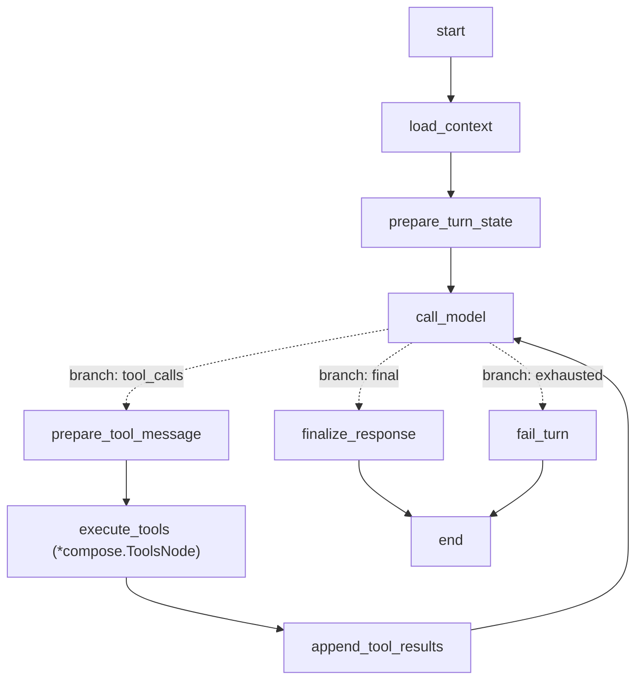
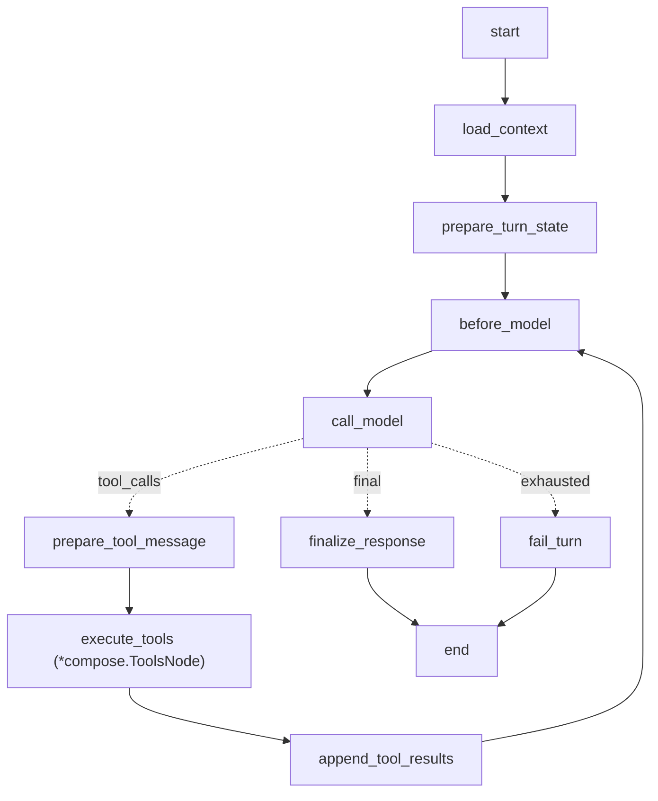
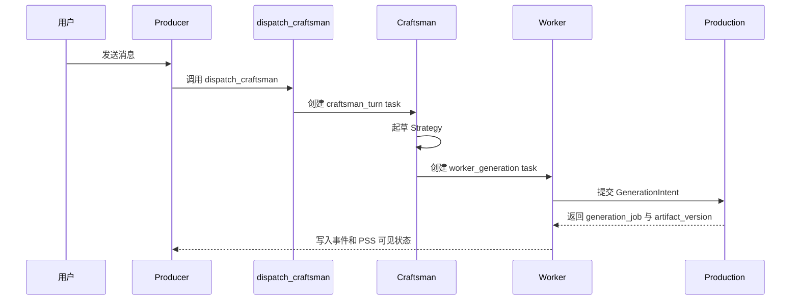
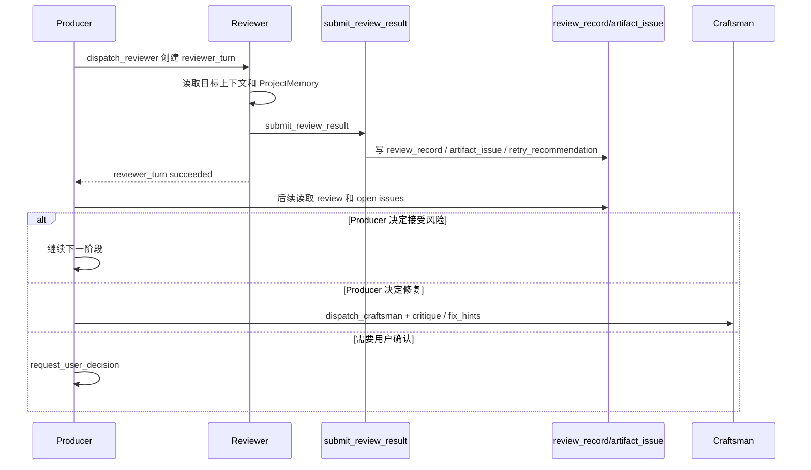
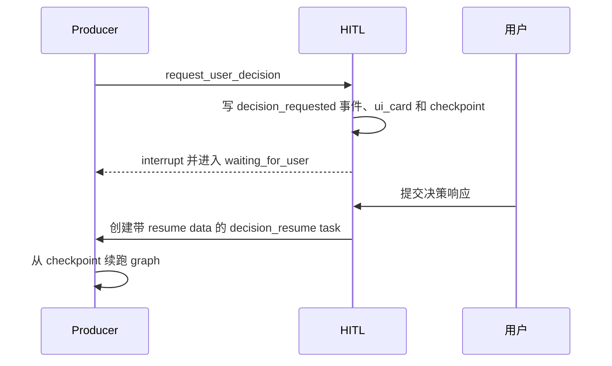

# Agent 模式 MultiAgent 架构

本文档记录当前代码里的 Agent 模式 MultiAgent 架构，用于下一阶段 Agent 模式规划。当前事实以 `apps/server/internal/agent/`、`apps/server/cmd/server/main.go`、迁移和 sqlc 生成代码为准；历史 spec/plan 只作为背景材料。

## 当前状态

Agent 模式已经不是纯设计稿。当前服务端已落地：

- Agent 对话入口、消息持久化、附件节点、WebSocket 广播和 Producer 后台任务。
- Eino 图主路径：`producer_turn`、`craftsman_render_plan`、`reviewer_gate`、`composer_timeline`。Producer 通过 native `dispatch_composer` 派发 Composer task；旧 `composer_final` 线性图已下线。
- 原生 Eino checkpoint/resume：`agent:eino:<graph>:<workspace>:<thread>:<task>`，存入 `eino_checkpoint`。
- 创作与生产事实表：`creative_brief`、`project_memory`、`key_element`、`key_element_state`、`scene`、`shot`、`shot_key_element`、`shot_dependency`、`render_plan`、`review_record`、`artifact_issue`。
- Agent runtime 表：`agent_thread`、`agent_task`、`agent_event`、`agent_message`。
- Producer、Craftsman、Reviewer、Composer 的新工具链都通过 Eino `compose.ToolsNode` 执行，主路径使用 Eino-native typed tools。旧 registry 工具文件仍可在代码中看到，但当前 `main.go` 注册的 Agent 主链路不再依赖旧 `RegistryToolExecutor` 执行工具。

当前角色分工如下：

| 角色 | 作用域 | Eino 图 | 运行时线程 | 主要职责 | 对应 Studio 能力 |
|---|---|---|---|---|---|
| Producer | workspace | `producer_turn` | `role='producer'`, `scope_type='workspace'` | 对话总控、全局创作状态 owner、读取 ObjectIndex / ProjectContext、维护 brief/memory/key elements/storyboard、派发 Craftsman/Reviewer、决策 RenderPlan、请求用户决策 | 读取画布/资源树/生产状态；把创意事实投影到画布；发起分镜生成、评审和 HITL |
| Craftsman | 当前主要为 shot；目标包含 key_element_state / render_plan | `craftsman_render_plan` | `role='craftsman'`, 当前主要 `scope_type='shot'` | 将 Producer 的创意事实翻译成 `RenderPlan`，组织 reference bindings、subject bindings、prompt parts 和 model params | 对应 Studio 里“配置节点 prompt/operation/model 后点击运行”的策划部分，但不直接写 UI 属性面板 |
| Worker | shot/node | 无 | 只有 task，`role='worker'` | 执行实际 `GenerationIntent`，复用共享 production service | 对应 Studio 的 production run、输入引用解析、dependency edge 自动建立、generation_job/artifact_version 写入 |
| Reviewer | 当前支持 shot artifact；schema 已覆盖 render_plan / final_output | `reviewer_gate` | `role='reviewer'`, `scope_type='shot'|'render_plan'|'final_output'` | 质量 gate。读取目标上下文，提交 10 轴 rubric、`review_record`、`artifact_issue` 和 retry recommendation；不直接重跑、不直接选择 winner | 对应 Studio 的结果审阅/问题标注能力，并把评审和问题投影到制作画布 |
| Composer | final_output | `composer_timeline` | `role='composer'`, `scope_type='final_output'` | 成片剪辑 Agent。读取成片上下文、stage/probe 媒体、写 TimelinePlan、通过受控 ffmpeg/sandbox 工具渲染并提交成片 artifact | 对应 Studio 后期剪辑/时间线能力；当前已接 Producer 派发链路，`simple_concat` 成片 E2E 已可跑通，音频/BGM/TTS 与更复杂模板仍需后续补齐 |
| System scheduler / signal | workspace | 无 | `producer_pending_signal` + task | 计算依赖、接收 Worker/Reviewer/Craftsman 结果并唤醒 Producer | 对应 Studio 的 stale/依赖传播观察面，决策仍回到 Producer |

## 运行时入口

Agent 用户消息入口：

1. `POST /api/agent/workspaces/:workspaceID/messages`
2. `AgentHandler.PostMessage`
3. 创建或读取 Producer thread：`runtime.GetOrCreateProducerThread`
4. 写用户消息：`agent_message(role='user', message_type='text')`
5. 创建 Producer task：`agent_task(role='producer', task_type='producer_turn')`
6. 写事件：`agent_event(event_type='producer_turn_queued', source_role='user', target_role='producer')`
7. 通过 goroutine 调用 `producer.Executor.RunTask`

用户附件入口：

1. `POST /api/agent/workspaces/:workspaceID/attachments`
2. 上传文件或保存文本 asset。
3. 创建 Agent-owned media node：`CreateAgentMediaNode`。
4. 返回 attachment payload，后续用户消息可带 attachment id。
5. Producer context loader 从消息 attachment 里提取图片，必要时从 MinIO 读出并转成 data URL 给模型视觉输入。

用户决策入口：

1. Producer 调用 `request_user_decision`。
2. HITL service 写 `decision_requested` 事件和 `ui_card` 消息。
3. Producer task 标记为 `waiting_for_user`，Eino checkpoint 写入 DB。
4. 用户通过 `POST /api/agent/workspaces/:workspaceID/decisions/:eventID/respond` 响应，或在待决策时直接发普通消息。
5. HITL service 写用户回复消息，创建 `decision_resume` task。
6. `producer.Executor.RunTask` 使用原 checkpoint 和 resume data 续跑 `producer_turn`。

## Studio 能力基线与 Agent 映射

Studio 前端当前实际支持 5 类节点。节点创建入口在画布右键菜单，属性面板负责节点内容、运行配置、版本与诊断。

| Studio 节点类型 | Studio 前端能力 | 当前 Agent 对应能力 | 缺口 |
|---|---|---|---|
| `text` | 创建文本节点；文本生成；手工文本素材；prompt 编辑；`@` 引用；版本/重试/选择 | Producer 可用 `create_agent_text_node` 创建 Agent-owned 文本素材；Craftsman 可为 shot 起草文案/prompt；Worker 可生成文本类 production intent | 没有通用“创建任意文本生产节点/编辑任意节点 prompt”的 Producer 工具 |
| `image` | 创建图片节点；上传图片素材；`text_to_image`；部分 frame extraction 目标；prompt refs；版本/重试/选择 | Agent 附件 API 可把图片变成 Agent-owned image source node；`dispatch_craftsman` + Craftsman + Worker 生成 preview image；Producer 可派 `dispatch_reviewer` 评审 preview image；Reviewer 通过 `submit_review_result` 写问题与建议 | 没有通用图片节点 CRUD；`image_to_image`、`multi_image_to_image` 等能力已进入 RenderPlan operation schema，但还不是完整手工节点工具 |
| `video` | 创建视频节点；上传视频素材；`text_to_video`；版本/重试/选择；可作为成片节点 | Agent 附件 API 可把视频变成 Agent-owned video source node；`dispatch_craftsman(mode=shot_video)` 生成 shot video RenderPlan；Producer 可用 `dispatch_composer` 派发 `composer_timeline`；Reviewer 可评审 shot video | 没有通用视频节点 CRUD；`text_to_video`、首尾帧、multi-reference video 等能力已进入 RenderPlan operation schema，但 provider 执行链路仍需继续补齐 |
| `audio` | 创建音频节点；上传音频素材；资源树展示；当前默认 `manual`，不运行模型 | 当前没有专用 Agent 工具；Agent 附件 API 也不接受 audio | 音频素材导入、旁白/配乐生成、音频参与合成均未接入 Agent |
| `reference_pack` | 创建参考包；维护直接成员；作为参考集合参与输入；不运行模型 | Producer PSS 可读取现有素材/节点上下文；Worker 可解析显式 `input_node_refs` | 没有创建/修改 Reference Pack 的 Agent 工具，也没有把参考包作为一等输入策略对象 |

从功能维度看，Studio 是通用手工编辑器，Agent 是分镜生产编排器。当前映射如下：

| Studio 功能 | Studio 入口/行为 | Agent 所属角色与工具 | 覆盖状态 |
|---|---|---|---|
| 读取画布与资源 | canvas query、资源树、节点计数、生产状态 | Producer: `read_project_context(include=["object_index","production_state"])` | 已覆盖核心读取；Agent 读取的是语义对象索引和生产状态，不是完整 Studio UI 状态 |
| 创建节点 | 右键创建 text/image/video/audio/reference_pack | Producer: `create_agent_text_node`；Agent attachment API 创建 text/image/video source node；Worker/Composer 创建生成节点 | 部分覆盖；缺少通用节点 CRUD 和 audio/reference_pack |
| 上传素材 | Studio drag upload image/video/audio | Agent attachment API 支持 image/video/text | 部分覆盖；附件不是 Producer 工具，且不支持 audio |
| 编辑 Prompt 与参数 | 属性面板编辑 prompt、operation、model、duration、temperature | Craftsman 生成策略；Worker 按策略构造 `GenerationIntent` | 部分覆盖；Agent 不能直接 patch 任意节点 prompt/参数 |
| 建立/删除依赖边 | 画布连线和删除 dependency edge | Worker/Composer 解析 `input_node_refs` 时自动创建 dependency edge | 部分覆盖；没有显式 edge 管理工具 |
| Reference Pack 管理 | 属性面板替换成员 | 无直接 Agent 工具 | 未覆盖 |
| 分组与资源组织 | group 创建、重命名、成员移动、筛选搜索 | 无直接 Agent 工具 | 未覆盖 |
| 布局与相机 | 节点拖拽、自动布局、viewport 持久化 | 后端按固定坐标创建 Agent 节点；Agent 画布可展示结果 | 基本未覆盖；没有 Agent 布局工具 |
| 生产运行 | `POST /api/nodes/:id/run` 提交通用 run | Producer 派 `dispatch_craftsman`，Craftsman 写 `RenderPlan`，Producer 用 `decide_render_plan` accept 后 Worker 提交 `GenerationIntent` | 已覆盖分镜生产场景；不是通用 runNode |
| 版本选择 | 属性面板选择 current version | 当前主要由 production current winner 和 artifact 语义引用承载；旧 `select_version` 文件仍留存 | 三 Agent 主链路还没有把版本选择作为 Producer native tool 完整收口 |
| 失败重试 | 属性面板 retry failed job | Producer 基于 Reviewer critique 再次 `dispatch_craftsman`，Craftsman `fork_from` 新 RenderPlan | 部分覆盖；自动 repair 完整闭环还需更多 E2E |
| 评审 | Studio 查看结果与诊断，人工判断 | Producer: `dispatch_reviewer`；Reviewer: `submit_review_result` 写 `review_record` / `artifact_issue` | Agent 更强；提供自动评审记录、问题节点和修复建议；是否修复由 Producer 决策 |
| 用户决策 | Studio 直接 UI 操作 | Producer: `request_user_decision`；HITL resume | 已覆盖 Agent 暂停/恢复 |

按 Agent 角色拆开看，每个 Agent 已具备的 Studio 能力子集如下：

| Agent | 已具备的 Studio 能力子集 | 通过哪些工具/内部接口实现 | 不具备的 Studio 能力 |
|---|---|---|---|
| Producer | 读取 project/canvas/production；维护创意事实源；派发预览图、分镜视频和评审；请求用户决策 | 主路径：`read_project_context`、`upsert_project_brief`、`update_project_memory`、`upsert_key_elements`、`upsert_storyboard`、`dispatch_craftsman`、`decide_render_plan`、`dispatch_reviewer`、`request_user_decision` | 不直接做通用节点 CRUD、prompt patch、edge 管理、Reference Pack 管理、分组管理、布局管理；商业级成片和版本选择仍需后续 native 化 |
| Craftsman | 相当于 Studio 运行前的“生产配置/提示词策划”；为 reference image、preview image 或 shot video 生成 RenderPlan | `craftsman_render_plan` graph；`read_project_memory`、`upsert_render_plan`；`render_plan` + `worker_generation` task | 当前执行入口仍主要是 shot-scoped；key_element_state reference image 的端到端派发和绑定还没完整打通 |
| Worker | 相当于 Studio run 的执行层；创建/复用目标节点；解析输入引用；提交 production；写 job/version；建立 dependency edge | `GenerationIntent`、`production.Service.SubmitGenerationIntent`、`CreateAgentGenerationNode`、`input_node_refs` 解析 | 不处理 UI 交互；不做用户可控的任意 operation 菜单 |
| Reviewer | 相当于 Studio 结果审片和问题标注，但自动化程度更高 | `reviewer_gate` graph；`read_project_context`、`read_project_memory`、`submit_review_result`；`review_record`、`artifact_issue` | 不直接选择版本、不直接触发重试；`pre_render_plan_review` 和 `final_video_review` 仍是 schema/类型先行，loader 尚未完整支持 |
| Composer | 相当于 Studio 里的后期剪辑/成片时间线 | `composer_timeline` graph；`get_composition_context`、`stage_media_inputs`、`probe_media`、`create_timeline_plan`、`update_timeline_plan_status`、`render_timeline_template`、`run_ffmpeg_command`、`submit_composition_artifact` | 当前已接 Producer 派发链路；`simple_concat` 会通过 sandbox ffmpeg 渲染、上传并持久化 final video artifact；音频/BGM/TTS 和更复杂模板仍需后续补齐 |
| HITL | 相当于 Studio 里需要用户拍板的手工操作，但通过 decision card 挂起/恢复 Agent | `request_user_decision`、`decision_requested` event、Eino checkpoint/resume | 只覆盖明确决策，不覆盖所有 Studio 手工编辑动作 |
| System scheduler | 相当于 Studio 依赖/stale 状态传播的后台观察者 | dependency dispatcher、`NotifyShotUpdated`、readiness event | 当前 video/composer readiness 仍未完整实现 |

这意味着下一阶段 Agent 模式如果要向 Studio 能力靠齐，优先不是复用 Studio REST controller，而是在 Agent tool/service 层补齐“可被 Producer 安全调用”的能力：素材导入、参考包管理、通用节点配置、显式输入依赖管理、音频与合成参数。

## Agent 图

### ProducerGraph

Eino 图名：`producer_turn`



图节点：

- `load_context`: `RuntimeContextLoader.LoadProducerContext` 读取最近消息、Producer 模型选择、图片附件、PSS 文本与结构化状态。
- `prepare_turn_state`: 初始化 `ProducerLoopState`，注入当前工具 schema。
- `call_model`: 调用模型 responder。模型只能通过原生 `ToolCalls` 调用工具，不再解析普通文本里的 JSON / FunctionCall 伪工具调用。
- `prepare_tool_message`: 将 `ProducerLoopState` 转成 Eino `ToolsNode` 需要的 assistant tool-call message，并用图内 state key 保存 per-run `ProducerContext`。
- `execute_tools`: 真实 Eino `compose.ToolsNode`，由 `Graph.AddToolsNode("execute_tools", toolNode)` 挂进图，按 `ExecuteSequentially: true` 执行工具。
- `append_tool_results`: 将 `[]*schema.Message` 工具结果合回 `ProducerContext.SameTurnMessages`，然后回到 `call_model`。
- `finalize_response`: 修剪 assistant 文本；如果模型只有 thinking 没有可展示内容，写回退文案。
- `fail_turn`: `MaxToolCalls` 超限时返回 `agent_tool_loop_exhausted`。

Producer、Craftsman、Reviewer 当前都是 Eino-native tool loop。差异在权限和边界：Producer 是 workspace 级 Full ReAct；Craftsman 是只读 ProjectMemory、只写 RenderPlan 的 bounded ReAct；Reviewer 是只读上下文、只写 review / issue 的 bounded ReAct。Worker 是后台 executor，不是 ReAct；Composer 是留存图，不属于当前三 Agent v1 主角色。

模型工具绑定流程：

1. 每个 Producer 工具都是 Eino native `agenttools.NativeTool` 实现类，通过 `NativeRegistry` 注册。
2. `NativeTool.Info()` 返回 Eino `schema.ToolInfo`，参数 schema 由工具自己的 struct tag 生成。
3. Volcengine Producer responder 如果模型支持工具调用，会调用 `WithTools(producerContext.ToolInfos)`。
4. 模型原生 tool calls 经 `prepare_tool_message` 进入 Eino `execute_tools` ToolNode。
5. native tool 通过 middleware 从 context 获取 workspace/thread/task/tool_call_id，不再经过 `RegistryToolExecutor`。
6. 工具结果作为同一轮的 `tool` message 回灌给 Producer，直到没有 tool call 或达到 `MaxToolCalls`。
7. Producer executor 在最终 assistant text 前，把本轮 native `tool_call` / `tool_result` trace 写入 `agent_message`，保证多轮恢复时上下文完整。

当前不支持旧版文本 JSON 工具解析回退路径；模型如果在普通文本里输出伪工具调用，只会被当作普通 assistant 文本处理。

### CraftsmanGraph

Eino 图名：`craftsman_render_plan`


图节点：

- `load_context`: 读取当前 Craftsman task 的 shot、ProjectMemory、相关上下文和工具 schema。
- `prepare_turn_state`: 初始化 Craftsman loop state。
- `call_model`: 调用 Craftsman responder，绑定 `read_project_memory`、`upsert_render_plan`。
- `execute_tools`: Eino `compose.ToolsNode`，执行 Craftsman 白名单工具。
- `append_tool_results`: 把工具结果回灌给 Craftsman，同一轮继续让模型修正或完成。
- `finalize_response`: 生成 task 输出，记录 checkpoint / event。

Craftsman 不是直接生成图片/视频。它写 `RenderPlan`，由 `upsert_render_plan` 内部完成 prompt compile / capability validation / 生产提交，并让 Worker/production substrate 继续执行。当前主要 mode：

- `preview_image`: 默认，输出 image，operation `text_to_image`。
- `shot_video`: 输出 video，常见 operation 为 `image_to_video_first_frame` 或其他 Seedance 映射，通常需要输入节点引用。
- `reference_image`: schema 和 RenderPlan 支持，但 Producer -> Craftsman 的 key_element_state scoped 派发与 artifact 绑定还不是完整端到端闭环。

### Worker 执行器

Worker 没有 Eino graph。它是后台执行器：

1. 标记 `worker_generation` task 为 running。
2. 解析 `GenerationInput`。
3. 创建或读取目标 Agent generation node。
4. 解析 `input_node_refs`，支持 node UUID 或唯一标题，并自动创建 dependency edge。
5. 构造 `production.GenerationIntent`，`RequestedBy.Type='agent_worker'`。
6. 调用 `production.Service.SubmitGenerationIntent`。
7. 标记 task succeeded，写 `worker_generation_submitted` 事件。

### ReviewerGraph

Eino 图名：`reviewer_gate`


图节点：

- `load_context`: 读取 review task、目标 artifact、shot、generation job、历史 review、PSS、可访问 artifact URL，并注入工具 schema。
- `prepare_turn_state`: 初始化 Reviewer loop state。
- `call_model`: 调用 Reviewer responder，绑定 `read_project_context`、`read_project_memory`、`submit_review_result`。
- `execute_tools`: Eino `compose.ToolsNode`，执行 Reviewer 白名单工具。
- `append_tool_results`: 记录工具观察；如果 `submit_review_result` 成功，提取 `review_record` 和 verdict。
- `finalize_response`: 要求本轮必须成功提交 review result，否则任务失败。

Reviewer 的边界：

- 只提交 `review_record`、10 轴 rubric、`artifact_issue` 和 retry recommendation。
- 不直接修改 `ProjectMemory`、`ShotPlan`、`RenderPlan`、`generation_job` 或 `artifact_version`。
- 不直接选择 winner。
- 不直接触发重跑。Producer 读取结果后决定接受、请求用户确认、派 Craftsman repair，或停止自动重试。

当前实现说明：

- `dispatch_reviewer` 和 `submit_review_result` 的 schema 已覆盖 `pre_render_plan_review`、`preview_image_review`、`shot_video_review`、`final_video_review`。
- Reviewer `ContextLoader` 当前实际支持 `preview_image` 和 `shot_video` artifact review。
- `pre_render_plan_review` 与 `final_video_review` 还需要补 loader / context / E2E，属于 schema/类型先行能力。
- `reviewer.Executor` 的 checkpoint key 仍使用历史 graph name `reviewer_preview`，实际 graph compile name 是 `reviewer_gate`。这是观测命名债，不影响当前 E2E 主链路。

### ComposerGraph

Eino 图名：`composer_timeline`



图节点：

- `load_context`: 读取 Composer task、source storyboard node、workspace 和 timeline plan 摘要，并注入 Composer native tool schema。
- `prepare_turn_state`: 初始化 Composer tool loop state。
- `before_model`: 注入工具循环 reminder，避免模型重复错误调用。
- `call_model`: 调用 Composer responder。real mode 使用 Volcengine tool-calling；非 real mode 使用 deterministic responder 并返回 `blocked`，不再沿用旧线性合成伪造结果。
- `execute_tools`: 真实 Eino `compose.ToolsNode`，执行 Composer native tools。
- `append_tool_results`: 将工具结果回灌给 Composer，同一轮继续修正或完成。
- `finalize_response`: 输出 `completed`、`blocked` 或 `failed` 结果；executor 根据结果写 `composition_completed` / `composition_blocked` / `composition_failed` signal 给 Producer。

## 工具

当前工具分两层：

1. **三 Agent v1 native typed tools**：Producer、Craftsman、Reviewer 的主路径工具。每个工具是一个 Go 实现类，实现 Eino 标准工具接口，`Info` 返回 `schema.ToolInfo`，执行返回中文自然语言字符串。工具 schema 由 struct + tag 生成，工具内部继续做必填、枚举、语义引用解析、对象归属、workspace mode 和跨字段校验；业务错误返回自然语言错误，不直接抛给模型。
2. **历史 legacy 工具文件**：早期 Agent 生产工具仍保留在代码目录中，便于回溯和少量留存能力迁移。但当前 `apps/server/cmd/server/main.go` 的三 Agent 主注册路径使用 `NewNativeRegistry(...)`，不再用旧 `RegistryToolExecutor` 作为工具执行入口。

当前 ProducerGraph 使用显式 Eino tool loop，并注册 native typed tools：

| 工具 | 调用者 | 当前用途 |
|---|---|---|
| `read_project_context` | Producer / Reviewer | 读取创作事实源、storyboard、RenderPlan、review 和 issue 等项目上下文。 |
| `upsert_project_brief` | Producer | 创建或更新 `CreativeBrief`。 |
| `update_project_memory` | Producer | 创建或更新项目级创作宪法 `ProjectMemory`。 |
| `upsert_key_elements` | Producer | 创建或更新 `KeyElement` / `KeyElementState`。 |
| `upsert_storyboard` | Producer | 创建或更新 `Scene`、`Shot`、`shot_key_element`、`shot_dependency`。 |
| `dispatch_craftsman` | Producer | 派发 Craftsman 创建或修订 RenderPlan；当前端到端主路径是 shot-scoped preview image / shot video，也支持 key_element_state scope 的设计入口。 |
| `decide_render_plan` | Producer | 对一个或多个 waiting_for_approval RenderPlan 做 accept/reject。accept 会入队 Worker；reject 只标记计划并把修订决策留给 Producer。 |
| `dispatch_reviewer` | Producer | 派发 Reviewer 做 pre-render、preview image、shot video 或 final video review；当前实际 loader 支持 preview image / shot video。 |
| `request_user_decision` | Producer | 一等 HITL 工具，写 decision card、checkpoint 和 waiting_for_user 状态。 |
| `read_project_memory` | Craftsman / Reviewer | 读取 ProjectMemory，给 RenderPlan 或评审提供全局约束。 |
| `upsert_render_plan` | Craftsman | 创建、更新草稿或 fork `RenderPlan`，并触发工程内部 compile / validation；是否提交执行由 Producer 后续 `decide_render_plan` 决定。 |
| `submit_review_result` | Reviewer | 提交 verdict、10 轴 rubric、critique、retry recommendation；工具内部写 `review_record` 和 `artifact_issue`。 |

历史 legacy 工具文件：

| 工具 | 当前状态 |
|---|---|
| `read_workspace_context`、`get_production_state` | 旧 PSS / workspace 读取工具。新 prompt 更推荐 `read_project_context`。 |
| `create_agent_text_node`、`update_storyboard` | 旧创作工具。M1 后由 `upsert_project_brief` / `upsert_storyboard` 等替代。 |
| `generate_shot_video`、`review_shot`、`select_version`、`retry_generation` | 兼容生产和版本选择的旧工具集。当前主路径用 RenderPlan + `decide_render_plan` + `dispatch_reviewer`；旧 `compose_final` 工具已移除，Producer 使用 native `dispatch_composer`。 |

下面保留旧工具 schema，作为历史兼容能力说明；三 Agent v1 新开发优先查看上面的 native typed tools。

### `read_workspace_context`

用途：读取 workspace 元信息、Agent 素材节点摘要、画布节点计数。它不读消息历史。

参数：

```json
{
  "type": "object",
  "properties": {
    "include_assets": {"type": "boolean"},
    "include_canvas_summary": {"type": "boolean"},
    "include_tasks": {"type": "boolean"}
  },
  "additionalProperties": false
}
```

返回：

- `workspace`: `id/title/mode`
- `source_material_refs`: Agent 所有的源素材引用
- `source_material_summary`
- `canvas_summary`
- `node_type_counts`

安全属性：只读，每轮最多调用 10 次。

### `get_production_state`

用途：读取 Producer PSS，包括 storyboard shots、shot dependencies、source materials、canvas nodes、versions、stale reasons、pending decisions、running tasks。

参数：

```json
{
  "type": "object",
  "properties": {
    "include_structured": {"type": "boolean"},
    "include_recent_activity": {"type": "boolean"}
  },
  "additionalProperties": false
}
```

返回：

- `pss`: 确定性的 PSS 文本
- `structured`: 结构化生产状态

安全属性：只读，每轮最多调用 10 次。UI 会显示调用和结果。

### `update_storyboard`

用途：创建或修改 Agent storyboard。只写 shot 与 shot dependency 事实，不生成预览、不评审、不合成。

暴露参数：

```json
{
  "type": "object",
  "properties": {
    "intent": {"type": "string", "enum": ["replace", "upsert", "patch", "archive"]},
    "shots": {"type": "array"},
    "storyboard_shots": {"type": "array", "description": "shots 的兼容别名。每项可使用 shot_number、duration、content、voice_over 和 ui_overlay。"},
    "dependencies": {"type": "array"},
    "summary": {"type": "string"}
  },
  "additionalProperties": false
}
```

解析器实际接受的 shot 条目字段：

- `id`
- `client_key` 或 `shot_id`
- `sort_order` 或 `shot_number`
- `title`
- `brief`
- `content`, `voice_over`, `ui_overlay`
- `duration_sec` 或 `duration`
- `narrative_purpose` 或 `purpose`
- `status`
- `linked_node_ids`

解析器实际接受的 dependency 条目字段：

- `from`
- `to`
- `dependency_type`
- `required_artifact`
- `injection_role`
- `blocking_phase`
- `stale_policy`
- `reason`

返回：

- `status`
- `shots_created`
- `shots_updated`
- `shots_archived`
- `dependencies_created`
- `shots`

安全属性：每轮最多调用 5 次。UI 会显示调用和结果。

### `create_agent_text_node`

用途：在 Agent workspace 内创建 Agent-owned text source material node。适合持久化 brief、script、notes、用户确认过的创意方向。

暴露参数：

```json
{
  "type": "object",
  "properties": {
    "title": {"type": "string", "minLength": 1, "maxLength": 120},
    "text": {"type": "string", "minLength": 1, "maxLength": 12000}
  },
  "additionalProperties": false
}
```

解析器实际接受的额外字段：

- `placement.x`
- `placement.y`

返回：

- `node_id`
- `asset_id`
- `title`
- `type`

安全属性：写画布，每轮最多调用 10 次。要求 workspace mode 为 `agent`。

### `dispatch_craftsman`

用途：派发 shot-scoped preview generation work，创建持久化 Craftsman tasks。工具结果只代表入队，不代表生成完成。

暴露参数：

```json
{
  "type": "object",
  "properties": {
    "shot_refs": {"type": "array", "items": {"type": "string"}},
    "mode": {"type": "string", "enum": ["preview_image"]},
    "force": {"type": "boolean"},
    "max_attempts": {"type": "integer", "minimum": 1, "maximum": 3},
    "review_record_id": {"type": "string"},
    "critique": {"type": "string"},
    "fix_hints": {"type": "array", "items": {"type": "string"}}
  },
  "additionalProperties": false
}
```

解析器已接受但暴露 schema 未完整体现的字段：

- `mode='shot_video'`
- `input_node_refs`

返回：

- `status='queued'`
- `mode`
- `summary`
- `dispatched[]`: `shot_id/client_key/craftsman_thread_id/craftsman_task_id/status`
- `skipped[]`

安全属性：使用 production service，每轮最多调用 5 次。要求 workspace mode 为 `agent`。

注意：当前 Definition 文案说 M6.6 只支持 `preview_image`，但解析器和 `generate_shot_video` 路由也支持 `shot_video`。

### `generate_shot_video`

用途：从已接受或当前 preview image 生成分镜级视频。它是 `dispatch_craftsman` 的封装，会自动注入 `mode='shot_video'`。

参数：

```json
{
  "type": "object",
  "properties": {
    "shot_refs": {"type": "array", "items": {"type": "string"}},
    "force": {"type": "boolean"},
    "max_attempts": {"type": "integer", "minimum": 1, "maximum": 3},
    "input_node_refs": {"type": "array", "items": {"type": "string"}}
  },
  "additionalProperties": false
}
```

返回：与 `dispatch_craftsman` 相同，`mode='shot_video'`。

安全属性：使用 production service，每轮最多调用 5 次。

### `review_shot`（Legacy）

这是旧 registry 工具。三 Agent v1 新主路径使用 Producer 的 `dispatch_reviewer` 派发 Reviewer task，再由 Reviewer 的 `submit_review_result` 写入评审结果。本节保留用于说明兼容能力。

旧用途：为已生成的 preview images 或 shot videos 创建 ReviewerGraph tasks。它不直接生成新媒体。

参数：

```json
{
  "type": "object",
  "properties": {
    "shot_refs": {"type": "array", "items": {"type": "string"}},
    "target_phase": {"type": "string", "enum": ["preview_image", "shot_video"]},
    "max_attempts": {"type": "integer", "minimum": 1, "maximum": 3},
    "auto_retry": {"type": "boolean"}
  },
  "additionalProperties": false
}
```

返回：

- `status='queued'`
- `queued[]`: `shot_id/client_key/reviewer_task_id`
- `skipped[]`: 对应目标阶段没有 current winner 的 shot refs
- `summary`

安全属性：使用 production service，每轮最多调用 5 次。要求 workspace mode 为 `agent`。

### `select_version`

用途：选择一个 succeeded artifact version 作为 Agent-owned production node 的 current winner，复用 production version selection 和 stale propagation。

暴露参数：

```json
{
  "type": "object",
  "properties": {
    "node_id": {"type": "string"},
    "version_id": {"type": "string"},
    "reason": {"type": "string"},
    "target_phase": {"type": "string", "enum": ["preview_image"]}
  },
  "additionalProperties": false
}
```

返回：

- `status='succeeded'`
- `summary`
- `node_id`
- `version_id`

安全属性：使用 production service，每轮最多调用 10 次。

注意：schema 只暴露 `preview_image` 作为目标阶段，但实现不按 `target_phase` 分支；它只根据 node/version IDs 选择版本。

### `retry_generation`

用途：根据评审 critique 或用户 revision instruction 强制重跑某个 shot preview generation。它内部调用 `dispatch_craftsman`，固定 `mode='preview_image'` 和 `force=true`。

参数：

```json
{
  "type": "object",
  "properties": {
    "shot_ref": {"type": "string"},
    "target_phase": {"type": "string", "enum": ["preview_image"]},
    "review_record_id": {"type": "string"},
    "critique": {"type": "string"},
    "fix_hints": {"type": "array", "items": {"type": "string"}},
    "max_attempts": {"type": "integer", "minimum": 1, "maximum": 3}
  },
  "additionalProperties": false
}
```

返回：与 `dispatch_craftsman` 的 queued result 形状相同。

安全属性：使用 production service，每轮最多调用 5 次。

### `dispatch_composer`

用途：Producer 将最终成片任务派发给 Composer。工具只创建 `composer_turn` task 并入队；返回 queued 不代表成片已经完成。

参数包含 source storyboard 语义引用、成片 instructions 和可选 `simple_concat` / `concat_with_fades` template key。Composer 后续通过 native tools 读取成片上下文、stage/probe 媒体、写 TimelinePlan、运行受控 ffmpeg 工具并提交 artifact。

返回：

- `status='queued'`
- `composer_task_id`
- `video_node_refs`
- `summary`

安全属性：使用 production service，每轮最多调用 2 次。要求 workspace mode 为 `agent`。

### `request_user_decision`

用途：请求用户在继续前做决定。它创建持久化 decision card、checkpoint 和 waiting_for_user task state。

参数：

```json
{
  "type": "object",
  "properties": {
    "title": {"type": "string", "minLength": 1, "maxLength": 120},
    "message": {"type": "string", "minLength": 1, "maxLength": 2000},
    "options": {
      "type": "array",
      "maxItems": 6,
      "items": {
        "type": "object",
        "properties": {
          "id": {"type": "string", "minLength": 1, "maxLength": 80},
          "label": {"type": "string", "minLength": 1, "maxLength": 120},
          "description": {"type": "string", "maxLength": 300}
        },
        "additionalProperties": false
      }
    },
    "allow_free_text": {"type": "boolean"}
  },
  "additionalProperties": false
}
```

返回：

- `decision_id`
- `status='waiting_for_user'`
- `checkpoint_key`

安全属性：需要 HITL，每轮最多调用 1 次。该工具会 interrupt ProducerGraph。

## 生产与持久化边界

Agent 模式没有复用 Studio 的用户可见 `POST /api/nodes/:id/run`。实际生成统一走共享 production substrate：

- `production.GenerationIntent`
- `production.Service.SubmitGenerationIntent`
- provider runtime：mock/Volcengine/internal_ffmpeg
- `generation_job`
- `artifact_version`
- current winner / stale propagation
- asset resolver / TOS staging / MinIO ingest

Agent Worker 和 Composer 分别设置 `RequestedBy`：

- Worker: `RequestedBy.Type='agent_worker'`, `ID=<worker_task_id>`
- Composer: `RequestedBy.Type='agent_composer'`, `ID=<composer_task_id>`

这保持了 Studio/Agent 的 controller 边界，同时复用同一个生产核心。

## 任务与事件流

典型预览图生成流程：



典型 Reviewer Gate 流程：



典型 HITL 流程：



## 对标 ifstudio / spark-video 后的架构结论

本节记录重新梳理 MultiAgent 架构时的阶段性判断。对标对象：

- ifstudio 示例：一个 Agentic Workflow，把用户输入和上传图片转成素材分析、创意框架、关键元素、场景/分镜，再逐步生成分镜图片、分镜视频、音频和最终拼接视频。
- spark-video：一个 skill + deterministic scripts 的开源视频生产库，通过 `lore`、`cast`、`movie-set`、`props`、`script.md`、`storyboard.json`、`shots_state.json` 等文件状态承载完整视频生产过程。

核心结论：ClipAnvil 当前 MultiAgent 更像“对话驱动的生产任务编排器”，还不是“视频创作对象系统”。它已经能由 Producer 调工具，派发 Craftsman/Worker 生成 preview image / shot video，再由 Reviewer 评审、Composer 合成；但它缺少 ifstudio 和 spark-video 都具备的稳定中间产物层：创意框架、关键元素、场景、分镜、镜头计划、引用关系、音频计划、预算/校验 gate。

### ifstudio 的启发

ifstudio 的关键不是工具数量，而是把用户需求拆成用户可审阅、可修改、可重新生成的业务对象：

- 素材分析：理解用户上传图片中的角色、商品、妆效、环境、光线等。
- 创意框架：概览、视频类型、情感基调、视觉风格、节奏、声音设计、总时长、宽高比、语言、目标受众。
- 关键元素：角色、商品、场景等；元素可以来自上传素材，也可以来自 prompt 派生，例如用户没有上传但在 prompt 中提到的“柔光房间”。
- 场景与分镜：每个分镜有时长、景别、运镜、动作描述、引用元素、旁白文案、分镜图、分镜视频和分镜音频。
- 对话式修改：用户后续修改的是故事板和其中的字段，然后局部重跑创意框架、关键元素、分镜图、分镜视频、音频或成片。

这说明一个视频生成平台不能只把 Agent 行为落到“生成图片/生成视频”两个生产动作上。Agent 需要先生产一组结构化创作对象，再让画布展示和编辑这些对象，最终由这些对象驱动生成。

### spark-video 的启发

spark-video 用文件系统实现了一套视频生产数据库：

- `lore.md` 承载项目级世界观、风格锚点、禁用项。
- `cast/`、`movie-set/`、`props/` 分别锁定角色、场景、关键道具的一致性，并强调“一文件夹 = 一个视觉状态”。
- `script.md` 和 `storyboard.json` 是用户审阅与下游渲染的主对象。
- `Shot.kind` 使用 provider-agnostic 的 `t2v | i2v | r2v`，渲染时再映射到具体模型。
- `use_prev_last_frame_as_first` 决定镜头链路和并行渲染分组。
- `shots_state.json` 记录每个 shot 的 attempts、review、winner_version，是渲染状态事实源。
- gate 机制把用户确认放在高成本节点前：剧本、故事板/预算、逐镜头结果、成片。

这套设计的重点是“Agent 做判断，确定性脚本做执行和校验”。ClipAnvil 已经有数据库和 production substrate，理论上更适合把这些对象做成一等业务表/服务，而不是散落在 prompt、message 或自由 JSON 里。

### 重构前 ClipAnvil 的主要问题与当前修复状态

本节保留最初对标 ifstudio / spark-video 时发现的问题，但它已经不完全代表当前代码。M1/M2/M3 实施后，部分问题已经落地修复，部分仍是后续目标。

1. Storyboard 太薄。

   **已部分修复。** M1 已新增 `scene`、`shot` 扩展字段、`shot_key_element` 和 `shot_dependency`，Producer 可通过 `upsert_storyboard` 写入分镜和关键元素引用。但旁白/BGM、shot kind、连续帧策略、模型输入策略仍未完整结构化为一等字段。

2. 缺少素材分析与关键元素层。

   **已部分修复。** M1 已新增 `key_element` / `key_element_state`，Producer 可持久化 prompt 派生元素，例如“机场出发大厅”。但上传素材的多模态分析还没有独立工具/表结构；`KeyElementState` reference image 的端到端生成与绑定仍未完整闭环。

3. Producer 承担了太多创意结构化职责。

   当前 Producer 是唯一 ReAct/tool-loop Agent，Craftsman 只是单 shot 策略生成，Reviewer 只做产物评审，Worker 是执行器。缺少更明确的 Screenwriter / Director / ArtDirector 这类角色边界：谁负责剧本结构，谁负责镜头语言，谁负责关键元素一致性，谁负责把 shot plan 映射到模型能力。

4. 工具是生产 shortcut，不是创作编辑工具。

   **已部分修复。** Producer 已有 `upsert_project_brief`、`update_project_memory`、`upsert_key_elements`、`upsert_storyboard`、`dispatch_craftsman`、`dispatch_reviewer`。Craftsman 已有 `upsert_render_plan`，能表达镜头级模型计划。仍缺 Reference Pack 管理、音频/旁白/BGM、通用节点编辑和更完整的手工 Studio parity。

5. 缺少 provider-agnostic shot plan。

   **已部分修复。** `RenderPlan` 已引入 provider-agnostic `operation`、`task_type`、reference bindings、subject bindings、prompt parts 和 params，可以表达 Seedream/Seedance 的多种计划形态。但 provider 执行链路仍主要验证了 preview image / shot video 主路径，连续帧、video/audio refs、并行/串行渲染分组还需要继续落地。

6. Seedream / Seedance 的模型特性还没有进入 Agent 设计。

   ClipAnvil 主力生图/生视频模型是 Seedream 和 Seedance，但当前 Agent 层没有把它们的官方能力和提示词规则结构化。Seedream 5.0 lite 支持文生图、文生组图、单/多图生图、单/多图生组图、流式输出、联网搜索、2K/3K/4K；Seedance 2.0 支持文生视频、首帧/首尾帧图生视频、图片/视频/音频参考、组合参考、编辑视频、延长视频、有声视频、返回尾帧、4~15 秒、多比例和最高 4K。当前 `volcengine_video.go` 只把 image refs 拼进 Seedance 请求，没有 video/audio refs，也没有 `reference_image`、`reference_video`、`reference_audio`、`first_frame`、`last_frame` 这类 role 语义；Craftsman system prompt 也还只是“输出 preview prompt”的薄策略。

7. HITL 有，但不是产品化 gate。

   `request_user_decision` 可以中断/恢复 Producer，但 ifstudio / spark-video 的关键是固定审阅对象：创意框架 gate、故事板 gate、预算/校验 gate、渲染结果 gate、成片 gate。当前 HITL 是通用决策卡，不会自动保证“先审故事板，再花钱渲染”。

8. Reviewer 太靠后。

   **已部分修复。** `dispatch_reviewer` / `submit_review_result` 的 schema 已支持 `pre_render_plan_review`，`review_record` 和 `artifact_issue` 也能表达 pre-render 问题。但 Reviewer loader 仍只支持 preview image / shot video artifact review，pre-render review 的上下文装载和 E2E 未完成。

9. 画布映射还是生产副产物。

   **已部分修复。** Agent 画布已经投影 CreativeBrief、ProjectMemory、KeyElement、KeyElementState、Scene、Shot、RenderPlan、Review 和 Issue。仍缺更强的 process node、timeline、reference bundle、continuity chain 和可从画布直接编辑/触发修复的交互。

10. 音频链路缺位。

   ifstudio 有分镜旁白、分镜音频、BGM；spark-video 有 narration TTS、BGM gate、stitch 音频混合。ClipAnvil 当前 audio 模型仍是 hold，Composer 主要是视频拼接，缺少旁白文本、TTS、BGM、音轨策略这些一等字段和 Agent 工具。

### 下一阶段设计重心

下一阶段不应只把 Producer prompt 写得更强，也不应只给 Craftsman/Reviewer 改成 ReAct。真正需要补的是领域模型和 Agent 边界。

建议先定义 ClipAnvil 自己的一组视频创作对象。但这些对象不应被理解成“10 张等待 Agent 填满的表”，更不应把视频创作变成僵硬工作流。合理的原则是：**结构化的是生产关键点，创意表达仍然自由**。

领域对象应该采用“少量强约束核心字段 + 大量可选结构字段 + 保留自由创作文本”的形态。Agent 可以先写自然语言分镜描述，系统再从中提取结构化信息；提取不到的字段可以为空，而不是强迫 Agent 编一个值。

建议的 11 类领域对象如下：

- `CreativeBrief`: 记录整体方向，例如用户目标、视频类型、受众、风格、节奏、声音、时长、比例、语言。它回答“这个视频整体要成为什么”。
- `ProjectMemory`: 记录项目级创作宪法，也就是这条视频必须持续遵守的核心约束和 soul，例如品牌事实、核心卖点、人物/商品/场景一致性、风格锚点、禁区、必须重复注入到每个分镜里的短句。它吸收 spark-video 的 `lore.md`、soul card、allowed/forbidden 思想，但在 ClipAnvil 里应是可版本化、可审计、可投影到画布的业务对象。
- `KeyElement`: 记录一致性锚点，例如角色、商品、场景、道具、风格参考；需要记录来源是用户素材、模型分析还是 prompt 派生。
- `KeyElementState`: 记录锚点的具体视觉状态，例如同一角色的“素颜/全妆”、同一房间的“柔光白天/暖灯夜晚”、同一商品的“正面/开盖”。它吸收 spark-video 的“一状态一参考”原则。
- `ReferenceBundle`: 记录生成时需要带入的参考资源包，包括人物、商品、场景、道具、风格、首帧、尾帧等引用，以及引用顺序和优先级。v1 不单独建表，先内嵌在 `RenderPlan.reference_bindings` / `reference_roles`；当参考包需要独立人工编辑、复用和版本化时再拆出来。
- `Scene`: 组织一组分镜，记录场景目标、地点/光线/情绪、出场元素、BGM/声音策略。
- `ShotPlan`: 描述要生成的镜头，包括 shot id、scene id、时长、景别/视觉意图、动作、台词/旁白、narrative purpose、引用的 key elements、provider-agnostic kind、连续帧策略。`ShotPlan` 不应把一次具体执行的 `generate/edit/extend/bridge` 当成核心事实；这些属于 `RenderPlan` 和修复策略。只有当用户明确要求“基于已有视频创作这个镜头”时，才在 `ShotPlan` 保留 source video 语义。
- `ContinuityLink`: 描述分镜之间的依赖，例如故事顺序、尾帧承接、同人物一致性、同商品一致性、同场景连续、道具状态转移，以及依赖会阻塞哪个生产阶段。spark-video 的 chain group 应在 ClipAnvil 中落为 `ContinuityLink.link_type='last_frame_chain'`，由 Scheduler 串行编排同组镜头，并在上游尾帧变化后把下游视频标记为 stale。
- `RenderPlan`: 把创意翻译成模型调用计划，包括 output type、operation、task type、model family、input refs、reference roles、reference ordering、prompt parts、compiled prompt、model params、预算估算、provider capability validation 和 prompt audit。`generate/edit/extend/bridge` 应主要落在 `RenderPlan.task_type`，因为同一个 `ShotPlan` 在不同重试轮次可能采用不同修复方式。
- `ArtifactIssue`: 记录生成结果的问题，例如人物不一致、物体漂移、物理不合理、某一帧失败、动作不匹配，并带上 time range、frame ref、10 轴 rubric dimension、严重程度和建议修复动作。Reviewer 不应只返回 rejected，而应给出 `suggested_fix='regenerate'|'edit'|'extend'|'bridge'|'manual'`，再由 Producer 决定是否执行。
- `TimelinePlan`: 记录最终剪辑方案，包括分镜顺序、转场、旁白、BGM、音量、淡入淡出、是否禁止视频模型自带 BGM、目标时长和最终比例。

这些对象的约束强度应分层：

| 层级 | 约束强度 | 示例 |
|---|---|---|
| 创意层 | 松 | `CreativeBrief.description`、`Scene.description`、`ShotPlan.creative_text`、`ShotPlan.action_text` |
| 约束层 | 中 | `ProjectMemory.non_negotiables`、`element_refs`、`duration`、`shot_order`、`continuity_links`、`reference_bundle` |
| 执行层 | 强 | `render_phase`、`operation_type`、`input_refs`、`model_params`、`generation_job`、`artifact_version` |

Agent 的发挥主要发生在创意层；系统的可靠性主要来自约束层和执行层。不要让 Agent 一次性生成所有对象，应该采用渐进式结构化：

1. 用户输入和素材上传。
2. Producer 先建立或更新 `CreativeBrief` 和 `ProjectMemory`，把用户明确说过的目标、约束、禁区和 soul 固化下来。
3. Agent 生成初版 `KeyElement` / `KeyElementState`，把用户素材和 prompt 派生元素变成一致性锚点。
4. 用户确认或修改方向。
5. Agent 生成 `Scene` 和 `ShotPlan`。
6. 系统校验一致性、时长、引用关系和 provider 能力。
7. Agent 生成 `RenderPlan`。
8. 用户确认高成本生成。
9. Worker 执行 production。
10. Reviewer 写 `ArtifactIssue`。
11. Agent 根据 issue 局部修改 `ShotPlan` 或 `RenderPlan`。

因此，领域对象不是为了限制 Agent，而是给 Agent 一个可迭代的工作台：太自由会不可控，太结构化会僵硬。ClipAnvil 应该卡在中间，让 Agent 能发挥，但每一步都能被用户看见、修改、追踪、局部重跑。

### Seedream / Seedance 模型能力与 Prompt 编译层

Seedream / Seedance 的官方文档对 ClipAnvil 的启发不是“把提示词写得更长”，而是：模型调用本身需要成为结构化生产计划的一部分。特别是 Seedance 2.0，它把素材拆成空间层和时间层理解，好的提示词更像导演工程指令：谁、在什么场景、做什么动作、镜头如何运动、按什么顺序发生。因此，模型知识不能只散落在 Craftsman system prompt 里，而应该进入 `ModelPromptProfile`、`RenderPlan`、`PromptCompiler` 和 Reviewer 的 pre-render audit。

#### 模型能力摘要

| 模型 | 主要能力 | 对 ClipAnvil 的架构含义 |
|---|---|---|
| Seedream 5.0 lite | 文生图、文生组图、单/多图生图、单/多图生组图、流式输出、联网搜索、2K/3K/4K、png/jpeg | 分镜图不应只等同 `text_to_image`；需要支持多图融合、组图输出、参考图编辑、prompt 字数预算和输出数量。 |
| Seedream 4.5 / 4.0 | 文生图、文生组图、单/多图生图、单/多图生组图，不同分辨率档位 | `ModelCapability` 需要表达模型族差异，而不是只记录一个默认 seedream model。 |
| Seedance 2.0 | 文生视频、首帧/首尾帧图生视频、图片/视频/音频参考、组合参考、编辑视频、延长视频、有声视频、返回尾帧、4~15 秒、多比例、最高 4K | `RenderPlan` 必须能表达 reference role、operation subtype、首尾帧、视频/音频参考、有声视频、延长/编辑语义、返回尾帧和高成本参数。 |
| Seedance 2.0 Fast | 与 Seedance 2.0 能力相同，更偏速度和成本 | Producer 可以把它作为预算/速度优先的模型选择；Reviewer 应知道它不是能力降级，只是质量/成本取舍。 |

当前 ClipAnvil 已经有 `model_capability` 表，但需要扩展其语义。`limits` 不应只覆盖 `durations_sec`，还应能表达 `aspect_ratios`、`resolutions`、`max_input_images`、`max_input_videos`、`max_input_audios`、`reference_roles`、`supports_generate_audio`、`supports_return_last_frame`、`supports_web_search`、`supports_sequential_image_generation`、`prompt_char_guidance` 等字段。`defaults` 也应区分模型真实 API 参数，例如 Seedream 的 `size/output_format/response_format/watermark/sequential_image_generation`，Seedance 的 `resolution/ratio/duration/watermark/generate_audio/service_tier/camera_fixed/return_last_frame`。

#### RenderPlan 的模型原生结构

`RenderPlan` 不应该只保存一段最终 prompt。建议结构化为：

| 字段 | 用途 |
|---|---|
| `model_prompt_profile` | 例如 `seedream_5_image`、`seedance_2_video`。决定 prompt 编译规则、默认约束包和 provider request 映射。 |
| `operation` | provider-agnostic 操作，例如 `text_to_image`、`multi_image_to_image`、`image_to_video_first_frame`、`image_to_video_first_last_frame`、`multi_modal_reference_video`、`video_edit`、`video_extend`。 |
| `reference_bindings` | 把 `@图片1`、`@视频1`、`@音频1` 映射到 `media_node` / `artifact_version` / `KeyElementState` / 后续 `ReferenceBundle`，避免裸 asset id 进入 prompt。 |
| `reference_roles` | 明确每个输入是 `reference_image`、`reference_video`、`reference_audio`、`first_frame`、`last_frame`、`source_video_to_edit`、`source_video_to_extend`。 |
| `subject_bindings` | `<主体1>`、`<主体2>` 及 2~3 个稳定静态特征；多人或多素材同主体时必须显式绑定。 |
| `prompt_parts` | 拆分为 overall setting、subject definition、shot sequence、style pack、quality pack、constraint pack、audio text、text rendering template。 |
| `compiled_prompt` | PromptCompiler 输出的模型原生 prompt，进入 provider request 和审计记录。 |
| `params` | `duration` / `duration_sec`、`ratio`、`resolution`、`watermark`、`generate_audio`、`return_last_frame`、`sequential_image_generation`、`max_images` 等。 |
| `prompt_audit` | 记录自动补全、关键歧义、规则冲突、是否需要 HITL、是否已通过 pre-render review。 |

这个结构能把“提示词技巧”变成可验证对象。比如 Seedance 的“一镜一运镜”“镜头顺序优先于绝对时间”“禁用裸 asset id”“多人正面动态必须强方位约束 + 双胞胎兜底”，都应该成为 `prompt_audit` 的规则，而不是靠模型临场记忆。

#### PromptCompiler 与重试策略

采纳评审意见后，Prompt 生成边界应进一步收窄：Craftsman / RenderPlanner 是 LLM，负责把创作意图翻译成结构化 `prompt_parts`；PromptCompiler 不是 Agent，也不做创意判断，只根据 `ModelPromptProfile`、`prompt_parts`、`ProjectMemory.prompt_injection_hints` 和 `ModelCapability` 做确定性编译、校验和审计。

| 组件 | 负责 | 不负责 |
|---|---|---|
| Craftsman / RenderPlanner | 情绪外化、动作细化、镜头表达、素材使用意图、prompt parts、reference ordering、params 草案 | 不直接写 provider request；不绕过模型能力；不把裸 asset id 写进 prompt |
| PromptCompiler | Path A/B 模板、`<主体N>@图片N` 绑定语法、素材引用排序、mood anchor 注入、约束包挂载、音频符号格式化、8 要素和能力校验、字符预算检查 | 不改故事目标；不做模型自主判断；不替 Producer 做成本/质量决策 |
| Reviewer pre-render | 检查 compiled prompt、reference role、模型能力、ProjectMemory 冲突、成本风险 | 不直接改 `RenderPlan`，只写 issue/verdict/patch suggestion |

PromptCompiler 的规则应尽量由 `ModelPromptProfile` 配置化，例如 `seedance_2_video`、`seedream_5_image`，代码执行确定性 compile。不要把所有规则写死在单个 Go 函数里；否则后续模型版本变化、prompt profile A/B 测试和 skill 版本化都会变困难。

Seedance 2.0 的 `edit`、`extend` 和 `bridge` 能力会改变 Reviewer 之后的修复策略。当前“失败就重新生成整个 shot”的路径应升级为：

```text
Reviewer 发现问题
  -> 整体不达标：regenerate
  -> 局部元素错误：edit
  -> 动作/剧情不足：extend
  -> 两段之间跳变：bridge
  -> 模型无法可靠修复：manual / HITL
```

这要求：

- `RenderPlan.task_type` 支持 `generate | edit | extend | bridge`。
- `ArtifactIssue.suggested_fix` 支持 `regenerate | edit | extend | bridge | manual`。
- Producer 读取 Reviewer 建议、成本、风险和用户意图后决定是否执行修复。
- `bridge` 首期只建模，不一定在 MVP 立即执行；它涉及两个视频输入、过渡语义、时长约束、timeline 回填和专门评审，适合放到后续阶段。

chain group 也应以模型能力落地：`ContinuityLink.link_type='last_frame_chain'` 表示前镜尾帧作为后镜首帧。Scheduler 同组串行、跨组并行；同组非末位 shot 的 `RenderPlan.params.return_last_frame=true`；上游 video winner 或 last frame 变化时，下游相关 `RenderPlan`、job 和 artifact 标记 stale。

#### Seedance Prompt 规则如何进入 Agent

Seedance 官方 prompt optimizer 可以沉淀为 `seedance-video-prompt-skill`，但它不应成为所有 Agent 的大段 system prompt。更合适的分发方式是：

| 角色 | 应该知道什么 | 不应该做什么 |
|---|---|---|
| Producer | 知道 Seedance/Seedream 能力边界、成本/速度/质量取舍、哪些关键歧义需要 HITL，例如方位不明、首尾帧不明、编辑/延长语义不明。 | 不亲自拼最终 Seedance prompt，不直接操作 provider request。 |
| Producer | v1 直接写可生成的 `CreativeBrief`、`ProjectMemory`、`KeyElement`、`Scene`、`ShotPlan` 和 `ContinuityLink`：主体、动作、场景、情绪、镜头目的、连续性；遵守“一镜一运镜”“情绪外化为动作”“不要写绝对秒数”等上游约束。 | 不亲自拼最终 Seedance prompt，不直接操作 provider request；复杂长片或多故事线阶段再考虑拆出 StoryArchitect。 |
| Craftsman / RenderPlanner | 使用 `seedream-image-prompt-skill` 和 `seedance-video-prompt-skill` 生成 `RenderPlan.prompt_parts`、reference bindings、reference roles、params 和 prompt audit。 | 不改变故事目标，不绕过 `ModelCapability`，不把 asset id 裸写进 prompt。 |
| Reviewer | 做 pre-render prompt review 和 post-render artifact review；检查 Seedance/Seedream 规则、ProjectMemory、reference bindings、人物/商品一致性。 | 不直接改 `RenderPlan`，只写 `ArtifactIssue`、verdict 和 patch suggestion。 |
| Worker | 把 `RenderPlan` 映射成 provider request，提交任务并持久化 request/response。 | 不创造 prompt，不推断创意语义。 |
| PromptCompiler | 按 `ModelPromptProfile` 把结构化 prompt parts 渲染成最终 prompt 和 provider request content。 | 不做模型自主判断，不改领域事实。 |

Seedance skill 的关键规则应进入 `ModelPromptProfile`：

- 任务类型先判定：多模态参考、编辑视频、延长视频、组合任务。
- 多模态参考再判定复杂度：简单视频走一段式路径 A；复杂影视化场景走三段论路径 B。
- 八大要素自检：精准主体、动作细节、场景环境、光影色调、镜头运镜、视觉风格、画质、约束条件。
- 素材引用统一：`@图片N` / `@视频N` / `@音频N`，主体引用统一为 `<主体N>`，禁止裸 asset id。
- 素材配置策略：重要素材前置；人物参考优先大头照 + 全身照；不建议人物多视图；参考人物过多时先分组生图再图生视频。
- 关键歧义需要 HITL：方位/帧位不明、编辑/延长任务误写成“参考视频”、显式运镜冲突、主体静态特征冲突。
- 默认约束包：画质包、稳定包、水印/Logo 兜底；非文字生成加字幕兜底；多人场景加双胞胎兜底；非写实场景加强风格锚定。
- 音频规范：背景音乐用 `（）`，音效用 `<>`，台词用 `{}`，字幕/标题用 `【】`；小语种台词标注语种。

Seedream skill 则应该更短、更克制：

- 文生图和图文生图 prompt 优先控制在模型建议范围内，避免过长导致元素被忽略。
- 结构以主体、行为、环境为核心，美学元素只补风格、色彩、光影、构图。
- 多图融合要明确“图1提供什么，图2提供什么”，避免把所有参考图当作同等风格噪声。
- 组图输出必须进入 `sequential_image_generation=auto` 和 `max_images`，不能只在 prompt 里说“生成四张图”。
- 商品/Logo/品牌视觉类图像应把文字、Logo、包装、背景、材质、视角拆成结构化 prompt parts，Reviewer 需要做文字和品牌一致性检查。

#### 当前实现差距

这部分对当前代码有直接影响：

- `volcengine_video.go` 当前已把 image/video/audio refs 加入 Seedance content 并保留 role 字段，`video_url/reference_video` 路径已有单测覆盖；编辑视频、延长视频、桥接视频和更完整首尾帧链路仍需继续补齐。
- 当前默认视频能力仍偏 `seedance-1-0-pro-fast` 的窄抽象；需要新增/更新 Seedance 2.0 / 2.0 Fast 的 `model_capability`，并把 4~15 秒、多比例、4K、有声视频、返回尾帧等能力写入 limits/defaults。
- `GenerationIntent.InputRef` 只有 node type / asset / storage URL，缺少 provider input role、prompt alias、reference priority、semantic target；这些应由 `RenderPlan.reference_bindings` 或扩展后的 input refs 表达。
- Craftsman 当前 system prompt 只要求 `strategy` 和 `preview_prompt`，不足以生成 Seedream/Seedance 级别的结构化 `RenderPlan`。
- `generate_shot_video` 仍默认从 preview image 做 `image_to_video`，不能表达直接 `text_to_video`、首尾帧、视频编辑、视频延长或图片+视频+音频组合参考。
- Reviewer 当前主要看产物；需要增加 pre-render prompt audit，先挡住会浪费预算的坏 prompt。

### Agent 步骤的画布投影

结合当前 Studio 画布模式，这个目标可以定义为：Agent 的任何“可持久化步骤”都应该可以被画布投影出来；但 Agent 内部思考、token 流、尚未落库的临时参数不应该变成画布对象。否则画布会从创作工作台变成调试日志，用户反而看不清视频是如何被生产出来的。

当前 ClipAnvil 画布架构的优势是业务数据库是事实源，React Flow 只是投影层。`media_node`、`media_edge`、`media_group`、`canvas_document` 负责把 Studio/Agent 的业务状态渲染成画布；Agent 模式下用户可以浏览、选择、拖动布局，但不能直接创建/删除节点、编辑 prompt 或运行节点。这个基础适合继续扩展，因为未来不需要让 Agent 操作前端画布快照，而是让 Agent 写领域对象，再由投影层生成可见节点、分组和边。

但当前画布主要展示 source/generated media，节点类型集中在 `text`、`image`、`video`、`audio`、`reference_pack`。如果要做到“从灵感到分镜，再到可生成的视频画布”，画布需要投影创作对象和生产对象，而不只是展示 Worker 的输出结果。

### 当前 Studio 画布能力与 Agent 目标差距

当前 Studio 画布能力是一个通用媒体编辑器的最小闭环：5 类 `media_node`、一种 dependency edge、扁平 `media_group`、节点坐标、视口状态、资源树、属性面板、版本/重试/选择。这个基础足够表达“用户创建一个图片节点，连到视频节点，然后运行生成”，但不足以表达 Agent 模式里的完整视频制作过程。

Agent 模式需要展示的不是更多普通媒体节点，而是更多 **领域投影节点**：

| 当前 Studio 能力 | 适合表达 | Agent 目标缺口 |
|---|---|---|
| `text/image/video/audio/reference_pack` 五类媒体节点 | 源素材、生成产物、手工文本、参考包 | 不能表达 brief、关键元素、场景、分镜、生成计划、评审问题、剪辑方案 |
| 单一 dependency edge | 节点输入依赖 | 不能区分参考引用、剧情顺序、尾帧承接、同角色一致性、同商品一致性、问题指向、timeline sequence |
| `media_group` 扁平分组 | 资源整理、简单分镜归类 | 不能表达 scene lane、shot 内部生产链、timeline track、阶段折叠 |
| 节点 status / version | 生产状态和当前 winner | 不能表达 plan review、prompt 编译状态、预算 gate、issue resolution、局部重跑分支 |
| Agent 对话面板 / task timeline | Agent 消息、工具调用、任务进度 | 和画布对象没有稳定锚点，用户难以从某个分镜或问题直接发起修改 |

因此，下一阶段画布不应只扩展 `media_node.node_type`。更合理的是引入 CanvasPayload v2 / projection view-model，把后端业务事实投影成多类 React Flow 节点和边：

| 投影类型 | 示例 | 来源事实 | 用途 |
|---|---|---|---|
| `media` | source image、preview image、shot video、audio、final video | `media_node`、`artifact_version` | 展示真实素材和生成产物 |
| `domain` | `CreativeBrief`、`ProjectMemory`、`KeyElement`、`KeyElementState`、`Scene`、`ShotPlan`、v1 `RenderPlan.reference_bindings` / 后续 `ReferenceBundle` | 视频创作领域表 | 展示创意、项目创作宪法、素材分析、分镜结构和一致性锚点 |
| `process` | `RenderPlan`、compiled prompt、budget / estimate gate | `RenderPlan`、model capability、prompt compiler 输出 | 展示某个分镜将如何被模型生成 |
| `annotation` | `ArtifactIssue`、review verdict、time range / frame issue | `ArtifactIssue`、`review_record` | 展示为什么失败、如何修复、是否阻塞 |
| `timeline` | `TimelinePlan`、track、transition、voiceover、BGM、subtitle cue | `TimelinePlan` 和合成配置 | 展示最终剪辑结构 |
| `group/lane` | scene group、shot production lane、timeline lane | 领域对象 + layout 投影 | 组织信息层级，避免节点平铺 |

同样，Agent 目标画布需要比 Studio dependency edge 更丰富的投影边，但这些边不应全部塞回 `media_edge`。`media_edge` 继续表达 Studio 的生产依赖；Agent 领域关系可以从 `ContinuityLink`、v1 `RenderPlan.reference_bindings`、后续 `ReferenceBundle`、`ArtifactIssue.target`、`TimelinePlan.sequence` 派生为 projection edges：

| 投影边 | 含义 |
|---|---|
| `references` | 某个 shot / render plan 使用了某个 key element 或 reference bundle |
| `continuity` | 分镜之间存在尾帧承接、同角色、同商品、同场景或道具状态转移 |
| `renders_to` | `RenderPlan` 产出某个 preview image / shot video / audio |
| `review_blocks` | 某个 issue 阻塞 shot、render plan 或 artifact |
| `timeline_sequence` | 最终剪辑顺序和转场关系 |

这些都是画布投影关系，不一定都需要成为可编辑业务边。用户在 Agent 模式下可以看见、选择、讨论这些关系；真正修改仍应通过 Producer 调度相应领域对象更新。

建议的映射关系如下：

| Agent 步骤 | 领域对象 / 现有对象 | 画布呈现 |
|---|---|---|
| 用户上传素材 | `media_node` source 节点 | 原始素材节点，例如图片、视频、音频、文本 |
| 素材分析 | `KeyElement`、`KeyElementState` | 角色、商品、场景、道具、风格锚点节点 |
| 生成整体方向 | `CreativeBrief` | 项目 brief / 创意方向节点，挂在画布起点 |
| 生成场景结构 | `Scene` | 场景分组或横向 lane |
| 生成分镜 | `ShotPlan` | 分镜卡片，位于对应 `Scene` 内 |
| 组织参考资源 | v1: `RenderPlan.reference_bindings` / 后续: `ReferenceBundle` | reference pack 或引用关系节点，连接到 key element / shot |
| 建立连续性约束 | `ContinuityLink` | 类型化边，例如尾帧承接、同角色、同商品、同场景、道具状态转移 |
| 生成模型调用计划 | `RenderPlan` | 分镜下的生产计划节点，展示 operation、model family、input refs、params |
| 执行生成 | `generation_job`、`artifact_version`、`media_node` | 带状态和版本的图片/视频/音频产物节点 |
| 评审结果 | `ArtifactIssue`、review 记录 | issue badge、评论、时间段/帧标记、建议修复动作 |
| 最终剪辑 | `TimelinePlan`、final video 节点 | timeline lane、拼接顺序、音轨策略、最终成片节点 |

画布上不应该把这些领域对象全部平铺成同等级节点。更合理的是分层投影：

```text
CreativeBrief
  -> KeyElement / RenderPlan.reference_bindings
  -> Scene Group
    -> ShotPlan
      -> RenderPlan: keyframe
      -> Generated Image
      -> RenderPlan: shot video
      -> Generated Video
  -> TimelinePlan
  -> Final Video
```

这个结构能让用户看到 Agent 每一步的因果关系：为什么这个镜头需要这些参考图，为什么它依赖上一镜的尾帧，为什么先生成关键帧再生成视频，为什么 Reviewer 要求局部重跑。用户也可以在画布上精细修改某一层对象，例如只改一个 `ShotPlan` 的动作描述、只替换某个 `KeyElementState` 或 reference binding、只重跑某个 `RenderPlan`，而不是让 Producer 重新生成整段视频。

实现上不建议把所有领域对象都硬塞进 `media_node`。`media_node` 应继续表示真实素材和生成产物；`CreativeBrief`、`Scene`、`ShotPlan`、`RenderPlan`、`ArtifactIssue` 等应有自己的业务事实源。前端或后端提供一个 canvas view-model，把这些对象投影成 React Flow 节点、分组、边和状态。这样 Studio 模式可以直接编辑业务对象，Agent 模式可以只读观察和发起对话修改，两者共享同一套事实源。

分阶段落地可以按三步走：

1. Storyboard 可视化：先把 `Scene`、`ShotPlan`、`ContinuityLink` 投影成场景分组、分镜卡片和依赖线；已有生成图片/视频继续用 `media_node` 展示。
2. 一致性可视化：把 `KeyElement`、`KeyElementState`、reference bindings 显示出来，让用户看到每个分镜携带了哪些角色、商品、场景、道具和参考资源。
3. 生产计划与问题可视化：把 `RenderPlan`、`ArtifactIssue`、`TimelinePlan` 投影出来，让用户看到每个分镜如何生成、为什么失败、怎样局部修复，以及最终如何剪辑成片。

### Agent 角色收敛：三 Agent v1

基于上面的领域对象讨论，下一阶段不推荐做纯单 Agent，也不推荐第一版就把 Screenwriter、Director、StoryArchitect、ArtDirector、PlanReviewer、ArtifactReviewer 全部拆成长期有状态 Agent。v1 更合理的形态是 **Producer-led Orchestrator + Craftsman / RenderPlanner + Reviewer + 确定性执行服务**。

这里的参考对象不是“把 spark-video 的 6 个 skill 原样变成 6 个常驻 Agent”。spark-video 的强点是 root producer 统筹、sub-skill 有明确输入输出、状态落在脚本/文件事实源里、渲染并发发生在 render graph 和脚本层。ClipAnvil 应该吸收这种“状态工程 + 专家判断 + 确定性工具”的结构，而不是让多个 Agent 自由互相聊天。

v1 明确先不拆 StoryArchitect。Producer 吸收轻量 StoryArchitect 职责，成为全局创作状态 owner：它直接维护 `CreativeBrief`、`ProjectMemory`、`KeyElement`、`KeyElementState`、`Scene`、`ShotPlan`、`ContinuityLink`，并决定何时派 Craftsman 生成参考图、分镜图或分镜视频。StoryArchitect 只作为后续扩展角色保留：当 ClipAnvil 需要处理更长视频、多故事线、多版本剧本或复杂分镜重排时，再从 Producer 中拆出。

v1 目标态控制在 3 个 Agent，但 ReAct 能力仍然分层：Producer 是全局 Full ReAct；Craftsman / RenderPlanner 是受限 Bounded ReAct；Reviewer 可以先是无状态或弱状态的评审 graph，后续再升级为 Bounded ReAct。Worker、Composer、Scheduler、PromptCompiler、PSS builder、canvas projection 等仍是确定性服务。

| Agent | 状态作用域 | 是否 ReAct | 主要写入对象 | 主要职责 | 明确不做 |
|---|---|---|---|---|---|
| Producer | workspace，全局持久 thread | Full ReAct，唯一面向用户的全局 tool-loop | `agent_message`、`agent_task`、`agent_event`、`CreativeBrief`、`ProjectMemory`、`KeyElement`、`KeyElementState`、`Scene`、`ShotPlan`、`ContinuityLink`、HITL 决策、调度记录 | 用户对话、读取完整当前状态、维护项目级创作宪法、识别关键元素和派生参考需求、拆 scene / shot、建立连续性、调度 Craftsman / Reviewer、请求用户确认、解释状态、决定局部重跑 | 不直接执行模型生成；不亲自拼 Seedream / Seedance 最终 prompt；不把自己降级成只看 summary 的队列调度器 |
| Craftsman / RenderPlanner | `key_element_state` / shot / render phase，按 scope 持久化 | Bounded ReAct，窄工具白名单 | `RenderPlan`、reference bindings、reference roles、模型 prompt parts、model params、prompt audit 草案 | 把 `KeyElementState` 或 `ShotPlan + ProjectMemory + KeyElementState + ContinuityLink` 翻译成可执行生成计划；为参考图、分镜图、分镜视频、edit/extend/bridge 生成符合 Seedream/Seedance 习惯的 prompt parts；可在入参、引用、模型能力或 prompt 校验失败时自我修正 | 不改故事目标、分镜目的或卖点；不直接修改 `ProjectMemory`；不直接选择最终版本；不直接提交 generation job |
| Reviewer | render plan / artifact / shot / final，可按 review task 临时运行 | v1 可无状态或弱状态；后续可升级 Bounded ReAct | `review_record`、`ArtifactIssue`、verdict、retry recommendation | 做 pre-render plan review 和 post-render artifact review；按 10 轴 rubric 评审，指出一致性、物理、文案、模型能力、预算和质量问题，并给出 suggested_fix | 不直接修改 `ShotPlan` / `RenderPlan` / `ProjectMemory`；不直接触发重跑；不负责 issue 生命周期管理，只提交评审结果和修复建议 |

Producer v1 不是“所有创作对象都亲手长篇写完”的单 Agent，而是全局状态 owner。简单任务可以直接处理，例如“先生成机场场景参考图”：Producer 直接创建 `KeyElement=机场出发大厅` 和 `KeyElementState=现代机场晨光状态`，再派 Craftsman 生成 reference image，不需要先经过 StoryArchitect。复杂任务才由 Producer 自己在同一 tool-loop 内写 scene / shot / continuity；未来如果这部分变重，再拆出 StoryArchitect。

#### ReAct 分层原则

需要工具调用、参数修复和重试，不等于所有 Agent 都应该拥有全局 ReAct。更合适的分层是：

| 层级 | 对象 | 工具范围 | 允许的自主性 |
|---|---|---|---|
| Full ReAct | Producer | 读取完整上下文、调度 specialist、HITL、状态查询、局部重跑、版本选择、成片调度 | 可以决定跨角色下一步，可以请求用户确认，可以选择何时推进或回退 |
| Bounded ReAct | Craftsman / 后续 Reviewer | 只读必要上下文，只写自己拥有的领域对象，只调用自己的校验/解析/辅助工具 | 可以在自己的对象边界内修正工具入参、补齐缺失字段、重试校验失败的操作 |
| Deterministic Service | Worker / Composer / Scheduler / PromptCompiler / PSS builder / canvas projection | 无模型自主循环 | 只执行确定性逻辑，失败时返回结构化错误给上游 Agent |

Bounded ReAct 的目的不是让 specialist 自主规划整条视频，而是让它们在局部任务内具备自愈能力。例如：

- Craftsman 生成 `RenderPlan` 后发现 `operation` 不被当前 `model_capability` 支持，或 `input_refs` 解析失败，可以改 operation、调整 reference ordering 或返回明确阻塞原因。
- Reviewer 读取 artifact 后发现缺少关键帧、参考图或评审入参不完整，可以调用抽帧/读取参考/重跑评审准备工具，但最终只写 issue 和建议。

Bounded ReAct 必须有硬边界：

- 每个 specialist 只有自己的 tool allowlist。
- 每轮设置较小的 `max_tool_calls`，例如 3 到 6 次。
- 工具返回结构化错误，允许模型修正参数后重试。
- 写权限按对象所有权隔离：Producer 写全局创作结构，Craftsman 写生成计划，Reviewer 写 issue/review。
- specialist 不能直接调用其他 specialist。
- specialist 不能直接请求用户，必须把 `needs_user_decision` 或 `blocked_by_*` 交给 Producer。
- specialist 不能直接提交 generation job、选择 winner 或触发重跑，这些跨阶段动作由 Producer 调度。
- 所有修改都落库，Producer 下一轮通过 Full Context Packet 读取完整当前状态。

Worker、Composer、Scheduler、PromptCompiler、PSS builder、canvas projection、provider adapter 都不应该算 Agent：

- Worker 是确定性 executor，提交 `GenerationIntent`，写 `generation_job` / `artifact_version`，并处理失败记录。
- Composer / timeline service 负责最终拼接、字幕、旁白、BGM 和 ffmpeg/internal provider 调用；是否需要一个真正的 Composer Agent 要等 `TimelinePlan` 复杂到需要模型判断时再决定。
- Scheduler 负责依赖图、chain group、可并发性、stale propagation 和恢复，不做创意判断。
- PromptCompiler / ModelPromptProfile 是确定性服务，把 Craftsman 的结构化 prompt parts 渲染成不同模型习惯的最终 prompt；模型提示词创作判断在 Craftsman，格式化和 provider 约束在 PromptCompiler。
- PSS builder 和 canvas projection 只从业务 DB 派生视图，不是状态源，也不是 Agent。

### Reviewer 机制：10 轴 Rubric 与 Gate

当前代码和 M6 设计中的 Reviewer required axes 是 7 轴：`proportion`、`physics`、`style`、`visual_quality`、`product_visibility`、`selling_power`、`platform_fit`。外部评审提到的 spark-video 6 轴 `faithfulness / motion / visual_quality / character_consistency / continuity / audio_sync` 值得吸收，但不能替代 ClipAnvil 自己的评审标准。ClipAnvil 的目标态应升级为 10 轴 rubric：保留当前营销视频判断，补齐参考一致性、连续性和音画同步。

| 轴 | 评审重点 | 主要适用阶段 |
|---|---|---|
| `faithfulness` | 是否符合用户指令、`CreativeBrief`、`ShotPlan`、`RenderPlan` 和 `ProjectMemory` | all |
| `subject_consistency` | 人物、商品、Logo、关键物体是否和参考资源及 `KeyElementState` 一致 | preview / video |
| `product_visibility` | 商品或核心对象是否清楚可见、卖点是否能被看见 | preview / video / final |
| `brand_style_consistency` | 品牌调性、视觉风格、色彩、光线和 mood anchor 是否稳定 | preview / video / final |
| `composition_proportion` | 构图、主体位置、比例、肢体/物体形态是否合理 | preview / video |
| `motion_physics` | 动作、运镜、物理接触、穿模、变形、速度和重力感是否合理 | video |
| `visual_quality` | 清晰度、细节、噪声、压缩感、画面稳定性和模型瑕疵 | preview / video / final |
| `continuity` | 分镜之间、首尾帧、同场景、同道具状态和 chain group 是否连续 | video / final |
| `audio_sync` | 台词、口型、音效、BGM、旁白节奏和画面是否匹配 | video / final |
| `platform_selling_power` | 是否适合目标平台、信息效率是否足够、是否有广告转化力 | final |

这 10 轴不是每个 review task 都必须全量打分。Reviewer 应按 task type 使用不同的 required axis 子集：

| Review task | 必选轴 | 补充检查 |
|---|---|---|
| `pre_render_plan_review` | `faithfulness`、`subject_consistency`、`continuity` | `model_capability`、`prompt_validity`、`reference_role_validity`、`cost_risk`、`ProjectMemory` conflict |
| `preview_image_review` | `faithfulness`、`subject_consistency`、`product_visibility`、`brand_style_consistency`、`composition_proportion`、`visual_quality` | 商品文字/Logo 可读性，是否值得进入视频生成 |
| `shot_video_review` | preview 必选轴 + `motion_physics`、`continuity`、`audio_sync` | 首尾帧承接、动作完整性、Seedance 常见问题 |
| `final_video_review` | `faithfulness`、`brand_style_consistency`、`visual_quality`、`continuity`、`audio_sync`、`platform_selling_power` | 成片节奏、总时长、转场、平台规格和转化目标 |

`review_record.rubric` 仍可继续用 JSONB 存完整 rubric；`ArtifactIssue.dimension` 应升级为上述 10 轴枚举之一，并额外允许 `model_capability`、`prompt_validity`、`cost_risk` 这类 pre-render 专用维度。`review_record.retry_recommendation` 应包含 `suggested_fix`、`target_object_type`、`target_object_id`、`fix_hint`、`requires_user_confirmation`，让 Producer 可以决定局部重跑、编辑、延长、bridge 或 HITL。

Reviewer 还需要 escalation policy：同一 shot 或同一维度连续失败达到阈值，例如 3 次，Producer 不应无限重试，而应触发 HITL 或降级为 manual fix。这个机制比单纯提高 max attempts 更重要，因为视频模型的失败往往不是随机重试能解决，而是需要改 `ShotPlan`、参考资源、模型 operation 或用户目标。

### Producer 的感知模型

Producer 不能只是派活，也不能只看 specialist 的 handoff summary。它必须是强感知 Orchestrator：不一定亲自写每个对象，但必须能读取所有当前有效对象，理解完整分镜、脚本、视觉约束和生产状态。

因此，handoff summary 的定位只是“变更通知 / 索引 / 快速导航”，不是 Producer 决策的唯一信息源。Producer 每次关键决策前应加载一个 Producer Full Context Packet，至少包含：

- 原始用户需求和最近关键用户消息。
- 当前 `CreativeBrief` 完整内容。
- 当前有效 `ProjectMemory`，包括核心约束、soul、禁区和待处理 patch proposal。
- 当前有效 `KeyElement`、`KeyElementState`，以及 v1 内嵌在 `RenderPlan` 中的 reference bindings / reference roles。
- 当前所有 `Scene`、`ShotPlan`、`ContinuityLink`。
- 当前 `RenderPlan` 及其 `ModelPromptProfile`、prompt parts、compiled prompt、model params、reference bindings、reference roles、reference ordering、prompt audit。
- 当前 open `ArtifactIssue`、最新 `review_record` 和 unresolved risk。
- 当前 winner artifact、running/failed/succeeded jobs、pending decisions。
- 必要时的关键视觉资产：素材缩略图、当前 preview winner、shot video 关键帧或低成本视觉摘要。

对 5 到 20 个分镜的视频广告或短片，当前长上下文窗口足以让 Producer 直接读取完整当前状态。需要控制的是噪声，而不是过早压缩信息。默认加载“当前有效状态”，不默认加载所有历史失败版本、所有旧 prompt、全部模型调用日志、已关闭 issue 的长文本或原始视频全帧；这些信息可以按需 drill down。

#### ProjectMemory / 创作宪法

ClipAnvil 需要一个 Producer 可维护的全局 memory 工具，但它不应该是普通聊天记忆，也不应该成为 PSS 之外的第二套散乱状态。更合适的形态是 `ProjectMemory`：项目级、结构化、版本化、可审计的创作宪法。

`ProjectMemory` 记录的是每个分镜、每次生图、生视频、评审和剪辑都必须继承的稳定约束。它解决的问题和 spark-video 的 `lore.md`、cast / set / prop soul card 类似：不要相信视频模型会在多次单轮调用之间自动保持一致，而是把能锚定的东西外部化、结构化，并在每次生成和评审时重新注入。

建议结构如下：

| 字段 | 用途 |
|---|---|
| `core_intent` | 一句话说明这条视频最终要完成什么，例如“让用户相信这个行李箱适合短途商务出行并愿意点击购买”。 |
| `soul` | 项目气质和创作灵魂，给 Producer / Craftsman / Reviewer 共同使用，避免不同分镜风格漂移。 |
| `brand_facts` | 品牌、商品、功能、价格、卖点、合规说法等事实约束。 |
| `non_negotiables` | 不可破坏的硬约束，例如商品颜色、logo 位置、人物身份、必须出现的场景或卖点。 |
| `visual_anchors` | 全局视觉锚点，例如色彩、光线、镜头质感、商品展示方式、角色外观描述。 |
| `narrative_anchors` | 故事/广告结构锚点，例如情绪曲线、重复意象、每个 shot 必须有明确 narrative purpose。 |
| `allowed` / `forbidden` | 明确允许和禁止的内容，用于脚本、prompt、review 的一致性校验。 |
| `prompt_injection_hints` | 可被 PromptCompiler 注入每个 shot prompt 的短约束，例如 mood anchor、商品固定描述、禁用词。 |
| `source_refs` | 每条约束来自哪条用户消息、素材分析、人工确认或 review 发现。 |
| `version` / `status` | 版本号、是否已被用户确认、是否有待处理 patch proposal。 |

目标工具形态：

| 工具 | 调用者 | 用途 |
|---|---|---|
| `read_project_memory` | Producer / Craftsman / Reviewer | 读取当前有效创作宪法，可选择是否包含历史版本和待处理 patch。 |
| `update_project_memory` | Producer only | 合并用户指令、素材分析或 specialist proposal，写入新版本。重要变化应先走 HITL。 |
| `propose_project_memory_patch` | Craftsman / Reviewer 后续 | specialist 只能提出新增/修改/删除约束的建议，不能直接改全局 memory。v1 可先不做。 |
| `list_project_memory_conflicts` | Producer / Reviewer | 检查 `ShotPlan`、`RenderPlan`、artifact review 或 timeline 是否违反全局约束。 |

目标 schema 可以保持窄而可审计：

```json
{
  "read_project_memory": {
    "type": "object",
    "properties": {
      "include_versions": {"type": "boolean"},
      "include_pending_patches": {"type": "boolean"}
    },
    "additionalProperties": false
  },
  "update_project_memory": {
    "type": "object",
    "properties": {
      "operation": {"type": "string", "enum": ["patch", "replace", "append_rule", "archive_rule"]},
      "patch": {"type": "object"},
      "reason": {"type": "string"},
      "evidence_refs": {"type": "array", "items": {"type": "string"}},
      "requires_user_confirmation": {"type": "boolean"}
    },
    "required": ["operation", "patch", "reason"],
    "additionalProperties": false
  },
  "propose_project_memory_patch": {
    "type": "object",
    "properties": {
      "proposal": {"type": "object"},
      "reason": {"type": "string"},
      "evidence_refs": {"type": "array", "items": {"type": "string"}},
      "severity": {"type": "string", "enum": ["low", "medium", "high", "blocking"]}
    },
    "required": ["proposal", "reason"],
    "additionalProperties": false
  },
  "list_project_memory_conflicts": {
    "type": "object",
    "properties": {
      "target_type": {"type": "string", "enum": ["creative_brief", "shot_plan", "render_plan", "artifact", "timeline_plan", "all"]},
      "target_ids": {"type": "array", "items": {"type": "string"}},
      "severity_min": {"type": "string", "enum": ["low", "medium", "high", "blocking"]}
    },
    "required": ["target_type"],
    "additionalProperties": false
  }
}
```

写入规则：

- Producer 是唯一能调用 `update_project_memory` 的 Agent。
- Craftsman、Reviewer 只能调用 `read_project_memory`；后续如果实现 patch proposal，再允许它们调用 `propose_project_memory_patch`。Reviewer 可以额外调用冲突检查。
- 任何会改变核心卖点、品牌事实、禁区、人物/商品视觉锚点的 patch，都应该由 Producer 通过 HITL 请求用户确认。
- `ProjectMemory` 是事实源之一；PSS 可以摘要它，但不能替代它。
- 画布应把 `ProjectMemory` 投影为项目起点附近的 domain node，用户可以选中它查看当前创作宪法，也可以围绕某条约束和 Producer 对话修改。

MVP 阶段可以简化 `ProjectMemory`，避免第一阶段工具和权限体系过重：

- 保留 `core_intent`、`soul`、`brand_facts`、`non_negotiables`、`visual_anchors`、`allowed` / `forbidden`、`prompt_injection_hints`、`source_refs`、`version` / `status`。
- `narrative_anchors` 暂时合并进 `soul`，等真实项目中出现独立需求再拆。
- 第一阶段只实现 `read_project_memory` 和 Producer-only `update_project_memory`。
- `propose_project_memory_patch` 和 `list_project_memory_conflicts` 可以推迟到 Reviewer / Bounded ReAct 成熟后再做；MVP 中 specialist 可在 task result 里返回 `memory_suggestion`，Producer 决定是否写入。

PSS 应分层提供给不同角色：

| PSS | 主要消费者 | 内容 |
|---|---|---|
| Global PSS | Producer | 项目目标、`ProjectMemory` 摘要、当前阶段、所有 scene/shot 摘要、阻塞点、待决策、生产状态 |
| Scene PSS | Producer / Craftsman | 场景环境、出场元素、shot 列表、连续性、继承的 `ProjectMemory` 约束 |
| Shot PSS | Craftsman / Reviewer | 单个 shot 的计划、引用资源、RenderPlan、job/version、issue、相关全局约束 |
| Visual PSS | Producer / Craftsman / Reviewer | 关键素材缩略图、winner artifact、关键帧、视觉差异摘要 |

业务对象、`ProjectMemory` 和 production 表是事实源；PSS 是从 DB 派生出来的可读视图。不要把 PSS 当作 LLM 手写的第二状态库。

### Agent 协作规则

Agent 之间不直接委派、不自由互相聊天。所有协作通过 Producer 调度、领域对象、task 和 event 完成：

```text
Producer       -> 写创作对象 -> DB
Craftsman      -> 写 RenderPlan -> DB
Reviewer       -> 写 Issue / verdict -> DB
Worker         -> 写 job / version -> DB

Producer 读取完整当前状态 + 变更摘要
Producer 决定下一步调度 / HITL / 局部重跑
```

Producer 创建 specialist task 时可以只传 object ids、目标和约束；specialist 自己从 DB 读取完整局部上下文。例如 Craftsman task 不需要接收整段 storyboard 文本，但必须能通过 `scope_type/scope_id` 读取 `KeyElementState` 或 `ShotPlan`、`Scene`、相关 `KeyElementState`、`ContinuityLink`、`ModelCapability` 和历史 issue。

这种结构避免两个极端：

- 避免单 Agent 把剧本、导演、视觉一致性、模型 prompt、评审和调度全塞进一个上下文里，难以审计和局部重跑。
- 避免多 Agent 彼此直接沟通导致目标漂移，Producer 无法知道谁改了什么、为什么改。

最终原则是：**v1 由 Producer 直接拥有全局创作对象和一致性锚点；Craftsman 只把这些对象翻译成可执行 RenderPlan；Reviewer 只提交评审结果和修复建议；并发发生在 RenderPlan / Worker / dependency graph 层，而不是靠多个长期 Agent 自由协商。**

### 三 Agent v1 工具集

v1 工具设计应遵循一个边界：**Agent 只调用语义工具；编译、校验、调度、提交、依赖等待、stale propagation 和画布投影都在工具实现或工程服务内部完成。** Producer 不应该主动调用 `compile_render_plan`、`submit_render_plan`、`schedule_ready_render_plans` 这类工程步骤；这些步骤应由 `upsert_render_plan`、用户确认、scheduler 或 Worker 流程自动触发，并把结果写回 DB / event 供 Producer 读取。

工具和图的实现必须采用 Eino-native 口径：

- 所有新图都用 Eino `compose.Graph` 构建，工具执行节点使用原生 `compose.NewToolNode` / `AddToolsNode`。不能再引入文本 JSON 工具调用、legacy function-call 解析或非 Eino 的伪 tool loop。
- 每个工具一个 Go 实现类，并实现 Eino 标准工具接口。工具 `Info` 返回 `schema.ToolInfo`，工具执行返回 `string`。
- `ToolInfo.ParamsOneOf` 优先使用 `components/tool/utils.GoStruct2ParamsOneOf[T]` 从 typed struct 生成；struct tag 负责向模型描述字段含义、必填项和枚举项。
- 工具实现体内部必须二次校验入参，包括类型、枚举、必填字段、UUID、对象归属、workspace mode、数组长度和跨字段依赖。模型侧 schema 不是安全边界。
- 工具不能把业务错误直接抛给模型；参数错误、状态冲突、权限错误、DB 错误都应转成中文自然语言观察，说明哪里错、允许的值是什么、模型应如何修正后重试。
- 工具返回不能是裸 JSON。可以把结构化结果拼成自然语言摘要，摘要里可保留关键 ID / client_key / 状态名，方便 Producer 下一轮引用。
- 每个工具入参都应有 `brief` 字段，用一句中文说明本次调用目的。`brief` 既用于模型自检，也用于审计 task / event。

从 Planora system prompt 和 Seedance prompt optimizer 可以吸收两条设计原则：第一，system prompt 按角色、边界、核心原则、Agent loop、工具规则、错误处理、关键规则分层，避免把全部规则揉成一段长提示词；第二，Seedance/Seedream 的详细 prompt 工程规则应主要沉淀给 Craftsman 和 PromptCompiler，Producer 只保留足以做全局决策的摘要，例如关键元素锚定、派生参考资源、先图后视频、参考人物数量风险、一镜一运镜、关键歧义走 HITL。

目标 v1 工具如下：

| Tool | 调用者 | 用途 |
|---|---|---|
| `read_project_context` | Producer / Craftsman / Reviewer | 按角色和 scope 读取上下文。Producer 可读 full context；Craftsman 默认读 `key_element_state` / shot / render plan 局部上下文加全局约束；Reviewer 读 review target 上下文。 |
| `read_project_memory` | Producer / Craftsman / Reviewer | 读取当前 `ProjectMemory`。 |
| `upsert_project_brief` | Producer | 创建或修改 `CreativeBrief`，包括视频类型、目标受众、调性、风格、时长、比例、目标和创意概念。 |
| `update_project_memory` | Producer | 写 `ProjectMemory`。v1 只有 Producer 能写。 |
| `upsert_key_elements` | Producer | 写 `KeyElement` / `KeyElementState`。用户上传素材、素材分析结果和 prompt 派生元素都由 Producer 统一收敛为一致性锚点。 |
| `upsert_storyboard` | Producer | 写 `Scene`、`ShotPlan`、`shot_key_element`、`ContinuityLink`。局部改 shot 也走这个工具的 `mode='patch'`，不再单独提供 `update_shot_plan`。 |
| `dispatch_craftsman` | Producer | 派 Craftsman 为 `key_element_state` 或 shot 创建 / 修订 RenderPlan。支持 reference image、preview image、shot video、edit、extend、bridge。 |
| `decide_render_plan` | Producer | 对一个或多个 waiting_for_approval RenderPlan 做 accept/reject；accept 后由工程代码入队 Worker。 |
| `dispatch_reviewer` | Producer | 派 Reviewer 做 pre-render、preview image、shot video、final video review。 |
| `request_user_decision` | Producer | HITL，确认参考图、storyboard、高成本生成、关键约束变化或歧义。 |
| `upsert_render_plan` | Craftsman | Craftsman 唯一写工具。创建、更新草稿或 fork 历史 RenderPlan；内嵌 reference bindings / reference roles / prompt parts / params。 |
| `submit_review_result` | Reviewer | Reviewer 唯一写工具。提交 verdict、10 轴 rubric、critique、retry recommendation；工具内部写 `review_record` 和必要的 `ArtifactIssue`。 |

`upsert_render_plan` 的关键参数形态：

```json
{
  "brief": "为机场出发大厅状态创建 Seedream reference image 的生成计划，供后续多个分镜复用。",
  "mode": "create|update_draft|fork_from",
  "render_plan_ref": {"type": "render_plan", "key": "shot_01.preview_image.rp1.ab12cd34"},
  "fork_from_render_plan_ref": {"type": "render_plan", "key": "shot_01.preview_image.rp1.ab12cd34"},
  "scope": {
    "type": "key_element_state|shot",
    "key": "product_luggage.state_silver_reference|shot_01"
  },
  "target_phase": "reference_image|preview_image|shot_video",
  "task_type": "generate|edit|extend|bridge",
  "model_prompt_profile": "seedream_5_image|seedance_2_video",
  "operation": "text_to_image|image_to_video_first_frame|video_edit|video_extend",
  "reference_bindings": [],
  "reference_roles": [],
  "subject_bindings": [],
  "prompt_parts": {},
  "params": {},
  "rationale": "string"
}
```

已经执行过的 RenderPlan 不允许原地改。`draft` 可 `update_draft`；`compiled`、`reviewed`、`submitted`、`succeeded`、`failed` 等状态要修改时必须 `fork_from`，形成新的 revision。

v1 明确删除或不暴露这些工具：

| 工具 | v1 处理 |
|---|---|
| `dispatch_story_architect` | 删除。StoryArchitect v1 不作为独立 Agent。 |
| `upsert_story_structure` / `update_shot_plan` | 合并为 Producer 的 `upsert_storyboard`。 |
| `create_reference_bundle` | 删除。参考资源包先内嵌在 `upsert_render_plan.reference_bindings` / `reference_roles`。 |
| `create_render_plan` / `revise_render_plan` | 合并为 `upsert_render_plan`，通过 `mode` 区分 create / update / fork。 |
| `read_model_capabilities` | v1 删除。Seedream / Seedance 能力概要放入 system prompt，真实校验由 `ModelPromptProfile` / PromptCompiler / provider adapter 做。 |
| `compile_render_plan` / `submit_render_plan` / `schedule_ready_render_plans` / `approve_render_plan_execution` | 不暴露给 Agent。作为工具实现、HITL 后续动作、scheduler 或 Worker 内部流程。 |
| `create_artifact_issue` / `resolve_artifact_issue` | v1 不暴露。`submit_review_result` 内部创建 issue；issue 是否解决由 Producer 读取新 review 后决策，工程代码可自动 supersede / resolve。 |

派生参考资源的 v1 规则：

- Producer 负责识别 prompt 派生关键元素，例如“机场出发大厅”“柔光房间”，并写成 `KeyElement` / `KeyElementState`。
- 如果缺少参考图，Producer 将该 state 标为 `reference_status='needs_reference'`，然后 `dispatch_craftsman(scope.type='key_element_state', target_phase='reference_image')`。
- Craftsman 通过 `upsert_render_plan(scope.type='key_element_state')` 生成 reference image 的计划。
- 工程代码执行 Seedream，成功后把 artifact 绑定到 `key_element_state.reference_version_id`，后续多个 shot 统一引用这个 state。
- 每个 shot 的 Craftsman 不能各自重新生成同一个“柔光房间”或“机场场景”；缺 reference 时应返回 blocked，让 Producer 先解决全局/场景级锚点。

短期落地不建议继续按平铺任务推进，也不建议第一版就追求全自动成片。三 Agent v1 的里程碑按能力闭环切分：**M1 建状态，M2 能生成，M3 能评审和修复**。

#### Milestone 1: 创作对象与 Producer 全局状态

目标：建立 Agent 模式的视频创作事实源。Producer 可以直接维护 brief、memory、关键元素、场景、分镜和连续性，不再依赖 StoryArchitect。

主要工作：

- 新增或扩展底层表：`creative_brief`、`project_memory`、`key_element`、`key_element_state`、`scene`、`shot`、`shot_key_element`、`shot_dependency` / `ContinuityLink`。
- 新增 Producer v1 工具：`upsert_project_brief`、`update_project_memory`、`upsert_key_elements`、`upsert_storyboard`、`read_project_context`。
- Producer system prompt 调整为三 Agent v1：Producer 是全局创作状态 owner，不拆 StoryArchitect，可以直接识别 prompt 派生元素，例如“机场出发大厅”。
- PSS / Full Context Packet 支持新领域对象。
- 画布先做只读基础投影：Brief、ProjectMemory、KeyElement / KeyElementState、Scene / Shot、Continuity edge。

可交付标准：

- 用户输入“做一个悦行行李箱机场广告，我只上传了行李箱图片”后，系统能落库：
  - `CreativeBrief`: 悦行行李箱机场广告。
  - `ProjectMemory`: 行李箱外观一致、银灰色、商务机场场景等全局约束。
  - `KeyElement`: 悦行行李箱。
  - `KeyElementState`: 用户上传素材状态，reference ready。
  - `KeyElement`: 机场出发大厅。
  - `KeyElementState`: 现代机场晨光状态，reference needs_reference。
  - 可选 `Scene` / `ShotPlan`。
- 画布能看到这些对象的基础投影。

验收标准：

- DB migration 可正常 migrate up / down。
- Producer 工具单测覆盖 create / patch / replace / invalid input。
- Producer E2E 能从用户消息生成上述领域对象。
- `read_project_context` 返回完整 Producer context。
- 画布可以只读展示 brief、key elements、shots，不要求可编辑。
- 不生成图片/视频也算 M1 通过。
- `git diff --check`、server tests 通过。

#### Milestone 2: Craftsman RenderPlan 与参考资源生成闭环

目标：让 Craftsman 成为 Seedream / Seedance 生成计划专家。先打通 reference image、preview image、shot video 的结构化生产链路。

主要工作：

- 新增 `render_plan` 表。
- `reference_bundle` 暂不建表，参考资源先内嵌在 `render_plan.reference_bindings` / `reference_roles`。
- 新增 Craftsman 工具：`upsert_render_plan`。
- `dispatch_craftsman` 支持 `scope.type='key_element_state'|'shot'|'render_plan'`。
- 新增 `ModelPromptProfile` / `PromptCompiler`，先落 `seedream_5_image` 和 `seedance_2_video`。
- 工程内部自动执行 prompt compile、capability validation、cost estimate、dependency readiness check、generation job submit。
- 扩展 Volcengine provider request builder，支持 Seedream 多图 / 组图基础能力，Seedance image/video/audio refs、provider role、first frame、return last frame。
- 支持派生参考资源：`KeyElementState(reference_status='needs_reference')` -> Craftsman reference image RenderPlan -> Worker 生成图片 -> artifact 绑定回 `key_element_state.reference_version_id`。

可交付标准：

- 用户输入“先生成一张机场场景图给我确认”后，系统能完成：
  - Producer 创建机场 `KeyElementState(needs_reference)`。
  - Producer dispatch Craftsman。
  - Craftsman 写 reference image RenderPlan。
  - PromptCompiler 生成 Seedream prompt。
  - Worker 调 Seedream。
  - 生成机场场景图。
  - artifact version 绑定到 `KeyElementState`。
  - Producer 请求用户确认。
- 用户确认“可以，就用这个机场”后，系统能把该图标记为机场场景统一 reference，后续 shot RenderPlan 都能引用同一个 `KeyElementState`。

验收标准：

- `upsert_render_plan` 支持 `create` / `update_draft` / `fork_from`。
- 已执行 RenderPlan 禁止原地修改，只能 fork。
- PromptCompiler 有单测覆盖 reference alias、subject binding、Seedream prompt、Seedance prompt、constraint pack。
- E2E：悦行行李箱机场场景图生成成功，并绑定到 `KeyElementState`。
- E2E：两个 shot 复用同一个机场 `KeyElementState`，不会各自重新生成机场图。
- `generation_job` / `artifact_version` / `render_plan` 链路可追溯。
- 画布能看到 KeyElementState、RenderPlan、Generated Image 和绑定关系。

#### Milestone 3: Reviewer Gate、局部修复与制作过程画布

目标：让系统从“能生成”升级为“能评审、能解释、能局部修复、能在画布展示制作过程”。

主要工作：

- 扩展 Reviewer：`submit_review_result` 作为唯一写工具，支持 10 轴 rubric。
- 支持 review task：`pre_render_plan_review`、`preview_image_review`、`shot_video_review`、`final_video_review`。
- 新增或扩展 `artifact_issue`、`review_record.retry_recommendation`。
- 支持修复建议：`regenerate`、`edit`、`extend`、`bridge`、`manual`。
- Producer 根据 Reviewer 结果决策：重新派 Craftsman fork RenderPlan、请求用户确认、接受风险或标记人工处理。
- 实现 chain group / last frame continuity：`ContinuityLink.link_type='last_frame_chain'`、`RenderPlan.params.return_last_frame`、Scheduler 同组串行/跨组并行、上游 last frame 变化后下游 stale。
- CanvasPayload v2 基础投影：domain node、process node、media node、annotation / issue node，以及 continuity / reference / renders_to / review_blocks edge。

可交付标准：

- 用户能完成一个最小广告片段流程：
  1. 上传悦行行李箱。
  2. 生成并确认机场场景图。
  3. 生成 2 到 3 个分镜。
  4. 每个分镜生成 preview image。
  5. 生成 shot video。
  6. Reviewer 发现一个问题，例如 Logo 漂移。
  7. Producer 派 Craftsman fork 新 RenderPlan 修复。
  8. 新版本生成。
  9. Reviewer 通过。
  10. 画布展示整个链路。

验收标准：

- Reviewer 10 轴 rubric 校验完整。
- `submit_review_result` 自动写 `review_record`、`artifact_issue`、retry recommendation。
- `ArtifactIssue.dimension` 使用 10 轴或 pre-render 专用维度。
- 同一 issue 多次失败触发 escalation policy，不无限重试。
- Chain group E2E：shot-01 返回 last frame，shot-02 使用 shot-01 last frame 作为 first frame，shot-01 重生成后 shot-02 标记 stale。
- Canvas E2E：用户能看到 brief -> key element -> shot -> render plan -> artifact -> review issue 的投影链路。
- 最小悦行行李箱广告 demo 可以完整跑通。
- server tests、web build/lint、关键 smoke 通过。

阶段边界：

| 阶段 | 做到哪里 | 不做什么 |
|---|---|---|
| M1 | Producer 能建立创作事实源 | 不要求生成图片/视频 |
| M2 | Craftsman + PromptCompiler + Worker 打通生成 | 不要求复杂 Reviewer 修复闭环 |
| M3 | Reviewer + 局部修复 + 画布过程可视化 | 不要求高级时间线剪辑和完整商业级 Composer |

## 当前实现完成度

按当前工作区代码判断，三 Agent v1 的主干已经落地，但不是完整愿景全部完成。

| 模块 | 当前状态 | 说明 |
|---|---|---|
| Producer Eino-native tool loop | 已实现 | 显式图中有 `call_model -> execute_tools -> append_tool_results -> call_model`，`execute_tools` 是真实 `compose.ToolsNode`。旧文本 JSON 工具解析已删除。 |
| M1 创作事实源 | 已实现主干 | `creative_brief`、`project_memory`、`key_element`、`key_element_state`、`scene`、`shot`、`shot_key_element`、`shot_dependency` 已有迁移、sqlc、工具、ObjectIndex/PSS 和画布投影。 |
| Producer native tools | 已实现主干 | `read_project_context`、`upsert_project_brief`、`update_project_memory`、`upsert_key_elements`、`upsert_storyboard`、`dispatch_craftsman`、`decide_render_plan`、`dispatch_reviewer`、`request_user_decision` 已注册。 |
| M2 Craftsman RenderPlan | 已实现主干 | Craftsman 已是 bounded native tool loop，使用 `read_project_memory` / `upsert_render_plan` 写 RenderPlan，并触发工程内部编译和校验；执行提交由 Producer `decide_render_plan` accept 后触发。 |
| PromptCompiler / Seedream / Seedance profile | 已实现基础版 | 已有 `seedream_5_image`、`seedance_2_video` profile、RenderPlan prompt parts / params / bindings 和相关单测；`video_url/reference_video` 已覆盖 provider request，编辑/延长/桥接和更完整首尾帧链路仍需扩展。 |
| Worker production substrate | 已实现主干 | Worker 继续复用 `production.GenerationIntent`、`generation_job`、`artifact_version`、dependency edge 写入。 |
| M3 Reviewer Gate | 已实现 preview/shot-video 主干 | Reviewer 已是 `reviewer_gate` bounded native tool loop，使用 `submit_review_result` 写 `review_record` / `artifact_issue`；E2E 已验证 preview image review + issue 投影。 |
| 10 轴 rubric | 已实现基础版 | `preview_image_review`、`shot_video_review` 等必评轴校验已落地。 |
| `pre_render_plan_review` | 部分实现 | schema、枚举、review_record 结构和 dispatch target 支持已存在；Reviewer `ContextLoader` 尚未支持 render_plan target，未做 E2E。 |
| `final_video_review` | 部分实现 | schema、枚举和 target 类型已存在；final video context loader / E2E 未完成。 |
| ArtifactIssue 画布投影 | 已实现基础版 | `artifact_issue` 表、sqlc、PSS、domain canvas review/issue 节点和边已落地。 |
| 语义身份层 | 已实现主干 | `semantic_key` / `display_name` 已扩展到主要 Agent 对象，`agent_object_index` 统一给 Agent 提供语义引用，工具入参优先使用 semantic key 而不是 UUID。 |
| Producer 自动 repair 闭环 | 部分实现 | Reviewer 能输出 issue / retry recommendation，Craftsman 支持 `mode=fork_from`；但“Producer 读取 issue 后自动派 Craftsman fork -> 新版本生成 -> 再评审”的完整自动闭环未做端到端验收。 |
| KeyElementState reference image 闭环 | 部分实现 | 数据模型和 RenderPlan scope 支持存在；Producer -> Craftsman key_element_state scoped 派发、生成后绑定 reference artifact、用户确认 gate 还未完整打通。 |
| Chain group / last frame continuity | 未完成 | `shot_dependency` / RenderPlan params 有基础表达，但 last frame return、下游 first frame 注入、stale propagation、串并行 scheduler E2E 未完成。 |
| 音频 / BGM / TTS / TimelinePlan | 未完成 | 仍是后续里程碑，不属于当前 M1-M3 主干完成范围。 |

## 当前限制与规划提示

- Producer graph 已改为显式 Eino tool loop，并把 `execute_tools` 作为真实 `compose.ToolsNode` 暴露在 GraphInfo 中；条件分支记录在 Eino `GraphInfo.Branches`，不是普通 `Edges`。
- 旧工具文件仍有留存。Agent native tools 已改成 struct tag + ToolInfo，但复杂数组字段仍需要持续审视描述质量。
- `dispatch_craftsman` native schema 已支持 `preview_image` / `shot_video`；key_element_state / reference_image scoped 派发还未端到端打通。
- Reviewer graph compile name 已是 `reviewer_gate`；但 `reviewer.Executor` 的 checkpoint key 仍使用历史 `"reviewer_preview"`，需要后续改名并兼容旧 checkpoint。
- Reviewer 类型和工具输入支持 `pre_render_plan_review` / `final_video_review`，但当前 loader 还不支持 render_plan / final target。
- Worker 是唯一提交普通 shot 媒体生成的组件。Craftsman 产出策略，Worker 执行 production。
- `dispatch_composer` 当前只派发 Composer task；Composer 的 `get_composition_context` 可读取 current shot video winners，`simple_concat` timeline 可以通过 sandbox ffmpeg 渲染、上传并持久化 final video artifact。
- `request_user_decision` 是当前唯一一等的暂停/恢复工具。其他后台任务通过 goroutine 和 queued task recovery 继续执行。
- 当前队列是进程内 goroutine 加启动时 queued task recovery；还没有外部 worker queue。
- Dependency scheduler 当前处理 preview/review readiness；`video` 和部分 `composer` phase 仍需要补齐 readiness E2E。
- Agent 生成媒体输入引用时，Worker 会在解析 RenderPlan 输入引用时自动创建 dependency edges；Composer 后续应在 TimelinePlan/asset staging 阶段显式记录成片输入依赖。
- Agent workspace 写入 API 继续和 Studio mode 分离；Agent tools/services 通过后端控制的 production 和 canvas helpers 写数据。
