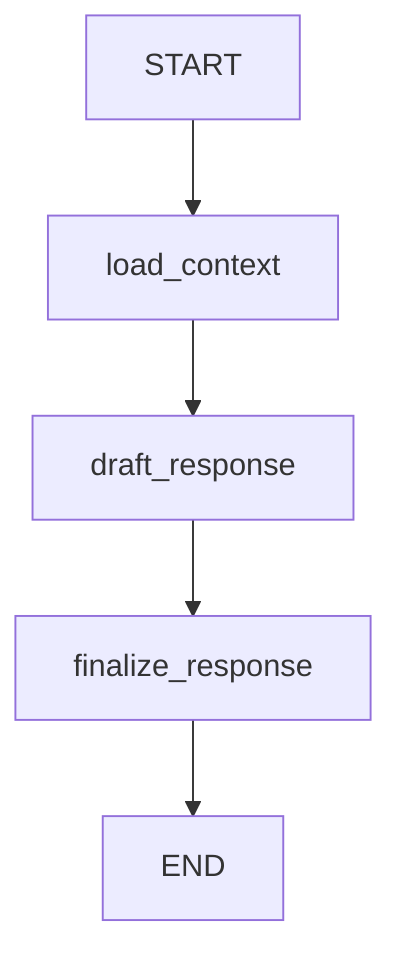
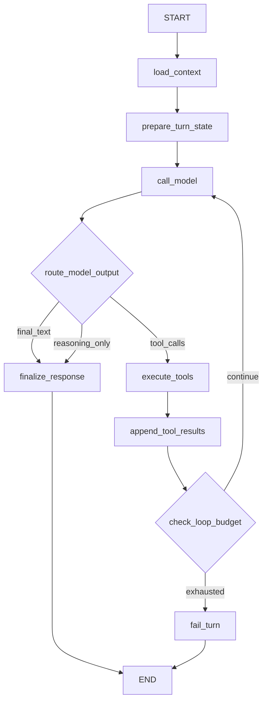
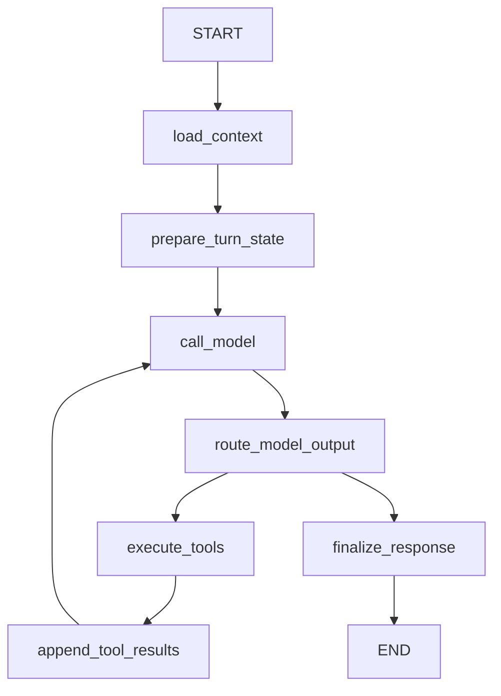

# ProducerGraph Eino 原生工具循环迁移设计

**Status**: Draft for review
**Date**: 2026-06-24
**Scope**: Agent 模式 ProducerGraph 迁移重构

## 背景

当前 Agent 模式已经接入 Eino 原生能力：

- ProducerGraph / CraftsmanGraph / ReviewerGraph / ComposerGraph 编译时接入 `compose.WithCheckPointStore`。
- `agent/einoruntime.CheckpointStore` 将 Eino checkpoint blob 持久化到 `eino_checkpoint`。
- Producer HITL 已使用 Eino `StatefulInterrupt`、`compose.ExtractInterruptInfo`、`compose.BatchResumeWithData` 和 `compose.WithCheckPointID`。
- Producer 工具执行已经通过 Eino `compose.ToolsNode`，工具定义来自 `agenttools.Definition` 转换出的 `schema.ToolInfo`。

但 ProducerGraph 的外层 Eino 图仍然很薄：



`draft_response` 内部调用 `runProducerLoop`，用 Go `for` 循环完成：

```text
Responder.Respond
-> 检查 schema.Message.ToolCalls
-> compose.ToolsNode.Invoke
-> append SameTurnMessages
-> 再次 Responder.Respond
-> 直到没有 tool call 或超过 MaxToolCalls
```

因此当前架构是“Eino 原生 ToolNode 被嵌在一个 Lambda 里”。它能工作，也已经支持 native HITL resume，但 GraphInfo 不能展示工具循环结构，checkpoint 的节点粒度也停留在 `draft_response` 这个大节点上。

## 目标

将 ProducerGraph 迁移为更 Eino-native 的显式工具循环图：



迁移后，Eino GraphInfo 应能直接看到 `call_model`、`execute_tools`、`append_tool_results` 和 loop-back edge。Producer 仍然保留 ClipAnvil 自己的 runtime 持久化和 UI 广播，不把业务事实交给 Eino checkpoint 管。

## 非目标

- 不引入 `react.NewAgent` 作为 Producer 的外层封装。
- 不迁移到 Eino `AgenticMessage` 或 provider-specific agentic runtime。
- 不重写 Volcengine Ark model selection、thinking depth policy、streaming delta 协议。
- 不重写 Agent 工具业务实现。
- 不把 Studio 的 `POST /api/nodes/:id/run` 暴露给 Agent。
- 不在本迁移里新增 Studio 能力补齐工具。
- 不保留 legacy text tool parser；Producer 只接受模型原生 `ToolCalls` 工具调用。

## 当前代码事实

### ProducerGraph

位置：`apps/server/internal/agent/producer/graph.go`

当前节点：

- `load_context`: 调 `RuntimeContextLoader.LoadProducerContext`。
- `draft_response`: 调 `runProducerLoop`。
- `finalize_response`: 修剪最终文本，处理 reasoning-only fallback。

当前 `runProducerLoop` 已承担多种职责：

- 调模型 responder。
- 创建 per-turn Eino `ToolsNode`。
- 将 `agenttools.Definition` 注入 `ProducerContext.ToolInfos`，供 responder 绑定模型工具。
- 检查 `schema.Message.ToolCalls`。
- 调 `ToolsNode.Invoke`。
- 将 assistant tool call 和 tool result 写入 `ProducerContext.SameTurnMessages`。
- 限制 `MaxToolCalls`。
- 检查工具是否触发 HITL interrupt。

### Native ToolNode

位置：`apps/server/internal/agent/producer/native_tool_middleware.go`

当前 Producer 已经不再通过旧 `agenttools.Registry` / `RegistryToolExecutor` 包装工具；ToolNode 只接收 Eino native tool：

- `agenttools.NativeTool -> einotool.BaseTool`
- `NativeTool.Info() -> schema.ToolInfo`
- `compose.NewToolNode(... ExecuteSequentially: true)`
- `ToolCallMiddlewares` 注入 workspace/thread/task/tool_call_id。
- native `request_user_decision` 用 `einotool.StatefulInterrupt` 暂停 Producer 图。
- `einotool.GetInterruptState` / `einotool.GetResumeContext` 支持恢复到中断工具。

### HITL / checkpoint

位置：

- `apps/server/internal/agent/producer/executor.go`
- `apps/server/internal/api/agent_handler.go`
- `apps/server/internal/agent/einoruntime/run_options.go`

当前链路：

1. Producer Executor 用 `compose.WithCheckPointID(checkpointKey)` 运行 ProducerGraph。
2. Tool adapter 对 HITL 工具调用 `StatefulInterrupt`。
3. Executor 捕获 `compose.ExtractInterruptInfo(err)`。
4. 写 `graph_interrupted` event，task 标 `waiting_for_user`。
5. 用户回复后创建 `decision_resume` task。
6. `producerDecisionResumeRunInput` 将 `checkpoint_key` 和 `interrupt_ids` 转成 `ResumeCheckpointID` 与 `ResumeData`。
7. Graph 通过 `compose.BatchResumeWithData` 继续执行。

这个机制必须保留。

### Eino 原生能力

Eino 0.9.9 提供：

- `compose.GraphInfo` / `GraphCompileCallback` 用于打印图结构。
- `compose.AddToolsNode` 将 `ToolsNode` 放入外层 Graph。
- `compose.NewGraphBranch` 支持模型输出后按条件路由。
- 默认 `AnyPredecessor` / Pregel runtime 支持带环图。
- `compose.WithMaxRunSteps` 可限制 loop 图最大步数。
- Eino 自身测试存在 `model -> tools -> model` 的 ReAct-style loop，并支持 `ToolsNode` interrupt/resume。

## 设计原则

1. **Graph 结构优先显式**
   `call_model`、`execute_tools`、`append_tool_results` 必须成为外层 Eino 节点。GraphInfo 应能解释 Producer 的工具循环。

2. **业务持久化继续归 ClipAnvil**
   `agent_task`、`agent_event`、`agent_message`、`shot`、`media_node`、`generation_job` 仍由现有 runtime/service 写入。Eino checkpoint 只保存执行态。

3. **HITL 继续使用 Eino 原生 interrupt/resume**
   迁移不能退化为普通 tool result + 手写等待状态。

4. **迁移分阶段，先并行新图，后替换旧图**
   保留旧 `runProducerLoop`，先用 feature flag 或构造参数切换到显式图，验证后再删除旧 loop。

5. **模型/tool 消息协议不变**
   前端和 DB 继续看到同样的 tool_call/tool_result/status 消息。

6. **不支持文本伪工具调用**
   Producer 不解析普通文本里的 JSON / FunctionCall 标记。模型必须通过 provider/Eino 原生 `ToolCalls` 调工具。

## 目标数据结构

新增 Producer turn 内部状态类型，承载显式图节点之间的可变状态：

```go
type ProducerLoopState struct {
    Context ProducerContext
    LastOutput ProducerTurnOutput
    LastAssistantMessage *schema.Message
    LastToolResults []*schema.Message
    ToolCallsUsed int
    Route ProducerRoute
    ErrorCode string
    ErrorMessage string
}

type ProducerRoute string

const (
    ProducerRouteToolCalls ProducerRoute = "tool_calls"
    ProducerRouteFinalText ProducerRoute = "final_text"
    ProducerRouteReasoningOnly ProducerRoute = "reasoning_only"
    ProducerRouteLoopExhausted ProducerRoute = "loop_exhausted"
)
```

`ProducerLoopState` 是 Eino graph 的内部执行态，不直接持久化为业务事实。它可以进入 Eino checkpoint blob，但不能替代 `agent_message` 和 `agent_task`。

## 目标 Graph 节点

### `load_context`

保持当前行为，读取：

- 最近消息；
- Producer model selection；
- 图片附件；
- PSS 文本和结构化生产状态；
- 当前工具 schema 容器需要的基础上下文。

输出 `ProducerContext`。

### `prepare_turn_state`

输入 `ProducerContext`，输出 `ProducerLoopState`。

职责：

- 创建初始 loop state。
- 构造 per-turn tool registry context。
- 将 tool infos 写入 `ProducerContext.ToolInfos`，让模型 responder 能绑定 Eino tools。
- 初始化 `ToolCallsUsed=0`。

### `call_model`

输入 `ProducerLoopState`，输出 `ProducerLoopState`。

职责：

- 调用当前 `Responder.Respond(ctx, state.Context)`。
- 保留 streaming delta 行为。
- 保存 `LastOutput` 和 `LastAssistantMessage`。
- 记录 diagnostics：model id、tool binding count、native tool call count、reasoning token 等。

### `route_model_output`

作为 Eino branch condition 使用。

路由规则：

- `LastAssistantMessage.ToolCalls` 非空：去 `execute_tools`。
- 无 tool calls 且文本非空：去 `finalize_response`。
- 无文本但 reasoning 非空：去 `finalize_response`，沿用 fallback 文案。
- tool count 已超过限制：去 `fail_turn`。

### `execute_tools`

应使用外层 Eino `compose.ToolsNode`，而不是在 Lambda 内手动 `Invoke`。

输入需要是 `*schema.Message`，输出是 `[]*schema.Message`。因此推荐把工具执行拆成两个节点：

1. `extract_tool_message`: `ProducerLoopState -> *schema.Message`
2. `execute_tools`: Eino `ToolsNode`
3. `append_tool_results`: 将 `[]*schema.Message` 合回 `ProducerLoopState`

如果 Eino Graph 类型转换太重，可以先用一个轻量 state wrapper，但最终 GraphInfo 必须显示独立的 `execute_tools` 节点。

### `append_tool_results`

输入工具结果，更新 `ProducerLoopState`：

- 将 assistant tool call 写入 `SameTurnMessages`。
- 将 tool result 写入 `SameTurnMessages`。
- `ToolCallsUsed += len(tool calls)`。
- 保存 `LastToolResults`。

注意：ToolNode 只负责执行 native tools 和维护 same-turn model context；本轮 native `tool_call` / `tool_result` trace 由 Producer executor 写入 `agent_message`，用于 UI 展示和后续多轮恢复。

### `check_loop_budget`

作为 branch condition：

- 如果还有预算，回到 `call_model`。
- 如果超过 `MaxToolCalls`，去 `fail_turn`。

同时编译 Graph 时使用 `compose.WithMaxRunSteps` 作为第二层保护。建议：

```text
max_run_steps = MaxToolCalls * 4 + 8
```

如果 Eino compile option 不能使用运行时 `MaxToolCalls`，先使用保守常量，例如 `256`，并保留业务层 `MaxToolCalls`。

### `finalize_response`

保持当前语义：

- trim `AssistantText`。
- reasoning-only 时返回现有 fallback 文案。
- 输出 `ProducerTurnOutput`。

### `fail_turn`

生成明确错误，交给 Producer Executor 的 `failTask` 处理。

典型错误：

- `agent_tool_loop_exhausted`
- `agent_tool_executor_missing`
- `agent_model_tool_calling_unsupported`
- `producer_returned_empty_response`

## HITL 迁移要求

`request_user_decision` 必须继续通过 `StatefulInterrupt` 中断 `execute_tools` 节点。

目标行为：

1. `execute_tools` 运行到 HITL tool。
2. Tool adapter 创建 decision card、event、message，并返回 `Interrupted=true`。
3. Adapter 调 `einotool.StatefulInterrupt`。
4. Eino 在 `execute_tools` 节点中断并写 checkpoint。
5. Producer Executor 捕获 interrupt，写 `graph_interrupted` event，task 标记 `waiting_for_user`。
6. 用户回复创建 `decision_resume` task。
7. Resume 时 Eino 从 `execute_tools` 的中断点继续，adapter 通过 `GetResumeContext` 返回 `user_decision_received`。
8. `append_tool_results` 看到恢复后的 tool result，再回到 `call_model`。

这比当前实现更 Eino-native：中断点从“`draft_response` 内部某次 ToolNode.Invoke”提升为“外层 `execute_tools` 节点”。

## 可选方案比较

### 方案 A：保留当前 `draft_response` 内部 loop

优点：

- 最小改动。
- 当前已支持 native ToolNode 和 HITL resume。

缺点：

- GraphInfo 仍看不到工具循环。
- checkpoint 粒度粗。
- 以后引入更复杂路由时会继续堆在 `runProducerLoop`。

结论：不满足“更 Eino-native”的目标。

### 方案 B：显式 Graph 工具循环

优点：

- GraphInfo 能展示真实 Producer 控制流。
- Eino checkpoint/resume 的节点语义更清晰。
- 后续可以自然加入更多 branch，例如安全审查、模型切换、工具预算、用户确认。
- 仍复用现有 `Responder`、HITL service 和 UI 协议，但工具执行链路只保留 Eino native ToolNode。

缺点：

- 需要引入 `ProducerLoopState`。
- 需要处理 Graph 节点间类型转换。
- 测试面比当前 loop 更大。

结论：推荐方案。

### 方案 C：直接使用 Eino `react.NewAgent`

优点：

- Eino-native 程度最高。
- ReAct loop 由框架管理。

缺点：

- 隐藏太多 ClipAnvil 需要控制的细节：task/event/message 持久化、WebSocket 时序、HITL card、PSS 构造、thinking passback、tool audit。
- 当前 Producer 不是通用聊天 Agent，而是生产编排器。

结论：暂不采用。可作为长期评估，不作为本次迁移目标。

## 分阶段迁移计划

### 阶段 1：补测试和 GraphInfo 目标断言

目标：先锁定当前行为。

新增测试：

- 当前 GraphInfo 只包含 `draft_response` 的测试保留为现状记录。
- 新增目标测试，期望新图包含：
  - `prepare_turn_state`
  - `call_model`
  - `extract_tool_message`
  - `execute_tools`
  - `append_tool_results`
  - `finalize_response`
- native tool call 仍能调用 `create_agent_text_node`。
- `update_storyboard` same-turn tool result 能回灌给第二次 model call。
- `MaxToolCalls` 仍生效。
- 普通文本里的 JSON / FunctionCall 伪工具调用不会被解析或执行。
- HITL interrupt/resume 仍使用 `compose.ExtractInterruptInfo` 和 `ResumeData`。

### 阶段 2：抽出纯函数和状态对象

目标：不改图结构，先降低迁移风险。

抽出：

- `prepareToolState`
- `routeProducerOutput`
- `appendNativeSameTurnMessages`
- `effectiveMaxRunSteps`
- `finalizeProducerOutput`

这些函数应由当前 `runProducerLoop` 和未来显式 Graph 共享。

### 阶段 3：新增显式 ProducerGraph 构造路径

目标：并行构造新图，先保留旧 inline loop 作为回归对照。

可选接口：

```go
type ProducerGraphMode string

const (
    ProducerGraphModeInlineLoop ProducerGraphMode = "inline_loop"
    ProducerGraphModeExplicitToolLoop ProducerGraphMode = "explicit_tool_loop"
)
```

`GraphConfig` 增加 `Mode`，默认先保持旧模式，测试中开启新模式。验证稳定后 server main 切到新模式。

### 阶段 4：接入外层 `execute_tools` 节点

目标：让 `compose.ToolsNode` 出现在 GraphInfo 中。

实现要点：

- Graph 构造时创建真正的 `compose.ToolsNode`，通过 `AddToolsNode("execute_tools", toolsNode)` 接入图。
- `prepare_tool_message` 将 `ProducerLoopState` 转成 `*schema.Message`，并注入仅图内使用的 state key。
- Tool adapter 通过 state store 找回 per-run `ProducerContext`，避免工具复用上一次 workspace/task。
- `append_tool_results` 将 `[]*schema.Message` 合回 `ProducerLoopState`，并清理 state store。

需要特别验证 Eino `ToolsNode` resume 时仍能找到 Producer state，HITL 恢复不能退化为业务层手写状态机。

### 阶段 5：切换默认路径并删除旧 loop

条件：

- 单元测试覆盖旧 loop 的所有关键行为。
- 浏览器 smoke 通过。
- GraphInfo 打印出显式工具循环。
- HITL resume 通过。
- `agent_task/tool_call`、`agent_event`、`agent_message` 形状无回归。

切换后：

- 删除文本 JSON tool parser 及其单测。
- 更新 Producer system prompt，明确只允许原生 `ToolCalls`。
- 更新 `agent-multiagent-architecture.md` 中 ProducerGraph 图。

## 风险与缓解

| 风险 | 影响 | 缓解 |
|---|---|---|
| Graph 带环后 Eino 步数失控 | Producer task 卡住或失败不清晰 | 保留业务 `MaxToolCalls`，并设置 `WithMaxRunSteps` |
| ToolsNode 实例持有过期 ProducerContext | 工具写错 workspace/thread/task | 工具 adapter 必须 per run 创建，或通过 ctx 注入 per-run context |
| HITL resume 目标不再匹配 | 用户回复后无法续跑 | 用 Eino 官方 `model -> tools -> model` resume 模式做专门测试 |
| same-turn reasoning passback 丢失 | 模型二次响应质量下降 | 保留 `ProducerSameTurnMessage.ReasoningContent` 测试 |
| UI 工具状态缺失 | 用户看不到工具调用过程 | Producer executor 持久化 native `tool_call` / `tool_result` agent_message |
| 文本伪工具调用被误执行 | 架构目标落空 | 删除 parser，测试确认图和代码无 fallback |

## 验收标准

### GraphInfo

`producer_turn` Mermaid 至少包含：



### 功能

- 普通文本对话仍返回 assistant text。
- native `ToolCalls` 能调用 Producer 工具。
- 工具结果进入下一次 model call。
- `request_user_decision` 触发 Eino interrupt，task 进入 `waiting_for_user`。
- 用户决策后通过 `decision_resume` 从 checkpoint 续跑。
- `MaxToolCalls` 超限返回 `agent_tool_loop_exhausted`。
- 普通文本里的 JSON / FunctionCall 伪工具调用不会触发工具。

### 持久化

- 每次工具调用仍创建 `agent_task(task_type='tool_call')`。
- 仍写 `tool_call_started` / `tool_call_completed` / `tool_call_failed`。
- 仍写 `agent_message(message_type='tool_call')`。
- 工具结果仍可被 UI 看到。
- `agent_thread.current_checkpoint_key` 仍更新为当前 Producer checkpoint。

### 兼容

- 不改变 Agent API response shape。
- 不改变 WebSocket event payload。
- 不改变已有 `agenttools.Executor` 接口。
- 不改变 Studio mode controller。

## 验证命令

后端定向测试：

```bash
cd apps/server
GOCACHE=/private/tmp/clipanvil-go-build go test ./internal/agent/producer ./internal/agent/tools ./internal/agent/hitl -count=1
```

完整后端测试：

```bash
GOCACHE=/private/tmp/clipanvil-go-build make server-test
```

后端构建：

```bash
GOCACHE=/private/tmp/clipanvil-go-build make server-build
```

文档和格式检查：

```bash
git diff --check
```

如果更新了架构文档或 graph 输出，需要补充：

```bash
cd apps/server
GOCACHE=/private/tmp/clipanvil-go-build go test ./internal/agent/einoruntime ./internal/agent/producer -run 'GraphInfo|ProducerGraph' -count=1
```

## 需要后续确认的问题

1. 新图是否直接作为默认路径上线，还是先通过 `ProducerGraphMode` feature flag 并行一轮。
2. `execute_tools` 最终是否必须使用 `AddToolsNode`，还是可接受 named Lambda 包装 `ToolsNode.Invoke` 作为第一阶段。
3. 是否在同一阶段更新 `docs/engineering/agent-multiagent-architecture.md` 的 ProducerGraph 图，还是等实现落地后再更新。
