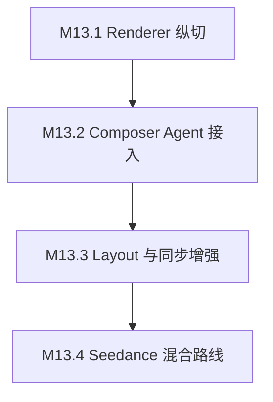

# M13 Remotion Timeline Composer 里程碑

**状态**：M13.1、M13.2、M13.3、M13.4 已实现并验证
**设计来源**：`docs/superpowers/specs/2026-07-03-agent-remotion-timeline-composer-design.md`
**可执行目标**：`docs/milestones/m13-remotion-timeline-composer-goals.md`
**目标**：把 Remotion 从单分镜图片动效 provider 升级为 Agent 可控的最终视频排版和剪辑引擎。

## 总目标

M13 要完成的不是继续增强 `motion_shot_video`，而是新增 Composer 级 `remotion_timeline_v1`。Producer 仍然动态创建分镜和 AudioPlan，Craftsman 生成 Seedream 图片与火山音频，Composer 根据 cue plan 生成 `RemotionTimelinePlan`，由 Remotion 渲染完整 final video。

最终低成本主线应变为：

```text
Storyboard + AudioPlan cue_plan
  -> Seedream 多张 still images
  -> Volcengine voiceover/BGM
  -> Composer RemotionTimelinePlan
  -> Remotion final render
  -> final_video artifact
```

## 阶段顺序



## M13.1：Remotion Timeline Renderer 纵切

**阶段状态**：已实现并通过本地验证（2026-07-03）。

### 阶段目标

先证明后端和 sandbox 能使用一个 fixture `RemotionTimelinePlan` 渲染完整 final video。这个阶段不要求真实 Agent 自动生成 timeline，也不要求营销效果很强，重点是打通 final composer 的 Remotion 渲染能力。

### 主要任务

1. 新增 `remotion_timeline_v1` template key。
2. 扩展 Composer tool enum，让 `dispatch_composer`、`create_timeline_plan`、`render_timeline_template` 接受 `remotion_timeline_v1`。
3. 新增 `RemotionTimelinePlan` Go 侧 validation，至少校验：
   - `schema=clipanvil.remotion_timeline.v1`
   - `composition=MarketingTimeline`
   - `output.width/height/fps/duration_sec`
   - 至少 1 个 segment
   - segment 时间范围合法
   - segment asset workspace_path 位于 `/workspace`
   - audio workspace_path 位于 `/workspace`
4. 新增 sandbox Remotion timeline project：
   - `sandbox-image/remotion-timeline/package.json`
   - `sandbox-image/remotion-timeline/src/index.tsx`
   - `sandbox-image/remotion-timeline/src/render.mjs`
   - `sandbox-image/remotion-timeline/src/schema.ts`
   - 基础 layout component。
5. 新增 sandbox job service：
   - stage 已有 fixture media。
   - 上传 `timeline-plan.json`。
   - 执行 Remotion renderer。
   - 检查输出 MIME、大小、duration。
6. 扩展 `render_timeline_template`：
   - `simple_concat` / `concat_with_fades` 继续走 ffmpeg。
   - `remotion_timeline_v1` 走 Remotion timeline renderer。
7. 增加 fixture smoke：
   - 1-2 张图片。
   - 1 条 voiceover。
   - 1 条 BGM。
   - 8-12 秒 final video。

### 可交付标准

- 代码中存在可复用的 `remotion_timeline_v1` renderer 路径。
- fixture timeline 可以渲染出 MP4 final video。
- final video 至少包含：
  - still image visual layer
  - caption
  - voiceover audio
  - BGM audio
- 现有 ffmpeg Composer 模板不回归。
- `timeline_plan` 能记录 Remotion render 的 sandbox job、output artifact 和 result metadata。

### 可验收标准

- 单元测试通过：
  - template key enum 接受 `remotion_timeline_v1`。
  - invalid timeline plan 被拒绝。
  - `simple_concat` / `concat_with_fades` 仍走 ffmpeg renderer。
  - `remotion_timeline_v1` 走 Remotion renderer。
- sandbox fixture smoke 通过。
- `ffprobe` 验证 final video：
  - 有 video stream。
  - 有 audio stream。
  - duration 接近 timeline duration。
  - 分辨率为 `1080x1920`。
- `git diff --check` 通过。

### 验证记录

```bash
cd apps/server
GOCACHE=/private/tmp/clipanvil-go-build go test ./internal/remotiontimeline ./internal/agent/tools ./internal/sandbox
```

结果：通过。

```bash
GOCACHE=/private/tmp/clipanvil-go-build make server-build
bash -n scripts/smoke-m13-1-remotion-timeline.sh
node --check sandbox-image/remotion-timeline/src/render.mjs
./scripts/smoke-m13-1-remotion-timeline.sh
git diff --check
```

结果：通过。Remotion smoke 输出 `1080x1920` MP4，包含 audio stream，duration 约 `10.048s`。

### Codex Goal

```text
Codex Goal: M13.1 Remotion Timeline Renderer 纵切

Objective:
在 ClipAnvil 中新增 `remotion_timeline_v1` Composer template，打通 sandbox Remotion final timeline renderer。使用 fixture RemotionTimelinePlan、fixture 图片、voiceover 和 BGM 渲染出一个可持久化的 final_video artifact，同时保证现有 ffmpeg `simple_concat` 和 `concat_with_fades` 不回归。

Scope:
- 新增 Remotion timeline sandbox project。
- 新增 RemotionTimelinePlan validation。
- 扩展 Composer template key 和 render_timeline_template 分流。
- 新增或更新相关 Go 单元测试。
- 新增 fixture smoke，使用 ffprobe 验证 MP4 video/audio/duration/resolution。

Out of Scope:
- 不要求真实 Agent 自动生成 RemotionTimelinePlan。
- 不要求完整营销 layout 集合。
- 不改 Producer 分镜策略。
- 不删除 motion_shot_video。

Acceptance:
- `remotion_timeline_v1` fixture 可以渲染 final MP4。
- final MP4 有 video stream 和 audio stream。
- `timeline_plan` 回填 sandbox_job_id、artifact_version_id 和 completed status。
- 旧 Composer ffmpeg 模板测试仍通过。
- 运行验证命令并记录结果：相关 Go tests、fixture smoke、ffprobe、git diff --check。
```

## M13.2：Composer Agent 接入

**阶段状态**：已实现并通过真实浏览器 Agent E2E 验证（2026-07-03）。

### 阶段目标

让真实 Composer Agent 在 Agent 模式中读取 Storyboard、AudioPlan、Seedream still、voiceover 和 BGM，自动创建 `RemotionTimelinePlan` 并生成 final video。这个阶段开始验证真实用户工作流。

### 主要任务

1. 扩展 `get_composition_context`：
   - still asset 从 fallback 变成 first-class composition asset。
   - 返回 active shot 的 `shot_ref`、`title`、`duration_sec`、`narrative_purpose`、`visual_intent`、`sort_order`。
   - 返回每个 media node 的完整 semantic ref。
   - 返回 active AudioPlan 的 `cue_plan`。
   - 返回 `remotion_timeline_schema`，列出支持的 layout、motion、transition。
2. 新增或更新 Composer skill：
   - `remotion-timeline-composer`。
   - 更新 `composer-timeline-director`。
   - 明确 `remotion_timeline_v1` 下 still image 是一等素材。
3. 更新 Composer system prompt：
   - 允许 `remotion_timeline_v1`。
   - 要求以 AudioPlan cue order 作为 primary timeline。
   - 禁止用 `narrative_purpose` / `visual_intent` / `action_text` 作为字幕。
4. 更新 deterministic Composer fallback：
   - 当模型未主动调用工具时，可根据 cue plan 生成基本 `RemotionTimelinePlan`。
5. 更新 Producer system prompt / skill：
   - no-Seedance 低成本主线优先派发 `remotion_timeline_v1` Composer。
   - 不再默认每个 shot 必须先生成 `motion_shot_video`。
6. 增加真实 Agent E2E：
   - 使用桌面 `box.png` 或 fixture product image。
   - 用户明确禁止 Seedance。
   - Seedream 生成多张 still。
   - 火山生成 voiceover/BGM。
   - Composer 生成 Remotion final video。

### 可交付标准

- Composer Agent 能创建 `timeline_plan.template_key=remotion_timeline_v1`。
- Composer 生成的 `plan_json` 使用真实 `shot_ref`、真实 staged asset path、真实 audio path。
- final video 使用 Remotion renderer 完成。
- no-Seedance 低成本 E2E 不再要求每个 shot 都有 `motion_shot_video`。
- 字幕来自 AudioPlan cue，而不是 Storyboard 内部导演字段。

### 可验收标准

- 浏览器 Agent E2E 真实跑通。
- DB 验证：
  - 有 `timeline_plan.template_key=remotion_timeline_v1`。
  - `generation_job` 没有 Seedance video job。
  - 有多张 Seedream image job。
  - 有 voiceover 和 BGM audio job。
  - final artifact persisted。
- `ffprobe` 验证 final video >= 30 秒且有 audio stream。
- 抽查 `timeline_plan.plan_json`：
  - segments 数量与 cue plan 对齐。
  - captions 不包含内部导演笔记。
  - wheel cue 使用 wheel/detail 素材。
  - storage cue 使用 interior/storage 素材。
- 相关 Go tests、web build/lint 或最小必要验证通过。

### 验证记录

真实浏览器 Agent E2E：

- 前端：`http://localhost:5180`
- 后端：`http://localhost:8895`
- workspace：`dd54ce28-f5c4-4229-951b-7b6aa3317734`
- 用户输入：上传桌面 `box.png`，要求生成 30 秒以上「悦行行李箱」中文口播广告，禁止 Seedance，允许 Seedream 图片和火山音频，最终使用 `remotion_timeline_v1`。
- HITL：批准 AudioPlan 后继续生成。
- 浏览器验收：Agent workspace 显示 `FINAL remotion_timeline_v1 completed`，页面 video duration `31.722667`，readyState `4`。

DB route smoke：

```bash
psql "$DATABASE_URL" -v workspace_id='dd54ce28-f5c4-4229-951b-7b6aa3317734' -f scripts/smoke-m13-2-agent-remotion-route.sql
```

结果：

- `timeline_plan = 1`
- `seedance_generation_jobs = 0`
- `seedream_render_plans = 5`
- `audio_render_plans = 2`
- latest timeline plan：`e1c8ca53-4530-43ee-98df-442490412d50`
- `template_key=remotion_timeline_v1`
- `status=completed`
- `schema=clipanvil.remotion_timeline.v1`
- `segment_count=5`
- `artifact_version_id=5f1968ff-9516-46fc-a2e7-168bf799dc89`
- `sandbox_job_id=f3af26a2-bfdf-4bec-a864-b84c51e6bc6b`

Provider route：

```text
Seedance jobs: 0
Seedream jobs: 5 x volcengine / doubao-seedream-5-0-260128 / image_to_image / succeeded
Audio jobs: 2 x volcengine / seed-audio-1.0 / text_to_audio / succeeded
Final composition job: 1 x internal_ffmpeg / ffmpeg / compose_final_video / succeeded
Remotion render sandbox job: f3af26a2-bfdf-4bec-a864-b84c51e6bc6b / succeeded
```

Media probe：

```bash
ffprobe -v error \
  -show_entries format=duration \
  -show_entries stream=index,codec_type,codec_name,width,height,duration \
  -of json /tmp/clipanvil-m13-final-e1c8ca53.mp4
```

结果：

- duration：`31.722667`
- video：`h264`，`1080x1920`，duration `31.666667`
- audio：`aac`，duration `31.722667`

Cue / visual spot check：

- `00:08` 抽帧：字幕讲「顺滑万向轮」，画面为行李箱万向轮/轮组特写。
- `00:16` 抽帧：字幕讲「分区合理，收纳利落」，画面为打开箱体收纳内景。
- 抽查 `timeline_plan.plan_json`：segment captions 来自 AudioPlan cue 文案，没有出现 `narrative_purpose`、`visual_intent`、`action_text` 或内部导演笔记。

修复记录：

- `RemotionTimelinePlan` decode 兼容 `motion.intensity` 为 number 或 string，避免真实 LLM 输出数值强度时 render tool 失败。
- segment-level `captions` array 会归一为 renderer 使用的 `caption` object。
- deterministic Composer fallback 改为输出 `caption` object，并通过 `remotiontimeline.Decode/Validate` 测试。
- 本地 sandbox 镜像已重新构建为 `clipanvil-sandbox:dev`，确保 `/opt/clipanvil/remotion-timeline/src/render.mjs` 存在。

剩余注意：

- final artifact 已成功生成并持久化后，工程自动触发的后续 Producer signal 因火山账号欠费返回 `AccountOverdueError 403` 而失败。该失败发生在 final video 完成之后，不影响 M13.2 final artifact 验收，但会让 workbench overview phase 显示 `needs_attention`。

### Codex Goal

```text
Codex Goal: M13.2 Composer Agent 接入 Remotion Timeline

Objective:
让 ClipAnvil 真实 Agent 模式能够在 no-Seedance 低成本营销视频请求中，由 Composer 自动生成 `remotion_timeline_v1` 的 RemotionTimelinePlan，并使用 Seedream still、火山 voiceover/BGM 和 AudioPlan cue_plan 渲染 30 秒以上 final video。

Scope:
- 扩展 get_composition_context，让 still images、shot metadata、AudioPlan cue_plan 和 remotion timeline schema 可被 Composer 使用。
- 更新 Composer prompt、skill 和 deterministic fallback。
- 更新 Producer prompt/skill，使 no-Seedance 主线优先 dispatch_composer(template_key=remotion_timeline_v1)。
- 增加真实浏览器 Agent E2E 验证。
- 补充 DB 查询或 smoke 脚本验证 provider route、timeline_plan 和 final artifact。

Out of Scope:
- 不实现完整 layout/motion/transition 高级集合。
- 不接 TTS word-level subtitle timestamp。
- 不做 Seedance 混合路线。
- 不删除现有 motion_shot_video provider。

Acceptance:
- 真实 Agent E2E 可从用户上传商品图生成 30 秒以上 final video。
- DB 中无 Seedance video generation_job。
- DB 中有 Seedream image jobs、火山 voiceover/BGM jobs、remotion_timeline_v1 timeline_plan。
- final video 有音频、有字幕，字幕不包含内部导演笔记。
- 关键 cue 与素材语义对齐：讲万向轮时使用轮组/细节图，讲收纳时使用打开箱体/内景图。
- 运行并记录必要测试、E2E、ffprobe 和 git diff --check。
```

## M13.3：营销 Layout 与 Cue 同步增强

**阶段状态**：已实现并通过真实浏览器 Agent E2E 验证（2026-07-03）。

### 阶段目标

提升 Remotion final video 的观感和同步可靠性。这个阶段从“能渲染”进入“像营销视频”，重点是 layout、motion、transition、字幕安全区、cue/asset mismatch blocker 和重复视觉检查。

### 主要任务

1. 扩展 Remotion layout 集合：
   - `hero_packshot`
   - `detail_focus`
   - `benefit_card`
   - `split_compare`
   - `scenario_card`
   - `open_storage`
   - `cta_endcard`
2. 扩展 motion preset：
   - `push_in`
   - `pull_out`
   - `pan_left`
   - `pan_right`
   - `float_parallax`
   - `spotlight_reveal`
   - `kinetic_text`
   - `cta_pop`
3. 扩展 transition：
   - `cut`
   - `crossfade`
   - `slide`
   - `wipe`
   - `zoom_blur`
4. 强化 caption lane：
   - 单一字幕 lane。
   - 统一底部安全区。
   - 中文自动分行。
   - 避免与大标题 text layer 重叠。
5. 增加 cue/asset mismatch blocker：
   - cue visual_focus 或 visual_intent 与 selected asset metadata 明显冲突时 blocked。
   - 例如 wheel cue 不允许使用 storage/interior still。
6. 增加重复视觉检查：
   - 同一图片不能无解释地覆盖多数 segments。
   - 同一 layout 不能连续重复过多。
7. 增加 Reviewer 规则：
   - 字幕来源检查。
   - 字幕重叠检查。
   - BGM/voiceover 存在性检查。
   - no-Seedance route compliance。
8. 可选接入 TTS subtitle / alignment：
   - 如果当前火山接口可用，保存 alignment。
   - 否则继续使用 AudioPlan cue scaling。

### 可交付标准

- Remotion final video 可以呈现多种 layout，而不是同一张卡片重复。
- Composer 会根据 shot/cue 选择不同 layout 和 motion。
- 语义冲突时 Composer 或 Reviewer 会 blocked，不会静默生成错配视频。
- 字幕 lane 稳定、可读、不叠双层字幕。

### 可验收标准

- 单元测试覆盖每个 layout key 至少一个 snapshot 或 render smoke。
- Composer plan validation 拒绝未知 layout/motion/transition。
- E2E 视频中至少出现 4 种 layout。
- E2E 中同一 still image 不超过总 segment 的 50%，除非 Producer 明确说明素材不足。
- 字幕不重叠，且不使用内部字段。
- Reviewer 对故意错配 fixture 能给出 blocked 或 issue。

### 验证记录

真实浏览器 Agent E2E：

- 前端：`http://localhost:5180`
- 后端：`http://localhost:8895`
- workspace：`61d63b61-bead-49d1-8da8-ce6a8c2cee16`
- 用户输入：上传桌面 `box.png`，要求生成 30 秒以上「悦行行李箱」中文口播广告，禁止 Seedance，允许 Seedream 图片和火山音频，最终使用 `remotion_timeline_v1`，且至少 4 种 layout、cue 与画面同步。
- HITL：批准 AudioPlan 后继续生成。
- 最新 timeline plan：`57c335fd-58bc-4fc1-805b-01544585b8d4`
- final artifact version：`f6206c5a-e73b-4f07-9bbe-ba3afe432776`
- sandbox job：`ce29d2f2-33bd-441b-a4d4-6ee6891a45ea`
- final storage key：`workspace-61d63b61-bead-49d1-8da8-ce6a8c2cee16/production/39896882-ccbb-41f5-b28a-7b8a169d679b/34d5dd83-5a66-4943-a1f6-78e5c946f628.mp4`

Provider route：

```text
Seedance provider/model jobs: 0
Seedream jobs: 6 x volcengine / doubao-seedream-5-0-260128 / image_to_image / succeeded
Audio jobs: 2 x volcengine / seed-audio-1.0 / text_to_audio / succeeded
Remotion timeline plans: 2 x remotion_timeline_v1 / completed
Latest Remotion sandbox render: ce29d2f2-33bd-441b-a4d4-6ee6891a45ea / succeeded / 362898ms
```

Timeline plan spot check：

- segment count：`6`
- distinct layouts：`scenario_card`、`detail_focus`、`open_storage`、`benefit_card`、`cta_endcard`
- transition presets：`cut`、`slide`、`wipe`、`zoom_blur`、`crossfade`
- caption source：全部为 `audio_cue`
- captions 未包含 `narrative_purpose`、`visual_intent`、`action_text`、`短途出行痛点钩子`、`前三秒抓住` 等内部导演字段。
- `shot_02` 万向轮 cue 使用 `detail_focus`、`visual_focus=顺滑万向轮` 和轮组特写素材。
- `shot_03` 收纳 cue 使用 `open_storage`、`visual_focus=分区收纳` 和打开箱体素材。

Media probe：

```bash
ffprobe -hide_banner -v error \
  -show_entries format=duration,size:stream=index,codec_type,codec_name,width,height,duration \
  -of json /tmp/clipanvil-m13-3-final-57c335fd.mp4
```

结果：

- duration：`31.722667`
- video：`h264`，`1080x1920`，duration `31.666667`
- audio：`aac`，duration `31.722667`

Frame spot check：

- `00:08` 抽帧：画面为万向轮特写，顶部短标题「顺滑万向轮」，底部单一字幕 lane 为对应口播。
- `00:14` 抽帧：画面为打开箱体分区收纳，顶部短标题「分区收纳」，底部单一字幕 lane 为对应口播。
- `00:29` 抽帧：画面为正面箱体 CTA，顶部 CTA 标题「现在出发」，底部单一字幕 lane 为对应口播。

本地验证：

```bash
cd apps/server
GOCACHE=/private/tmp/clipanvil-go-build go test ./internal/remotiontimeline -count=1
GOCACHE=/private/tmp/clipanvil-go-build go test ./internal/agent/composer -run 'TestDeterministicComposerRemotionTimelinePlanUsesCuePlanAndStills|TestDeterministicComposerRemotionTimelinePlanUsesLayoutDiversity' -count=1
GOCACHE=/private/tmp/clipanvil-go-build go test ./internal/remotiontimeline ./internal/agent/composer ./internal/agent/reviewer ./internal/agent/skills ./internal/agent/tools ./internal/sandbox -count=1
GOCACHE=/private/tmp/clipanvil-go-build make server-build
node --check sandbox-image/remotion-timeline/src/render.mjs
bash -n scripts/smoke-m13-3-remotion-layouts.sh
./scripts/smoke-m13-3-remotion-layouts.sh
```

结果：通过。M13.3 smoke 输出 `1080x1920` MP4，包含 audio stream，duration 约 `14.058667s`，覆盖 7 个 layout。

### Codex Goal

```text
Codex Goal: M13.3 Remotion 营销 Layout 与 Cue 同步增强

Objective:
在 `remotion_timeline_v1` 主线中增加可控的营销 layout、motion、transition、caption lane 和 cue/asset mismatch 检查，让低成本 Remotion final video 从可渲染提升到具备营销视频观感和基本音画语义同步可靠性。

Scope:
- 实现 hero_packshot、detail_focus、benefit_card、split_compare、scenario_card、open_storage、cta_endcard layouts。
- 实现受控 motion 和 transition 枚举。
- 强化 Composer plan validation。
- 强化字幕 lane，避免字幕重叠和内部导演笔记泄露。
- 增加 cue/asset mismatch blocker 与视觉重复规则。
- 增加 Reviewer 规则检查。
- 使用真实或 fixture E2E 验证多 layout、多素材、字幕安全区和语义对齐。

Out of Scope:
- 不让 Agent 写 TSX/CSS。
- 不做开放式时间线编辑器。
- 不强依赖 TTS word-level timestamp；可用则接入，不可用则保留 cue scaling。
- 不要求视觉理解模型自动审核所有画面。

Acceptance:
- E2E final video 至少使用 4 种 layout。
- captions 只来自 cue/text/alignment，不来自 narrative_purpose、visual_intent、action_text。
- wheel cue 不使用 storage still，storage cue 不使用 wheel still。
- 字幕 lane 不与主标题明显重叠。
- 故意错配 fixture 会 blocked 或产生 Reviewer issue。
- 相关 tests、render smoke、ffprobe 和 git diff --check 通过。
```

## M13.4：Seedance 混合路线

**阶段状态**：已实现并通过本地 mixed-media smoke 与真实浏览器 no-Seedance Agent E2E 回归验证（2026-07-03）。真实 mixed-cost Seedance E2E 会产生额外视频模型成本，默认不自动执行，需用户显式授权后再跑。

### 阶段目标

把 Remotion final composer 从 no-Seedance 低成本主线扩展为通用 final composer：它既能使用 Seedream still，也能混入 Seedance hero video。这样可以形成成本可控的混合路线。

### 主要任务

1. Producer route policy 扩展：
   - no-Seedance：只用 Seedream still + audio + Remotion final timeline。
   - mixed-cost：hero/complex motion shot 可用 Seedance，其余 shot 用 Seedream still。
   - premium：更多 shot 可用 Seedance，但 final packaging 仍由 Remotion timeline 统一完成。
2. Composer 支持 video asset segment：
   - 使用 staged video。
   - 支持 trimBefore / trimAfter 或等价裁剪。
   - 支持 video layer 与 text/caption overlay 同时渲染。
3. Remotion timeline 支持 mixed segment：
   - image segment。
   - video segment。
   - image + video overlay segment。
4. Reviewer 增加成本/质量报告：
   - Seedance 使用了几个 shot。
   - Remotion still 使用了几个 shot。
   - 外部 API 成本风险。
   - 哪些 shot 可降级为 still。
5. E2E 验证：
   - 本地 mixed-media fixture：1 个 staged video hero segment + 2 个 Seedream-style still segments + Remotion final timeline。
   - 真实 no-Seedance 浏览器 Agent 回归：禁止 Seedance，使用 Seedream still + 火山 audio + Remotion final timeline。
   - 真实 mixed-cost Seedance E2E：成本型验收项，需用户显式授权后执行。

### 可交付标准

- Remotion final composer 能混合 Seedance video 和 Seedream still。
- Producer 能根据用户成本偏好选择路线。
- DB 中可以审计哪些 shot 使用了 Seedance，哪些 shot 使用了 still。
- Reviewer 能输出成本/质量摘要。

### 可验收标准

- 本地 mixed-media smoke final video 成功生成，timeline 同时包含 image segment 和 video segment。
- 如用户显式授权真实 mixed-cost E2E，`generation_job` 中 Seedance video job 数量符合 Producer plan。
- `timeline_plan.plan_json` 中同时存在 image segment 和 video segment。
- final video 有音频、字幕和 CTA。
- 成本/质量报告能说明 Seedance 使用范围和 Remotion still 使用范围。
- no-Seedance E2E 不回归，仍然没有 Seedance video job。

### 验证记录

本地 mixed-media smoke：

```bash
node --check sandbox-image/remotion-timeline/src/render.mjs
bash -n scripts/smoke-m13-4-remotion-mixed-media.sh
./scripts/smoke-m13-4-remotion-mixed-media.sh
```

结果：通过。fixture timeline 使用 1 个 staged video segment 和 2 个 image segments，输出 `1080x1920` MP4，包含 audio stream，duration `12.053333s`。

真实浏览器 no-Seedance Agent 回归：

- 前端：`http://localhost:5180`
- 后端：`http://localhost:8895`
- workspace：`be269c0f-9d18-4685-994c-280ffa13d39d`
- 用户输入：上传桌面 `box.png`，要求生成 30 秒以上「悦行行李箱」中文口播广告，严格禁止 Seedance，允许 Seedream 图片和火山音频，最终使用 `remotion_timeline_v1`。
- HITL：批准 AudioPlan 后继续生成。
- latest timeline plan：`973f7623-35bf-4290-b188-c22074883ce5`
- final artifact version：`3dc73923-fa41-447d-9ce2-9bea5e2899ad`
- sandbox job：`054e1a59-1aac-4dfa-bbbe-b13c227d0e19`

Provider route：

```text
Seedance provider/model jobs: 0
Seedream jobs: 6 x volcengine / doubao-seedream-5-0-260128 / image_to_image / succeeded
Audio jobs: 2 x volcengine / seed-audio-1.0 / text_to_audio / succeeded
Final composition job: 1 x internal_ffmpeg / ffmpeg / compose_final_video / succeeded
```

Timeline plan spot check：

- segment count：`6`
- distinct layouts：`cta_endcard`、`detail_focus`、`benefit_card`、`open_storage`
- asset types：真实 no-Seedance 回归全部为 `image`；mixed-media smoke 覆盖 `video` + `image`。
- captions 未包含 `narrative_purpose`、`visual_intent`、`action_text`、`短途出行痛点钩子`、`前三秒抓住` 等内部导演字段。

Media probe：

```bash
ffprobe -hide_banner -v error \
  -show_entries format=duration,size:stream=index,codec_type,codec_name,width,height,duration \
  -of json /tmp/clipanvil-m13-4-final-973f7623.mp4
```

结果：

- duration：`31.722667`
- video：`h264`，`1080x1920`，duration `31.666667`
- audio：`aac`，duration `31.722667`

Frame spot check：

- `00:08` 抽帧：画面为万向轮特写，标题「顺滑万向轮」，底部单一字幕 lane 为对应口播。
- `00:18` 抽帧：画面为打开箱体收纳内景，标题「分区收纳」，底部单一字幕 lane 为对应口播。
- `00:29` 抽帧：画面为正面箱体 CTA，标题「现在出发」，底部单一字幕 lane 为对应口播。

本地验证：

```bash
cd apps/server
GOCACHE=/private/tmp/clipanvil-go-build go test ./internal/remotiontimeline ./internal/agent/composer ./internal/agent/producer ./internal/agent/reviewer ./internal/agent/skills -count=1
GOCACHE=/private/tmp/clipanvil-go-build go test ./internal/remotiontimeline ./internal/agent/composer ./internal/agent/producer ./internal/agent/reviewer ./internal/agent/skills ./internal/agent/tools ./internal/sandbox -count=1
GOCACHE=/private/tmp/clipanvil-go-build make server-build
```

结果：通过。真实 mixed-cost Seedance E2E 未默认执行，因为它会产生付费视频模型调用；当前阶段通过 fixture 验证 renderer mixed-media 能力，通过真实浏览器 E2E 验证 no-Seedance 成本防线不回归。

### Codex Goal

```text
Codex Goal: M13.4 Remotion Final Composer 混合 Seedance 路线

Objective:
让 `remotion_timeline_v1` 成为通用 final composer，既能在 no-Seedance 路线中使用 Seedream still，也能在 mixed-cost 路线中混入少量 Seedance hero video，并由 Reviewer 输出成本/质量摘要。

Scope:
- 扩展 Producer route policy：no-Seedance、mixed-cost、premium。
- 扩展 RemotionTimelinePlan 和 renderer，使 segment 可引用 image 或 video asset。
- Composer 能把 Seedance shot video 与 Seedream still 放进同一 Remotion timeline。
- Reviewer 增加成本/质量报告。
- 增加本地 mixed-media smoke 和 no-Seedance regression E2E。
- 真实 mixed-cost Seedance E2E 需用户显式授权后执行。

Out of Scope:
- 不改变 Seedance provider 本身。
- 不做自动成本计费系统，只输出可审计摘要。
- 不要求所有视频素材都经过 Remotion 二次动效处理。

Acceptance:
- 本地 mixed-media smoke 生成 final video，包含至少 1 个 video segment 和多个 image segments。
- 如用户显式授权真实 mixed-cost E2E，生成 final video，包含至少 1 个 Seedance video segment 和多个 Seedream still segments。
- no-Seedance E2E 仍然没有 Seedance video generation_job。
- final video 有音频、字幕、转场和 CTA。
- Reviewer 或 final report 明确列出 Seedance 使用数量、Remotion still 使用数量和成本风险。
- 相关 tests、E2E、ffprobe 和 git diff --check 通过。
```

## 统一验收口径

每个阶段完成时都必须满足：

- 代码、prompt、skill、docs 与当前阶段目标一致。
- 生成链路可从 DB 审计，不能只靠聊天消息说明。
- 不把 runtime/browser/smoke 生成物提交到 git。
- 运行与改动范围匹配的最小验证。
- 如果涉及真实视频输出，必须用 `ffprobe` 或等价工具验证 duration、stream 和 resolution。
- 如果涉及 Agent E2E，必须明确 workspace id、关键 DB 记录和最终 artifact。

## 推荐执行顺序

一次只创建一个 active Codex goal：

1. 先执行 M13.1，直到 fixture Remotion final renderer 可用。
2. 再执行 M13.2，接入真实 Agent。
3. 再执行 M13.3，增强营销观感和同步可靠性。
4. 最后执行 M13.4，支持 Seedance 混合路线。

不要在 M13.1 还未完成时同时实现 M13.3 的复杂 layout，也不要在 M13.2 还未跑通真实 no-Seedance E2E 前实现 mixed-cost 路线。
