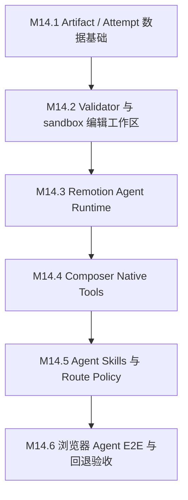

# M14 Agent 动态 Remotion Renderer 里程碑

**状态**：已完成（M14.1-M14.6）
**日期**：2026-07-04
**设计来源**：`docs/superpowers/specs/2026-07-04-agent-authored-remotion-renderer-design.md`
**目标**：在现有 sandbox / Composer / timeline_plan 链路上新增 `agent_remotion_code_v1`，让 Agent 可以为单次成片生成、校验、修复并渲染一次性 Remotion 代码；`remotion_timeline_v1` 保留为 baseline、快速交付路线和稳定 fallback。

## 总目标

M14 要解决的是 `remotion_timeline_v1` 的模板家族感。当前 Remotion timeline renderer 稳定，但视觉系统固定。M14 新增高级动态路线：

```text
Storyboard + AudioPlan + available assets
  -> Composer 生成 Agent-authored Remotion renderer attempt
  -> sandbox 工作区编译 / 修复 / 快照
  -> Remotion render
  -> QA / Reviewer gate
  -> final_video artifact
```

这条路线不删除 `remotion_timeline_v1`，但会改变它的定位。`agent_remotion_code_v1` 是非模板化视觉表达的主要能力；`remotion_timeline_v1` 是 baseline/fallback。Producer/Composer 可以根据用户诉求、Storyboard 复杂度、素材类型、品牌定制需求、耗时和失败风险，自行选择动态 route 或 baseline route，并在 ProjectMemory / timeline result 中记录理由。

## 总验收门

M14 最终完成不能只依赖 fixture、unit test 或 smoke 脚本。最终验收必须打开本地浏览器，用真实 Agent 对话框完成端到端流程：

1. 通过 `./scripts/dev-start.sh` 启动当前 worktree。
2. 打开脚本输出的 Vite URL。
3. 在浏览器中创建或进入 Agent workspace。
4. 上传真实商品素材。
5. 在 Agent 对话框输入明确要求：生成非模板化营销视频，允许 Agent 动态写 Remotion 渲染代码；可混合 Seedance 关键动态镜头、Seedream still、火山 voiceover/BGM，最终由 Agent 决策使用动态 Remotion renderer 或记录为什么 fallback 到 baseline。
6. 通过 Agent 对话、HITL、任务队列和工具调用完成生成。
7. 页面可播放 final video。
8. DB 可审计 `timeline_plan.template_key=agent_remotion_code_v1`、renderer artifact、attempt、validation、compile、render、QA、final artifact。
9. 使用 `ffprobe` 验证最终 MP4 的 duration、video stream、audio stream 和 resolution。
10. 记录 workspace id、timeline_plan id、renderer_artifact id、accepted attempt id、final artifact version id、关键 DB 查询结果和 final video URL。

允许中间阶段使用 fixture 或局部 smoke 帮助开发，但它们不能替代最终浏览器 Agent E2E。

## 阶段顺序



## M14.1：Artifact / Attempt 数据基础

### 阶段目标

建立动态 renderer 的持久事实源。DB 负责保存 renderer 逻辑实体、每次 attempt 的代码快照、props、hash、校验和渲染结果；sandbox 文件只作为编辑态工作区。

### 主要任务

1. 新增 migration：
   - `remotion_renderer_artifact`
   - `remotion_renderer_attempt`
2. 新增 sqlc queries：
   - create/get/update artifact
   - create/get/list/update attempt
   - set current attempt
3. 生成 sqlc 代码。
4. 增加 store / contract tests，覆盖：
   - artifact 与 timeline_plan 关联
   - attempt_no 唯一性
   - attempt snapshot/hash/result 更新
   - current_attempt_id 回填
5. 确认 `timeline_plan` 可通过 `plan_json` / `result` 引用 renderer artifact 和 attempt。

### 可交付标准

- migrations 中有 renderer artifact / attempt 表。
- `apps/server/sqlc/queries/` 有对应 query。
- sqlc 生成代码已更新。
- Go tests 覆盖基础 CRUD 和约束。
- 文档中表结构与实现保持一致。

### 可验收标准

- `make sqlc-generate` 通过且没有非预期 diff。
- 相关 Go tests 通过。
- `git diff --check` 通过。
- DB schema 能表达多次 attempt，而不是只保存一个最终 source。
- 删除 workspace 时 artifact / attempt 能随 workspace 清理。

### 验证命令

```bash
make sqlc-generate
cd apps/server && GOCACHE=/private/tmp/clipanvil-go-build go test ./internal/agent/composer ./internal/agent/tools ./internal/store/db
git diff --check
```

### 停止条件

- 只能保存单次代码，无法记录修复历史。
- attempt 无法关联 timeline_plan 或 sandbox_job。
- schema 无法支持 DB snapshot 作为持久事实源。

## M14.2：Validator 与 Sandbox 编辑工作区

### 阶段目标

实现 sandbox attempt 工作区和代码静态校验。Agent 可以把文件写入 sandbox attempt 目录，validator 可以读取文件树、检查安全规则、做 TypeScript/syntax 检查，并把快照固化到 DB attempt。

### 主要任务

1. 定义 attempt 工作区路径：
   - `/workspace/agent-remotion/<renderer_artifact_id>/<attempt_no>/`
2. 新增 sandbox helper：
   - 创建 attempt 目录
   - 写入初始 renderer files 和 `props.json`
   - 读取 attempt 文件树
   - 限制文件数量、大小、路径逃逸
3. 新增 validator：
   - import 白名单
   - 禁止 Node builtin、网络、eval、dynamic import、外部 URL、绝对路径
   - props JSON schema 校验
   - TypeScript / syntax check
   - source hash / props hash 计算
4. 将 validate 结果写入 `remotion_renderer_attempt.validation_result` 和 `compile_result`。
5. 增加 fixture tests：合法代码通过，危险代码被拒绝。

### 可交付标准

- sandbox attempt 工作区 helper 存在。
- validator package 或等价逻辑存在。
- validator 能输出结构化 errors / warnings。
- validate 通过后 DB attempt 有 source snapshot、props_json、source_hash、props_hash、validation_result、compile_result。
- tests 覆盖危险 API、非法 import、路径逃逸、文件大小限制。

### 可验收标准

- 合法 fixture renderer 可通过 validation。
- 使用 `fs`、`child_process`、`fetch`、外部 URL 或动态 import 的 fixture 会失败。
- 修改 sandbox 文件后重新 validate，会更新 attempt snapshot 和 hash。
- 失败时错误信息足够 Composer 修复。
- 不依赖浏览器 E2E。

### 验证命令

```bash
cd apps/server && GOCACHE=/private/tmp/clipanvil-go-build go test ./internal/sandbox ./internal/agent/tools ./internal/agent/composer
node --check sandbox-image/remotion-agent-runtime/src/validate.mjs
git diff --check
```

### 停止条件

- validator 只能返回普通字符串，无法定位文件/行/错误类型。
- sandbox 文件能逃逸出 attempt 工作区。
- DB attempt snapshot 与实际文件树不一致且无法检测。

## M14.3：Remotion Agent Runtime

### 阶段目标

新增固定 sandbox runtime，使通过校验的 generated renderer 可以在 sandbox 中渲染 MP4。这个阶段仍可用 fixture renderer，不接真实 Agent。

### 主要任务

1. 新增 `sandbox-image/remotion-agent-runtime/`：
   - `package.json`
   - `src/harness.tsx`
   - `src/render.mjs`
   - `src/validate.mjs`，如 M14.2 未落到 runtime 内则补齐
   - safe helpers
2. harness 固定注册 `AgentGeneratedVideo` composition。
3. render wrapper 接受：
   - `--workdir`
   - `--out`
   - `--browser-executable`
   - `--public-dir`
4. 支持 generated component + props 动态 metadata。
5. sandbox job service 增加 `RenderAgentRemotionCode` 或等价能力。
6. 输出校验：
   - MIME
   - size
   - duration
   - video/audio stream
   - resolution

### 可交付标准

- runtime project 可独立安装和运行。
- fixture generated renderer 可渲染 MP4。
- sandbox job 记录 command、cwd、stdout/stderr、duration、output metadata。
- 输出可被上传流程消费。
- 旧 `remotion_timeline_v1` runtime 不回归。

### 可验收标准

- fixture renderer 生成有效 MP4。
- `ffprobe` 看到 video stream；有 audio fixture 时看到 audio stream。
- 非法 output path 被拒绝。
- runtime 不需要 npm install 任意外部依赖。
- 与 `remotion_timeline_v1` sandbox renderer 并存，不互相覆盖。

### 验证命令

```bash
node --check sandbox-image/remotion-agent-runtime/src/render.mjs
node --check sandbox-image/remotion-agent-runtime/src/validate.mjs
cd apps/server && GOCACHE=/private/tmp/clipanvil-go-build go test ./internal/sandbox ./internal/agent/tools
git diff --check
```

可以使用 fixture render 作为本阶段开发验证，但不能作为 M14 最终验收。

### 停止条件

- generated renderer 需要安装任意动态依赖。
- render wrapper 能读取 `/workspace` 之外文件。
- 输出无法被现有 `submit_composition_artifact` 消费。

## M14.4：Composer Native Tools

### 阶段目标

把动态 renderer 接入 Composer 工具链。Composer 能创建 attempt、在 sandbox 工作区写入文件、validate、render，并把结果提交为 final artifact。

### 主要任务

1. 扩展 template key enum：
   - `agent_remotion_code_v1`
2. 新增 native tools：
   - `create_remotion_renderer_attempt`
   - `validate_remotion_renderer_attempt`
   - `render_agent_remotion_renderer`
3. 扩展 `dispatch_composer`、`create_timeline_plan`、`render_timeline_template` 或新增专用 render 分支，使它们接受动态 route。
4. `create_remotion_renderer_attempt`：
   - 创建 artifact / attempt
   - 写 sandbox attempt 工作区
   - 返回 `workspace_dir`
5. `validate_remotion_renderer_attempt`：
   - 执行 validator
   - 固化 DB snapshot
6. `render_agent_remotion_renderer`：
   - 要求 attempt 已 validate passed
   - 执行 sandbox runtime
   - 写 render_result / sandbox_job_id
7. `submit_composition_artifact` 复用现有流程。
8. tool tests 覆盖成功路径、validation failure、render failure、fallback metadata。

### 可交付标准

- Composer tool schema 包含新 template key 和新工具。
- native tools 有结构化 input/output。
- tests 覆盖每个工具的 happy path 和失败路径。
- `timeline_plan.result` 能记录 renderer artifact、attempt、sandbox job、QA summary 和 fallback。
- 动态 route 不破坏 `simple_concat`、`concat_with_fades`、`remotion_timeline_v1`。

### 可验收标准

- Agent tools unit tests 通过。
- `render_agent_remotion_renderer` 拒绝未通过 validation 的 attempt。
- attempt 修复后可再次 validate / render。
- 旧 Composer templates 测试仍通过。
- `git diff --check` 通过。

### 验证命令

```bash
cd apps/server && GOCACHE=/private/tmp/clipanvil-go-build go test ./internal/agent/tools ./internal/agent/composer ./internal/sandbox ./internal/remotiontimeline
cd apps/server && GOCACHE=/private/tmp/clipanvil-go-build make server-build
git diff --check
```

### 停止条件

- 工具允许绕过 validation 直接 render。
- 工具只支持全量重写，无法读取/修复 sandbox attempt 文件。
- 新 template key 导致旧 Composer route 回归。

## M14.5：Agent Skills 与 Route Policy

### 阶段目标

让 Producer、Composer、Reviewer 知道何时选择动态 Remotion code route、如何生成/修复/审核动态 renderer，以及何时 fallback。

### 主要任务

1. 新增 skill：
   - `agent-remotion-code-composer`
2. 更新 skill：
   - `commerce-ad-producer`
   - `composer-timeline-director`
   - `final-video-remotion-reviewer`
3. 保持不变的边界：
   - Craftsman 不写 TSX
   - `remotion-timeline-composer` 继续禁止 raw Remotion code
4. 更新 Producer system prompt：
   - 用户明确要求非模板化 / 品牌定制 / Agent 写 Remotion 时优先选择 `agent_remotion_code_v1`
   - 用户没有明确要求时，允许 Producer 基于 Storyboard 复杂度、品牌表达需求、素材丰富度和交付风险自行选择 `agent_remotion_code_v1` 或 `remotion_timeline_v1`
   - 每次 route 选择都要记录 rationale 和 fallback policy
5. 更新 Composer system prompt：
   - 动态路线必须使用 attempt 工具
   - 先 stage media，再写 code
   - validate 失败优先 patch sandbox 文件
   - 超过上限 fallback
6. 更新 Reviewer system prompt：
   - 读取 artifact / attempt / validation / compile / render / QA facts
   - 审核动态 renderer code route 与 no-Seedance / mixed-cost policy
7. 更新 registry tests 和 skill tool list。

### 可交付标准

- 新 skill 文件存在并被 registry 识别。
- Producer skill 明确动态 route 的触发条件、Agent 自主决策依据和 route rationale 记录要求。
- Composer skill 明确 attempt 工作流。
- Reviewer skill 明确动态 renderer 审核点。
- 相关 tests 覆盖新 skill 和工具名。
- 现有 `remotion-timeline-composer` 仍只用于 `remotion_timeline_v1`。

### 可验收标准

- skill registry tests 通过。
- Producer 不会盲目选择动态 code route；当选择 `agent_remotion_code_v1` 时，ProjectMemory 或 timeline result 中有可审计 rationale。
- 普通低成本请求允许走 `agent_remotion_code_v1` 或 `remotion_timeline_v1`，但必须能解释为什么选择该 route。
- Composer 在 `agent_remotion_code_v1` 下不会走 `remotion_timeline_v1` JSON-only protocol。
- Reviewer report 能区分固定 timeline renderer 与 Agent-authored renderer。
- `git diff --check` 通过。

### 验证命令

```bash
cd apps/server && GOCACHE=/private/tmp/clipanvil-go-build go test ./internal/agent/skills ./internal/agent/producer ./internal/agent/composer ./internal/agent/reviewer ./internal/agent/tools
git diff --check
```

### 停止条件

- dynamic code route 和 `remotion_timeline_v1` skill 互相混淆。
- Producer 选择动态 code route 但没有记录 rationale / fallback policy。
- Reviewer 不读取 attempt / compile / validation 信息。

## M14.6：浏览器 Agent E2E 与回退验收

### 阶段目标

用真实浏览器 Agent 对话框完成最终端到端测试。这个阶段不允许用 smoke 脚本替代。可以用脚本辅助读取 DB、下载 artifact 和运行 `ffprobe`，但视频生成必须来自浏览器中的 Agent 对话流程。

### 主要任务

1. 使用 `./scripts/dev-start.sh` 启动当前 worktree。
2. 打开脚本输出的 Vite URL。
3. 创建 Agent workspace。
4. 上传真实商品素材。
5. 在 Agent 对话框输入明确请求，例如：

   ```text
   用我上传的商品图生成一个 30 秒以上的中文营销视频。希望不要是固定模板，请让 Agent 根据商品和分镜动态编写 Remotion 渲染代码。允许 Seedream 生成商品和卖点图片，允许火山生成旁白和 BGM；如果关键动作或故事背景需要真实运动，可以少量使用 Seedance，但要说明哪些 shot 使用了 Seedance，其余用图片和 Remotion 动效补全。最终视频要有字幕、旁白、BGM、转场和 CTA。
   ```

6. 如果 Agent 请求 HITL，按产品目标确认。
7. 等待 Producer、Craftsman、Composer、Reviewer 完成。
8. 在页面播放 final video。
9. 读取 DB 证据。
10. 下载 final artifact，运行 `ffprobe`。
11. 记录结果到 milestone 或后续验证文档。

### 可交付标准

- 浏览器 Agent 对话能触发 `agent_remotion_code_v1`。
- ProjectMemory 或 timeline result 中记录动态 route 的选择理由；如果 fallback 到 `remotion_timeline_v1`，也记录 fallback 原因。
- DB 中存在：
  - `timeline_plan.template_key=agent_remotion_code_v1`
  - `remotion_renderer_artifact`
  - 至少 1 条 `remotion_renderer_attempt`
  - validation / compile / render / QA metadata
  - final artifact version
- 如果发生编译错误，至少有一次可审计的 repair attempt，或明确 fallback。
- 页面能播放 final video。
- Reviewer report 存在，且提到动态 renderer route。

### 可验收标准

- 最终视频由浏览器 Agent 对话端到端生成，不是直接运行 smoke 脚本。
- final MP4 duration >= 用户目标下限。
- final MP4 有 video stream。
- 当 AudioPlan 要求音频时，final MP4 有 audio stream。
- DB 中可查到 accepted attempt 的 source hash 和 props hash。
- DB 或 ProjectMemory 中可查到 route rationale。
- 如果用户允许 mixed-cost，Seedance generation_job 数量符合 Producer plan；如果用户禁止 Seedance，Seedance generation_job 必须为 0。
- final report 或 Reviewer 说明哪些 segment 使用 Seedance clip、哪些使用 Seedream still、哪些由 Remotion 动态 renderer 动效包装。
- 如果动态 route 失败并 fallback，DB 和 Reviewer 必须记录 fallback 原因，页面仍应有可播放 final video 或清晰 blocked 结果。

### 必须记录的 E2E 证据

- dev server URL。
- workspace id。
- 用户原始 prompt。
- 是否发生 HITL，以及用户选择。
- route rationale 和 fallback policy。
- timeline_plan id。
- renderer_artifact id。
- accepted renderer_attempt id。
- sandbox_job id。
- final output node id。
- artifact_version id。
- final signed download URL 或可复查路径。
- `ffprobe` 输出摘要：duration、video stream、audio stream、resolution。
- Seedance / Seedream / audio generation job 数量。
- Reviewer verdict 和主要 issue。

### 建议 DB 查询

```sql
select id, template_key, status, sandbox_job_id, artifact_version_id, result
from timeline_plan
where workspace_id = $1
order by created_at desc
limit 5;

select id, timeline_plan_id, status, current_attempt_id, route_policy, summary
from remotion_renderer_artifact
where workspace_id = $1
order by created_at desc;

select id, renderer_artifact_id, attempt_no, status, source_hash, props_hash,
       validation_result, compile_result, render_result, qa_result, sandbox_job_id
from remotion_renderer_attempt
where workspace_id = $1
order by created_at;

select provider, model_id, operation, status, count(*)
from generation_job
where workspace_id = $1
group by provider, model_id, operation, status
order by provider, model_id, operation, status;
```

### 验证命令

```bash
CLIPANVIL_PRINT_DEV_ENV=1 ./scripts/dev-start.sh
./scripts/dev-start.sh
```

浏览器 Agent 对话完成后：

```bash
ffprobe -v error -show_entries format=duration -show_streams -of json /path/to/final.mp4
git diff --check
```

如改动包含前端：

```bash
pnpm --filter @clip-anvil/web... build
pnpm --filter @clip-anvil/web lint
```

如改动包含后端：

```bash
cd apps/server && GOCACHE=/private/tmp/clipanvil-go-build make server-build
cd apps/server && GOCACHE=/private/tmp/clipanvil-go-build make server-test
```

### 停止条件

- 最终视频不是通过浏览器 Agent 对话框生成。
- DB 无法审计 renderer artifact / attempt。
- dynamic code route 绕过 validation。
- 页面无法播放 final video，且没有清晰 blocked / fallback 结果。
- mixed-cost 或 no-Seedance policy 与用户要求冲突。

### 最终验收记录（2026-07-05）

- dev server：`http://localhost:5181`，backend `http://localhost:8896`，profile `clip-anvil-detached-2478`。
- workspace：`6b8a89ab-3a3e-4d02-8f56-765453e98e9a`，`mode=agent`，名称 `M14 Dynamic Remotion Final Browser E2E Pass`。
- 浏览器入口：打开 `/workspaces/6b8a89ab-3a3e-4d02-8f56-765453e98e9a/agent`，Agent Canvas 显示 `2 个节点`，Agent 对话框发送了用户原始动态 Remotion 请求。
- 上传素材：`product-suitcase.png`，upload node `a044d8c9-2b11-4836-abfb-9334fba01038`，asset `45d9954e-7fba-4544-ba0b-0bfeff8f52c6`。
- 用户 prompt 明确要求：不要固定模板，走 `agent_remotion_code_v1`，创建 timeline plan，写 `GeneratedComposition.tsx`，validate，render，并提交最终成片 artifact；允许 Seedream / Seedance / Remotion 混合思路。
- route rationale：`用户明确要求非固定模板和动态 Remotion renderer`；fallback policy：`validation 或 render 失败时 fallback 到 remotion_timeline_v1`。
- timeline plan：`507f1f07-0764-48fa-bde9-00a2a3be79bb`，`template_key=agent_remotion_code_v1`，`status=completed`。
- renderer artifact：`e11056b4-d3c8-4ad2-a0f4-8108b7d04521`，`status=rendered`。
- accepted attempt：`50660177-fc6a-44cd-bdf6-bab973971e77`，`attempt_no=1`，`status=rendered`，`validation_result.passed=true`。
- source / props hash：`sha256:4cb07a7cd4184b82d261caff0a5ce8fc6982313cc6b48b862be4590cfa98f3a9` / `sha256:5ddfb7a7d240973706a1775b6088a7edae9f8ea1541d2771d66a4aaf71939989`。
- sandbox job：`3be0f90b-1823-4a9a-95d3-77ce63a8dfda`，command 运行 `node /opt/clipanvil/remotion-agent-runtime/src/render.mjs ... --public-dir /workspace`，exit code `0`。
- final output：node `9c636dee-3852-45b0-9a82-e07a9880be6d`，artifact version `e5b06ca7-3351-4056-a6e5-9ceb25ee9155`，asset `878d7890-7702-4e42-9f6f-dbbde084f5ee`。
- storage URL：`workspace-6b8a89ab-3a3e-4d02-8f56-765453e98e9a/production/9c636dee-3852-45b0-9a82-e07a9880be6d/1d5e0ffe-6563-485f-9f57-947f1dffeadf.mp4`。
- workbench final output：authenticated browser fetch 返回 `status=completed`、`template_key=agent_remotion_code_v1`、signed `asset_url`、`mime=video/mp4`。
- 浏览器播放验证：在 Agent 页面上下文创建临时 `video` 元素加载 signed `asset_url`，`loadedmetadata=true`，duration `30`，video size `720x1280`，`readyState=4`。
- MinIO 下载验证：通过 `minio/mc` 从 bucket/key 下载到 `/tmp/clipanvil-m14-e2e/final-agent-remotion.mp4`。
- `ffprobe` 摘要：format duration `30.000000`，size `1175297`，video stream `h264` `720x1280` `24fps` `720 frames`，audio stream `aac` stereo。
- generation job：`internal_ffmpeg / ffmpeg / compose_final_video / succeeded = 1`；当前 mock/provider 环境未真实调用 Seedance / Seedream 外部 provider。
- agent tasks：`producer succeeded = 2`，`composer succeeded = 1`；composition signal guard 收到 `composition_completed` 后没有重复派发 Composer。
- HITL：本轮未出现人工确认卡。
- 限制说明：浏览器工具不支持原生文件选择器，素材上传使用同一后端 attachment API 完成；最终生成请求和验收均通过真实 Agent 页面/对话框执行。当前环境无 Volcengine provider key，因此 Seedance / Seedream / voiceover/BGM 被 mock route 记录为替代策略，未真实消耗外部模型。

## 完成定义

M14 完成必须同时满足：

- `agent_remotion_code_v1` 在代码、DB、sandbox、Composer tools、skills、Reviewer 中形成闭环。
- `remotion_timeline_v1` 仍可作为 baseline/fallback，但不再限制 Agent 的非模板化视觉表达。
- Agent 写的 Remotion code 不进入 repo，只存在 sandbox attempt 工作区和 DB attempt snapshot。
- 动态 renderer 至少经历一次真实 validate / render / submit artifact 流程。
- 最终浏览器 Agent E2E 跑通并留下可复查证据。
- 没有把 smoke / fixture 当作最终验收替代品。
