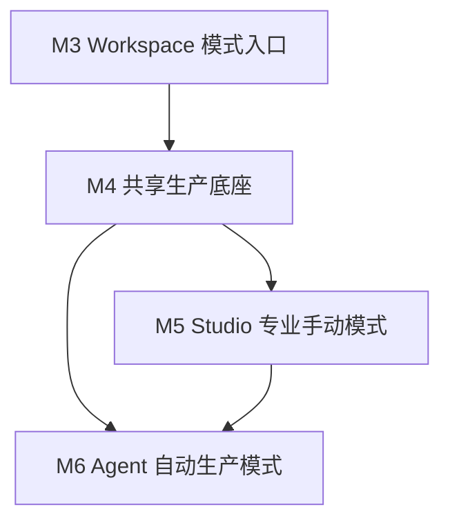

# M3-M6 Studio / Agent 生产体系路线图

**状态**：M3-M6 阶段性闭环已完成；Agent v1 三角色主链路已在此基础上继续演进
**日期**：2026-06-18；M6 状态更新于 2026-06-24；Agent v1 当前事实更新于 2026-06-27
**目标**：自底向上建设 Studio / Agent 双模式：先明确 Workspace 入口和权限边界，再建设共享生产底座，随后分别完成专业手动 Studio 和自动化 Agent 模式。

参考设计见本文末尾附录。本文只保留里程碑拆分、目标、工作项、可验收标准和 E2E 测试，不重复展开完整设计细节。

## 总体原则

1. **先入口，后能力**：先让用户明确创建的是 Studio Workspace 还是 Agent Workspace，避免后续路由和权限返工。
2. **先共享底座，后模式体验**：Studio 手动运行和 Agent 自动运行都应复用同一套节点、依赖、生成、版本、Stale、模型能力和资源存储。
3. **Studio 与 Agent 不无缝切换**：两种模式通过复制/导入衔接，避免 Agent 上下文被用户手动编辑扰乱。
4. **Agent 模式画布只读**：Agent Workspace 中用户通过对话干预，画布由 Agent 工具写入。
5. **Sandbox 是执行边界**：FFmpeg、Agent shell、Composer、Python/ImageMagick/yt-dlp 等不可预测资源消耗必须通过 Sandbox Job Service 执行，应用容器不直接执行这些命令。
6. **边做边验收**：每个里程碑都有独立可验收闭环，通过后再进入下一阶段。

## 里程碑总览

| 里程碑 | 状态 | 名称 | 核心目标 | 主要产物 |
|---|---|---|---|---|
| M3 | 已完成 | Workspace 模式入口 | 从创建入口、路由和权限上区分 Studio / Agent | `workspace.mode`、创建入口、路由分流、Agent 只读画布 |
| M4 | 已完成 | 共享生产底座 | 建立 Studio / Agent 共用的生产数据和执行链路 | 节点目标态、GenerationIntent、Provider Bridge、Sandbox Job Service、版本、Stale、失败重试、Production Read API |
| M5 | 已完成 | Studio 专业手动模式 | 让专业用户可手动创建、引用、运行和重跑节点 | 浮层 Inspector、Prompt `@`、Reference Pack、手动运行、版本/调用记录、真实 Volcengine、源素材节点、级联 Stale |
| M6 | 阶段性完成 | Agent 自动生产模式 | Producer/Craftsman/Worker/Reviewer/Composer 复用共享底座完成旧闭环 | Eino runtime、PSS、shot、HITL、Craftsman、评审重试、Composer、`/ws/agent` |
| Agent v1 | 主干已落地 | 三角色生产链路 | Producer/Craftsman/Reviewer + Worker 以创作事实源、RenderPlan、Reviewer gate 和 pending signal 驱动分镜生产 | `creative_brief`、`project_memory`、`key_element`、`scene`、`shot`、`render_plan`、`artifact_issue`、`producer_pending_signal`、语义 ObjectIndex、Agent Workbench |

---

# M3 Workspace 模式入口

**状态**：已完成（2026-06-18）

## 目标

让 Workspace 从入口开始区分 `studio` 和 `agent` 两种模式。M3 不实现完整 Agent 能力，只建立模式字段、创建入口、路由分流和最小权限边界。

完成 M3 后，用户能明确感知当前进入的是专业手动 Studio，还是对话驱动 Agent。后续 M4-M6 都以 `workspace.mode` 作为分流依据。

## 工作项

1. **数据库和类型**
   - 给 `workspace` 增加 `mode` 字段，取值 `studio` / `agent`。
   - 现有测试数据可重建，不需要复杂兼容迁移。
   - 后端 DTO、sqlc 查询、共享类型同步暴露 mode。
   - 完成记录：已新增 `006_add_workspace_mode.sql`，`CreateWorkspace` 支持写入 mode，workspace API 返回 mode。

2. **Workspace 创建入口**
   - 新建 Workspace 时选择模式。
   - 默认推荐 `studio`，但入口要明确展示两种模式。
   - Workspace 列表显示模式标签。
   - 完成记录：创建弹窗已提供 Studio / Agent 选择，列表卡片展示模式标签。

3. **前端路由分流**
   - `studio` workspace 进入现有 Studio 画布。
   - `agent` workspace 进入 Agent 工作台壳子。
   - Agent 工作台首版包含对话区域占位、只读画布区域和状态占位。
   - 完成记录：`/workspaces/:id` 会按 mode 分流到 `/studio` 或 `/agent`，错误模式路由会重定向到正确页面。

4. **模式权限边界**
   - Studio 模式允许用户创建、移动、编辑、删除节点。
   - Agent 模式禁用用户直接编辑画布。
   - 后端写接口也要校验模式：Agent 模式下用户直接发起的手动画布编辑应被拒绝或走 Agent 工具身份。
   - 完成记录：普通节点、边、分组和 camera 写接口在 Agent Workspace 下返回 `403`；canvas 读取仍允许，用于只读展示。

5. **基础导航**
   - 从列表进入 Workspace 时按 mode 跳转。
   - 错误进入不匹配路由时自动重定向或展示明确错误。
   - 完成记录：列表点击、新建成功、直接访问无后缀 URL 都会进入对应模式页面。

## 可验收标准

- 新建 Workspace 时必须选择 Studio 或 Agent。
- Workspace 列表和详情接口都能看到 mode。
- Studio Workspace 保持现有画布编辑能力。
- Agent Workspace 进入独立 Agent 页面，画布不可手动编辑。
- 用户不能通过前端或普通用户 API 绕过 mode 在 Agent Workspace 里手动写画布。
- M3 不要求 Agent 能真正生成内容。

## E2E 测试

1. **Studio 创建和进入**
   - 注册/登录。
   - 创建 Studio Workspace。
   - 进入 workspace。
   - 创建一个文本节点并移动位置。
   - 刷新页面后节点和位置仍存在。

2. **Agent 创建和进入**
   - 创建 Agent Workspace。
   - 进入 workspace。
   - 页面展示 Agent 工作台壳子。
   - 尝试通过 UI 创建或移动节点，操作不可用。

3. **权限边界**
   - 对 Agent Workspace 调用普通画布编辑 API。
   - 预期返回拒绝结果，或要求 Agent 工具身份。
   - Studio Workspace 同样 API 仍可成功。

4. **路由分流**
   - 直接访问 Studio 路由打开 Agent Workspace。
   - 预期重定向到 Agent 工作台，或展示模式不匹配错误。

## 建议验证命令

```bash
make migrate-up
make sqlc-generate
make server-test
pnpm --filter @clip-anvil/web... build
pnpm --filter @clip-anvil/web lint
git diff --check
```

## 完成记录

M3 实施范围：

- 数据库新增 `workspace_mode` enum 和 `workspace.mode`。
- Workspace 创建、列表、详情 API 均支持 mode。
- 前端创建入口支持选择 Studio / Agent。
- Workspace 列表展示模式标签。
- 新增 `/workspaces/:id/studio` 和 `/workspaces/:id/agent`。
- 新增 `/workspaces/:id` 模式分流页。
- 新增 Agent 工作台壳子，首版展示 Producer 占位和只读画布摘要。
- Studio 路由和 Agent 路由互相防错跳转。
- Agent Workspace 普通画布写接口被后端拒绝，避免绕过前端只读限制。
- `.playwright-mcp/` 已加入 `.gitignore`，避免浏览器 smoke 临时产物进入 Git。

已执行验收：

```bash
make migrate-up
make sqlc-generate
GOCACHE=/private/tmp/clipanvil-go-build make server-build
GOCACHE=/private/tmp/clipanvil-go-build make server-test
pnpm --filter @clip-anvil/web... build
pnpm --filter @clip-anvil/web lint
git diff --check
```

E2E / smoke 结果：

- API smoke 通过：Studio Workspace 可创建节点。
- API smoke 通过：Agent Workspace 的 canvas 可读。
- API smoke 通过：Agent Workspace 普通节点创建返回 `403`。
- Browser smoke 通过：Agent Workspace 直接访问 `/studio` 会重定向到 `/agent`。
- Browser smoke 通过：Studio Workspace 直接访问 `/agent` 会重定向到 `/studio`。
- Browser smoke 通过：无后缀 `/workspaces/:id` 会按 mode 分流。

---

# M4 共享生产底座

**状态**：已完成（2026-06-18）

分阶段执行计划见：[M4 Shared Production Foundation](./m4-shared-production-foundation.md)。

## 目标

建立 Studio 和 Agent 都能复用的生产核心。M4 关注数据事实和执行链路，不追求完整 Studio 体验，也不引入完整 Agent orchestration。

M4 完成后，系统已经能表达“节点输入 -> GenerationIntent -> generation job -> artifact version -> winner -> 下游 stale -> 失败记录/重试”的闭环，并把内部 FFmpeg 等不可预测执行放入 Sandbox Job Service。

## 工作项

1. **生产目标态数据库**
   - 调整 `media_node`：增加 `operation_type`、`prompt_template`、`prompt_rich`、`prompt_refs`、`model_provider`、`model_id`、`model_params`、`current_version_id`。
   - 收敛 `media_edge`：只保留 dependency 输入候选关系，不再区分 reference / sequence 等边类型。
   - 新增 `artifact_version`：记录节点每次成功运行的产物版本和 winner。
   - 新增 `generation_job`：记录每次模型调用或内部处理任务。
   - 新增 `model_provider` / `model_capability`：记录模型能力和可用 operation。
   - 新增 `reference_pack_item`：让 Reference Pack 作为 node 管理成员。

2. **GenerationIntent**
   - 定义统一的生成意图结构。
   - Studio 手动运行和 Agent Worker 都提交同一种 GenerationIntent。
   - GenerationIntent 包含 node、operation、model、prompt、显式 `@` 引用、隐式连接输入、输出约束和重试上下文。

3. **Provider Bridge**
   - 根据模型能力把 GenerationIntent 转成具体供应商请求。
   - 运行前校验模型是否支持当前 operation 和输入类型。
   - 不支持时返回结构化错误，不创建无效供应商调用。

4. **版本和 winner**
   - 每次成功运行创建 `artifact_version`。
   - `media_node.current_version_id` 指向当前 winner。
   - 支持同一节点多版本保留。
   - 后续节点默认使用上游 current winner。

5. **Stale 传播**
   - 上游节点产生新 winner 后，下游节点标记为 stale。
   - stale 不删除历史产物，只提示当前产物基于旧输入。
   - 支持查询某个节点的 stale 原因。

6. **失败记录和重试**
   - `generation_job` 持久化失败原因、供应商响应、attempt、parent_job_id。
   - 支持系统自动重试和用户手动重跑。
   - 自动重试必须有最大次数。

7. **内部媒体操作**
   - 支持 `extract_first_frame` 和 `extract_last_frame`。
   - 内部操作也创建 `generation_job` 和 `artifact_version`。
   - 背后使用 sandbox 内的 ffmpeg，不调用模型供应商。
   - 应用容器不得直接执行 ffmpeg；每次内部媒体执行都要有 `sandbox_job` 记录。

## 可验收标准

- 一个节点能创建 generation job，并在成功后生成 artifact version。
- 同一节点可以保留多个版本，且有明确 current winner。
- 上游 winner 变化会把下游标记为 stale。
- 失败 job 会落库，能看到失败原因和 attempt。
- 模型能力不匹配会在运行前被阻断。
- 内部首帧/尾帧提取走同一套 job/version 链路。

## E2E 测试

1. **文本节点运行**
   - 创建 Text Node。
   - 设置 prompt 和 model。
   - 运行节点。
   - 预期产生 `generation_job=succeeded` 和 `artifact_version`。

2. **依赖和 Stale**
   - 创建 A -> B 的 dependency。
   - 运行 A 和 B。
   - 修改并重跑 A。
   - 预期 B 被标记 stale，且 stale 原因指向 A 的新版本。

3. **模型能力阻断**
   - 选择只支持 text-to-image 的模型。
   - 对 video operation 发起运行。
   - 预期不调用供应商 API，并返回能力不支持错误。

4. **失败和重试**
   - 使用测试 provider 人为返回失败。
   - 预期 job 记录失败原因。
   - 触发重试后产生新 attempt，并保留 parent_job_id。

5. **首帧/尾帧提取**
   - 上传或生成一个 video asset。
   - 创建 image node，operation 为 `extract_first_frame`。
   - 运行后预期产生 image asset 和 artifact version。

## 建议验证命令

```bash
make migrate-up
make sqlc-generate
make server-test
pnpm --filter @clip-anvil/web... build
git diff --check
```

## 完成记录

M4 实施范围：

- 数据库和 sqlc 已支持生产节点字段、`generation_job`、`artifact_version`、`model_provider`、`model_capability`、`node_stale_reason`、`reference_pack_item`、`sandbox_job`。
- 节点运行已通过 `GenerationIntent` 和 Provider Bridge 统一进入 mock provider、Volcengine adapter boundary 或 sandbox-backed internal provider。
- 能力校验、provider 失败、内部处理失败和重试耗尽都会持久化 failed `generation_job`。
- 成功运行会创建 `media_asset`、`artifact_version`，并更新 `media_node.current_version_id`。
- 上游 winner、Reference Pack membership、Reference Pack member winner 变化会标记下游 stale，并记录可查询原因。
- `extract_first_frame` 和 `extract_last_frame` 通过 Sandbox Job Service 运行 FFmpeg，不在应用容器执行。
- Production Read API 已提供模型能力、版本、生产状态、job、sandbox job list/detail 读取能力，作为 M5 属性面板后端基础。

已执行验收：

```bash
make sqlc-generate
GOCACHE=/private/tmp/clipanvil-go-build make server-test
GOCACHE=/private/tmp/clipanvil-go-build make server-build
pnpm --filter @clip-anvil/web... build
CLIPANVIL_API_BASE=http://127.0.0.1:8891/api scripts/smoke-m4-1.sh
CLIPANVIL_API_BASE=http://127.0.0.1:8891/api scripts/smoke-m4-2.sh
CLIPANVIL_API_BASE=http://127.0.0.1:8891/api scripts/smoke-m4-3.sh
CLIPANVIL_API_BASE=http://127.0.0.1:8891/api scripts/smoke-m4-4.sh
CLIPANVIL_API_BASE=http://127.0.0.1:8891/api scripts/smoke-m4-5.sh
CLIPANVIL_API_BASE=http://127.0.0.1:8891/api scripts/smoke-m4-6.sh
rg -n 'exec\.Command|os/exec' apps/server/internal
git diff --check
```

E2E / smoke 结果：

- M4.1 smoke 通过：Text Node 可生成 job、version 和 current winner。
- M4.2 smoke 通过：GenerationIntent、Provider Bridge 和缺失真实 provider key 的失败落库可用。
- M4.3 smoke 通过：capability mismatch、provider failure、retry chain 可追溯。
- M4.4 smoke 通过：input hash 和 stale propagation 可用。
- M4.5 smoke 通过：Reference Pack、内部首帧/尾帧提取、sandbox-backed FFmpeg 成功和失败路径可用。
- M4.6 smoke 通过：capability、versions、production state、job detail、sandbox job list/detail 读接口可用。

---

# M5 Studio 专业手动模式

**状态**：已完成（2026-06-21）

分阶段设计与工作项见：[M5 Studio Manual Production](../archive/superpowers/specs/2026-06-18-m5-studio-manual-production-design.md)。

## 目标

把 Studio 做成专业用户可手动使用的生产工具。用户可以在画布上组织素材、创建节点、连线、在 Prompt 中 `@` 引用依赖、选择模型、运行节点、查看版本、处理 stale 和重试。

完成 M5 后，Studio 可以独立完成“素材 -> 参考包 -> 图片/视频生成 -> 手动级联重跑”的生产闭环。

## 工作项

1. **节点类型体验**
   - 支持 `text`、`image`、`video`、`audio`、`reference_pack`。
   - 不同 node type 有不同预览、空状态、运行状态和失败状态。
   - 节点输出就是该节点的 current winner。

2. **属性面板**
   - 按 node type / operation type 展示不同字段。
   - 支持 prompt、模型、参数、输入引用、版本列表、失败原因。
   - 避免把复杂配置都塞进节点卡片。

3. **Prompt `@` 引用**
   - 用户通过手动连线建立候选输入。
   - Prompt 编辑器中 `@` 菜单优先展示已连入节点。
   - `@` 写入 `media_node.prompt_refs`。
   - 有连线但未 `@` 的输入作为隐式参考，UI 提示“有未在 Prompt 中引用的资源”。

4. **Reference Pack**
   - Reference Pack 是一种 node，不是普通 group。
   - Pack 成员只能是已有 node，不能直接混入 raw asset。
   - Pack membership 不等于 dependency。
   - 其他节点可以 dependency 到整个 Reference Pack。

5. **手动运行和版本管理**
   - 用户可以运行单个节点。
   - 运行中展示 progress。
   - 成功后更新预览和版本列表。
   - 失败后展示错误，可手动重跑。

6. **级联 Stale 处理**
   - 下游 stale 在画布和属性面板可见。
   - 用户可以逐个重跑 stale 节点。
   - 首版不需要自动批量级联重跑，但要保留后续扩展入口。

7. **模型选择**
   - 用户可以手动选择模型。
   - UI 根据 `model_capability` 禁用不兼容 operation。
   - 价格、速度等信息可以先手动配置，优先级低于能力正确性。

## 可验收标准

- 用户能创建多类型节点并看到正确预览。
- 用户能通过连线和 Prompt `@` 组合控制输入。
- 未 `@` 的连入资源不会静默消失，UI 会提示它是隐式参考。
- Reference Pack 可以被创建、显示、添加/移除成员，并整体作为输入候选。
- 单节点运行能产生版本，失败能重跑。
- 上游变化后下游 stale 在 UI 中清晰可见。

## 完成记录

- Studio 画布已支持文本、图片、视频、音频、Reference Pack 和用户源素材节点。
- 右侧常驻 Inspector 已收敛为节点附近的浮层 Inspector，核心区域聚焦 Prompt、模型、参数和运行；标题可在顶部编辑，版本/调用记录进入版本详情。
- 文本节点支持 Markdown 摘要预览；图片节点按原始比例自适应；图片/视频/文本素材支持全屏预览。
- 手动运行会立即创建 `generation_job(status=queued)` 和 `artifact_version(status=queued)`，版本和运行记录一一绑定；运行中、成功、失败状态会同步到画布和 Inspector。
- Prompt `@` 引用已支持内联编辑器和 Inspector：文本依赖渲染进 `rendered_prompt`，图片/视频依赖以 `图1`、`图2` 等可读占位进入 prompt，并作为 provider input refs 传入模型；失效引用会阻断运行。
- Reference Pack 已作为一等节点支持成员管理、画布预览、整体作为输入、成员变化触发下游 stale；参考包不能把自身成员反向作为自己的输入。
- 用户源素材节点已落地：手动文本、上传图片/视频/音频不展示模型运行入口，但可作为普通依赖或 Reference Pack 成员。
- 真实 provider 已接入：mock provider 保留本地测试；Volcengine/Doubao 文本、图片、视频模型可真实运行；音频生成模型暂 hold。
- Volcengine 输入媒体通过 TOS 暂存，生成图片/视频远程 URL 会由 sandbox 下载并存入 MinIO，最终画布和版本引用 ClipAnvil 自有资产。
- 已通过 mock provider、真实 provider 和浏览器 E2E 验证 Reference Pack / Prompt `@` / stale / 版本 / 源素材等核心闭环。

## E2E 测试

1. **商品参考包**
   - 上传商品图，创建 Image Node A。
   - 创建 Image Node B，依赖 A，prompt 中 `@A` 生成九宫格商品多角度图。
   - 创建 Reference Pack P，把 A 和 B 加入 P。
   - 创建 Image Node C，依赖 P，生成广告主视觉。
   - 预期 C 的运行输入包含 P 当前成员的 winner。

2. **隐式参考提示**
   - 创建 A -> B dependency。
   - B 的 prompt 不写 `@A`。
   - 运行前 UI 提示 A 是未在 Prompt 中引用的隐式参考。
   - 若模型支持参考图，A 被作为普通参考输入；若不支持，运行前阻断。

3. **删除依赖**
   - B prompt 中包含 `@A`。
   - 删除 A -> B 连线。
   - 预期 B 的 `@A` 标记失效或被提示修复。
   - B 不能带着无效引用成功运行。

4. **Stale 重跑**
   - A -> B -> C。
   - 全部运行成功。
   - 重跑 A。
   - B 和 C 标记 stale。
   - 手动重跑 B 后，C 仍 stale。
   - 手动重跑 C 后 stale 清除。

5. **视频首帧提取**
   - 上传 video。
   - 创建 image node，operation 为 `extract_first_frame`。
   - 运行后画布显示提取出的图片。
   - 验证抽帧对应的 `sandbox_job` 成功，且应用进程未本地执行 ffmpeg。

6. **真实 Volcengine 图片/视频**
   - 配置 Volcengine API key 和 TOS。
   - 文本节点生成脚本。
   - 图片节点 `@` 文本节点生成图片。
   - 视频节点 `@` 文本节点和图片节点生成视频。
   - 预期 `rendered_prompt` 可追溯，图片/视频输入进入 provider request，远程产物被 sandbox 下载到 MinIO。

7. **用户源素材**
   - 拖拽上传商品图或视频到画布。
   - 预期创建源素材节点，不展示运行按钮。
   - 将源素材加入 Reference Pack，或被下游节点 `@` 引用。
   - 预期下游 provider input refs 使用该素材资产。

## 建议验证命令

```bash
make server-test
pnpm --filter @clip-anvil/web... build
pnpm --filter @clip-anvil/web lint
git diff --check
```

---

# M6 Agent 自动生产模式

**状态**：阶段性完成（2026-06-24）；当前主线已演进为三 Agent v1（2026-06-27）

> 本节记录 M6 原始里程碑目标和完成记录。当前代码事实以 Producer / Craftsman / Reviewer 三角色主链路为准：Producer 维护创作事实源并决策 RenderPlan，Craftsman 写 RenderPlan，Worker 执行 production，Reviewer 写 review/issue，Producer pending signal 唤醒下一轮决策。

## 目标

建设完整 Agent 模式。Producer 面向用户对话，规划分镜并调度 Craftsman、Worker、Composer；Craftsman 负责单个分镜的有状态创意执行；Worker 复用 M4 的 GenerationIntent 进行一次性生成；Composer 完成成片合成。

完成 M6 后，用户可以在 Agent Workspace 中通过对话从商品素材和目标平台出发，生成分镜、预览图、视频片段和成片，并能在关键点通过卡片或自然语言干预。

## 工作项

1. **Agent runtime 存储**
   - 新增 `agent_thread`。
   - 新增 `agent_message`。
   - 新增 `eino_checkpoint`。
   - 新增 `agent_task`。
   - 新增 `agent_event`。
   - Eino Memory / Session 由 ClipAnvil 自行持久化。
   - Eino Interrupt / Resume 通过自建 CheckPointStore 恢复。

2. **对话面板**
   - Agent Workspace 提供 Producer 对话面板。
   - 支持用户消息、Assistant 消息、工具调用结果和 UI 卡片消息。
   - 支持 WebSocket 或事件通道推送增量状态。

3. **HITL 决策工具**
   - `request_user_decision` 是 Producer 工具，不是固定 workflow 卡点。
   - 工具触发 Eino stateful interrupt。
   - 写入 `eino_checkpoint`、`agent_event(decision_requested)`、`agent_message(ui_card)`。
   - 用户点击卡片或自然语言回复后写入 `decision_resolved` 并 resume。

4. **Memory 和 PSS**
   - 新增 `memory_document` 和 `memory_revision`。
   - Workspace Memory 保存商品、品牌、创意方向、受众、脚本和 notes。
   - PSS 从 DB 事实源构建成自然语言。
   - Producer PSS 看全局；Craftsman Scoped PSS 只看自身 shot 子图和必要素材。

5. **Storyboard**
   - 新增 `shot` 和 `shot_dependency`。
   - Producer 通过 `update_storyboard` 工具创建/修改/删除/重排分镜。
   - 分镜是 Agent 模式的生产语义，不是 Studio 必备节点。
   - 用户说“第二个分镜重做”时必须能稳定解析到 shot id。

6. **Craftsman 和 Worker**
   - 每个 shot 绑定一个持久 Craftsman thread。
   - Producer dispatch Craftsman。
   - Craftsman 生成策略和 prompt。
   - Worker 执行一次 GenerationIntent。
   - 生成结果写入共享 `generation_job` / `artifact_version`。
   - Worker 需要 shell、脚本或内部媒体处理时，只能通过 Sandbox Job Service。

7. **评审和重试**
   - 通用评审轴：proportion、physics、style、visual_quality。
   - 营销评审轴：product_visibility、selling_power、platform_fit。
   - 任一轴过低则 reject。
   - Craftsman 根据 critique 改写，最多重试 3 次。
   - 评审记录落库，失败原因可追溯。

8. **跨分镜依赖调度**
   - Producer 在 storyboard 阶段写入 `shot_dependency`。
   - 支持连续性、同主体一致性、资源复用、节奏依赖等多种依赖类型。
   - 有阻塞依赖的 shot 等上游完成后再 dispatch。
   - 无阻塞依赖的 shot 可以并行。

9. **视频生成和成片合成**
   - 预览图确认后生成视频。
   - 视频也走 GenerationIntent 和版本链路。
   - Composer 使用已确认视频和音频合成成片。
   - 成片版本也可被确认或重做。
   - Composer 的 FFmpeg 合成命令必须在 sandbox 内执行，并写入 `sandbox_job`。

10. **Studio / Agent 复制导入**
    - Agent -> Studio：复制完整 Workspace 内容到新的 Studio Workspace。
    - Studio -> Agent：复制到新的 Agent Workspace，并调用模型理解 Studio 当前状态，生成初始 Memory / PSS 摘要。
    - 不做原地无缝切换。

## 可验收标准

- Producer 能通过对话创建 storyboard，并持久化 shot。
- PSS 能自然语言描述当前 workspace、shots、节点、版本和任务状态。
- `request_user_decision` 能中断 Agent，等待用户选择后 resume。
- 每个 shot 有稳定 Craftsman thread，并能跨重试保留决策链。
- 预览图生成复用 M4 的 generation job/version 链路。
- 失败、评审、重试和 winner 可追溯。
- 跨分镜依赖能阻止错误并行。
- Composer 能基于已确认视频生成成片。
- Agent 模式中用户不能直接编辑画布。

## E2E 测试

1. **从需求到分镜**
   - 创建 Agent Workspace。
   - 上传商品图。
   - 用户输入商品卖点、目标平台和风格。
   - Producer 生成脚本和 storyboard。
   - 调用 `update_storyboard` 写入 shots。
   - PSS 显示所有 shots。

2. **分镜确认 HITL**
   - Producer 调用 `request_user_decision`。
   - 对话面板显示确认卡片。
   - 用户选择“确认并生成预览图”。
   - 后端 resume Producer。
   - Producer dispatch Craftsman。

3. **预览图生成和评审重试**
   - Craftsman 为每个 shot 生成预览图。
   - Worker 创建 generation job。
   - 评审失败时 Craftsman 改写并重试。
   - 最终 winner 写入 artifact version。

4. **用户指定分镜重做**
   - 用户说“第二个分镜颜色太冷，重做”。
   - Producer 从 PSS 解析到 shot-02。
   - 复用 shot-02 Craftsman thread。
   - 新版本生成后替换 winner，下游相关节点 stale。

5. **跨分镜连续性**
   - Producer 创建 shot-02 依赖 shot-01 尾帧的 storyboard。
   - 调度时 shot-02 等待 shot-01 完成。
   - 系统提取 shot-01 尾帧，作为 shot-02 输入。
   - shot-02 生成成功。

6. **成片合成**
   - 所有视频片段完成。
   - Composer 合成成片。
   - 用户通过卡片确认成片或要求修改。

7. **Agent -> Studio**
   - 在 Agent Workspace 中完成一个视频草案。
   - 复制为 Studio Workspace。
   - Studio Workspace 中用户可手动编辑节点。
   - 原 Agent Workspace 的上下文不被 Studio 手动编辑污染。

8. **Studio -> Agent**
   - 在 Studio 中手动搭建若干节点和依赖。
   - 导入为新的 Agent Workspace。
   - 系统调用模型理解 Studio 当前状态。
   - Agent Workspace 生成初始 Memory 和 PSS。

## 建议验证命令

```bash
make migrate-up
make sqlc-generate
make server-test
pnpm --filter @clip-anvil/web... build
pnpm --filter @clip-anvil/web lint
scripts/smoke-m6-6-preview-closure.sh
scripts/smoke-m6-7-review-retry-scheduler.sh
scripts/smoke-m6-8-video-composer.sh
scripts/smoke-m6-9-ux-completion.sh
git diff --check
```

## 完成记录

- 数据库已推进到 `030_agent_semantic_identity.sql`。除 `agent_thread`、`agent_message`、`agent_task`、`agent_event`、`eino_checkpoint`、`shot`、`shot_dependency`、`review_record` 外，当前还包括 `creative_brief`、`project_memory`、`key_element`、`key_element_state`、`scene`、`shot_key_element`、`render_plan`、`artifact_issue`、`producer_pending_signal` 和 `agent_object_index`。
- 后端已注册 `/api/agent/workspaces/:workspaceID/...` 系列 API 和 `/ws/agent`，支持对话消息、附件、模型选择、生产概览、HITL 决策响应和 Agent 事件推送。
- Agent runtime 已使用 Eino native checkpoint/resume。Producer、Craftsman、Reviewer 当前都是 Eino-native tool loop；Composer 代码仍保留，但不是三 Agent v1 主角色。
- Producer native tools 已切换为 `read_project_context`、`upsert_project_brief`、`update_project_memory`、`upsert_key_elements`、`upsert_storyboard`、`dispatch_craftsman`、`decide_render_plan`、`dispatch_reviewer` 和 `request_user_decision`。
- Craftsman/Worker 已复用 M4 生产底座生成预览图和分镜视频；Reviewer 通过 `submit_review_result` 写入 `review_record` / `artifact_issue`；Worker/Reviewer/Craftsman 结果通过 `producer_pending_signal` 唤醒 Producer。
- 前端 Agent Workspace 已从旧只读媒体画布演进为 Agent Workbench，按 overview、scene、shot、artifact、review/issue 组织制作过程，并保留对话面板、流式消息、附件上传、模型选择、决策卡、线程观察和任务状态。
- 仍未收口：Studio/Agent 复制导入、长期 Skill 配置化、生产级并发/成本策略、完整音频生成链路、TimelinePlan/商业级 Composer、Seedance 首尾帧/视频/音频参考深度支持和更多真实 provider 的端到端回归。

---

# 里程碑间依赖



说明：

- M3 是入口和权限基础，必须先做。
- M4 是 M5/M6 的共同底座，已完成；M5/M6 后续应复用 M4 的生产链路和 Sandbox Job Service。
- M5 可以先于 M6 完成，因为 Studio 是验证共享生产底座最直接的手动界面。
- M6 复用 M4 的生产链路，也借鉴 M5 的节点、版本和 Reference Pack 交互；后续工作应继续围绕复制导入、长期记忆、Skill 配置化和生产级稳定性展开。

# 附录：设计文档

以下设计稿是本路线图的详细背景材料。实现时以 milestone 和当前工程文档为入口，再回看这些设计稿补充细节。

- [MultiAgent Agent Mode 设计方案](../archive/superpowers/specs/2026-06-18-multiagent-agent-mode-design.md)
- [Studio / Agent 共享生产设计](../archive/superpowers/specs/2026-06-18-studio-agent-shared-production-design.md)
- [Studio / Agent 生产底层数据库技术方案](../archive/superpowers/specs/2026-06-18-production-database-technical-design.md)
