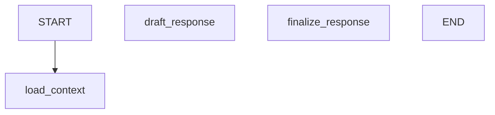

# M6 Eino Native Checkpoint / Resume Implementation Plan

> **For agentic workers:** REQUIRED SUB-SKILL: Use superpowers:subagent-driven-development (recommended) or superpowers:executing-plans to implement this plan task-by-task. Steps use checkbox (`- [ ]`) syntax for tracking.

**Goal:** Refactor M6 MultiAgent execution so Producer, Craftsman, Reviewer, and Composer use Eino native `CheckPointStore`, deterministic `WithCheckPointID`, native interrupt/resume, and deterministic GraphInfo export, while ClipAnvil DB continues to own long-term conversation and production facts.

**Architecture:** Add a shared `internal/agent/einoruntime` package for checkpoint keys, DB-backed Eino checkpoint store, graph run options, and GraphInfo export. Wire that package into all Eino Graph constructors and executors. Convert Producer HITL from manual “tool result says interrupted” behavior to Eino `StatefulInterrupt` plus resume through the original checkpoint key. Keep `decision_resume` as an audit task linked to the original `producer_turn`.

**Tech Stack:** Go 1.26, CloudWeGo Eino `compose`, Eino tool components, Hertz API handlers, pgx/sqlc, existing `agent_task` / `agent_message` / `agent_event` / `eino_checkpoint` tables.

---

## Implementation Decisions

- Use deterministic checkpoint IDs in the form `agent:eino:<graph_name>:<workspace_id>:<thread_id>:<task_id>`.
- Do not use a compile-time scoped checkpoint store. Graphs are compiled at server startup, so the Eino store must parse workspace/thread/task from the runtime checkpoint ID on every `Set`.
- Preserve `agent_message` as the source of conversation history. Eino checkpoints store graph execution state only.
- Preserve `agent_task` lifecycle and WebSocket events. Eino callbacks do not replace task persistence.
- Keep `decision_resume` as a separate audit task. The original `producer_turn` remains the owner of the checkpointed Graph run and final output.
- Use Eino tool interrupt primitives for `request_user_decision`: `github.com/cloudwego/eino/components/tool.StatefulInterrupt`.
- Keep Worker outside Eino Graph for this refactor.
- Export GraphInfo to `docs/superpowers/graphs/` for dev/test inspection. Do not add a runtime debug API in this pass.

## Task 1: Add Shared Eino Runtime Package

**Files**

- Add `apps/server/internal/agent/einoruntime/checkpoint_key.go`
- Add `apps/server/internal/agent/einoruntime/checkpoint_store.go`
- Add `apps/server/internal/agent/einoruntime/checkpoint_store_test.go`
- Add `apps/server/internal/agent/einoruntime/run_options.go`
- Add `apps/server/internal/agent/einoruntime/run_options_test.go`

**Behavior**

- Implement:

```go
const CheckpointKeyPrefix = "agent:eino"

type CheckpointScope struct {
    GraphName   string
    WorkspaceID pgtype.UUID
    ThreadID    pgtype.UUID
    TaskID      pgtype.UUID
}

func CheckpointKey(graphName string, workspaceID, threadID, taskID pgtype.UUID) string
func ParseCheckpointKey(key string) (CheckpointScope, bool)
```

- Implement a DB-backed Eino store:

```go
type CheckpointRuntime interface {
    UpsertCheckpoint(ctx context.Context, input agentruntime.UpsertCheckpointInput) (db.EinoCheckpoint, error)
    GetCheckpoint(ctx context.Context, key string) (db.EinoCheckpoint, bool, error)
    DeleteCheckpoint(ctx context.Context, key string) error
}

type CheckpointStore struct {
    runtime CheckpointRuntime
    logger  *slog.Logger
}

func NewCheckpointStore(runtime CheckpointRuntime, logger *slog.Logger) *CheckpointStore
func (s *CheckpointStore) Get(ctx context.Context, checkPointID string) ([]byte, bool, error)
func (s *CheckpointStore) Set(ctx context.Context, checkPointID string, checkPoint []byte) error
func (s *CheckpointStore) Delete(ctx context.Context, checkPointID string) error
```

- `Set` must parse `checkPointID` and write:
  - `workspace_id`, `thread_id`, `task_id` from parsed key.
  - raw Eino checkpoint bytes into `value`.
  - metadata:

```json
{
  "source": "eino_native",
  "graph_name": "<graph>",
  "checkpoint_key": "<key>",
  "checkpoint_version": 1
}
```

- Invalid checkpoint IDs return a typed error containing code `invalid_eino_checkpoint_key`.
- `Get` returns raw bytes without interpreting the blob.
- Existing `apps/server/internal/agent/hitl/checkpoint_store.go` should remain untouched until Producer HITL is migrated, then either removed or reduced to a compatibility wrapper if no references remain.

**Tests First**

- `TestCheckpointKeyRoundTripScope`
- `TestParseCheckpointKeyRejectsMalformedKeys`
- `TestCheckpointStoreSetParsesScopeAndStoresRawBlob`
- `TestCheckpointStoreGetReturnsRawBlob`
- `TestCheckpointStoreDeleteDelegatesRuntime`

**Verification**

```bash
GOCACHE=/private/tmp/clipanvil-go-build go test ./internal/agent/einoruntime -run 'TestCheckpoint' -count=1
```

## Task 2: Add Eino Run Options and Resume Helpers

**Files**

- Continue in `apps/server/internal/agent/einoruntime/run_options.go`
- Continue in `apps/server/internal/agent/einoruntime/run_options_test.go`

**Behavior**

- Implement a shared runtime option model:

```go
type RunOptions struct {
    CheckPointID string
    ForceNewRun  bool
    ResumeData   map[string]any
}

func ApplyRunOptions(ctx context.Context, options RunOptions) (context.Context, []compose.Option)
```

- Mapping:
  - `CheckPointID` -> `compose.WithCheckPointID(options.CheckPointID)`
  - `ForceNewRun` -> `compose.WithForceNewRun()`
  - `ResumeData` -> `compose.BatchResumeWithData(ctx, options.ResumeData)`

- Add helper:

```go
func ResumeDecisionData(eventID pgtype.UUID, selectedOptionID string, freeText string) map[string]any
```

The helper must produce stable keys:

```json
{
  "decision_event_id": "...",
  "selected_option_id": "...",
  "free_text": "..."
}
```

**Tests First**

- `TestApplyRunOptionsAddsCheckpointOption`
- `TestApplyRunOptionsAppliesBatchResumeData`
- `TestResumeDecisionDataUsesStableKeys`

**Verification**

```bash
GOCACHE=/private/tmp/clipanvil-go-build go test ./internal/agent/einoruntime -run 'TestApplyRunOptions|TestResumeDecisionData' -count=1
```

## Task 3: Add GraphInfo Capture and Mermaid Export

**Files**

- Add `apps/server/internal/agent/einoruntime/graph_info.go`
- Add `apps/server/internal/agent/einoruntime/graph_info_test.go`
- Add `apps/server/internal/agent/einoruntime/graph_dump_test.go`
- Add generated graph files under `docs/superpowers/graphs/`

**Behavior**

- Implement:

```go
type GraphInfoRegistry struct {
    mu     sync.Mutex
    graphs map[string]*compose.GraphInfo
}

func NewGraphInfoRegistry() *GraphInfoRegistry
func (r *GraphInfoRegistry) CompileCallback() compose.GraphCompileCallback
func (r *GraphInfoRegistry) Get(graphName string) (*compose.GraphInfo, bool)
func (r *GraphInfoRegistry) Mermaid(graphName string) (string, error)
func (r *GraphInfoRegistry) JSON() ([]byte, error)
```

- Mermaid output must be deterministic:



- Add a test helper that compiles Producer, Craftsman, Reviewer, and Composer with fake dependencies where needed and writes:
  - `docs/superpowers/graphs/producer_turn.mmd`
  - `docs/superpowers/graphs/craftsman_generation.mmd`
  - `docs/superpowers/graphs/reviewer_preview.mmd`
  - `docs/superpowers/graphs/composer_final.mmd`
  - `docs/superpowers/graphs/graph-info.json`

- The graph dump test should run only when explicitly enabled:

```bash
CLIPANVIL_DUMP_AGENT_GRAPHS=1 GOCACHE=/private/tmp/clipanvil-go-build go test ./internal/agent/einoruntime -run TestDumpAgentGraphInfo -count=1
```

**Tests First**

- `TestGraphInfoMermaidIsDeterministic`
- `TestGraphInfoJSONIncludesGraphNames`
- `TestDumpAgentGraphInfoRequiresEnvFlag`

**Verification**

```bash
GOCACHE=/private/tmp/clipanvil-go-build go test ./internal/agent/einoruntime -run 'TestGraphInfo|TestDumpAgentGraphInfoRequiresEnvFlag' -count=1
CLIPANVIL_DUMP_AGENT_GRAPHS=1 GOCACHE=/private/tmp/clipanvil-go-build go test ./internal/agent/einoruntime -run TestDumpAgentGraphInfo -count=1
```

## Task 4: Wire Native CheckPointStore Into All Graph Compiles

**Files**

- Update `apps/server/internal/agent/producer/graph.go`
- Update `apps/server/internal/agent/craftsman/graph.go`
- Update `apps/server/internal/agent/reviewer/graph.go`
- Update `apps/server/internal/agent/composer/graph.go`
- Update related graph tests in each package.

**Behavior**

- Extend each Graph config:

```go
type GraphConfig struct {
    ...
    CheckPointStore compose.CheckPointStore
    CompileCallbacks []compose.GraphCompileCallback
}
```

- Compile with:

```go
compileOptions := []compose.GraphCompileOption{
    compose.WithGraphName("<graph_name>"),
}
if config.CheckPointStore != nil {
    compileOptions = append(compileOptions, compose.WithCheckPointStore(config.CheckPointStore))
}
if len(config.CompileCallbacks) > 0 {
    compileOptions = append(compileOptions, compose.WithGraphCompileCallbacks(config.CompileCallbacks...))
}
runnable, err := g.Compile(context.Background(), compileOptions...)
```

- Refactor each Graph `Run` signature:

```go
Run(ctx context.Context, input GraphInput, options einoruntime.RunOptions) (GraphOutput, error)
```

- Inside `Run`, call `einoruntime.ApplyRunOptions`.

**Tests First**

- Producer: `TestProducerGraphCompileCapturesGraphInfo`
- Craftsman: `TestCraftsmanGraphCompileCapturesGraphInfo`
- Reviewer: `TestReviewerGraphCompileCapturesGraphInfo`
- Composer: `TestComposerGraphCompileCapturesGraphInfo`
- For each graph, assert expected node names are present in captured GraphInfo.

**Verification**

```bash
GOCACHE=/private/tmp/clipanvil-go-build go test ./internal/agent/producer -run 'TestProducerGraphCompileCapturesGraphInfo' -count=1
GOCACHE=/private/tmp/clipanvil-go-build go test ./internal/agent/craftsman -run 'TestCraftsmanGraphCompileCapturesGraphInfo' -count=1
GOCACHE=/private/tmp/clipanvil-go-build go test ./internal/agent/reviewer -run 'TestReviewerGraphCompileCapturesGraphInfo' -count=1
GOCACHE=/private/tmp/clipanvil-go-build go test ./internal/agent/composer -run 'TestComposerGraphCompileCapturesGraphInfo' -count=1
```

## Task 5: Wire Checkpoint IDs Through Executors and Server Startup

**Files**

- Update `cmd/server/main.go`
- Update `apps/server/internal/agent/producer/executor.go`
- Update `apps/server/internal/agent/craftsman/executor.go`
- Update `apps/server/internal/agent/reviewer/executor.go`
- Update `apps/server/internal/agent/composer/executor.go`
- Update executor tests in each package.

**Behavior**

- In server startup, construct one shared store:

```go
agentEinoCheckpointStore := einoruntime.NewCheckpointStore(agentRuntime, logger.With("component", "eino_checkpoint_store"))
agentGraphInfoRegistry := einoruntime.NewGraphInfoRegistry()
```

- Pass the checkpoint store and compile callback to Producer, Craftsman, Reviewer, Composer graph constructors.
- Each executor computes a checkpoint key from its workspace/thread/task and calls Graph `Run` with:

```go
einoruntime.RunOptions{
    CheckPointID: einoruntime.CheckpointKey("<graph_name>", workspaceID, threadID, taskID),
}
```

- On normal Graph completion, update `agent_thread.current_checkpoint_key` to the checkpoint key for that task.
- On task failure, keep the checkpoint row for debugging if Eino wrote one.
- Replace existing ad hoc checkpoint snapshot writes inside Graph nodes with explicit audit events where they are not needed for resume.

**Tests First**

- Producer: `TestProducerExecutorPassesDeterministicCheckpointID`
- Craftsman: `TestCraftsmanExecutorPassesDeterministicCheckpointID`
- Reviewer: `TestReviewerExecutorPassesDeterministicCheckpointID`
- Composer: `TestComposerExecutorPassesDeterministicCheckpointID`
- Runtime: `TestThreadCurrentCheckpointKeyUpdatedAfterGraphRun`

**Verification**

```bash
GOCACHE=/private/tmp/clipanvil-go-build go test ./internal/agent/producer -run 'TestProducerExecutorPassesDeterministicCheckpointID' -count=1
GOCACHE=/private/tmp/clipanvil-go-build go test ./internal/agent/craftsman -run 'TestCraftsmanExecutorPassesDeterministicCheckpointID' -count=1
GOCACHE=/private/tmp/clipanvil-go-build go test ./internal/agent/reviewer -run 'TestReviewerExecutorPassesDeterministicCheckpointID' -count=1
GOCACHE=/private/tmp/clipanvil-go-build go test ./internal/agent/composer -run 'TestComposerExecutorPassesDeterministicCheckpointID' -count=1
```

## Task 6: Convert Producer HITL to Native Eino Interrupt

**Files**

- Update `apps/server/internal/agent/producer/eino_tool_adapter.go`
- Update `apps/server/internal/agent/hitl/tool_requester.go`
- Update `apps/server/internal/agent/hitl/service.go`
- Update `apps/server/internal/agent/tools/decision.go`
- Update `apps/server/internal/agent/producer/executor.go`
- Add or update related tests.

**Behavior**

- `request_user_decision` still persists the user-facing decision card through `agent_message`.
- The tool requester persists `decision_requested`, marks the original task `waiting_for_user`, and stores checkpoint metadata in the decision event payload:

```json
{
  "checkpoint_key": "agent:eino:producer_turn:<workspace>:<thread>:<task>",
  "original_task_id": "...",
  "decision_event_id": "...",
  "tool_call_id": "...",
  "options": [...]
}
```

- The Eino tool adapter sees `ExecuteOutput.Interrupted == true` and calls:

```go
return "", einotool.StatefulInterrupt(ctx, interruptInfo, interruptState)
```

using `github.com/cloudwego/eino/components/tool` imported as `einotool`.

- `interruptState` must include:
  - `decision_event_id`
  - `checkpoint_key`
  - `tool_name`
  - `tool_call_id`
  - `arguments`

- `runProducerLoop` must stop converting interrupted tool results into normal assistant text. An Eino interrupt should flow out as a graph interrupt error and be handled by the executor/API layer.
- The executor classifies the interrupt as expected HITL pause:
  - original producer task status becomes `waiting_for_user`;
  - no final assistant response is generated;
  - `graph_interrupted` event is persisted;
  - WebSocket broadcasts the existing card and task state.

**Tests First**

- `TestEinoProducerToolAdapterRaisesStatefulInterruptForDecision`
- `TestProducerExecutorMarksTaskWaitingForNativeInterrupt`
- `TestProducerLoopDoesNotEmitFallbackTextForInterrupt`
- `TestDecisionRequestedEventStoresCheckpointKey`

**Verification**

```bash
GOCACHE=/private/tmp/clipanvil-go-build go test ./internal/agent/producer -run 'TestEinoProducerToolAdapterRaisesStatefulInterruptForDecision|TestProducerExecutorMarksTaskWaitingForNativeInterrupt|TestProducerLoopDoesNotEmitFallbackTextForInterrupt' -count=1
GOCACHE=/private/tmp/clipanvil-go-build go test ./internal/agent/hitl -run 'TestDecisionRequestedEventStoresCheckpointKey' -count=1
```

## Task 7: Resume ProducerGraph From Decision Responses

**Files**

- Update `apps/server/internal/api/agent_handler.go`
- Update `apps/server/internal/agent/hitl/service.go`
- Update `apps/server/internal/agent/producer/executor.go`
- Update `apps/server/internal/agent/producer/types.go`
- Update API and producer tests.

**Behavior**

- Keep `RespondDecision` creating a `decision_resume` task.
- Add the original checkpoint key and original task ID to `decision_resume` input:

```json
{
  "decision_event_id": "...",
  "resolved_event_id": "...",
  "original_task_id": "...",
  "checkpoint_key": "agent:eino:producer_turn:<workspace>:<thread>:<task>",
  "selected_option_id": "...",
  "free_text": "..."
}
```

- Extend Producer runner input:

```go
type RunTaskInput struct {
    WorkspaceID        pgtype.UUID
    ThreadID           pgtype.UUID
    TaskID             pgtype.UUID
    TriggerMessageID   pgtype.UUID
    ResumeCheckpointID string
    ResumeData         map[string]any
    OriginalTaskID     pgtype.UUID
}
```

- For normal turns, `ResumeCheckpointID` is empty and the executor computes the checkpoint ID from the current task.
- For `decision_resume`, executor uses `ResumeCheckpointID` and applies `einoruntime.ResumeDecisionData(...)` via `BatchResumeWithData`.
- After successful resume:
  - original `producer_turn` status becomes `succeeded`;
  - `decision_resume` status becomes `succeeded`;
  - `graph_resumed` event is persisted;
  - final assistant output is attached to the original producer run context while the resume task remains visible in the timeline.
- If checkpoint is missing:
  - `decision_resume` fails with `eino_checkpoint_missing`;
  - original `producer_turn` remains `waiting_for_user` or transitions to `failed` with a recoverable error event;
  - no fresh Producer turn is started silently.
- Duplicate decision handling remains idempotent for the same response and rejects conflicting responses.

**Tests First**

- `TestAgentDecisionResumesOriginalCheckpoint`
- `TestAgentNaturalTextDecisionResumesOriginalCheckpoint`
- `TestAgentDecisionResumeMissingCheckpointFailsStructured`
- `TestDuplicateDecisionDoesNotResumeTwice`
- `TestHistoricalMessagesStillLoadedFromAgentMessagesOnResume`

**Verification**

```bash
GOCACHE=/private/tmp/clipanvil-go-build go test ./internal/api -run 'TestAgentDecisionResumesOriginalCheckpoint|TestAgentNaturalTextDecisionResumesOriginalCheckpoint|TestAgentDecisionResumeMissingCheckpointFailsStructured|TestDuplicateDecisionDoesNotResumeTwice' -count=1
GOCACHE=/private/tmp/clipanvil-go-build go test ./internal/agent/producer -run 'TestHistoricalMessagesStillLoadedFromAgentMessagesOnResume' -count=1
```

## Task 8: Add Observability for Checkpoint and Resume

**Files**

- Update `apps/server/internal/agent/einoruntime/checkpoint_store.go`
- Update `apps/server/internal/agent/producer/executor.go`
- Update `apps/server/internal/agent/craftsman/executor.go`
- Update `apps/server/internal/agent/reviewer/executor.go`
- Update `apps/server/internal/agent/composer/executor.go`
- Update runtime event constants if they are centralized.

**Behavior**

- Add structured logs with:
  - `graph_name`
  - `checkpoint_key`
  - `workspace_id`
  - `thread_id`
  - `task_id`
  - `interrupt_id`
  - `resume_data_keys`
  - `error_code`
- Persist Agent events:
  - `graph_checkpoint_written`
  - `graph_interrupted`
  - `graph_resumed`
  - `graph_resume_failed`
- Event payloads must not contain full prompt text, full model output, user-uploaded file contents, or sensitive provider payloads.

**Tests First**

- `TestCheckpointStoreLogsWriteFailureWithScope`
- `TestProducerExecutorPersistsGraphInterruptedEvent`
- `TestProducerExecutorPersistsGraphResumedEvent`
- `TestResumeFailurePersistsGraphResumeFailedEvent`

**Verification**

```bash
GOCACHE=/private/tmp/clipanvil-go-build go test ./internal/agent/einoruntime -run 'TestCheckpointStoreLogsWriteFailureWithScope' -count=1
GOCACHE=/private/tmp/clipanvil-go-build go test ./internal/agent/producer -run 'TestProducerExecutorPersistsGraphInterruptedEvent|TestProducerExecutorPersistsGraphResumedEvent|TestResumeFailurePersistsGraphResumeFailedEvent' -count=1
```

## Task 9: Remove or Reclassify Manual Business Checkpoints

**Files**

- Inspect and update:
  - `apps/server/internal/agent/craftsman/graph.go`
  - `apps/server/internal/agent/reviewer/graph.go`
  - `apps/server/internal/agent/composer/graph.go`
  - `apps/server/internal/agent/hitl/checkpoint_store.go`

**Behavior**

- Manual writes to `eino_checkpoint` must not be the resume source after this refactor.
- If a manual checkpoint value is only a strategy/audit snapshot, move it to:
  - `agent_event.payload`, when it describes execution timeline; or
  - a domain table such as `review_record` / production job metadata, when it is a durable production fact.
- If `apps/server/internal/agent/hitl/checkpoint_store.go` is no longer referenced, remove it.
- If a compatibility wrapper remains, name it clearly so it is not confused with the Eino-native store.

**Tests First**

- `TestNoManualCheckpointWriteForCraftsmanStrategyResume`
- `TestNoManualCheckpointWriteForComposerOutputResume`
- `TestEinoCheckpointRowsUseNativeMetadataSource`

**Verification**

```bash
rg -n "UpsertCheckpoint|CheckpointStore|eino_checkpoint" apps/server/internal/agent
GOCACHE=/private/tmp/clipanvil-go-build go test ./internal/agent/craftsman ./internal/agent/reviewer ./internal/agent/composer -run 'TestNoManualCheckpointWrite|TestEinoCheckpointRowsUseNativeMetadataSource' -count=1
```

## Task 10: End-to-End Validation

**Files**

- No production file changes are required unless E2E reveals UI/API gaps.
- Save browser screenshots under `.playwright-mcp/` or another ignored local artifact directory.

**Setup**

```bash
./scripts/dev-stop.sh
./scripts/dev-start.sh
```

Use the Vite URL printed by `dev-start.sh`.

**Manual Browser Scenario**

1. Open an Agent workspace.
2. Send a normal non-tool message with thinking disabled.
3. Confirm assistant streams a normal reply and `agent_message` records the output.
4. Send a message that triggers `request_user_decision`.
5. Confirm decision card appears and input is blocked only while the task is actively running.
6. Refresh browser.
7. Confirm the same card remains interactive.
8. Choose an option.
9. Confirm the Producer continues from the interrupted graph instead of starting a fresh unrelated turn.
10. Query `eino_checkpoint` and confirm there is a row whose key starts with `agent:eino:producer_turn:`.
11. Trigger `dispatch_craftsman`, `generate_shot_video`, and `compose_final_video` paths from Agent tools.
12. Confirm GraphInfo files exist and contain Producer/Craftsman/Reviewer/Composer nodes.

**Database Checks**

```bash
psql "$CLIPANVIL_DATABASE_URL" -c "select key, metadata->>'source' as source, metadata->>'graph_name' as graph_name, updated_at from eino_checkpoint order by updated_at desc limit 10;"
psql "$CLIPANVIL_DATABASE_URL" -c "select type, payload, created_at from agent_event order by created_at desc limit 20;"
psql "$CLIPANVIL_DATABASE_URL" -c "select type, status, input, output from agent_task order by created_at desc limit 20;"
```

**Automated Verification**

```bash
make server-build
GOCACHE=/private/tmp/clipanvil-go-build make server-test
pnpm --filter @clip-anvil/web... build
git diff --check
```

## Final Acceptance Checklist

- [ ] `ProducerGraph`, `CraftsmanGraph`, `ReviewerGraph`, and `ComposerGraph` compile with Eino native `WithCheckPointStore`.
- [ ] Every Eino Graph invocation receives a deterministic checkpoint ID.
- [ ] `request_user_decision` pauses Producer through Eino native interrupt.
- [ ] Decision card response resumes the original Producer checkpoint.
- [ ] `decision_resume` is persisted as an audit task and does not replace the original `producer_turn`.
- [ ] Missing checkpoint resume fails with `eino_checkpoint_missing` instead of starting a fresh hidden turn.
- [ ] `agent_message` remains the source for historical conversation context.
- [ ] `eino_checkpoint.value` stores raw Eino checkpoint bytes with metadata source `eino_native`.
- [ ] GraphInfo Mermaid and JSON exports are generated for all four Graphs.
- [ ] Worker remains a deterministic task executor outside Eino Graph.
- [ ] Existing Agent WebSocket UI still renders tool status, decision cards, and resumed assistant output.
- [ ] Full server tests, web build, and browser E2E scenario pass.

## Rollback Plan

- The DB schema does not require migration changes for this refactor.
- If native HITL resume fails in development, revert only the Producer HITL adapter and API resume path while keeping read-only GraphInfo export and checkpoint key helpers.
- If CheckPointStore integration causes graph compile failures, remove `CheckPointStore` from Graph configs and preserve `RunOptions` signatures so executor checkpoint IDs can be re-enabled cleanly.
- Do not delete `eino_checkpoint` rows during rollback; they are useful for inspecting failed native checkpoint blobs.

## Implementation Order

1. Build `einoruntime` checkpoint key/store and run option tests.
2. Add GraphInfo capture and graph export.
3. Wire checkpoint store and compile callbacks into all Graph constructors.
4. Wire checkpoint IDs through executors and server startup.
5. Convert Producer HITL to Eino native interrupt.
6. Add decision resume through original checkpoint key.
7. Add observability events/logs.
8. Remove or reclassify manual checkpoint snapshots.
9. Run automated verification and browser E2E.

Implementation should proceed one task at a time. After each task, run its targeted tests before moving to the next task.
