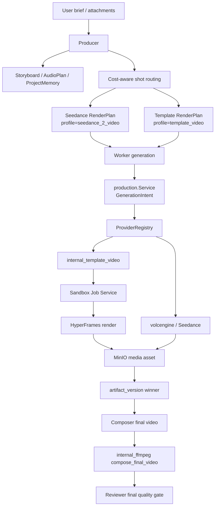

# HyperFrames Template Video Provider 与成本路由设计

**日期**：2026-07-01
**状态**：待审阅
**范围**：M10 Cost-aware Hybrid Production 第一阶段

## 背景

ClipAnvil 已经能从 Agent brief 自动推进到营销视频成片，但当前分镜视频主要依赖 Seedance。Seedance 适合生成真实运动、复杂场景和高价值 hero shot，但每次调用成本高，且在 provider safety 拒绝、参考图不稳定或局部重试时会造成明显浪费。

当前代码已经具备低成本视频能力的接入基础：

- `generation_job` / `artifact_version` / current winner / stale / retry 已形成共享生产闭环。
- `model_provider` / `model_capability` 已是模型和内部 provider 能力事实源。
- `generation_job.cost_cents` 与 `model_capability.pricing` 已存在，可承载成本估算和真实成本记录。
- `internal_ffmpeg` 已通过 Sandbox Job Service 执行抽帧和最终成片，应用进程不直接跑 FFmpeg。
- Composer 已有 `timeline_plan.template_key`，最终视频已经是普通 `video` node + `compose_final_video` artifact。

本阶段目标不是替换 Seedance，而是引入一个可控、低成本、确定性的视频片段 provider：用 HyperFrames 生成商品卡、卖点字幕、CTA、尾帧、静态图动效和失败 fallback，让 Seedance 只用于真正需要模型运动生成的镜头。

## 外部技术选择

第一版选择 **HyperFrames**，不选择 Remotion 作为主实现。

HyperFrames 的当前定位是：用 HTML、CSS、媒体和可 seek 动画生成 deterministic MP4。Composition 是普通 HTML 文件，通过 `data-*` 属性表达时间、布局和媒体行为；CLI 非交互，适合 Agent 和自动化 pipeline；运行依赖 Node.js >= 22、FFmpeg 和 headless Chrome。官方文档：

- HyperFrames introduction: <https://hyperframes.heygen.com/introduction>
- HyperFrames quickstart: <https://hyperframes.heygen.com/quickstart>
- HyperFrames data attributes: <https://hyperframes.heygen.com/concepts/data-attributes>
- HyperFrames engine: <https://hyperframes.heygen.com/packages/engine>
- HyperFrames GitHub: <https://github.com/heygen-com/hyperframes>

Remotion 更成熟，适合长期做 React 视频模板产品、编辑器和复杂组件生态，但第一版不优先使用，原因是：

- 授权会更早进入商业化判断；ClipAnvil 未来若面向组织或商业使用，需要额外确认 Remotion company license。
- React 视频应用的构建、Chrome runtime、bundle、SSR renderer 和模板工程复杂度更高。
- Agent 第一版生成 HTML composition 比生成 React component tree 更容易约束和验证。

本设计保留 `internal_template_video` 这个抽象 provider 名称，不把业务层绑死为 HyperFrames。未来可增加 Remotion、纯 FFmpeg、Mediabunny 或自研 renderer 后端。

## 目标

1. 新增 `internal_template_video` provider，以 HyperFrames 为第一版 engine。
2. 新增 `template_video` RenderPlan profile，让 `shot_video` 可以选择 Seedance 或 template 两条路线。
3. 在 Producer / Craftsman 路径中引入成本路由：默认只有高价值真实运动镜头走 Seedance，普通营销包装镜头走 template。
4. 让 template 产物仍进入现有 `shot_video` winner 槽位，Composer 无需重写主流程。
5. 让 Reviewer 能识别模板镜头，按模板视频质量标准评审，不把模板 fallback 冒充真实运动镜头。
6. 用现有 `generation_job.cost_cents`、`model_capability.pricing` 和 provider response 记录成本估算、真实执行信息和 sandbox trace。

## 非目标

- 不在第一版做完整时间线编辑器。
- 不把 HyperFrames 暴露为面向用户的自由代码编辑入口。
- 不替换现有 Composer / `internal_ffmpeg` final composition path。
- 不让应用进程直接执行 Node、Chrome、FFmpeg 或 npm 命令。
- 不把模板视频视为 Seedance 的等价替代；复杂真实运动仍应走 Seedance 或请求用户确认。
- 不在第一版接 Remotion、云渲染、Lambda、GPU 模型或 ComfyUI。

## 用户价值

### 成本下降

15 秒营销视频不再默认 3 个 5 秒 shot 全部调用 Seedance。推荐默认结构：

| 镜头 | 默认路线 | 示例 |
|---|---|---|
| Hero shot | Seedance | 商品真实运动、城市/机场动态场景、人物动作 |
| Benefit shot | HyperFrames template | 商品图 + 卖点字幕 + 轻动效 |
| CTA / packshot | HyperFrames template | 品牌尾帧、行动号召、价格/权益 |

### 失败恢复

当 Seedance 因 safety、参考图、prompt 或模型能力失败时，Producer 可以选择：

- 改参考图或提示词后重试 Seedance；
- 降级为 template fallback；
- 请求用户确认是否接受静态/半动态 fallback；
- 停止继续烧钱。

### 批量变体

同一组 Seedance / Seedream 资产可以生成多条低成本投放版本：

- 不同首秒 hook；
- 不同卖点排序；
- 不同字幕文案；
- 不同 CTA；
- 不同 BGM / 旁白节奏；
- 不同平台版式。

## 术语

| 名称 | 含义 |
|---|---|
| Template video | 由 HTML/CSS/media/animation 程序化渲染的视频片段 |
| `internal_template_video` | ClipAnvil 内部模板视频 provider |
| `hyperframes-html` | 第一版模板视频 model id，底层使用 HyperFrames CLI / engine |
| `template_video` | 新的 RenderPlan profile，用于 template-backed `shot_video` |
| Template key | 模板 ID，例如 `product_hook_v1`、`benefit_cards_v1`、`cta_packshot_v1` |
| Variables | 模板参数，例如产品名、卖点、CTA、品牌色、文案、时长 |
| Routing policy | Producer / Craftsman 对 Seedance 与 template 的选择规则 |

## 总体架构



关键原则：

- Template provider 是生产 provider，不是 Composer 内部小技巧。
- Template output 是正常 video artifact，进入现有 version / winner / stale / review 链路。
- Composer 继续只关心视频 winners、音频 tracks 和 timeline，不需要知道某个 shot 是 Seedance 还是 template，除非用于显示和 review context。
- 成本路由发生在 Producer / Craftsman 决策层，执行事实仍由 production service、model capability 和 provider adapter 校验。

## 数据模型设计

### `model_provider`

新增 provider：

```sql
INSERT INTO model_provider (id, display_name, provider_type, config, enabled)
VALUES (
  'internal_template_video',
  'Internal Template Video',
  'internal_media',
  '{"engine":"hyperframes"}',
  true
);
```

### `model_capability`

新增 capability：

```sql
INSERT INTO model_capability (
  provider_id,
  model_id,
  display_name,
  output_types,
  supported_operations,
  supported_input_node_types,
  limits,
  pricing,
  defaults,
  enabled
) VALUES (
  'internal_template_video',
  'hyperframes-html',
  'HyperFrames HTML Template Video',
  '["video"]',
  '["template_to_video", "image_to_template_video"]',
  '["image", "video", "audio", "text"]',
  '{
    "max_attempts": 1,
    "durations_sec": [3, 4, 5, 6, 8, 10],
    "aspect_ratios": ["9:16", "1:1", "16:9"],
    "resolutions": ["720p", "1080p"],
    "max_input_images": 6,
    "max_input_videos": 3,
    "max_input_audios": 2
  }',
  '{
    "tier": "internal",
    "unit": "sandbox_render",
    "estimated_cost_cents": 0
  }',
  '{
    "ratio": "9:16",
    "duration_sec": 5,
    "resolution": "1080p",
    "fps": 24,
    "template_key": "benefit_cards_v1"
  }',
  true
);
```

### `render_plan`

需要把 `model_prompt_profile` 允许值扩展为：

- `seedream_5_image`
- `seedance_2_video`
- `seed_audio_1`
- `template_video`

`template_video` 的 `target_phase` 第一版只允许 `shot_video`。它的 output type 仍是 `video`，但 provider 是 `internal_template_video`，model 是 `hyperframes-html`。

### `generation_job`

不新增字段。使用现有字段：

| 字段 | 用法 |
|---|---|
| `provider` | `internal_template_video` |
| `model_id` | `hyperframes-html` |
| `operation_type` | `template_to_video` 或 `image_to_template_video` |
| `intent` | 完整 GenerationIntent，包含 template params |
| `provider_request` | template key、variables 摘要、input refs、sandbox project path |
| `provider_response` | sandbox job id、output path、mime、size、duration、engine version |
| `cost_cents` | 第一版写 0 或估算内部成本 |
| `source_render_plan_id` | 关联 RenderPlan |

### `artifact_version.output`

建议写入：

```json
{
  "artifact_kind": "shot_video",
  "rendering_family": "template_video",
  "template_engine": "hyperframes",
  "template_key": "benefit_cards_v1",
  "duration_sec": 5,
  "width": 1080,
  "height": 1920,
  "fps": 24
}
```

### media node metadata

对应 `media_node.metadata` 可补充：

```json
{
  "agent_artifact_kind": "shot_video",
  "rendering_family": "template_video",
  "template_engine": "hyperframes",
  "template_key": "benefit_cards_v1"
}
```

这能让 Workbench / detail panel / Reviewer context 清楚区分 Seedance 和 template。

## GenerationIntent 设计

### `image_to_template_video`

适合单张或多张图片驱动的商品动效视频：

```json
{
  "output_type": "video",
  "operation_type": "image_to_template_video",
  "model": {
    "provider": "internal_template_video",
    "model_id": "hyperframes-html"
  },
  "params": {
    "template_key": "benefit_cards_v1",
    "ratio": "9:16",
    "duration_sec": 5,
    "resolution": "1080p",
    "fps": 24,
    "variables": {
      "product_name": "悦行行李箱",
      "headline": "轻松出行",
      "benefits": ["顺滑万向轮", "商务短途更省力", "登机箱友好"],
      "cta": "现在出发",
      "brand_colors": ["#111827", "#F5C542"]
    }
  }
}
```

### `template_to_video`

适合纯文字、品牌尾帧、CTA 或已有视频包装：

```json
{
  "output_type": "video",
  "operation_type": "template_to_video",
  "model": {
    "provider": "internal_template_video",
    "model_id": "hyperframes-html"
  },
  "params": {
    "template_key": "cta_packshot_v1",
    "duration_sec": 4,
    "ratio": "9:16",
    "variables": {
      "headline": "顺滑轮子，轻松赶路",
      "subtitle": "机场 / 城市短途商务场景",
      "cta": "了解更多"
    }
  }
}
```

## Template 参数合同

第一版模板参数应强约束，避免 Agent 任意生成复杂 HTML。

```json
{
  "template_key": "benefit_cards_v1",
  "duration_sec": 5,
  "ratio": "9:16",
  "resolution": "1080p",
  "fps": 24,
  "variables": {
    "product_name": "string",
    "headline": "string",
    "subtitle": "string",
    "benefits": ["string"],
    "cta": "string",
    "brand_colors": ["#RRGGBB"],
    "safe_area": "tiktok_feed"
  }
}
```

校验规则：

- `template_key` 必须来自白名单。
- `duration_sec` 第一版允许 3、4、5、6、8、10。
- `ratio` 第一版允许 9:16、1:1、16:9，Agent 主路径默认 9:16。
- 文案长度按模板限制截断或阻塞，不在 provider 内静默挤压。
- 颜色只允许 hex，禁止任意 CSS injection。
- variables 只允许 JSON primitive / array / object，不允许脚本。
- 输入资产必须来自 `InputRefs`，不能让 Agent 直接写任意 URL。

## HyperFrames sandbox 渲染流程

新增 sandbox 能力可以命名为 `RenderTemplateVideo`：

```go
type RenderTemplateVideoInput struct {
    WorkspaceID  pgtype.UUID
    TargetNodeID pgtype.UUID
    TemplateKey  string
    Params       map[string]any
    Assets       []SandboxAssetInput
}
```

执行步骤：

1. `internal_template_video` provider 收到 `GenerationIntent`。
2. provider 校验 `template_key`、params、input refs。
3. provider 调用 sandbox `RenderTemplateVideo`。
4. sandbox 确保 workspace sandbox 存在。
5. sandbox 下载 input refs 到 `/workspace/input/template-video/<job-id>/assets/`。
6. sandbox 写入临时项目：
   - `/workspace/template-video/<job-id>/index.html`
   - `/workspace/template-video/<job-id>/meta.json`
   - `/workspace/template-video/<job-id>/variables.json`
   - `/workspace/template-video/<job-id>/assets/*`
7. sandbox 执行：

```bash
npx --yes hyperframes render \
  --input /workspace/template-video/<job-id>/index.html \
  --output /workspace/output/template-<job-id>.mp4
```

如果 CLI 实际参数与该示例不同，以 HyperFrames 当前 CLI 为准；实现时必须先用最小 sandbox smoke 锁定命令。

8. sandbox inspect 输出 MIME、大小、duration、resolution。
9. sandbox 通过 presigned PUT 上传到 MinIO。
10. provider 返回 `ProviderResult`，production service 创建 asset/version/winner。

### Sandbox 镜像要求

第一版要补一个专用 sandbox image 或扩展现有 OpenSandbox image，要求：

- Node.js >= 22。
- FFmpeg 可执行。
- chrome-headless-shell 或 HyperFrames 可自动安装 / 使用的浏览器 runtime。
- 可访问 npm registry，或预烘焙 `hyperframes` 包避免运行期下载。
- 字体基础包，至少覆盖中文营销文案。

推荐第一版使用预烘焙镜像，不在每次 job 里 `npm install`。本地开发可允许 `npx --yes hyperframes`，但 smoke 和 CI 应尽量固定版本。

## 模板库设计

模板文件建议放在后端或独立 runtime 包内，而不是写进数据库：

```text
apps/server/internal/templatevideo/templates/
  benefit_cards_v1/
    index.html.tmpl
    schema.json
    preview.png
  cta_packshot_v1/
    index.html.tmpl
    schema.json
    preview.png
  product_hook_v1/
    index.html.tmpl
    schema.json
    preview.png
```

第一批模板：

| Template key | 用途 | 输入 | 输出 |
|---|---|---|---|
| `product_hook_v1` | 首秒 hook，商品图入场 + 大标题 | 1-2 images, headline, subtitle | 3-5s video |
| `benefit_cards_v1` | 卖点卡片，适合中段解释 | 1 image, 2-4 benefits | 5-8s video |
| `cta_packshot_v1` | 尾帧 CTA / 品牌收口 | 1 image, CTA, brand colors | 3-5s video |
| `static_fallback_ken_burns_v1` | Seedance 失败 fallback | 1 image, caption | 5-6s video |

模板 HTML 只允许使用本地资产、内联 CSS 和受控 runtime。第一版不要开放任意外部 script。

## 成本路由策略

### Producer 决策

Producer 需要在规划或修复时判断每个 shot 的 route：

| 条件 | route |
|---|---|
| 需要真实人物/商品/场景运动 | Seedance |
| 只是表达卖点、CTA、字幕、包装页、静态商品展示 | Template |
| Seedance 因 safety / provider rejection 连续失败 | Template fallback 或请求用户换素材 |
| 用户要求“自动推进到成片”但预算未知 | 最多 1 个 Seedance hero shot，其余优先 template |
| 用户明确要高真实动态质量 | 请求确认后增加 Seedance shot 数量 |

Producer 不直接写 HyperFrames HTML，只决定 route、template intent 和用户确认。

### Craftsman RenderPlan

Craftsman 负责把 route 翻译为 RenderPlan：

Seedance route：

- `target_phase=shot_video`
- `model_prompt_profile=seedance_2_video`
- operation 为 Seedance 支持的 video operation

Template route：

- `target_phase=shot_video`
- `model_prompt_profile=template_video`
- operation 为 `template_to_video` 或 `image_to_template_video`
- params 包含 `template_key` 和 `variables`

### Worker 执行

Worker 不需要理解业务成本，只按 RenderPlan 生成 `GenerationIntent` 并提交 production service。生产层按 capability 校验 provider、operation、input types 和 limits。

## Reviewer 规则

Reviewer 需要区分 Seedance shot 与 template shot。

Template shot 的质量维度：

- `readability`：字幕和 CTA 是否在移动端可读。
- `platform_selling_power`：是否像抖音/信息流广告，而不是普通 PPT。
- `brand_consistency`：颜色、文案、商品图是否一致。
- `motion_rhythm`：动效是否足够支撑节奏。
- `audio_sync`：旁白/BGM cue 是否和模板片段节奏匹配。
- `truthfulness`：是否把静态模板冒充真实拍摄或真实动作。

Template fallback 可以通过 Reviewer，但如果 brief 明确要求“真实动态展示”，Reviewer 应降分或要求 Producer 请求用户确认。

## Workbench / UI 展示

第一版 UI 改动保持轻：

- Workbench shot artifact 显示 `Template video` / `Seedance video` 标签。
- Detail panel 显示 template key、engine、duration、provider、estimated cost。
- 失败时展示 sandbox error 和 provider response。
- 不做模板编辑器。

后续可以增加：

- template preview card；
- route selector；
- budget slider；
- variant factory 面板。

## 成本记录

第一版成本分两层：

### Capability pricing

`model_capability.pricing`：

```json
{
  "tier": "internal",
  "unit": "sandbox_render",
  "estimated_cost_cents": 0
}
```

Seedance capability 可补充估算：

```json
{
  "tier": "paid",
  "unit": "video_generation",
  "price_source": "configured_or_billing_import",
  "estimated_cost_required": true
}
```

具体数值必须以后续实际供应商价格和账单为准，不在本 spec 中固定。

### Generation job cost

`generation_job.cost_cents`：

- template video 第一版写 0 或内部估算值；
- Seedance 写估算值，后续可按 provider response 或账单回填；
- provider failure 仍记录成本风险，即使没有成功 artifact。

后续可加 workspace / campaign budget policy，但第一版先不新增表。

## 错误处理

| 错误 | 行为 |
|---|---|
| 缺少 Node.js / FFmpeg / Chrome | provider config error，job failed，提示 sandbox runtime 未配置 |
| template key 未知 | capability / validation failed，不创建外部 job |
| variables 不合法 | validation failed，RenderPlan 或 job failed |
| 输入资产无法下载 | sandbox job failed，generation_job failed |
| HyperFrames render 失败 | sandbox stderr 摘要进入 provider_response / error_message |
| 输出不是 video MIME | sandbox output invalid，job failed |
| 输出过大 | sandbox output too large，job failed |
| Seedance 连续失败 | Producer 后续 route 到 template fallback 或 HITL |

## 安全边界

- Agent 不直接写任意 JS 文件。
- 模板 HTML 来自受控模板库，Agent 只能填 variables。
- 外部 URL 不直接进入模板；所有媒体通过 ClipAnvil asset / InputRefs staging。
- 颜色、字体、文案、时长、布局变量都要 schema validate。
- sandbox command 必须用固定 executable / fixed args builder，不能拼接 Agent 输入。
- 输出文件必须位于 `/workspace/output`，复用现有 path validation。
- 不把 sandbox stderr 原样大段展示给用户，只存审计摘要和 detail。

## 实施分阶段

### M10.1 Capability 与成本路由基础

交付：

- 新增 `internal_template_video` provider / capability migration。
- 新增 `template_video` profile。
- RenderPlan validation 允许 `shot_video + template_video`。
- Producer / Craftsman prompt 增加 route 规则。

验收：

- `make sqlc-generate`
- `GOCACHE=/private/tmp/clipanvil-go-build make server-test`
- 单测覆盖 `shot_video` 可用 `template_video`，非 `shot_video` 不可用。
- 单测覆盖 capability list 包含 `internal_template_video/hyperframes-html`。

### M10.2 Sandbox HyperFrames provider

交付：

- 新增 `TemplateVideoProvider`。
- 新增 sandbox `RenderTemplateVideo` 能力。
- 固定一个最小模板 `static_fallback_ken_burns_v1`。
- 生成 MP4 后走现有 MinIO / artifact_version path。

验收：

- provider 单测 mock sandbox 成功/失败。
- sandbox path / output validation 单测。
- 本地 smoke 生成一个 3-5 秒 MP4，ffprobe 能读取 video stream。
- `generation_job.provider=internal_template_video`，`artifact_version.winner=true`。

### M10.3 Agent 路由接入

交付：

- Producer 默认策略：自动成片时最多 1 个 Seedance hero shot，其余优先 template，除非用户要求全动态。
- Craftsman 能为 template route 写 RenderPlan。
- Worker 能执行 template RenderPlan。
- Workbench detail 显示 template engine / key。

验收：

- mock Agent smoke：三分镜营销广告生成 1 个 Seedance plan + 2 个 template plan。
- 不调用真实 Seedance 时也能用 template + image assets 生成可播放 final video。
- Reviewer 能看到 template metadata。

### M10.4 Reviewer 与 fallback 策略

交付：

- Reviewer prompt/context 增加 template shot 质量标准。
- Seedance 连续失败后 Producer 不自动无限重试，改 template fallback 或 HITL。
- `cost_risk` issue 用于 pre-render 或失败后评审。

验收：

- 单测覆盖 provider rejection 后 Producer route 不扩散重跑。
- smoke 覆盖 Seedance mock failure -> template fallback -> Composer 成片。
- Reviewer 对“要求真实动态但使用 template fallback”的 final video 给出 warning 或 blocking issue。

### M10.5 Variant Factory 准备

交付：

- 不做完整 UI，只把 template params / input hash / template key 稳定入库。
- 同一资产可通过不同 variables 生成多个版本。

验收：

- 同一 image winner + 不同 CTA 生成两个 artifact versions。
- input_hash 包含 template key / variables / input refs，变量变化会产生新版本并触发 stale。

## 需要修改的主要文件

后端：

- `apps/server/migrations/039_template_video_provider.sql`
- `apps/server/sqlc/queries/model.sql` 或现有 sqlc 生成代码
- `apps/server/internal/agent/renderplan/types.go`
- `apps/server/internal/agent/renderplan/profiles.go`
- `apps/server/internal/agent/renderplan/service.go`
- `apps/server/internal/agent/renderplan/prompt_compiler.go`
- `apps/server/internal/agent/tools/upsert_render_plan.go`
- `apps/server/internal/agent/craftsman/system_prompt.go`
- `apps/server/internal/agent/producer/system_prompt.go`
- `apps/server/internal/agent/reviewer/system_prompt.go`
- `apps/server/internal/production/template_video_provider.go`
- `apps/server/internal/production/provider.go`
- `apps/server/cmd/server/main.go`
- `apps/server/internal/sandbox/template_video.go`
- `apps/server/internal/sandbox/composition.go` 或新的受控 command helper
- `apps/server/internal/api/agent_workbench_projection.go`
- `apps/server/internal/api/agent_canvas_detail.go`

前端：

- `apps/web/src/components/agent-workbench/AgentShotNode.tsx`
- `apps/web/src/components/agent-workbench/AgentCanvasDetailPanel.tsx`
- `apps/web/src/lib/api.ts` 或对应类型文件

脚本 / runtime：

- sandbox image / Dockerfile 或 OpenSandbox image 配置。
- `scripts/smoke-m10-template-video-provider.sh`
- `.env.example` 如需新增 HyperFrames runtime 开关。

## Open Questions

1. 本地 sandbox image 是扩展当前 OpenSandbox 默认镜像，还是新增 `clipanvil-sandbox:template-video`？
2. HyperFrames CLI 的 render 参数在当前版本中如何固定？实现前必须用最小项目验证命令。
3. 是否允许 template provider 使用远程 npm registry？建议开发允许，CI / 生产预烘焙。
4. `cost_cents` 第一版写 0 还是写估算内部成本？建议先写 0，并在 provider_response 写 CPU/render duration。
5. Workbench 是否需要显示成本估算总额？建议 M10.1 只进入 detail，不做全局预算 UI。

## 验证矩阵

| 范围 | 命令 |
|---|---|
| migration/sqlc | `make sqlc-generate` |
| Go build | `GOCACHE=/private/tmp/clipanvil-go-build make server-build` |
| Go tests | `GOCACHE=/private/tmp/clipanvil-go-build make server-test` |
| 前端类型/构建 | `pnpm --filter @clip-anvil/web... build` |
| 前端 lint | `pnpm --filter @clip-anvil/web lint` |
| sandbox smoke | `bash -n scripts/smoke-m10-template-video-provider.sh` and `./scripts/smoke-m10-template-video-provider.sh` |
| 文档/补丁 | `git diff --check` |

## 成功标准

第一版完成后，ClipAnvil 应能在不调用真实 Seedance 的情况下，用上传商品图、文案和 BGM/旁白生成一条包含 template shot 的可播放营销视频；同时也能在混合模式下只对 hero shot 调 Seedance，其余镜头用 HyperFrames template。所有 template 产物必须通过现有 production job/version/winner/sandbox trace 链路入库，Reviewer 能识别其来源并给出合理质量判断。

## 后续方向

- Variant Factory：围绕 template variables 批量生成多条广告版本。
- Template catalog UI：让用户选择模板风格，而不是只由 Producer 决定。
- Brand Kit：品牌色、字体、logo、安全区、平台规范持久化。
- Remote rendering：当本地 sandbox 成本或速度成为瓶颈时，再评估 HyperFrames Lambda / Cloud Run。
- Remotion adapter：当需要 React 复杂组件生态或可视化模板编辑器时，再作为同一 `internal_template_video` family 的第二 engine 接入。
