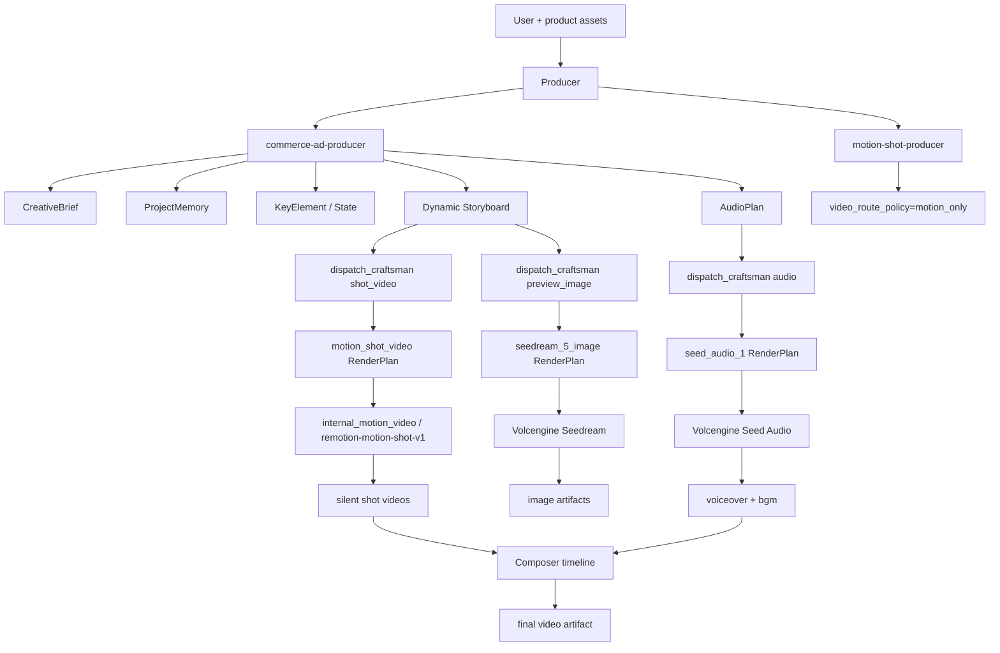

# Dynamic Agent Remotion Route 设计

**日期**：2026-07-02
**状态**：待审阅
**范围**：Agent 模式动态分镜的低成本 Remotion 视频路由

## 背景

M11 已经把 HyperFrames/template video 主线替换为 `motion_shot_video`，并接入 `internal_motion_video/remotion-motion-shot-v1`。E2E 验证证明 Seedream 图片、Remotion silent shot、火山音频和 Composer final video 可以跑通。

但 M11 的 E2E fixture 为了验证 provider/sandbox/Composer 纵切，固定生成了一个 8 秒单分镜广告。这不代表 Agent 模式的真实能力，也不符合用户期望。ClipAnvil Agent 现有主线本来支持动态 `CreativeBrief -> ProjectMemory -> KeyElement -> Storyboard -> AudioPlan -> dispatch_craftsman`。分镜数量、结构、顺序和依赖应由 Producer 根据商品、素材、用户约束和目标平台决定。

因此，M12 不应新建一个固定 30 秒 Remotion 模板系统。M12 的目标是：**复用 Agent 现有动态 storyboard 与多 Agent 生产链路，只把 no-Seedance / low-cost 场景下的 `shot_video` 执行路由从 Seedance 切换为 Remotion motion shot。**

## 当前代码事实

### 动态分镜已经存在

Producer 系统提示已定义：

- `Scene` 是组织分镜的逻辑场景。
- `Shot` 是可生成视频的基本分镜单元。
- `Storyboard` 由 `Scene`、`Shot`、`shot_key_element`、`shot_dependency` 组成。
- 复杂视频应拆成 scene / shot。
- 多分镜连续性应通过 `shot_dependency` 表达，例如 `last_frame_chain`、`same_product_consistency`、`same_scene_consistency`。

核心实现：

- `apps/server/internal/agent/producer/system_prompt.go`
- `apps/server/internal/agent/tools/upsert_storyboard.go`
- `apps/server/internal/agent/creative/state_service.go`
- `apps/server/internal/agent/pss/producer.go`

### Seedance 只是执行 profile，不决定分镜数量

Seedance 进入链路的位置是 RenderPlan / Worker 层：

- `seedance_2_video`
- provider: `volcengine`
- model: `doubao-seedance-2-0-pro-260428`
- operations: `text_to_video`、`image_to_video_first_frame`、`image_to_video_first_last_frame`、`multi_modal_reference_video`、`video_edit`、`video_extend`、`video_bridge`

核心实现：

- `apps/server/internal/agent/renderplan/profiles.go`
- `apps/server/internal/agent/renderplan/service.go`
- `apps/server/internal/agent/tools/render_plan_submitter.go`
- `apps/server/internal/agent/worker/executor.go`
- `apps/server/internal/agent/skills/library/seedance-renderplan-craftsman/SKILL.md`

### Remotion 已接在相同执行层

M11 已加入：

- `motion_shot_video`
- provider: `internal_motion_video`
- model: `remotion-motion-shot-v1`
- operation: `image_to_motion_video`
- target phase: `shot_video`

核心实现：

- `apps/server/internal/motionshot/plan.go`
- `apps/server/internal/production/motion_shot_provider.go`
- `apps/server/internal/sandbox/motion_shot.go`
- `sandbox-image/remotion-motion-shot/src/index.tsx`
- `apps/server/internal/agent/skills/library/motion-shot-craftsman/SKILL.md`

## 决策

1. 不做固定 30 秒模板。
2. 不让 Remotion 决定广告结构。
3. 保留 Producer 现有动态商品理解、Storyboard、AudioPlan 和 dispatch 机制。
4. 用户明确要求 no-Seedance、低成本、图片动效视频或 Remotion 路线时，`shot_video` 必须走 `motion_shot_video`。
5. `motion-shot-producer` skill 只负责成本路由约束，不取代 `commerce-ad-producer` 的商品广告规划职责。
6. `motion-shot-craftsman` 只负责把每个 shot 的创意事实翻译为 Remotion motion plan，不创建或改写 storyboard。
7. Composer 继续负责全片拼接、旁白、BGM、ducking、最终音画同步和 final video artifact。

## 目标

- 用户只给商品图和一句营销视频需求时，Agent 自动决定分镜数量和结构。
- no-Seedance 场景下，动态生成的每个 `shot_video` 都使用 Remotion motion shot route。
- 支持 20-45 秒营销视频，由 Producer 根据商品和平台决定总时长、shot 数量和每个 shot 时长。
- 保留 Seedream 多图生成能力：商品主视觉、场景图、细节图、packshot、CTA 图可以按 shot 需要生成。
- 保留火山音频能力：全片 AudioPlan 统一生成旁白和 BGM。
- E2E 验证必须使用真实 Agent 动态规划，而不是固定单分镜 fixture 证明产品效果。

## 非目标

- 不在 M12 做可视化时间线编辑器。
- 不让 Agent 写 Remotion React 源码。
- 不把 full subtitles 烘焙进每个 Remotion shot。
- 不删除 Seedance 能力；Seedance 仍可用于真实复杂运动或用户明确要求高动态生成的 hero shot。
- 不把现有 `commerce-ad-producer`、`upsert_storyboard`、`dispatch_craftsman` 另起炉灶重写。

## 目标用户体验

用户可以说：

> 用我上传的商品图生成一个 30 秒左右的营销视频，不调用 Seedance。图片可以用 Seedream，音频用火山，视频用 Remotion 图片动效，最后要有旁白、BGM、字幕和转场。

Agent 应该动态产出类似：

```text
Producer:
  - 读取商品图和用户目标
  - 识别商品类别、卖点、目标人群、适合的广告结构
  - 创建 ProjectMemory 和 KeyElementState
  - 根据商品自动创建 4-9 个 shots
  - 创建全片 AudioPlan 和 cue_plan
  - 派发 Seedream preview/reference images
  - 派发每个 shot_video，video_route_policy=motion_only
  - 派发 voiceover_audio / bgm_audio
  - 所有素材完成后派发 Composer

Craftsman:
  - preview_image: 写 Seedream RenderPlan
  - shot_video: 写 motion_shot_video RenderPlan
  - audio: 写 seed_audio_1 RenderPlan

Worker/Production:
  - Seedream 生成图片
  - Remotion 生成每段 silent motion shot
  - 火山生成旁白和 BGM

Composer:
  - 根据 AudioPlan cue 和 shot duration 创建 timeline
  - 拼接多个 motion shot
  - 混入 voiceover/BGM/ducking
  - 生成 final_video
```

## 架构



关键原则：

- `commerce-ad-producer` 决定广告结构。
- `motion-shot-producer` 决定 no-Seedance route policy。
- `dispatch_craftsman` 负责把多个 shot 派给 Craftsman。
- `motion-shot-craftsman` 负责每个 shot 的 Remotion plan。
- `RenderPlanSubmitter` 把 `motion_shot_video` 映射到 `internal_motion_video/remotion-motion-shot-v1`。
- Worker 和 production service 不需要知道“这是 30 秒广告”，只执行每个 shot 的 generation intent。

## Agent Skill 调整

### `commerce-ad-producer`

保持它是商品广告动态规划主 skill。需要强化：

- 不允许因为用户选择 no-Seedance 就退化成固定模板或单分镜。
- 根据商品类别、素材质量和目标平台决定 `scene` / `shot` 数量。
- 对 20-45 秒视频，默认规划 4-9 个 shot。
- 每个 shot 应有明确 `narrative_purpose`、`duration_sec`、`visual_intent`、`action_text`、`camera_intent`、`narration`。
- 需要图片锚点的 shot 应先派发 `preview_image` 或引用已有商品图。

### `motion-shot-producer`

重新定位为 route policy skill，而不是广告模板 skill：

- 必须与 `commerce-ad-producer` 配合使用。
- 它不负责决定固定 shot 结构。
- 当用户要求 no-Seedance / low-cost / Remotion 图片动效时，在 `dispatch_craftsman(target_phase=shot_video)` 中填 `video_route_policy=motion_only`。
- 它要求 Producer 对所有待生成 shot video 使用真实 `shot_refs`，不能只派一个固定 shot。
- 它要求 Producer 先确认或生成可用 input image，再派发 motion shot。

### `seedance-renderplan-craftsman`

保留 Seedance 能力，但它应明确：

- 如果 task context 有 `video_route_policy=motion_only`，不能写 `seedance_2_video`。
- 如果 shot 只是卖点卡、packshot、CTA、对比、文字信息层，优先建议 `motion_shot_video`。
- 如果 shot 需要真实人物动作、复杂物理运动、镜头穿越，且用户禁止 Seedance，则标记 blocked 或建议 Producer 请求用户确认。

### `motion-shot-craftsman`

强化为“每个动态 shot 的 Remotion 执行者”：

- 必须继承当前 shot 的 `duration_sec`，不固定 5 秒或 8 秒。
- 必须根据 shot 的 `visual_intent`、`action_text`、`narration` 生成适合该 shot 的 `visual_layers` 和 `text_layers`。
- `text_layers` 只放短 hook / benefit / CTA，不承担全片字幕。
- 对不同 shot 使用不同 `motion_style` / `transition` / layout，避免全片看起来像同一张模板重复。
- 如果没有可用 image input，必须 blocked 或要求先生成 preview/reference image。

## 路由规则

### 默认模式

当用户没有禁止 Seedance：

- Producer 仍可让 hero / complex motion shot 使用 Seedance。
- 非 hero、卖点卡、packshot、CTA 可用 Remotion 控成本。
- 当前 `dispatch_craftsman.recommendedVideoRoute` 的“首个 broad shot 默认 Seedance，非 hero 默认 Remotion”可以保留。

### no-Seedance 模式

当用户明确要求不要 Seedance：

- Producer 必须把 ProjectMemory 记录为 no-Seedance。
- 所有 `dispatch_craftsman(target_phase=shot_video)` 必须带 `video_route_policy=motion_only`。
- Craftsman 必须写：

```json
{
  "model_prompt_profile": "motion_shot_video",
  "operation": "image_to_motion_video",
  "target_phase": "shot_video"
}
```

- Worker / DB 中不得出现 `provider=volcengine` 且 `model_id` 包含 `seedance` 的 video job。

## 数据流

### 初始用户请求

1. `POST /api/agent/workspaces/:id/messages`
2. Producer 读取用户消息、附件和当前 project context。
3. Producer 加载 commerce ad 规划能力。
4. 如果用户要求 no-Seedance，加载 motion shot route 能力。
5. Producer 写入 brief、memory、key elements、storyboard、audio plan。
6. Producer 派发 preview/reference image。

### 图片完成

1. Worker 完成 preview image。
2. `producer_pending_signal(worker_generation_completed)` 唤醒 Producer。
3. Producer 读取 context，确认 image artifact winner。
4. Producer 对所有 ready shots 派发 `shot_video`。
5. no-Seedance 时带 `video_route_policy=motion_only`。

### 分镜视频完成

1. Remotion provider 为每个 shot 生成 silent video。
2. Worker 写 `generation_job`、`artifact_version`、`media_node`。
3. Producer 收到完成 signal。
4. Producer 继续派发缺失音频，或在素材齐备后派发 Composer。

### 最终成片

1. Composer 读取 `available_composition_assets`。
2. 创建 `timeline_plan`，包含多段 shot video 和全片音轨。
3. 渲染 final MP4。
4. 写 final video artifact。

## E2E 验收设计

M12 E2E 不能再用固定单分镜 fixture 作为产品效果证明。需要两类测试：

### API / deterministic smoke

用途：验证路由和 DB 约束。

- 可以用 deterministic fixture。
- fixture 必须创建至少 4 个 shot。
- 所有 `shot_video` 都使用 `motion_shot_video`。
- DB 中不得有 Seedance generation job。
- 至少生成 2 个 Remotion shot video artifact。
- Composer final video 必须有 video + audio streams。

### Browser / model-backed E2E

用途：验证 Agent 真实动态规划。

- 使用真实浏览器打开 Agent workspace。
- 上传桌面商品图。
- 发送 no-Seedance 30 秒左右营销视频请求。
- 不使用固定 storyboard fixture。
- 可使用真实 Producer/Craftsman 模型 responder；如为了成本控制使用 fixture，也必须是“动态多分镜 fixture”，不能固定一个 shot。
- DB 验收：
  - `scene` + `shot` 数量由 Producer 输出决定，至少 4 shots。
  - `render_plan` 包含多条 `motion_shot_video/image_to_motion_video`。
  - `generation_job` 不包含 Seedance。
  - `artifact_version` 包含 preview images、shot videos、voiceover、BGM、final video。
  - `timeline_plan` status 为 completed。
- 媒体验收：
  - final MP4 时长在目标范围内，例如 24-36 秒。
  - final MP4 有 h264 video stream 和 aac audio stream。
  - 抽帧检查不应是同一布局的简单重复；至少有 3 种不同视觉构图或文字层位置。

## 接受标准

- Agent 主路径仍使用现有 dynamic `upsert_storyboard`，没有新增固定 30 秒模板系统。
- no-Seedance 请求下，Producer 会对动态 storyboard 中多个 shot 派发 `video_route_policy=motion_only`。
- Craftsman 对每个 shot 写不同的 `motion_shot_video` RenderPlan。
- Worker/production 生成多个 Remotion shot video。
- Composer 合成多段 shot + voiceover + BGM 的 final video。
- E2E DB 中没有 Seedance video generation job。
- 旧 M11 单分镜 fixture 不再作为主要产品验收依据。

## 风险与缓解

| 风险 | 影响 | 缓解 |
|---|---|---|
| Remotion shot 全部看起来像同一模板 | 用户感知仍像模板 | `motion-shot-craftsman` 必须根据 shot purpose 变化 layout、motion_style、text position 和 transition |
| Producer 只生成 1 个 shot | 30 秒广告结构失败 | no-Seedance 30 秒请求的 E2E 要求至少 4 shots；skill 明确禁止退化为单分镜 |
| 没有足够图片输入 | Remotion 只能复用一张图 | Producer 先派 Seedream 生成多个 preview/reference image；缺图时不要派 motion shot |
| 音画不同步 | final video 不可用 | AudioPlan cue_plan 是事实源；Composer 按 cue 和 shot duration 建 timeline |
| 复杂动作被强行 Remotion 化 | 画面质量差 | Craftsman blocked，Producer 请求用户允许 Seedance 或改成图片动效表达 |
| 测试 fixture 掩盖真实 Agent 行为 | 再次误判产品效果 | E2E 明确区分 deterministic smoke 和 model-backed browser E2E |

## 后续实现边界

M12 实现应优先改：

1. `motion-shot-producer` 与 `commerce-ad-producer` skill 关系。
2. Producer prompt 中 no-Seedance 动态 storyboard 的约束。
3. `dispatch_craftsman` 批量 shot_video 派发和 recommended route 语义。
4. `motion-shot-craftsman` 根据 shot facts 生成差异化 motion params。
5. E2E fixture 从单分镜改为多分镜，或不再用于产品效果验收。
6. Browser E2E 和 DB/log audit 脚本。

不应优先改：

- Remotion renderer 成为创意 planner。
- 新建固定 30 秒 composition 模板。
- 绕过 Producer 直接从用户 prompt 生成 Remotion timeline。

