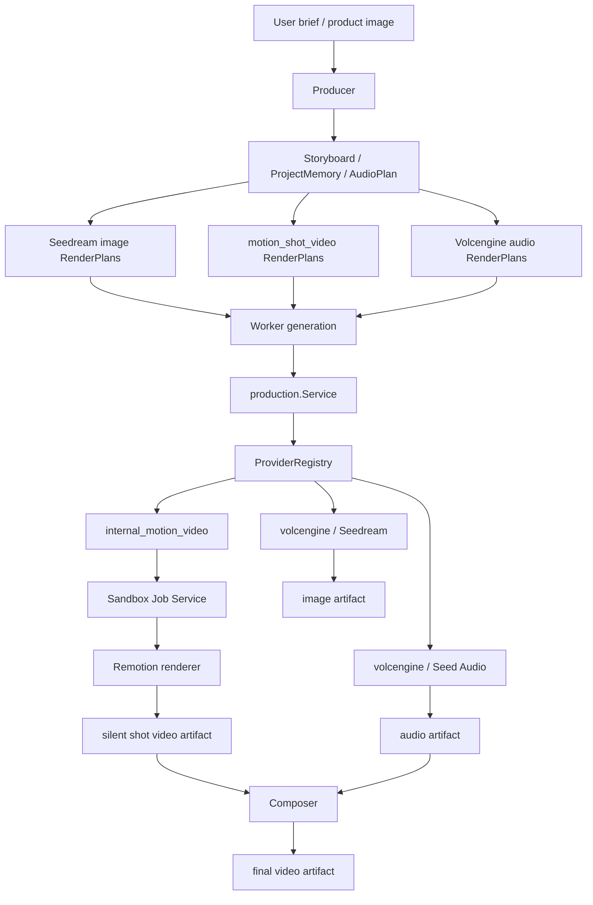

# Remotion Motion Shot Video 与 HyperFrames 清理设计

**日期**：2026-07-02
**状态**：待审阅
**范围**：低成本图片驱动营销视频主线

## 背景

ClipAnvil 已经能通过 Agent 生成营销视频，但视频成本主要来自 Seedance 分镜视频生成。此前 M10 引入 HyperFrames/template video，目标是用固定模板替代部分 Seedance 调用。真实试用后，这条路线暴露出产品定位偏差：

- 固定模板适合兜底和简单卖点卡，但不适合生成吸引眼球的完整营销分镜。
- 用户实际想要的是 Seedream 生成多张商品/场景关键图，再用程序化镜头运动、文字动效、转场、口播、字幕和 BGM 做成视频。
- HyperFrames 在当前实现中是固定 template key + variables 的渲染器，Agent 不能自由生成新样式或新 motion system。
- 为保证音画同步，完整字幕、口播和 BGM 不应分散烘焙进每个 shot，而应由最终 Composer 在统一时间线上处理。

因此，本设计直接将低成本视频主线切换到 **Remotion-backed motion shot**，并清理 HyperFrames/template_video 的系统残留。

## 决策

1. 不再保留 HyperFrames 作为 fallback 或 legacy 主线。
2. 删除 `template_video` / `internal_template_video` / `hyperframes-html` 相关能力、provider、skill、prompt、smoke 和 docs 残留。
3. 新增 `motion_shot_video` RenderPlan profile。
4. 新增 `internal_motion_video/remotion-motion-shot-v1` provider capability。
5. 新增 `image_to_motion_video` operation，用 Seedream 图片生成 silent motion shot video。
6. 最终口播、字幕、BGM、shot 拼接和全片音画同步由 Composer 统一完成。

## 目标

- 用 Seedream 图片和程序化 motion 生成低成本、高可控的分镜视频。
- 每个 shot 可以独立生成、审核、返工，再进入 Composer 拼接。
- Agent 默认用 Remotion motion shot 替代 HyperFrames/template video。
- 用户明确要求不调用 Seedance 时，shot video 仍能走低成本路线。
- 保持现有 production service、generation job、artifact version、winner、review 和 Composer 主链路。
- 让 Remotion 隐藏在 provider/sandbox 后面，不让 Agent 直接写 React 代码或执行任意脚本。

## 非目标

- 不在第一版做可视化时间线编辑器。
- 不让用户或 Agent 提交任意 Remotion/React 源码。
- 不把完整口播字幕烘焙进每个 motion shot。
- 不用 Remotion 替代最终 Composer 的音频混合、字幕对齐和 final video 输出职责。
- 不保留 HyperFrames/template_video 作为正式 fallback。
- 不做云渲染、Lambda、外部队列或分布式渲染。
- 不用 Seedance 生成低成本分镜视频；Seedance 仍只用于真实复杂运动或高价值 hero shot。

## 术语

| 名称 | 含义 |
|---|---|
| Motion shot | 由一张或多张图片、文字、镜头运动、转场和安全区规则生成的短视频分镜 |
| `motion_shot_video` | 新 RenderPlan profile，用于图片驱动的低成本 shot video |
| `internal_motion_video` | ClipAnvil 内部 motion video provider family |
| `remotion-motion-shot-v1` | 第一版 Remotion motion shot model id |
| `image_to_motion_video` | 使用图片输入生成 silent motion shot video 的 operation |
| Motion plan | 存在 RenderPlan params 中的结构化动效计划 |
| Final timeline | Composer 使用的最终时间线，统一处理 shot 拼接、口播、字幕、BGM 和 ducking |

## 用户体验目标

用户可以要求：

> 用我上传的商品图，Seedream 生成几张广告图，不调用 Seedance，用口播、字幕、动效和转场做一条吸引眼球的营销视频。

Agent 应生成类似流程：

```text
Producer 规划 4-6 个 shot
  -> Craftsman 生成每个 shot 的 Seedream 图片 RenderPlan
  -> Craftsman 生成每个 shot 的 motion_shot_video RenderPlan
  -> Craftsman 生成 voiceover_audio / bgm_audio RenderPlan
  -> Reviewer 审核图片、motion plan、可读性和节奏
  -> Worker/Production 生成每个 silent shot video
  -> Composer 拼接 shot、叠字幕、混口播/BGM
  -> Reviewer 审核最终视频音画同步和营销效果
```

## 总体架构



关键原则：

- Producer 决定广告结构和成本路线。
- Craftsman 只写 RenderPlan，不直接调用 Remotion。
- Remotion provider 只负责 silent motion shot。
- Composer 是唯一负责最终音画同步的角色。
- Reviewer 既审核 motion shot 的视觉可读性，也审核 final video 的音画同步。

## 数据模型与能力注册

### 移除旧 capability

清理旧 provider/capability：

- `internal_template_video`
- `hyperframes-html`
- `template_video`
- `template_to_video`
- `image_to_template_video`

如果旧 migration 尚未进入主干，可以直接替换迁移内容。如果本地或测试 DB 已应用旧 migration，需要新增 cleanup migration 删除旧 capability，并把 `render_plan_profile_check` 从 `template_video` 切换到 `motion_shot_video`。

### 新 provider

新增 provider：

```sql
INSERT INTO model_provider (
  id,
  display_name,
  provider_type,
  config,
  enabled
) VALUES (
  'internal_motion_video',
  'Internal Motion Video',
  'internal_media',
  '{"engine":"remotion"}',
  true
);
```

### 新 capability

新增 capability：

```sql
INSERT INTO model_capability (
  provider_id,
  model_id,
  display_name,
  output_types,
  supported_operations,
  supported_input_node_types,
  limits,
  pricing,
  defaults,
  enabled
) VALUES (
  'internal_motion_video',
  'remotion-motion-shot-v1',
  'Remotion Motion Shot Video',
  '["video"]',
  '["image_to_motion_video"]',
  '["image", "text"]',
  '{
    "max_prompt_chars": 3000,
    "max_attempts": 1,
    "async_required": true,
    "durations_sec": [3, 4, 5, 6, 8],
    "resolutions": ["720p", "1080p"],
    "ratios": ["9:16", "16:9", "1:1"],
    "max_input_images": 4
  }',
  '{"tier":"internal","cost_class":"low","external_api_cost":false}',
  '{"ratio":"9:16","duration_sec":5,"resolution":"1080p","fps":30,"watermark":false}',
  true
);
```

## RenderPlan 设计

新增 profile：

```text
ProfileMotionShotVideo = "motion_shot_video"
```

默认映射：

| 字段 | 值 |
|---|---|
| provider | `internal_motion_video` |
| model_id | `remotion-motion-shot-v1` |
| output_type | `video` |
| allowed operation | `image_to_motion_video` |
| target_phase | `shot_video` only |

`shot_video` 合法 profile 变为：

- `seedance_2_video`
- `motion_shot_video`

`motion_shot_video` 只能用于 `target_phase=shot_video`。

### RenderPlan params

示例：

```json
{
  "ratio": "9:16",
  "resolution": "1080p",
  "duration_sec": 5,
  "fps": 30,
  "motion_style": "premium_product_ad",
  "safe_area": "caption_safe_bottom",
  "visual_layers": [
    {
      "role": "product",
      "input_ref": "shot_01.preview_image.r1",
      "fit": "contain",
      "motion": "slow_push_in",
      "start_sec": 0,
      "end_sec": 5
    }
  ],
  "text_layers": [
    {
      "role": "hook",
      "text": "轻松出发",
      "start_sec": 0.2,
      "end_sec": 2.4,
      "animation": "pop_slide_up",
      "position": "upper_third"
    },
    {
      "role": "supporting",
      "text": "短途通勤更省心",
      "start_sec": 2.2,
      "end_sec": 4.6,
      "animation": "fade_rise",
      "position": "middle_safe"
    }
  ],
  "transitions": {
    "in": "soft_zoom",
    "out": "swipe_up"
  },
  "brand_colors": ["#111827", "#F5C542"]
}
```

约束：

- `duration_sec` 第一版支持 3、4、5、6、8 秒。
- `fps` 默认 30。
- `ratio` 支持 9:16、16:9、1:1。
- `text_layers` 只放大字标题和画面内短文案，不放完整口播字幕。
- `visual_layers` 只引用真实 input refs，不能写本地路径。
- 不允许 Agent 写任意 React component、CSS、HTML 或 JS。

## Remotion Provider 设计

新增 `MotionShotProvider`：

```text
GenerationIntent
  -> validate output_type=video
  -> validate operation=image_to_motion_video
  -> collect image input refs
  -> normalize motion plan
  -> sandbox.RenderMotionShot(...)
  -> upload MP4 artifact
```

Provider metadata：

```json
{
  "provider": "internal_motion_video",
  "model_id": "remotion-motion-shot-v1",
  "rendering_family": "motion_shot_video",
  "renderer_engine": "remotion",
  "duration_sec": 5,
  "width": 1080,
  "height": 1920,
  "fps": 30,
  "sandbox_job_id": "..."
}
```

第一版直接使用 `renderer_engine=remotion`，不沿用 HyperFrames 时代的 template 字段命名。

## Sandbox Remotion 设计

新增 sandbox 方法：

```go
RenderMotionShot(ctx, sandbox.RenderMotionShotInput) (sandbox.SandboxJobResult, error)
```

输入包括：

- workspace id
- target node id
- normalized motion plan JSON
- image assets
- duration / ratio / resolution / fps

Sandbox 步骤：

1. 创建 `sandbox_job`，`job_type=internal_media`，`operation_type=image_to_motion_video`。
2. 下载输入图片到 `/workspace/motion-shot/<jobID>/assets`。
3. 写入 `motion-plan.json`。
4. 写入受控 Remotion project 文件，或使用预置 renderer package。
5. 执行 Remotion render 命令输出 MP4。
6. 用 `ffprobe`/artifact inspect 校验 video MIME、尺寸、时长和大小。
7. 上传到 MinIO `production/<targetNodeID>/<jobID>.mp4`。

第一版 Remotion renderer 应是受控代码，不是 Agent 生成代码。Agent 只提供 motion plan JSON。

## Remotion 模板能力

第一版应支持有限但高质量的 motion primitives：

| 类别 | 选项 |
|---|---|
| image motion | `slow_push_in`, `slow_pull_out`, `pan_left`, `pan_right`, `float_up`, `parallax_soft` |
| text animation | `pop_slide_up`, `fade_rise`, `type_reveal`, `scale_snap`, `wipe_in` |
| transition | `cut`, `crossfade`, `swipe_up`, `flash_cut`, `match_zoom` |
| layout | `hero_center`, `product_right_copy_left`, `product_top_copy_bottom`, `split_compare`, `cta_packshot` |
| pacing | `calm`, `snappy`, `premium`, `social_fast` |

Renderer 应根据 ratio 自动计算安全区，避免文字贴边、遮挡商品或最终帧堆叠。

## Agent Skill 设计

删除：

- `template-video-producer`
- `template-video-craftsman`
- `template-video-reviewer`

新增：

### `motion-shot-producer`

Use when:

- 用户要低成本营销视频。
- 用户明确不要 Seedance。
- 用户希望 Seedream 图片 + 动效 + 口播 + 字幕。

职责：

- 规划 shot 结构：hook、pain、product proof、benefits、CTA。
- 记录 route policy：video 使用 `motion_shot_video`，图片允许 Seedream，音频允许 Volcengine。
- 先派 Seedream preview/reference image，再派 motion shot。
- 只在所有需要的 shot 和音频资产存在后派 Composer。

### `motion-shot-craftsman`

职责：

- 为 `target_phase=shot_video` 写 `motion_shot_video` RenderPlan。
- operation 使用 `image_to_motion_video`。
- 通过 input refs 绑定 Seedream 或用户上传图片。
- 在 params 写 motion plan。
- 避免真实复杂动作、人物表演、口型同步和物理运动。

### `motion-shot-reviewer`

职责：

- 审核 motion plan 或 motion shot artifact。
- 检查商品图可见性、文字安全区、画面节奏、转场是否自然。
- 检查 no-Seedance 策略是否被遵守。
- 对 final video 额外检查口播字幕同步、BGM ducking 和字幕可读性。

## Producer / Craftsman 路由规则

Producer prompt 应从 HyperFrames/template video 改为 Remotion motion shot：

- Seedream 用于图片关键帧。
- Seedance 用于真实复杂运动和高价值 hero shot。
- Motion shot 用于低成本商品展示、卖点、对比、CTA、图片驱动分镜。
- 用户明确不调用 Seedance 时，`shot_video` 必须使用 `motion_shot_video`，无法满足则 blocked。

Craftsman prompt 应更新：

- `preview_image/reference_image` 使用 `seedream_5_image`。
- `voiceover_audio/bgm_audio` 使用 `seed_audio_1`。
- no-Seedance `shot_video` 使用 `motion_shot_video/image_to_motion_video`。
- 不再推荐 `template_video`。

`dispatch_craftsman` 的推荐逻辑应改为：

- broad shot dispatch 默认推荐 `motion_shot_video`，除非 Producer 明确需要 Seedance。
- `video_route_policy=motion_only` 或 no-Seedance 时强制推荐 motion route。
- 删除 `template_only` / `hyperframes_only` 命名，迁移为 `motion_only` 或 `no_seedance`.

## Composer 与音画同步

音画同步由 Composer 统一负责。

### Shot 阶段

Motion shot 输出 silent video：

- 可以包含少量大字标题和视觉卖点。
- 不包含完整口播字幕。
- 不混入 voiceover。
- 不混入 BGM。

### Final 阶段

Composer 输入：

- ordered shot video refs
- voiceover audio ref
- optional BGM audio ref
- caption segments
- timeline settings

Composer 负责：

- 根据 shot duration 拼接 final timeline。
- 对齐 voiceover 和 caption。
- 生成字幕 overlay。
- 混 BGM，必要时 ducking voiceover。
- 输出 final video。

### 字幕来源

第一版可用 AudioPlan 中的 script 分段生成 caption segments。若 TTS provider 后续返回 word/phoneme timing，可以升级为精确字幕对齐。

第一版同步标准：

- final video duration 与 voiceover duration 误差小于 300ms，或按设计尾部留白。
- caption segment 不跨越不相关 shot。
- 字幕不遮挡关键商品区域。
- BGM 在 voiceover 存在时自动降低音量。

## 清理范围

实现时需要清理以下 HyperFrames 残留：

### 后端代码

- `apps/server/internal/production/template_video_provider.go`
- `apps/server/internal/templatevideo/`
- `apps/server/internal/sandbox/template_video.go`
- `internal_template_video` provider registry wiring
- `ProfileTemplateVideo`
- `template_to_video` / `image_to_template_video` operation schema
- Template-specific input hash / intent restore tests

### Agent

- template video skills
- Producer prompt 中 HyperFrames/template video 口径
- Craftsman prompt 中 template route 口径
- Reviewer context 中 template video 口径
- dispatch_craftsman 的 template route 默认值和 keyword
- E2E fixture 中 HyperFrames 文案

### 运行环境

- sandbox image 中 `hyperframes` npm install
- HyperFrames smoke scripts

### 文档

- M10 HyperFrames milestone 应移动到 archive 或重写为 superseded。
- HyperFrames reports/specs 可归档，但当前 docs 入口不应把它们作为未来主线。
- 新增 Remotion motion shot milestone，作为当前低成本视频主线。

## 迁移策略

推荐分三步做一个干净切换：

1. 清理 HyperFrames capability 和代码引用，让测试先红在 motion route 缺失处。
2. 新增 Remotion motion shot profile/provider/sandbox 竖切。
3. 更新 Agent skill/prompt/E2E，让 no-Seedance 真实走 Seedream + motion shot + Composer。

如果 DB 中已经有旧数据：

- 新 cleanup migration 删除 `internal_template_video/hyperframes-html` capability。
- 保留已生成 artifact 的历史 metadata，不强行改旧 artifact。
- 新 RenderPlan 不能再写 `template_video`。
- 旧 `template_video` RenderPlan 如果仍处于 draft/compiled/waiting 状态，应在 migration 或服务层视为不可提交。

## 验收标准

### 单测

- profile lookup 包含 `motion_shot_video`，不包含 `template_video`。
- `shot_video + motion_shot_video` 合法。
- 非 `shot_video + motion_shot_video` 非法。
- PromptCompiler 输出 provider `internal_motion_video`、model `remotion-motion-shot-v1`、operation `image_to_motion_video`。
- no-Seedance dispatch 推荐 `motion_shot_video`，不会推荐 Seedance 或 template video。
- upsert_render_plan 在 no-Seedance policy 下拒绝 Seedance。
- Reviewer context 可识别 motion shot provider metadata。

### Provider / Sandbox

- MotionShotProvider 拒绝非 video output。
- `image_to_motion_video` 缺少图片输入时失败。
- sandbox 可渲染 3-5 秒 MP4。
- 输出通过 MIME、尺寸、时长、大小校验。
- generation_job/provider_request/provider_response/artifact_version trace 完整。

### Agent E2E

用用户上传商品图生成“悦行行李箱”口播广告：

- 不调用 Seedance。
- Seedream 生成至少 2 张图片资产。
- Remotion motion shot 生成至少 2 个 silent shot video。
- 火山音频生成 voiceover。
- Composer 输出 final video。
- final video 有口播、字幕、BGM 或明确无 BGM。
- 字幕与口播同步，无明显最终帧堆叠。
- trace 中无 `internal_template_video`、`hyperframes-html`、`template_video`。

## 风险与对策

| 风险 | 对策 |
|---|---|
| Remotion runtime 依赖 Chrome/Node/FFmpeg，sandbox 镜像变大 | 固定版本，sandbox 内 smoke，先用本地 renderer package |
| Agent motion plan 写得过复杂 | schema 限制 motion primitives，超出能力直接 blocked |
| 字幕与口播不同步 | 完整字幕只在 Composer final timeline 做，不在 shot 阶段烘焙 |
| 图片动效仍显得模板化 | 增加 layout/motion primitive，而不是允许任意代码 |
| 删除 HyperFrames 影响旧测试 | 先用 rg 清理所有引用，再补 motion route 测试 |
| Remotion license | 当前是个人项目，可以使用；如果未来商业化或组织使用，需要重新确认 license |

## 完成定义

- 代码中没有活跃 HyperFrames/template_video/provider route。
- Agent no-Seedance 路线默认使用 Seedream + Remotion motion shot + Composer。
- Remotion provider 能通过真实 sandbox 生成 MP4 shot artifact。
- Composer 能用 motion shot + 火山音频生成最终口播广告。
- 浏览器 E2E 能验证真实生成流程。
- 文档入口和里程碑不再把 HyperFrames 作为当前主线。
