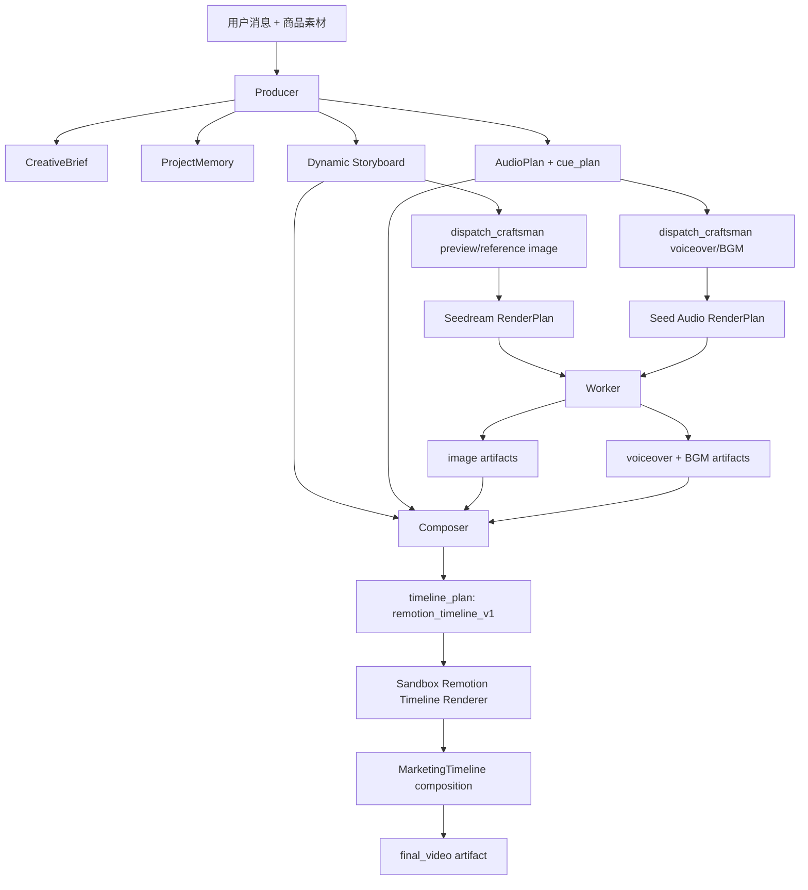

# Agent 可控 Remotion Timeline Composer 设计

**日期**：2026-07-03
**状态**：待审阅
**范围**：把 Remotion 从单 shot 图片动效 provider 升级为 Agent 可控的最终视频排版和剪辑引擎

## 背景

ClipAnvil 当前已经具备完整 Agent 视频生成链路：

```text
Producer -> CreativeBrief / ProjectMemory / Storyboard / AudioPlan
Craftsman -> RenderPlan
Worker / Production -> Seedream / Seedance / Volcengine audio / internal motion provider
Composer -> timeline_plan + ffmpeg final render
Reviewer -> quality gate
```

M11/M12 引入了 `motion_shot_video`，将用户禁止 Seedance 时的 `shot_video` 路由到 `internal_motion_video/remotion-motion-shot-v1`。这条纵切证明了 Remotion 可以在 sandbox 中运行，但当前能力边界很窄：

- Remotion 只作为 `image_to_motion_video` provider，输入一张或几张图片，输出一段 silent shot video。
- Remotion composition 固定为 `MotionShot`，只支持渐变背景、图片平移缩放、简单文字层。
- 最终成片仍由 Composer 的 ffmpeg 模板 `simple_concat` / `concat_with_fades` 完成。
- 字幕、音频、转场、全片节奏和多素材排版没有进入 Remotion 的时间线模型。

用户真正想要的低成本视频路线是：

```text
Seedream 生成多张商品/场景/细节图
火山生成旁白和 BGM
Producer 生成动态分镜与 cue plan
Composer 根据 cue plan 把图片、视频、文字、字幕、音频和转场排成一条吸引眼球的营销视频
```

因此下一步应把 Remotion 放到 **Composer final render** 层，而不是继续只做每个 shot 的轻动效视频。

## Remotion 能力依据

调研 Remotion 官方文档后，Remotion 适合承担 ClipAnvil 的参数化视频排版和渲染层：

- Remotion 支持通过 props 生成参数化视频；`renderMedia()` 可在服务端程序化渲染视频或音频，`inputProps` 必须是 JSON 对象。
  参考：https://www.remotion.dev/docs/renderer/render-media
- `<Sequence>` 用于把组件放到指定时间范围，适合表达全片 timeline、shot segment、字幕层和音频层。
  参考：https://www.remotion.dev/docs/sequence
- `<Html5Audio>` 支持音频 trim、loop、muted、playbackRate 等属性，适合把旁白和 BGM 放进同一条 Remotion composition。
  参考：https://www.remotion.dev/docs/audio
- `@remotion/transitions` 提供 `<TransitionSeries>`，适合在多个 scene/shot 之间做受控转场。
  参考：https://www.remotion.dev/docs/transitions/

设计结论：ClipAnvil 不应该让 Agent 写任意 Remotion/React 源码，而应该提供一组受控 Remotion components 和 layouts，让 Agent 通过 `RemotionTimelinePlan` JSON 控制它们。

## 设计目标

- 让 Remotion 成为低成本营销视频的最终排版和剪辑引擎。
- 保留 Producer 动态分镜能力，不退化为固定 30 秒模板。
- 让 Composer 根据 AudioPlan cue plan 做音画同步，而不是只按素材长度拼接。
- 支持一条 20-45 秒竖屏广告由多张 Seedream still、已有视频、旁白、BGM、字幕、卖点文字和转场组成。
- 降低 no-Seedance 路线成本：低成本主线不再要求每个 shot 都先生成 `motion_shot_video`。
- 保留 `motion_shot_video` 作为单 shot fallback 或局部 preview 能力，但不再把它作为 Remotion 主能力。
- 所有渲染仍在 sandbox 中执行，产物仍通过现有 storage / artifact / timeline_plan / final_output 持久化。

## 非目标

- 不让 Agent 生成、修改或执行任意 TSX/React 代码。
- 不做用户可视化时间线编辑器。
- 不删除 Seedance。Seedance 仍用于真实复杂运动、人物表演、物理运动或高价值 hero shot。
- 不把 Remotion 当作文生视频模型。Remotion 负责排版、动画、转场、字幕和音频时间线，不负责凭空生成真实画面内容。
- 不在第一版做自动语义视觉审核；Reviewer 可以先基于 metadata、cue plan 和 artifact probe 做规则检查，后续再接视觉理解模型。
- 不在第一版做复杂音频 sidechain 压缩；P0 以旁白主轨、BGM 低音量和淡入淡出保证可听性，必要时保留 ffmpeg fallback。

## 方案比较

### 方案 A：继续扩展 `motion_shot_video`

做法：给现有 `MotionShot` component 增加更多 layout、text animation 和 transitions，每个 shot 先生成一段 Remotion silent video，再由 ffmpeg Composer 拼接。

优点：

- 改动最小。
- 沿用现有 provider、sandbox job 和 render_plan 提交流程。
- 每个 shot 可独立生成、独立审核。

缺点：

- 全片字幕、音频和转场仍不在 Remotion 内。
- 多 shot 之间无法共享 timeline、节奏、字幕 lane 和音频 cue。
- 仍然会产生“像几张卡片拼起来”的感觉。
- 音画同步问题只能在 Composer ffmpeg 层补救。

结论：适合保留为 fallback，不适合作为主方向。

### 方案 B：Composer 使用 Remotion 渲染完整 final video

做法：新增 `remotion_timeline_v1` timeline template。Composer 读取 Storyboard、AudioPlan、Seedream 图片、已有视频、voiceover、BGM，创建 `RemotionTimelinePlan`，然后 sandbox 调用 Remotion 渲染最终成片。

优点：

- 真正用上 Remotion 的 timeline、Sequence、Audio、字幕、转场和 React 布局能力。
- Agent 控制的是 JSON，不是源码，安全边界清晰。
- Seedream still 可以直接进入最终视频，减少中间 motion shot 生成步骤。
- 字幕和 cue plan 可成为同一条 timeline 的事实源。
- 对 no-Seedance 低成本路线最贴合。

缺点：

- Composer、timeline plan schema、sandbox renderer 和 Remotion component 都要升级。
- 需要重新定义 still/video/audio/caption/layout 的 JSON 合同。
- 第一版要控制 layout 数量，避免一下子做成开放式编辑器。

结论：推荐方案。

### 方案 C：Agent 生成 Remotion 代码

做法：让 Composer 或 Craftsman 根据用户需求生成 TSX 文件，再在 sandbox 中渲染。

优点：

- 理论上表达能力最强。
- Agent 可以创造完全新样式。

缺点：

- 安全风险高，代码执行边界复杂。
- 可复现、可审核、可测试都很差。
- 容易产生依赖缺失、布局崩坏、运行时错误。
- 不符合 ClipAnvil 当前“领域事实和 RenderPlan 可审计”的架构。

结论：不采用。

## 核心决策

1. 新增 Composer template：`remotion_timeline_v1`。
2. Composer 继续写 `timeline_plan`，但 `plan_json` 从 ffmpeg segments 扩展为 `RemotionTimelinePlan`。
3. `render_timeline_template` 工具保留，新增对 `remotion_timeline_v1` 的渲染分支。
4. 新增 sandbox Remotion timeline renderer，独立于现有 `remotion-motion-shot`。
5. no-Seedance 低成本主线优先使用 Seedream still + Remotion final timeline，不强制生成每个 shot 的 `motion_shot_video`。
6. `motion_shot_video` 保留为单 shot fallback、局部 preview 或需要产出 shot video artifact 的场景。
7. `AudioPlan.cue_plan` 是最终字幕和音画同步的第一事实源。
8. Remotion components 是受控库，Agent 只能选择 layout、motion、transition 和文案字段。

## 总体架构



## Agent 分工

### Producer

Producer 仍然负责总导演和制片职责：

- 理解用户目标、商品、素材、平台和成本约束。
- 创建或更新 `CreativeBrief`。
- 创建或更新 `ProjectMemory`，记录路线策略，例如 `low_cost_remotion_timeline`、`seedance_forbidden`、`seedream_allowed`、`volcengine_audio_required`。
- 根据商品自动决定 scene / shot 数量，不使用固定模板。
- 为每个 shot 写清：
  - `narrative_purpose`
  - `duration_sec`
  - `visual_intent`
  - `action_text`
  - `camera_intent`
  - `narration`
  - 需要的 still image 策略，例如 hero、wheel close-up、open interior、material detail、CTA packshot。
- 创建 `AudioPlan`，其中 `cue_plan` 必须引用真实 `shot_ref`。
- 确保 cue 文案、视觉重点和图片生成策略一致。
- 调度 Craftsman 生成需要的 Seedream still 和火山音频。
- 在素材足够后调度 Composer，指定 `template_key=remotion_timeline_v1`。

Producer 不直接写 Remotion timeline JSON；它只提供创意事实和同步合同。

### Craftsman

Craftsman 继续负责素材生产计划：

- `preview_image` / `reference_image`：根据 shot 的 visual intent 生成 Seedream 图片 RenderPlan。
- `voiceover_audio` / `bgm_audio`：根据 AudioPlan 生成火山音频 RenderPlan。
- `shot_video`：只在需要真实视频素材时使用 Seedance，或在特定 fallback 场景使用 `motion_shot_video`。

在 `remotion_timeline_v1` 主路线下，Craftsman 不需要为每个 shot 创建 Remotion motion shot video。很多 shot 只需要一张或多张 still image，最终动效由 Composer 的 Remotion timeline 完成。

### Worker / Production

Worker 保持现有职责：

- 执行 Seedream 图片生成。
- 执行火山音频生成。
- 执行 Seedance 或 `motion_shot_video`，如果某些 shot 仍需要视频素材。
- 记录 `generation_job`、`media_node`、`artifact_version` 和 `media_asset`。

Worker 不理解全片剪辑，不生成 timeline。

### Composer

Composer 是这次升级的核心：

- 读取 `get_composition_context`，获得 active shots、available assets、active AudioPlan、voiceover/BGM assets、历史 timeline plans。
- 按 `AudioPlan.cue_plan` 排列 segment 顺序和时间窗。
- 把每个 cue 映射到最合适的素材：
  - 有 matching shot video 时，可作为 video layer。
  - 有 matching preview still 时，作为 image layer。
  - 缺失视觉素材时 blocked，不静默用错误素材。
- 生成 `RemotionTimelinePlan`。
- 调用 `render_timeline_template(template_key=remotion_timeline_v1)`。
- 提交 final artifact。

Composer 不改写 Storyboard 或 AudioPlan；如果 cue 和素材语义冲突，应 blocked 或请求 Producer 返工。

### Reviewer

Reviewer 需要新增 Remotion final video 关注点：

- 字幕是否来自 AudioPlan cue 或 TTS alignment，而不是内部导演笔记。
- 每个 cue 的画面和口播是否讲同一个卖点。
- 字幕是否重叠、是否被商品遮挡、是否在安全区内。
- 旁白是否存在，BGM 是否盖过旁白。
- 画面是否明显重复，是否所有 shot 都使用同一张图。
- no-Seedance 请求下是否没有 Seedance video generation job。

第一版 Reviewer 可以先做规则审核和人工可解释报告；后续再接视觉理解模型做自动画面语义检查。

## `RemotionTimelinePlan` 数据契约

`timeline_plan.template_key`：

```text
remotion_timeline_v1
```

`timeline_plan.plan_json` 示例：

```json
{
  "schema": "clipanvil.remotion_timeline.v1",
  "composition": "MarketingTimeline",
  "output": {
    "width": 1080,
    "height": 1920,
    "fps": 30,
    "duration_sec": 34,
    "codec": "h264",
    "audio_codec": "aac"
  },
  "theme": {
    "brand_colors": ["#111827", "#F5C542"],
    "font_family": "Noto Sans CJK SC",
    "style": "premium_product_ad"
  },
  "segments": [
    {
      "id": "seg_shot_03_wheels",
      "shot_ref": "shot_03_wheels",
      "start_sec": 14,
      "end_sec": 22,
      "layout": "detail_focus",
      "visual_focus": "wheel_closeup",
      "assets": [
        {
          "role": "primary",
          "node_ref": "shot_03_wheels.preview_image.r1.node",
          "workspace_path": "/workspace/input/shot_03_wheels.png",
          "type": "image"
        }
      ],
      "motion": {
        "preset": "push_in_pan",
        "intensity": "medium",
        "direction": "left_to_right"
      },
      "text_layers": [
        {
          "role": "benefit_label",
          "text": "顺滑万向轮",
          "start_sec": 0.2,
          "end_sec": 3.0,
          "position": "upper_third",
          "animation": "kinetic_rise"
        }
      ],
      "caption": {
        "source": "audio_cue",
        "text": "顺滑万向轮，窄路转弯也轻松。",
        "start_sec": 0,
        "end_sec": 8,
        "position": "subtitle_bottom"
      },
      "transition_in": {
        "type": "slide",
        "duration_sec": 0.35
      },
      "transition_out": {
        "type": "wipe",
        "duration_sec": 0.3
      }
    }
  ],
  "audio_tracks": [
    {
      "id": "voiceover_main",
      "role": "voiceover",
      "node_ref": "audio_plan.active.voiceover.node",
      "workspace_path": "/workspace/input/voiceover.mp3",
      "start_sec": 0,
      "volume": 1
    },
    {
      "id": "bgm_main",
      "role": "bgm",
      "node_ref": "audio_plan.active.bgm.node",
      "workspace_path": "/workspace/input/bgm.mp3",
      "start_sec": 0,
      "volume": 0.22,
      "fade_in_sec": 0.8,
      "fade_out_sec": 1.2,
      "loop": true
    }
  ],
  "captions": {
    "source": "audio_plan.cue_plan",
    "single_lane": true,
    "max_chars_per_line": 14,
    "style": "commerce_subtitle"
  }
}
```

### 字段说明

| 字段 | 说明 |
| --- | --- |
| `schema` | timeline JSON 版本。 |
| `composition` | Remotion composition id，P0 固定为 `MarketingTimeline`。 |
| `output` | 输出宽高、fps、时长和 codec。 |
| `theme` | 全片品牌色、字体、广告风格。 |
| `segments` | 按全片时间排列的 shot/cue 片段。 |
| `segment.assets` | 已 staged 的图片或视频素材。 |
| `segment.layout` | 受控 layout key，不是任意 CSS。 |
| `segment.motion` | 受控动效 preset。 |
| `segment.text_layers` | 画面短卖点文案，不是完整口播字幕。 |
| `segment.caption` | 最终字幕，默认来自 AudioPlan cue。 |
| `transition_in/out` | 受控转场。 |
| `audio_tracks` | 旁白和 BGM。 |
| `captions` | 全片字幕策略。 |

## Layout 和 Motion 受控集合

P0 只实现少量稳定 layout，避免变成开放式编辑器。

### Layout

| Key | 用途 |
| --- | --- |
| `hero_packshot` | 商品主视觉，适合开头或 CTA。 |
| `detail_focus` | 局部细节，例如轮子、拉杆、锁扣、材质。 |
| `benefit_card` | 一张图 + 大卖点文案。 |
| `split_compare` | 左右或上下对比，例如普通箱 vs 悦行箱。 |
| `scenario_card` | 场景图 + 商品/卖点叠层。 |
| `open_storage` | 打开箱体、收纳、容量展示。 |
| `cta_endcard` | 结尾品牌、CTA、购买引导。 |

### Motion

| Key | 用途 |
| --- | --- |
| `push_in` | 商品推进。 |
| `pull_out` | 从细节拉到整体。 |
| `pan_left` / `pan_right` | 横向扫过细节。 |
| `float_parallax` | 多层图片轻视差。 |
| `spotlight_reveal` | 卖点聚焦。 |
| `kinetic_text` | 卖点文字节奏动画。 |
| `cta_pop` | CTA 强调。 |

### Transition

| Key | 用途 |
| --- | --- |
| `cut` | 快节奏硬切。 |
| `crossfade` | 柔和过渡。 |
| `slide` | 社媒广告常见横/竖滑。 |
| `wipe` | 信息卡片切换。 |
| `zoom_blur` | 重点转场，谨慎使用。 |

## 现有 Composer 工具改造

### `dispatch_composer`

当前 `template_key` enum 只有：

```text
simple_concat
concat_with_fades
```

需要新增：

```text
remotion_timeline_v1
```

Producer 在低成本 Remotion timeline 主线下应派发：

```json
{
  "template_key": "remotion_timeline_v1",
  "instructions": "使用 AudioPlan cue_plan 对齐分镜、旁白、字幕和 BGM；Seedream still 作为主要视觉素材；不要要求每个 shot 都有 shot_video。"
}
```

### `get_composition_context`

当前 context 已返回：

- `available_composition_assets`
- active shot video 或 preview still
- active AudioPlan
- voiceover/BGM assets
- `timeline_plan_schema`

需要扩展：

- 将 still 从 fallback 升级为 first-class asset。
- 返回每个 shot 的 `visual_intent`、`narrative_purpose`、`duration_sec`、`sort_order`。
- 返回 shot 与 media_node 的完整 semantic refs。
- 返回 AudioPlan cue plan，并明确每个 cue 的 `shot_ref`、`text`、`caption`、`visual_intent`。
- 返回 `remotion_timeline_schema`，包含 layout/motion/transition 枚举。

### `create_timeline_plan`

保持不变，允许 `template_key=remotion_timeline_v1`。

### `render_timeline_template`

保持工具名，但内部根据 `template_key` 分流：

```text
simple_concat / concat_with_fades -> existing ffmpeg renderer
remotion_timeline_v1 -> new Remotion timeline renderer
```

这样 Composer 工具协议不用新增太多工具，现有 graph 和 submit flow 可以复用。

### `submit_composition_artifact`

保持不变。Remotion renderer 输出 `/workspace/output/final-<timeline>.mp4` 后，仍由该工具上传和持久化。

## Sandbox Remotion Timeline Renderer

新增独立 sandbox project：

```text
sandbox-image/remotion-timeline/
  package.json
  src/index.tsx
  src/MarketingTimeline.tsx
  src/layouts/
  src/motion/
  src/schema.ts
  src/render.mjs
```

不复用 `sandbox-image/remotion-motion-shot`，避免单 shot provider 和 final composer 混在一起。

### 渲染流程

1. Composer stage media 到 `/workspace/input`。
2. Composer 创建 `timeline_plan`。
3. `render_timeline_template` 调用 sandbox renderer。
4. 服务端将 `RemotionTimelinePlan` 写入 sandbox，例如：

   ```text
   /workspace/remotion-timeline/<job_id>/timeline-plan.json
   ```

5. sandbox 执行：

   ```bash
   node /opt/clipanvil/remotion-timeline/src/render.mjs \
     --props /workspace/remotion-timeline/<job_id>/timeline-plan.json \
     --out /workspace/output/final-<timeline_id>.mp4
   ```

6. `render.mjs` 使用 Remotion renderer API 或 CLI 渲染 `MarketingTimeline`。
7. 检查输出 MIME、大小、时长。
8. `submit_composition_artifact` 上传并回填 `timeline_plan`。

### 为什么用 Node renderer wrapper

当前 `motion_shot` 直接执行 Remotion CLI：

```text
remotion render ... --props=motion-plan.json
```

新 timeline renderer 建议使用 `render.mjs` 包一层，原因：

- 可以在渲染前做 JSON schema validation。
- 可以统一选择 composition、codec、audioCodec、concurrency 和 chromium path。
- 可以输出更结构化的日志，便于 sandbox job 排障。
- 后续可以加入 `renderStill()` 做 frame preview 或 E2E 截帧验证。

## Remotion Component 设计

### `MarketingTimeline`

职责：

- 根据 `output.duration_sec` 计算 `durationInFrames`。
- 渲染全局背景和 theme。
- 遍历 `segments`，用 `<Sequence>` 放置每段内容。
- 根据 `layout` 选择受控 React component。
- 根据 `transition` 使用 `@remotion/transitions` 或 P0 自研轻量 transition。
- 渲染字幕 lane。
- 渲染 voiceover 和 BGM。

### Layout components

每个 layout 只接收受控 props：

```ts
type SegmentLayoutProps = {
  segment: RemotionSegment;
  theme: RemotionTheme;
  fps: number;
};
```

P0 不允许 layout 执行外部 URL、任意 JS 或 CSS 字符串。所有素材必须来自 staged workspace path，并转换为 `staticFile()` 可读路径。

### Captions

字幕策略：

- 默认只渲染一个字幕 lane。
- 字幕文本来自 `segment.caption.text`。
- 不使用 `segment.text_layers` 作为完整字幕。
- `text_layers` 是营销短文案，例如“顺滑万向轮”“轻便好推”。
- 如果未来 TTS 接口返回 word timestamp，caption 可以从 `audio_alignment` 生成更细粒度字幕。

### Audio

P0：

- voiceover 使用 `<Html5Audio>`，start at 0。
- BGM 使用 `<Html5Audio loop>`，低音量、淡入淡出。
- 输出 AAC。

P1：

- 支持按 cue 或 phrase 做 caption timing。
- 如果 Remotion 音频混合无法满足 ducking，允许 renderer 在 Remotion 输出后用 ffmpeg 做一次受控 audio post-process，但 timeline_plan 仍然是事实源。

## 音画同步策略

### P0 同步合同

`AudioPlan.cue_plan` 是同步合同：

```json
{
  "shot_ref": "shot_03_wheels",
  "start_sec": 14,
  "end_sec": 22,
  "text": "顺滑万向轮，窄路转弯也轻松。",
  "caption": "顺滑万向轮",
  "visual_intent": "wheel close-up"
}
```

Composer 做以下校验：

- 每个 cue 必须能找到同名 shot。
- 每个 cue 必须能找到 shot 对应素材。
- cue 的 `caption` 用于字幕，不允许使用 `narrative_purpose`、`visual_intent`、`action_text` 等内部字段做字幕。
- 如果 voiceover 实际时长和 AudioPlan 目标时长不同，按实际 voiceover duration 等比例缩放 cue windows。

### P1 字幕时间戳

如果火山音频接口或替代音频对齐流程能返回字幕/字词时间戳，则新增：

```json
{
  "audio_alignment": {
    "source": "tts_subtitle",
    "items": [
      {"text": "顺滑", "start_sec": 14.1, "end_sec": 14.6},
      {"text": "万向轮", "start_sec": 14.6, "end_sec": 15.3}
    ]
  }
}
```

Composer 优先使用 alignment 生成字幕，cue_plan 仍作为 shot-level 同步和视觉选择合同。

## 低成本主线的新链路

### 当前 no-Seedance 链路

```text
Storyboard
  -> Seedream preview image
  -> Remotion motion_shot_video per shot
  -> Composer ffmpeg concat
  -> final video
```

### 新 no-Seedance 链路

```text
Storyboard + AudioPlan cue_plan
  -> Seedream preview/reference/detail images
  -> Volcengine voiceover/BGM
  -> Composer RemotionTimelinePlan
  -> Remotion final render
  -> final video
```

关键变化：

- `shot_video` 不再是 Composer 的硬前置条件。
- still image 是 Remotion timeline 的一等输入。
- 单个 shot 的 motion 不再通过 `motion_shot_video` 预渲染，而是在最终 timeline 内完成。
- 全片转场、字幕、文字层和音频都在一个 Remotion composition 中处理。

## 与 Seedance 路线的关系

Seedance 路线保留：

- Producer 仍可为 hero shot 或复杂动作 shot 派发 `seedance_2_video`。
- Composer Remotion timeline 可以混入 Seedance 生成的视频片段。
- 即使使用 Seedance，最终字幕、BGM、CTA、包装动效和画面排版也可由 Remotion final composer 统一完成。

混合路线：

```text
Hero shot: Seedance video
Benefit/detail/CTA shots: Seedream still
Final composer: Remotion timeline
```

这比“全 Seedance 视频拼接”更省钱，也比“纯 still 卡片”更有动态感。

## 数据和代码改造点

### 数据库

不需要新增核心表。复用：

- `timeline_plan.template_key`
- `timeline_plan.plan_json`
- `timeline_plan.render_settings`
- `timeline_plan.result`
- `media_node`
- `artifact_version`
- `media_asset`
- `sandbox_job`

可能需要调整约束或 enum：

- 如果 `template_key` 有 DB check constraint，加入 `remotion_timeline_v1`。
- 如果没有 DB check，只需工具层 enum 放开。

### Go 后端

主要改动：

- `apps/server/internal/agent/tools/dispatch_composer_native.go`
  - `TemplateKey` enum 加 `remotion_timeline_v1`。
- `apps/server/internal/agent/tools/composer_native.go`
  - template 常量加 `composerTemplateRemotionTimeline`。
  - `RenderTimelineTemplate` 根据 template key 分流。
  - 新增 `SandboxRemotionTimelineRenderer` 或在现有 renderer 中组合两个 renderer。
  - `timeline_plan_schema` 增加 Remotion schema。
- `apps/server/internal/agent/composer/tool_context_provider.go`
  - still asset 一等化。
  - 给 Composer 返回 shot 创意字段和 cue 映射所需 metadata。
- `apps/server/internal/agent/composer/system_prompt.go`
  - Phase 1 从 ffmpeg-only 改为支持 Remotion timeline。
  - 明确 `remotion_timeline_v1` 下优先用 cue_plan 和 still assets。
- `apps/server/internal/agent/composer/model_responder.go`
  - deterministic fallback 需要能生成 RemotionTimelinePlan。
- `apps/server/internal/sandbox/`
  - 新增 `RenderRemotionTimeline` job service。

### Sandbox image

新增：

- `sandbox-image/remotion-timeline/package.json`
- `sandbox-image/remotion-timeline/src/index.tsx`
- `sandbox-image/remotion-timeline/src/render.mjs`
- `sandbox-image/remotion-timeline/src/schema.ts`
- `sandbox-image/remotion-timeline/src/layouts/*`

### Agent skills

新增或修改：

- `remotion-timeline-composer`
  - Composer 用，指导生成 `RemotionTimelinePlan`。
- `composer-timeline-director`
  - 增加 Remotion template 分支，不再只强调 ffmpeg。
- `motion-shot-producer`
  - 更新：no-Seedance 主线优先 Remotion final timeline，不再必须每个 shot 都生成 `motion_shot_video`。
- `motion-shot-craftsman`
  - 保留但定位为单 shot fallback。
- `ffmpeg-audio-mix-composer`
  - 保留为 fallback，不是 Remotion 主线必需 skill。

## Producer / Composer prompt 调整

### Producer system prompt

需要新增规则：

- 如果用户要求低成本、no-Seedance、图片动效、Remotion 成片，优先走 `remotion_timeline_v1` final composer。
- 不要把 no-Seedance 理解为“所有 shot 都必须生成 motion_shot_video”。
- 每个 cue 必须绑定 visual asset strategy。
- 生成图片时要按卖点生成差异化 still：轮子、收纳、材质、整箱、CTA，而不是重复整箱图。
- 派发 Composer 时使用 `template_key=remotion_timeline_v1`。

### Composer system prompt

需要新增规则：

- `remotion_timeline_v1` 下，still image 是一等素材，不是 fallback。
- 使用 AudioPlan cue order 作为 primary timeline。
- `caption` 只能来自 cue caption/text 或 alignment，不允许来自 shot internal planning fields。
- 如果 cue 讲万向轮但素材是收纳内景，应 blocked 或请求 Producer 修正素材。
- 每段 segment 必须选择 layout、motion、transition。
- 不要生成 arbitrary CSS/TSX；只填 schema 支持字段。

## 错误处理

### Missing asset

如果 cue 对应 shot 没有可用 still/video：

- Composer 标记 `timeline_plan.status=blocked`。
- error message 指出缺失的 `shot_ref` 和需要的素材类型。
- Producer 后续派 Craftsman 补图。

### Cue / asset mismatch

如果 cue 文案和素材 metadata 明显冲突：

- P0：Composer blocked，并说明例如“cue=万向轮，但 shot_03 当前 winner 为 open_storage”。
- P1：Reviewer 用视觉理解模型确认。

### Remotion render failure

- sandbox job 标记 failed。
- `timeline_plan.status=failed`。
- result 中记录 command、stderr 摘要、timeline schema validation 错误。
- Producer 可派 Composer 修复 timeline plan。

### Audio missing

如果 AudioPlan 要求 voiceover/BGM 但资产缺失：

- Composer blocked，不生成静音最终视频。
- 不允许为了完成任务静默丢音频。

## 测试与验证

### 单元测试

- `composer_native`：
  - enum 接受 `remotion_timeline_v1`。
  - ffmpeg template 仍走旧 renderer。
  - remotion template 走新 renderer。
- `RemotionTimelinePlan` validation：
  - 缺 segment 失败。
  - 缺 asset 失败。
  - caption 使用内部字段失败或被拒绝。
  - segment 时间重叠或超出 duration 失败。
- `ToolContextProvider`：
  - still assets 可作为 first-class composition assets。
  - 返回 shot metadata 和 cue plan。
- `model_responder`：
  - 根据 cue plan 生成 segment order。
  - 使用 cue caption 而不是 shot purpose。

### Sandbox 测试

- 使用 fixture 图片 + fixture voiceover/BGM 渲染 10 秒视频。
- `ffprobe` 验证：
  - 有 video stream。
  - 有 audio stream。
  - duration 接近 timeline duration。
  - 分辨率为 1080x1920。

### E2E 测试

真实 Agent 浏览器 E2E：

输入：

```text
用桌面 box.png 生成一个 30 秒以上的悦行行李箱口播广告。
不要调用 Seedance。
图片可以用 Seedream。
旁白和 BGM 用火山。
最终成片用 Remotion 做排版、动画、字幕、转场和音频时间线。
```

验收：

- `generation_job` 中没有 Seedance video job。
- 有多张 Seedream 图片，至少覆盖 hero、wheel/detail、storage/interior、CTA。
- 有 voiceover 和 BGM audio job。
- `timeline_plan.template_key=remotion_timeline_v1`。
- final video duration >= 30s。
- final video 有 audio stream。
- 字幕不包含“短途出行痛点钩子”“前三秒抓住用户注意”等内部文案。
- 在万向轮 cue 时间窗内使用 wheel/detail 相关素材。
- 在收纳 cue 时间窗内使用 open storage/interior 相关素材。

## 里程碑拆分

详细里程碑、阶段任务、交付标准和验收标准，见 `docs/milestones/m13-remotion-timeline-composer.md`。
可直接复制给 Codex 逐阶段执行的 goal 文本，见 `docs/milestones/m13-remotion-timeline-composer-goals.md`。

阶段摘要：

- M13.1：Remotion Timeline Renderer 纵切。
- M13.2：Composer Agent 接入。
- M13.3：营销 layout 和 cue 同步增强。
- M13.4：Seedance 混合路线。

## 风险与取舍

### 风险：JSON schema 过宽导致效果不可控

缓解：

- P0 只开放有限 layout/motion/transition。
- 所有字段做 schema validation。
- Agent 不写 CSS，不写 TSX。

### 风险：Remotion 音频 ducking 不如 ffmpeg 灵活

缓解：

- P0 使用低 BGM volume 和 fade 保证旁白清晰。
- P1 如需精细 ducking，可在 Remotion render 后做受控 ffmpeg post-process，但 timeline_plan 仍是事实源。

### 风险：Composer 仍可能选错素材

缓解：

- Producer 写入明确 visual asset strategy。
- Craftsman 图片 RenderPlan 必须生成对应卖点图。
- Composer 做 cue/asset metadata 校验，不确定就 blocked。
- Reviewer 后续接视觉理解。

### 风险：和现有 `motion_shot_video` 职责重叠

缓解：

- 明确分层：
  - `motion_shot_video`：单 shot video artifact。
  - `remotion_timeline_v1`：final video timeline renderer。
- no-Seedance 主线优先 final timeline，只有确实需要 shot-level artifact 时才用 motion shot。

## 成功标准

一次真实 Agent E2E 能做到：

- Producer 动态创建 4-9 个 shot。
- AudioPlan cue plan 和 shot_ref 对齐。
- Craftsman 生成多张差异化 Seedream still。
- 火山生成 voiceover/BGM。
- Composer 创建 `remotion_timeline_v1`。
- Remotion 输出 30 秒以上最终视频。
- final video 有音频、有字幕、有转场、有差异化画面。
- DB 可审计：没有 Seedance 调用，或混合路线中只有明确授权的 Seedance hero shot。

## 后续问题

需要用户或实现阶段确认的问题：

- P0 是否允许 Remotion renderer 后接一次 ffmpeg 音频 post-process，还是必须完全由 Remotion 输出最终音频。
- P0 是否保留 `motion_shot_video` 在 no-Seedance 主线中的自动派发，还是改为只生成 stills + final timeline。
- TTS 字幕时间戳接入是否进入 M13，还是先用 AudioPlan cue scaling。

建议默认决策：

- P0 允许必要的 ffmpeg post-process，但只作为 renderer 内部实现细节。
- P0 不再自动为每个 shot 派发 `motion_shot_video`。
- TTS 字幕时间戳放到 M13.3，M13.1/M13.2 先使用 cue scaling。
