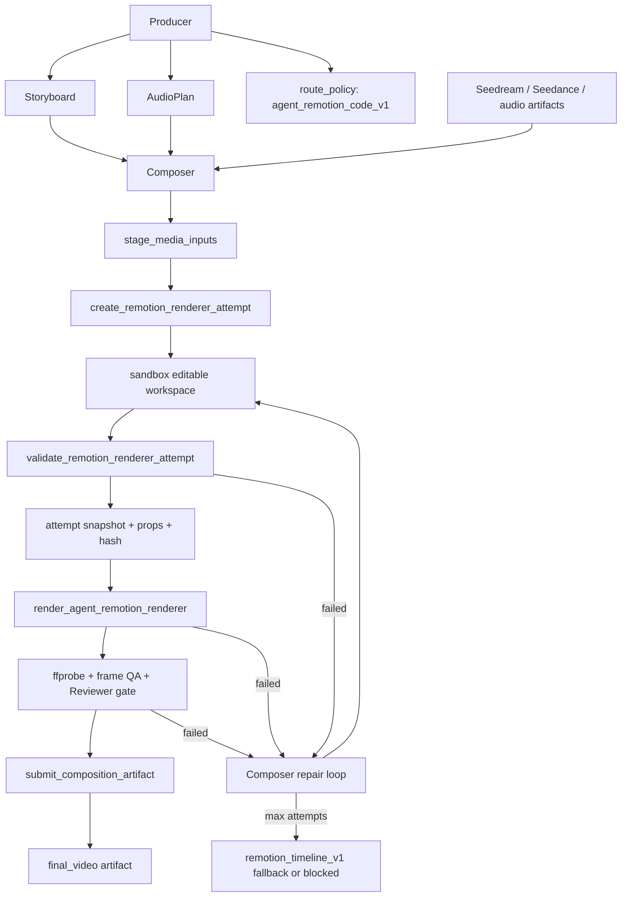

# Agent 动态 Remotion 渲染代码设计

**日期**：2026-07-04
**状态**：已落地（M14.1-M14.6，2026-07-05）
**范围**：在现有 sandbox / Composer / timeline_plan 链路上，新增 Agent 可生成 Remotion 渲染代码的高级成片路线

## 背景

`remotion_timeline_v1` 已经把 Remotion 接到 Composer final render 层。它的核心形态是固定 `MarketingTimeline` renderer 加结构化 JSON plan：Agent 可以选择 segment、layout、motion、transition、素材、字幕和音轨，但不能编写 Remotion / React 代码。

这条路线稳定、可审计，适合作为 baseline renderer 和失败 fallback。但它仍然会带来明显的模板家族感：

- renderer 代码固定，视觉语言固定。
- layout / motion / transition 是白名单枚举。
- 新广告风格需要工程侧先实现组件。
- Agent 无法根据用户诉求临场创造新的画面结构、视觉节奏和品牌表达。

用户期望的是：Agent 能结合用户诉求、Storyboard、AudioPlan、ProjectMemory、已生成素材和平台目标，动态写出一套 Remotion 渲染脚本，让每条视频在视觉系统、排版和动效上有更强差异。

当前底层能力已经足够支撑这一步：

- OpenSandbox workspace 已可执行隔离命令。
- Composer 已有 `stage_media_inputs`，能把对象存储素材 staging 到 `/workspace/input`。
- sandbox 镜像已能执行 Remotion CLI。
- `sandbox_job` 已有运行、失败、stdout/stderr、耗时和输出记录。
- `UploadCompositionOutput` / `submit_composition_artifact` 已能把 sandbox 输出上传并持久化为 final artifact。
- `timeline_plan` 已能保存成片计划、状态、sandbox job、artifact version 和 result metadata。

因此，本设计新增的是一条受控的 **Agent-authored Remotion renderer** 路线，而不是证明 Remotion 是否能运行。

## 设计目标

- 允许 Agent 为单次成片生成 Remotion 渲染代码，提升视觉多样性。
- 让生成代码只在 sandbox 中作为一次性 renderer artifact 执行，不进入主仓库源码。
- 复用现有 Composer 工具链：读取上下文、stage media、创建 timeline_plan、渲染、提交 artifact。
- 保留 `remotion_timeline_v1` 作为稳定 baseline、快速交付路线和失败 fallback。
- 使动态 renderer 可审计、可复现、可调试：保存代码快照、props、hash、生成 prompt、校验结果、渲染日志和产物元数据。
- 通过静态校验、依赖白名单、资源限制、输出校验和 Reviewer gate 控制风险。

## 非目标

- 不允许 Agent 修改仓库源码。
- 不允许 Agent 安装任意 npm 依赖。
- 不允许动态 renderer 访问网络。
- 不允许动态 renderer 读写 `/workspace` 之外路径。
- 不允许在第一版开放任意 Node API，例如 `fs`、`child_process`、`eval`、`Function`、动态 import。
- 不强制所有请求都走动态代码路线；Producer/Composer 应根据用户诉求、视觉定制需求、素材复杂度、耗时和失败风险选择路线。
- 不删除 `remotion_timeline_v1`、`motion_shot_video` 或 ffmpeg fallback。
- 不在第一版实现在线可视化代码编辑器。

## 方案比较

### 方案 A：继续扩展 `remotion_timeline_v1` DSL

继续增加 layout、motion、theme、keyframes、mask、grid 和 style tokens。

优点：

- 最稳定。
- 校验简单。
- Agent 输出仍是 JSON，生产风险低。

缺点：

- 每次新增表现力都需要工程实现。
- 长期仍会有模板家族感。
- Agent 不能真正根据一次性创意写出新结构。

结论：继续保留和增强，但它不解决“非模板化”核心诉求。

### 方案 B：Agent 生成受限 Remotion 代码，一次性 sandbox 渲染

Agent 生成 `GeneratedComposition.tsx` 和 `props.json`，后端保存快照并在 sandbox 中通过固定 harness 渲染。

优点：

- 视觉自由度最高。
- 可根据 Storyboard / AudioPlan / 素材临场设计画面。
- 不需要每种风格都提前工程化。
- 复用现有 sandbox、timeline_plan 和 artifact 链路。

缺点：

- 需要新增代码校验、安全限制和 QA gate。
- 失败率会高于固定 renderer。
- 调试和复现需要更完整的日志和快照。

结论：推荐作为高级动态路线：`agent_remotion_code_v1`。

### 方案 C：Agent 直接生成完整 Remotion 项目并安装依赖

Agent 可以生成 package.json、安装依赖、写任意代码。

优点：

- 表达力最大。

缺点：

- 安全和稳定性不可接受。
- 构建时间、依赖供应链、网络访问和复现风险过高。

结论：不采用。

## 核心决策

1. 新增 Composer template key：`agent_remotion_code_v1`。
2. `remotion_timeline_v1` 继续作为稳定 baseline、快速交付路线和失败 fallback，不再作为动态视觉路线的默认上限。
3. `agent_remotion_code_v1` 是非模板化视觉表达的主要能力。Producer/Composer 可以在用户明确要求非模板化、品牌定制、强视觉差异或 Agent 自写 Remotion 时选择它；也可以在普通请求中根据 Storyboard 复杂度、品牌表达需求、素材丰富度和用户可接受的耗时/失败风险主动选择它，并记录决策理由。
4. Agent 生成的代码不写入 repo；代码先进入 sandbox attempt 工作区用于编辑和编译，随后固化为 DB attempt snapshot 以便审计和复现。
5. sandbox 镜像预装固定 runtime 和依赖，Agent 只能提交受限 TSX 模块和 JSON props。
6. 渲染前必须通过静态校验和 TypeScript/Node 检查。
7. 渲染后必须通过 `ffprobe`、MIME/size/duration 校验和抽帧 QA。
8. 失败时自动进入修复循环，超过次数后 fallback 到 `remotion_timeline_v1` 或 blocked。

## 总体架构



## Runtime 形态

新增固定 sandbox runtime：

```text
sandbox-image/remotion-agent-runtime/
  package.json
  src/harness.tsx
  src/generated/GeneratedComposition.tsx
  src/generated/props.json
  src/validate.mjs
  src/render.mjs
```

固定 harness 负责：

- 注册 Remotion root。
- 加载 generated component。
- 传入 props。
- 限制 composition id，例如 `AgentGeneratedVideo`。
- 统一输出 metadata。
- 提供少量安全 helper，例如 `assetUrl(path)`、`fitText(...)`、`safeCaptionLines(...)`。

Agent 只生成：

```text
renderer files, for example:
  GeneratedComposition.tsx
  styles.ts
  copy.ts
props.json
```

Agent 不生成：

```text
package.json
node_modules
render.mjs
harness.tsx
Dockerfile
```

## Agent 生成代码合同

### `GeneratedComposition.tsx`

必须满足：

- 默认导出 React component 或命名导出 `AgentGeneratedComposition`。
- 只从允许模块 import：
  - `react`
  - `remotion`
  - 可选的本地 safe helper 包，例如 `../runtime/safe`
- 不使用外部 URL 作为媒体源。
- 所有媒体路径必须来自 props 中的 staged assets。
- 不使用浏览器或 Node 危险 API。
- 不定义无限循环或异步副作用。

示例结构：

```tsx
import React from "react";
import {AbsoluteFill, Img, Sequence, interpolate, staticFile, useCurrentFrame} from "remotion";

export function AgentGeneratedComposition(props) {
  const frame = useCurrentFrame();
  return (
    <AbsoluteFill>
      {props.segments.map((segment) => (
        <Sequence key={segment.id} from={segment.from} durationInFrames={segment.duration}>
          
        </Sequence>
      ))}
    </AbsoluteFill>
  );
}
```

### `props.json`

必须是 JSON，不允许代码。建议包含：

- `output`：width、height、fps、duration_sec。
- `brand`：品牌色、字体、调性。
- `segments`：每个 storyboard cue 的素材、文案、时间窗。
- `audio_tracks`：voiceover、BGM。
- `asset_manifest`：asset_id、node_ref、workspace_path、mime、role。
- `source_context`：storyboard id、audio_plan id、route policy。

## 新工具设计

### `create_remotion_renderer_attempt`

用途：为一次动态 renderer 生成或修复创建 attempt，并把文件写入 sandbox 编辑工作区。

输入：

- `timeline_plan_id`
- `renderer_artifact_id`，首次创建时可为空。
- `attempt_no`，首次为 1。
- `render_brief`
- `style_direction`
- `storyboard_summary`
- `audio_plan_summary`
- `asset_manifest`
- `constraints`
- `files`：文件名到内容的 map，例如 `{"GeneratedComposition.tsx": "...", "styles.ts": "..."}`。
- `props_json`
- `repair_from_attempt_id`，修复时填写。
- `repair_notes`，修复时填写编译或渲染错误摘要。

输出：

- `renderer_artifact_id`
- `renderer_attempt_id`
- `workspace_dir`
- `files_written`
- `props_json`
- `summary`

该工具不是唯一编辑方式。进入 sandbox 编辑工作区后，Composer 可以使用受控文件工具读取、修改当前 attempt 的文件，再重新 validate。工具职责是创建 attempt、初始化文件和登记元数据。

### `validate_remotion_renderer_attempt`

用途：对 sandbox 编辑工作区中的当前 attempt 做静态校验、类型检查和快照固化。

校验项：

- 文件大小限制，例如 source 总量 <= 150KB，单文件 <= 60KB，props <= 200KB。
- 文件数量限制，例如 renderer 文件 <= 8。
- import 白名单。
- 禁止 `fs`、`path`、`child_process`、`process.env`、`eval`、`Function`、`fetch`、`XMLHttpRequest`、`WebSocket`。
- 禁止动态 import。
- 禁止绝对路径媒体引用。
- props JSON schema 校验。
- TypeScript / syntax check。
- composition metadata 可计算。
- 将 sandbox 文件树读取为 snapshot，写入 `remotion_renderer_attempt`。

输出：

- `status=passed|failed`
- `errors`
- `warnings`
- `normalized_manifest`
- `source_snapshot`
- `source_hash`
- `props_hash`
- `compile_result`

### `render_agent_remotion_renderer`

用途：执行已通过校验的 attempt。渲染输入来自 sandbox 工作区，但渲染前必须已完成 DB snapshot。

流程：

1. 创建 sandbox job：`operation_type=render_agent_remotion_code`。
2. 使用 attempt 工作区：

   ```text
   /workspace/agent-remotion/<renderer_artifact_id>/<attempt_no>/
     GeneratedComposition.tsx
     props.json
   ```

3. 执行固定 runtime：

   ```bash
   node /opt/clipanvil/remotion-agent-runtime/src/render.mjs \
     --workdir /workspace/agent-remotion/<renderer_artifact_id>/<attempt_no> \
     --out /workspace/output/final-<timeline_plan_id>.mp4 \
     --browser-executable /usr/bin/chromium-headless-shell
   ```

4. 记录 stdout/stderr、exit code、duration。
5. inspect output MIME、size、duration、resolution、streams。

输出：

- `sandbox_job_id`
- `output_path`
- `mime`
- `size_bytes`
- `duration_sec`
- `renderer_artifact_id`
- `renderer_attempt_id`

## 数据持久化

动态 renderer 使用混合模型：

- DB 是持久事实源，保存每次 attempt 的快照、hash、校验、编译、渲染和 QA 结果。
- sandbox 文件是编辑态工作区，方便 Agent 根据编译错误做局部修改。
- 每次 validate/render 前后都要把当前工作区固化到 DB attempt，避免 sandbox 清理后无法复现。

### 推荐新增表：`remotion_renderer_artifact`

`remotion_renderer_artifact` 表示一次动态 renderer 任务的逻辑实体，不直接承载每次代码全文。

```sql
CREATE TABLE remotion_renderer_artifact (
    id UUID PRIMARY KEY DEFAULT gen_random_uuid(),
    workspace_id UUID NOT NULL REFERENCES workspace(id) ON DELETE CASCADE,
    timeline_plan_id UUID REFERENCES timeline_plan(id) ON DELETE SET NULL,
    agent_task_id UUID REFERENCES agent_task(id) ON DELETE SET NULL,
    template_key TEXT NOT NULL,
    status TEXT NOT NULL DEFAULT 'draft',
    current_attempt_id UUID,
    route_policy JSONB NOT NULL DEFAULT '{}'::jsonb,
    summary TEXT NOT NULL DEFAULT '',
    created_by_role TEXT NOT NULL DEFAULT 'composer',
    created_at TIMESTAMPTZ NOT NULL DEFAULT now(),
    updated_at TIMESTAMPTZ NOT NULL DEFAULT now()
);
```

### 推荐新增表：`remotion_renderer_attempt`

`remotion_renderer_attempt` 表示一次生成或修复尝试。这里保存代码快照，保证每一次 validate/render 都可复现。

```sql
CREATE TABLE remotion_renderer_attempt (
    id UUID PRIMARY KEY DEFAULT gen_random_uuid(),
    renderer_artifact_id UUID NOT NULL REFERENCES remotion_renderer_artifact(id) ON DELETE CASCADE,
    workspace_id UUID NOT NULL REFERENCES workspace(id) ON DELETE CASCADE,
    timeline_plan_id UUID REFERENCES timeline_plan(id) ON DELETE SET NULL,
    agent_task_id UUID REFERENCES agent_task(id) ON DELETE SET NULL,
    attempt_no INT NOT NULL,
    source_snapshot JSONB NOT NULL DEFAULT '{}'::jsonb,
    props_json JSONB NOT NULL DEFAULT '{}'::jsonb,
    source_hash TEXT NOT NULL DEFAULT '',
    props_hash TEXT NOT NULL DEFAULT '',
    workspace_dir TEXT NOT NULL DEFAULT '',
    status TEXT NOT NULL DEFAULT 'draft',
    validation_result JSONB NOT NULL DEFAULT '{}'::jsonb,
    compile_result JSONB NOT NULL DEFAULT '{}'::jsonb,
    render_result JSONB NOT NULL DEFAULT '{}'::jsonb,
    qa_result JSONB NOT NULL DEFAULT '{}'::jsonb,
    sandbox_job_id UUID REFERENCES sandbox_job(id) ON DELETE SET NULL,
    repair_from_attempt_id UUID REFERENCES remotion_renderer_attempt(id) ON DELETE SET NULL,
    repair_notes TEXT NOT NULL DEFAULT '',
    created_at TIMESTAMPTZ NOT NULL DEFAULT now(),
    updated_at TIMESTAMPTZ NOT NULL DEFAULT now(),
    UNIQUE(renderer_artifact_id, attempt_no)
);
```

P0 可以先把 snapshot 放 DB。后续如果动态 renderer 变成多文件大项目，再把 `source_snapshot` 上传 object storage，DB 保存 `snapshot_url`、manifest 和 hash。

推荐拆成 artifact + attempt 的原因：

- renderer artifact 可能有多轮修复。
- 同一个 timeline plan 可能对应多个 code attempts。
- 源码和 props 需要独立 hash、校验和审计。
- 后续可复现渲染或可视化 diff。
- Agent 修 bug 时可以在 sandbox 文件上做局部编辑，最终再把编辑结果固化为 attempt。

### `timeline_plan`

新增或复用：

- `template_key=agent_remotion_code_v1`
- `plan_json` 保存高层 render brief、asset manifest、style direction、renderer artifact id 和当前 attempt id。
- `result` 保存最终 renderer artifact、attempt、sandbox job、QA summary 和 fallback 信息。

## Sandbox 编辑工作区

每个 attempt materialize 到独立目录：

```text
/workspace/agent-remotion/<renderer_artifact_id>/<attempt_no>/
  GeneratedComposition.tsx
  props.json
  styles.ts
  ...
```

Composer 的修复循环：

1. 创建 attempt 并写入初始文件。
2. 调用 validator / typecheck。
3. 如果失败，读取错误和相关文件。
4. 使用受控 file 工具局部修改 sandbox 文件。
5. 重新 validate。
6. validate 通过后，将当前文件树 snapshot 写入 `remotion_renderer_attempt`。
7. 执行 render。

sandbox 文件不是长期事实源。它服务于“读错误、改一行、再编译”的工作流；DB attempt snapshot 才是可审计和可复现的持久事实源。

## 安全边界

### 代码静态限制

第一版禁止：

- 任意 Node builtin import。
- 网络访问。
- 动态 import。
- `eval` / `Function`。
- `dangerouslySetInnerHTML`。
- 任意外部 URL。
- 任意绝对文件路径。
- 读取 env。

允许：

- React function components。
- Remotion primitives：`AbsoluteFill`、`Sequence`、`Img`、`Video`、`Html5Audio`、`Audio`、`interpolate`、`spring`、`staticFile`、`useCurrentFrame`、`useVideoConfig`。
- 本地 safe helpers。

### Sandbox 限制

- 无网络，或仅保留已有 OpenSandbox 必要控制通道。
- 工作目录限制在 `/workspace/agent-remotion/<renderer_artifact_id>/<attempt_no>`。
- public dir 指向当前 staged workspace。
- 命令超时使用现有 `MaxExecTimeoutSeconds`。
- 输出只允许 `/workspace/output/*.mp4`。
- 输出大小沿用 `ValidateArtifactSize`。

### 失败策略

每个 timeline plan 最多允许：

- 2 次代码修复。
- 1 次 fallback 到 `remotion_timeline_v1`。

失败分类：

- `validation_failed`
- `typecheck_failed`
- `render_failed`
- `output_invalid`
- `qa_failed`
- `fallback_rendered`
- `blocked`

## QA 与 Reviewer Gate

动态 renderer 的 QA 不能只看 Remotion exit code。

P0 必须检查：

- MP4 有 video stream。
- 需要音频时有 audio stream。
- duration 与 AudioPlan / output 误差在可接受范围。
- resolution 符合 plan。
- 文件大小合理。
- 抽取 3-5 帧，确认非黑屏、非空白、非全透明。
- 字幕安全区：可先用规则检查 text layer metadata，后续加视觉检测。
- no-Seedance 合规：如果用户禁止 Seedance，generation_job 不能出现 Seedance video model。

Reviewer 应读取：

- renderer artifact summary。
- source hash / props hash。
- storyboard / audio cue alignment。
- ffprobe result。
- sampled frame thumbnails。
- route policy。

Reviewer 输出：

- `approved`
- `needs_revision`
- `blocked`
- 结构化 issues，例如 `blank_frame`、`caption_overlap`、`audio_missing`、`asset_mismatch`、`unsafe_route`。

## Agent 行为约束

### Producer

Producer 负责决定是否使用动态代码路线。这个决策不只来自用户显式关键词，也可以来自 Agent 对当前项目复杂度和视觉目标的判断。

以下情况应优先考虑 `agent_remotion_code_v1`：

- 用户明确要求不要模板化。
- 用户要求强品牌风格或独特视觉表达。
- 当前 `remotion_timeline_v1` layout 明显无法表达需求。
- Storyboard 包含多场景、多节奏、复杂视觉叙事，固定 `MarketingTimeline` 会明显模板化。
- mixed-cost 路线中既有 Seedance clips 又有 Seedream stills，需要更强的转场、遮罩、分屏、节奏设计来统一观感。
- 用户接受更高失败率和更长渲染时间。

以下情况可选择 `remotion_timeline_v1`：

- 用户强调快速、稳定、低风险交付。
- 素材少、结构简单，固定 timeline 已能满足表达。
- 动态 renderer 多次 validate/render/QA 失败，需要 fallback。

Producer 必须在 ProjectMemory 中记录：

- route policy。
- 选择动态或 baseline route 的理由。
- 用户是否接受动态代码路线的耗时、失败和 fallback 风险。
- fallback policy。

### Composer

Composer 是唯一可以创建动态 renderer 的角色。

Composer 必须：

- 先调用 `get_composition_context`。
- 先调用 `stage_media_inputs`。
- 基于 staged manifest 写代码，不编造路径。
- 创建 `timeline_plan(template_key=agent_remotion_code_v1)`。
- 创建 renderer artifact 和 attempt。
- 在 sandbox attempt 工作区写入或修改 renderer 文件。
- 调用 validator 并把通过校验的文件树固化为 DB snapshot。
- 通过后再 render。
- render 成功后 submit artifact。

Composer 不得：

- 要求 Craftsman 写 Remotion 代码。
- 让 generated code 下载远程素材。
- 修改源码仓库。
- 绕过 validation 直接 render。

### Craftsman

Craftsman 不写 Remotion TSX。它只负责生成素材 RenderPlan，例如 Seedream still、Seedance hero clip、voiceover、BGM。

## Agent Skill 调整

当前 Agent skill 已经能覆盖 `remotion_timeline_v1`、mixed-cost Seedance clips、Seedream stills、voiceover/BGM 和 final Remotion timeline review。但它们不能直接支持 `agent_remotion_code_v1`，原因是现有 Composer skill 明确禁止 raw Remotion code，工具列表也没有动态 renderer attempt 工具。

### 保持不变的边界

- Craftsman 类 skill 不写 Remotion TSX。`seedance-renderplan-craftsman`、`seedream-renderplan-craftsman`、`motion-shot-craftsman` 仍只负责素材 RenderPlan。
- `motion-shot-producer` 仍负责 no-Seedance / low-cost / motion-only 路由，不直接升级为动态 Remotion code 路由。
- `remotion-timeline-composer` 继续服务 `remotion_timeline_v1`，保留 “Do not create raw Remotion code” 约束。
- `ffmpeg-audio-mix-composer` 和 `platform-export-composer` 继续作为音频和平台导出辅助 skill，不负责生成 TSX。

### 需要新增或修改的 skill

#### 新增 `agent-remotion-code-composer`

用途：Composer 在 `template_key=agent_remotion_code_v1` 时加载，负责生成、校验、修复和渲染一次性 Remotion renderer。

工具列表应包含：

```text
get_composition_context
stage_media_inputs
probe_media
create_timeline_plan
update_timeline_plan_status
create_remotion_renderer_attempt
validate_remotion_renderer_attempt
render_agent_remotion_renderer
submit_composition_artifact
```

核心规则：

- 只在 `agent_remotion_code_v1` 路线下写 Remotion TSX。
- 先 stage media，再基于 staged manifest 写代码。
- 代码只写入 sandbox attempt 工作区，不写 repo。
- 优先局部 patch sandbox 文件修复编译错误，而不是每次全量重写。
- validate 通过并固化 DB attempt snapshot 后才 render。
- 不安装依赖，不访问网络，不引用外部 URL，不绕过 validator。
- render / QA 失败超过 attempt 上限后 fallback 到 `remotion_timeline_v1` 或 blocked。

#### 修改 `commerce-ad-producer`

当前 skill 已经有 no-Seedance、mixed-cost 和 premium 成本路由，但 final route 仍偏向 `remotion_timeline_v1`。需要增加：

- 当用户明确要求非模板化、品牌定制、强视觉差异或“让 Agent 写 Remotion 代码”时，Producer 应优先选择 `agent_remotion_code_v1`。
- 当用户没有明确要求非模板化时，Producer 也可以基于 Storyboard 复杂度、品牌表达需求、素材丰富度和交付风险自行选择 `agent_remotion_code_v1` 或 `remotion_timeline_v1`。
- Producer 必须在 ProjectMemory 中记录 route 选择理由、用户是否接受动态代码路线、失败 fallback、成本/耗时风险。
- `remotion_timeline_v1` 是 baseline/fallback，不再是普通低成本请求的唯一默认终点。
- mixed-cost 仍按现有规则：关键真实运动 shot 可用 Seedance，其余 cue 用 Seedream still，最终可由 `agent_remotion_code_v1` 或 `remotion_timeline_v1` 包装。
- dispatch Composer 时传 `template_key=agent_remotion_code_v1`，并在 instructions 中要求使用 staged assets、保存 renderer attempt、执行 validation 和 fallback。

#### 修改 `composer-timeline-director`

当前 skill 是通用 TimelinePlan skill，需要知道两条 Remotion final route：

- `remotion_timeline_v1`：固定 renderer + JSON plan，稳定 baseline/fallback。
- `agent_remotion_code_v1`：动态 renderer attempt，非模板化主能力，由 Agent 按项目需要选择。

新增要求：

- 当 template 是 `agent_remotion_code_v1` 时，必须加载 `agent-remotion-code-composer`，不能按 `remotion_timeline_v1` 的 JSON-only protocol 执行。
- 仍必须复用 AudioPlan cue plan、staged media、platform export 和 submit artifact 规则。
- 如果动态 renderer 无法满足平台或音频约束，允许 fallback 到 `remotion_timeline_v1` 或 ffmpeg fallback，但要记录原因。

#### 修改 `final-video-remotion-reviewer`

当前 reviewer 只描述 `remotion_timeline_v1`。需要扩展为同时支持 `agent_remotion_code_v1`：

- 读取 renderer artifact / attempt / source hash / props hash / validation result / compile result / render result。
- 检查动态 renderer 是否符合 route policy，特别是 no-Seedance 和 mixed-cost Seedance 使用数量。
- 检查 frame QA：非黑屏、非空白、字幕安全区、产品可见性、音频存在。
- 对动态代码路线新增 issue 类型：`unsafe_renderer_code`、`validation_failed`、`compile_failed`、`blank_frame`、`fallback_required`。
- Review 结果要明确说明最终视频来自固定 timeline renderer 还是 Agent-authored renderer。

#### 更新 skill registry / tests

实现阶段需要同步更新：

- skill library 新增 `agent-remotion-code-composer/SKILL.md`。
- skill registry 测试中加入新 skill 和新工具名。
- Composer tool schema 中 `template_key` enum 加入 `agent_remotion_code_v1`。
- `dispatch_composer` 的 schema / prompt / tests 同步接受新 template。

## 与现有路线关系

| 路线 | 用途 | 稳定性 | 自由度 | 默认性 |
| --- | --- | --- | --- | --- |
| `simple_concat` / `concat_with_fades` | 已有 clip 快速拼接 | 高 | 低 | fallback |
| `motion_shot_video` | 单 shot 图片动效 artifact | 中高 | 中低 | 局部能力 |
| `remotion_timeline_v1` | 稳定 baseline / 快速交付 / fallback | 高 | 中 | baseline/fallback |
| `agent_remotion_code_v1` | 非模板化动态 final video | 中 | 高 | Agent 决策优先路线 |

## 分阶段落地

### Phase 1：Spec 和合同

- 写清 `agent_remotion_code_v1` 的工具、数据、安全和 fallback 合同。
- 不改运行时代码。
- 验证：`git diff --check`。

### Phase 2：Renderer Artifact 与 Validation POC

- 新增 `remotion_renderer_artifact` 和 `remotion_renderer_attempt` 表与 sqlc query。
- 新增 validator package。
- 用 fixture source/props 测试 import 白名单、禁止 API、hash、schema。
- 验证 sandbox 工作区文件树可以固化为 DB attempt snapshot。
- 验证：Go unit tests。

### Phase 3：Sandbox Runtime POC

- 新增 `sandbox-image/remotion-agent-runtime`。
- 用固定 fixture TSX 渲染 MP4。
- 接入 sandbox job service：`RenderAgentRemotionCode`。
- 验证：node check、sandbox smoke、ffprobe。

### Phase 4：Composer Tools

- 新增 `create_remotion_renderer_attempt`、`validate_remotion_renderer_attempt`、`render_agent_remotion_renderer`。
- `create_timeline_plan` / `render_timeline_template` 接受 `agent_remotion_code_v1`。
- Composer deterministic fallback 不走动态代码，只 fallback 到 `remotion_timeline_v1`。
- 验证：agent tools unit tests。

### Phase 5：Agent Route 与 E2E

- Producer prompt / skill 增加动态代码路线选择规则。
- Composer prompt / skill 增加动态 renderer 编写规范。
- Reviewer 增加动态 renderer QA rubric。
- 浏览器 E2E：用户要求非模板化 Remotion 成片，或 Agent 基于复杂 Storyboard 主动选择动态 route 并记录理由。
- 验证：DB route audit、ffprobe、抽帧、Reviewer record。

## 验收标准

第一版完成时必须满足：

- Agent 选择动态路线后，能创建 `timeline_plan.template_key=agent_remotion_code_v1`，并在 ProjectMemory 或 timeline result 中记录 route rationale。
- 生成的 Remotion files 和 props 先进入 sandbox attempt 工作区，再被持久化为 DB attempt snapshot，有 hash 和 validation result。
- sandbox 能用 generated renderer 渲染 final MP4。
- output artifact 通过 production persistence 成为 final video。
- 失败时不会破坏 workspace，可 fallback 到 `remotion_timeline_v1` 或记录 blocked。
- no-Seedance 请求下不会调用 Seedance video provider。
- 至少一个 smoke fixture 证明动态 renderer 视觉结构不同于固定 `MarketingTimeline` layout。

## 开放问题

- 是否在 P0 要求人类确认后才执行 generated code，还是只要求用户在 route 层确认一次。M14.6 暂未强制 HITL；后续可按风险等级补确认卡。
- source code 是否只存 DB，还是同步上传到 object storage 方便下载和复现。M14.1-M14.6 采用 DB attempt snapshot 作为持久事实源，sandbox 文件作为编辑态工作区；暂不上传 source snapshot 到 object storage。
- 是否允许 `spring`、`random` 等会影响确定性的动画 helper；若允许，必须要求 seed。
- frame QA 第一版用抽帧脚本即可，还是直接接 Reviewer vision 模型。
- 动态 renderer 是否需要单独计费和耗时提示。

## 实施记录（M14.1-M14.6）

- 已新增 `remotion_renderer_artifact` / `remotion_renderer_attempt` 表、sqlc query 和 contract tests；attempt 保存 source snapshot、props、hash、validation、compile、render 和 sandbox job 事实。
- 已新增 sandbox attempt workspace helper、validator、persist helper 和 agent runtime；runtime 固定在 `sandbox-image/remotion-agent-runtime`，Agent 只生成受限 TSX/JSON，不写 repo 或安装依赖。
- 已新增 Composer native tools：`create_remotion_renderer_attempt`、`validate_remotion_renderer_attempt`、`render_agent_remotion_renderer`；`render_timeline_template` 对动态 route 给出专用工具引导，不允许绕过 validation。
- 已新增 `agent-remotion-code-composer` skill，并更新 Producer / Composer / Reviewer 相关 skill：`remotion_timeline_v1` 保留为 baseline/fallback，`agent_remotion_code_v1` 是非模板化动态路线。
- E2E 期间补充了并发与信号保护：`MarkAgentTaskRunning` 只 claim queued task；executor 遇到 already-claimed task 时 no-op；`dispatch_composer` 会复用同 workspace / scope 的 active composer task；mock Producer 收到 composition signal 后不重复派发 Composer。
- E2E 期间补充了上传素材上下文兜底：当 message attachment 为空时，Producer context loader 会读取 workspace upload image node；Composer composition context 会包含 source upload asset。
- 已通过浏览器 Agent 对话框完成最终端到端验收：workspace `6b8a89ab-3a3e-4d02-8f56-765453e98e9a` 生成 `agent_remotion_code_v1` final video，timeline plan `507f1f07-0764-48fa-bde9-00a2a3be79bb`，renderer artifact `e11056b4-d3c8-4ad2-a0f4-8108b7d04521`，attempt `50660177-fc6a-44cd-bdf6-bab973971e77`，sandbox job `3be0f90b-1823-4a9a-95d3-77ce63a8dfda`，artifact version `e5b06ca7-3351-4056-a6e5-9ceb25ee9155`。
- 最终 MP4 通过浏览器 metadata 加载和 `ffprobe` 验证：30 秒、720x1280、H.264 video stream、AAC audio stream。
- 当前 E2E 运行在 mock/provider 环境，未真实调用 Seedance / Seedream / Volcengine audio；route policy 和 workbench plan 已记录真实 provider 环境下的 mixed-cost 替代策略。

## 推荐结论

新增 `agent_remotion_code_v1` 是合理的下一阶段。它不应该删除 `remotion_timeline_v1`，但应成为非模板化视觉表达的主要能力；`remotion_timeline_v1` 降级为 baseline/fallback 和快速稳定交付路线。

Producer/Composer 可根据用户诉求、Storyboard 复杂度、素材类型、品牌定制需求和交付风险，自行选择 `agent_remotion_code_v1` 或 `remotion_timeline_v1`。当选择动态路线时，Composer 在受控 sandbox 中生成、校验、渲染和提交一次性 Remotion renderer；当动态路线失败或用户要求快速稳定交付时，fallback 到 `remotion_timeline_v1`。

这个方向能利用现有 sandbox 和 production 基础，同时把风险限制在可审计、可回退、可复现的边界内。
